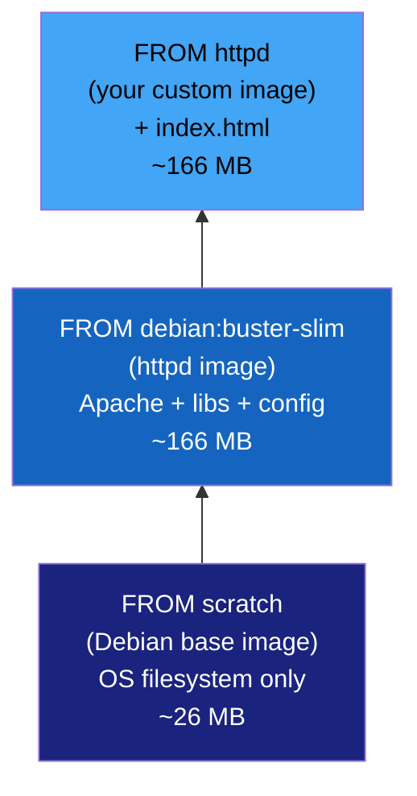

# Chapter 4: Minimize Base Image Footprint

## Why This Matters for CKS

Minimising base image footprint is one of the most direct, impactful security controls available to you. The logic is elegant: **fewer packages = fewer potential CVEs = smaller attack surface**. It costs nothing at runtime and dramatically reduces vulnerability scan noise.

The CKS exam tests this through:
- Understanding the image layer hierarchy (`scratch` → base → parent → custom).
- Knowing when and how to use multi-stage builds to produce minimal production images.
- Understanding distroless images and their security advantage.
- Reading and interpreting Trivy scan output differences between image types.
- Being able to write a Dockerfile that separates build and runtime stages.

---

## Understanding the Image Layer Hierarchy

Every container image is a stack of layers. Understanding this stack is fundamental — you can't minimise what you don't understand.

KodeKloud traces a three-level hierarchy for a web application image:



```dockerfile
# Level 1: Base image — built FROM scratch
# Dockerfile - debian:buster-slim
FROM scratch
ADD rootfs.tar.xz /
CMD ["bash"]

# Level 2: Parent image — built FROM debian
# Dockerfile - httpd
FROM debian:buster-slim
ENV HTTPD_PREFIX /usr/local/apache2
ENV PATH $HTTPD_PREFIX/bin:$PATH
WORKDIR $HTTPD_PREFIX
# installs: apache2, apr, apr-util, pcre, openssl, libxml2... (~140 packages)

# Level 3: Your custom image — built FROM httpd
# Dockerfile – My Custom Webapp
FROM httpd
COPY index.html htdocs/index.html
```

**The inheritance problem:** When you write `FROM httpd`, you inherit every package from both the `httpd` and `debian:buster-slim` layers. If any of those 140+ inherited packages has a CVE, your image is vulnerable — even though you wrote only 2 lines of Dockerfile.

```bash
# Inspect what you're inheriting
docker run --rm httpd dpkg -l | wc -l
# 168 packages — all inherited by your 2-line Dockerfile

trivy image httpd
# Total: 124 vulnerabilities (UNKNOWN: 0, LOW: 88, MEDIUM: 9, HIGH: 25, CRITICAL: 2)
# You wrote 2 lines and inherited 124 vulnerabilities.
```

---

## The Vulnerability Impact of Image Choice

KodeKloud's Trivy comparison is the clearest possible demonstration of why image choice matters:

```bash
# Full Debian-based httpd image
trivy image httpd
# httpd (debian 10.8)
# Total: 124 (UNKNOWN: 0, LOW: 88, MEDIUM: 9, HIGH: 25, CRITICAL: 2)

# Alpine-based httpd image (same application, ~4x smaller OS)
trivy image httpd:alpine
# httpd:alpine (alpine 3.12.4)
# Total: 0 (UNKNOWN: 0, LOW: 0, MEDIUM: 0, HIGH: 0, CRITICAL: 0)
```

**Same application. Same Apache web server. 124 vulnerabilities vs 0.**

The difference: Alpine Linux uses `musl libc` instead of `glibc`, uses `busybox` instead of GNU coreutils, and has far fewer packages by default. Fewer packages = fewer CVE targets.

### Extended Trivy Comparison Across Image Types

```bash
# nginx variants — same web server, different base images
trivy image nginx                    # Debian-based
# Total: 150+ vulnerabilities

trivy image nginx:alpine             # Alpine-based
# Total: 0-5 vulnerabilities

trivy image nginxinc/nginx-unprivileged:alpine   # Unprivileged Alpine
# Total: 0-2 vulnerabilities (also no root requirement)

# Python variants
trivy image python:3.11              # Full Debian — ~400 packages
# Total: 80-120 vulnerabilities

trivy image python:3.11-slim         # Debian slim — ~100 packages
# Total: 20-40 vulnerabilities

trivy image python:3.11-alpine       # Alpine — ~50 packages
# Total: 0-5 vulnerabilities

trivy image gcr.io/distroless/python3-debian12   # Distroless
# Total: 0-3 vulnerabilities (only python3 + glibc, no shell)
```

**The progression:**

| Image Type | Approx. Size | Approx. CVEs | Shell? | Package Manager? |
|-----------|-------------|-------------|--------|-----------------|
| `ubuntu:22.04` | 77 MB | 100-200 | ✅ bash | ✅ apt |
| `debian:bookworm` | 117 MB | 60-120 | ✅ bash | ✅ apt |
| `debian:bookworm-slim` | 74 MB | 30-60 | ✅ bash | ✅ apt |
| `alpine:3.19` | 7 MB | 0-5 | ✅ sh | ✅ apk |
| `gcr.io/distroless/base` | 20 MB | 0-3 | ❌ | ❌ |
| `gcr.io/distroless/static` | 2 MB | 0 | ❌ | ❌ |
| `scratch` | 0 MB | 0 | ❌ | ❌ |

---

## Best Practice 1: Separate Applications — Modularity


The principle: **one container, one process, one responsibility**. Combining multiple applications into a single container violates this principle and creates security problems:

```dockerfile
# WRONG — everything in one image
FROM ubuntu
RUN apt-get install -y nginx mysql-server redis python3
COPY app.py .
COPY nginx.conf /etc/nginx/
RUN service mysql start && service redis start && service nginx start
CMD ["/bin/bash", "-c", "python3 app.py & nginx & mysqld"]
```

**Problems with this approach:**
- One image runs multiple processes — violates single-responsibility.
- A vulnerability in MySQL affects the nginx process (same filesystem).
- Can't scale nginx independently from MySQL.
- Container restart restarts everything (no graceful per-service management).
- One exploited process has access to all other processes' data.

```
# CORRECT — separate containers, Kubernetes orchestrates them
Pod 1 (nginx):   FROM nginx:alpine        — 7 MB, 0 CVEs
Pod 2 (app):     FROM python:3.11-alpine  — 50 MB, 0-3 CVEs
Pod 3 (mysql):   FROM mysql:8.0           — dedicated, scalable
Pod 4 (redis):   FROM redis:alpine        — 9 MB, 0 CVEs

Kubernetes manages:
  - Independent scaling (nginx HPA: 2-10 replicas)
  - Independent upgrades (patch mysql without touching nginx)
  - Independent security policies (PSA per workload)
  - NetworkPolicy: nginx can only reach app, not mysql directly
```

---

## Best Practice 2: Avoid Data Persistence Inside Containers

Containers are ephemeral. Data written to a container's filesystem is lost when the container is replaced. More importantly, persisting data inside containers creates security risks:

```
Security risks of in-container data:
  1. Data survives container restart but not pod replacement
     → false sense of persistence leads to data loss patterns

  2. If container is compromised, attacker has access to all in-container data
     → no isolation between application files and data files

  3. Container images accumulate data layers
     → sensitive data (even if deleted) remains in image layers
     → docker history can reveal deleted files
```

```dockerfile
# WRONG — writing data inside the container
FROM nginx:alpine
RUN mkdir -p /data/uploads    # Baked into the image layer
COPY app-data/ /data/         # Sensitive data IN the image

# RIGHT — use volumes for all persistent data
FROM nginx:alpine
VOLUME ["/data"]              # Declare volume mount point
# Actual data stored in PersistentVolume, not in the image
```

```yaml
# Kubernetes: always mount persistent data from PV/PVC
spec:
  containers:
  - name: webapp
    image: webapp:v1.2.3
    volumeMounts:
    - name: uploads
      mountPath: /data/uploads
  volumes:
  - name: uploads
    persistentVolumeClaim:
      claimName: webapp-uploads-pvc  # Data in PV, not in image
```

---

## Best Practice 3: Select Base Images Wisely

### Official Images vs Community Images

Not all Docker Hub images are equal. There is a trust hierarchy:

```
Trust hierarchy (highest to lowest):

1. Docker Official Images
   ├── Curated by Docker, Inc.
   ├── From: docker.io/library/nginx, docker.io/library/python
   ├── Regularly scanned and updated
   └── Tag: "Official Image" badge on Docker Hub

2. Verified Publisher Images
   ├── From: companies like Bitnami, AWS, Google
   ├── Publisher verified by Docker
   └── Tag: "Verified Publisher" badge

3. Docker-Sponsored Open Source
   ├── OSS projects with Docker support
   └── Tag: "Docker-Sponsored Open Source"

4. Community Images (no verification)
   ├── Anyone can publish
   ├── May be abandoned, unscanned, or malicious
   └── Examples: random-person/nginx-custom — AVOID
```

```bash
# Verify you're using an official image
docker pull nginx            # Pulls library/nginx (official)
docker pull library/nginx    # Explicit — same thing

# Never use unverified images for production:
docker pull nginx-official   # ← Not official — could be anything
docker pull mynginx-fast     # ← Unknown publisher — AVOID
```

### Pinning by Digest — Immutable References

Tags are mutable. `nginx:1.25` today might point to a different image tomorrow if the publisher pushes an update. Pinning by digest guarantees immutability:

```dockerfile
# MUTABLE — tag can change:
FROM nginx:1.25                    # What is 1.25 today?

# IMMUTABLE — digest is a cryptographic hash:
FROM nginx@sha256:a484819eb60211f5299034ac80f6a681b06f89e65866ce91f356ed7c72af059c

# Get the digest of a current tag:
docker inspect nginx:1.25 --format='{{index .RepoDigests 0}}'
# nginx@sha256:a484819eb60211f5...

# Or:
docker pull nginx:1.25
docker images --digests nginx
# REPOSITORY   TAG    DIGEST                                                          SIZE
# nginx        1.25   sha256:a484819eb60211f5299034ac80f6a681b06f89e65866ce91f356ed7c72af059c   187MB
```

**Security benefit:** If an attacker replaces the `1.25` tag with a malicious image in your registry mirror, your Dockerfile with a pinned digest will fail (digest won't match) rather than silently pulling the malicious image.

---

## Best Practice 4: Minimize Image Size — Multi-Stage Builds

Multi-stage builds are the most powerful technique for producing minimal production images. The core idea: **use a fat build image to compile, then copy only the artifacts to a minimal runtime image.**

### Basic Multi-Stage Pattern

```dockerfile
# Stage 1: Build stage — has everything needed to compile
FROM golang:1.22-alpine AS builder
WORKDIR /app
COPY go.mod go.sum ./
RUN go mod download
COPY . .
# Build a statically linked binary (no external library deps)
RUN CGO_ENABLED=0 GOOS=linux go build -a -installsuffix cgo -o myapp ./cmd/

# Stage 2: Runtime stage — has only what's needed to run
FROM gcr.io/distroless/static:nonroot
COPY --from=builder /app/myapp /myapp
USER nonroot:nonroot
ENTRYPOINT ["/myapp"]
```

**Size comparison:**
```bash
docker build -t myapp:multi-stage .
docker images myapp
# REPOSITORY   TAG           SIZE
# myapp        builder       ~350 MB  (golang + source + build tools — never shipped)
# myapp        multi-stage   ~6 MB    (just the binary + distroless base)
```

**Security comparison:**
```bash
trivy image golang:1.22-alpine
# Total: 0-5 (Alpine base)

trivy image gcr.io/distroless/static:nonroot
# Total: 0 (literally nothing to scan — just CA certs and timezone data)

trivy image myapp:multi-stage
# Total: 0 (distroless base + statically linked binary)
```

### Multi-Stage for Python Applications

```dockerfile
# Stage 1: Build stage — install dependencies including dev tools
FROM python:3.12-alpine AS builder
WORKDIR /app

# Install build dependencies (compilers for native extensions)
RUN apk add --no-cache gcc musl-dev libffi-dev

COPY requirements.txt .
RUN pip install --user --no-cache-dir -r requirements.txt

# Stage 2: Runtime stage — copy only installed packages
FROM python:3.12-alpine
WORKDIR /app

# Copy installed Python packages from builder
COPY --from=builder /root/.local /root/.local
COPY app.py .

# Security hardening
RUN addgroup -S appgroup && adduser -S appuser -G appgroup
USER appuser

ENV PATH=/root/.local/bin:$PATH
CMD ["python", "app.py"]
```

**What gets eliminated:**
- `gcc`, `musl-dev`, `libffi-dev` (compilation tools, not needed at runtime)
- Build caches and temporary files
- Unneeded Python development headers

### Multi-Stage for Java Applications

```dockerfile
# Stage 1: Build with Maven
FROM maven:3.9-eclipse-temurin-17-alpine AS builder
WORKDIR /app
COPY pom.xml .
# Download dependencies separately (Docker cache optimization)
RUN mvn dependency:go-offline -B
COPY src ./src
RUN mvn package -DskipTests

# Stage 2: Extract Spring Boot layers (Spring layered jars)
FROM eclipse-temurin:17-jre-alpine AS extractor
WORKDIR /app
COPY --from=builder /app/target/*.jar app.jar
RUN java -Djarmode=layertools -jar app.jar extract

# Stage 3: Minimal runtime image with Spring layers
FROM eclipse-temurin:17-jre-alpine
WORKDIR /app
RUN addgroup -S spring && adduser -S spring -G spring
USER spring:spring
COPY --from=extractor /app/dependencies/ ./
COPY --from=extractor /app/spring-boot-loader/ ./
COPY --from=extractor /app/snapshot-dependencies/ ./
COPY --from=extractor /app/application/ ./
ENTRYPOINT ["java", "org.springframework.boot.loader.JarLauncher"]
```

**Why Spring layered jars?** Docker rebuilds layers from the changed layer downward. By separating rarely-changed dependencies from frequently-changed application code, `COPY --from=extractor /app/dependencies/` is cached across most rebuilds — dramatically faster CI/CD.

### Multi-Stage for Node.js Applications

```dockerfile
# Stage 1: Install all dependencies (including devDependencies)
FROM node:20-alpine AS builder
WORKDIR /app
COPY package*.json ./
RUN npm ci                    # Installs devDependencies too (needed to build)
COPY . .
RUN npm run build             # Compile TypeScript, bundle assets, etc.
RUN npm prune --production    # Remove devDependencies after build

# Stage 2: Production-only runtime
FROM node:20-alpine
WORKDIR /app
# Non-root user
RUN addgroup -S nodejs && adduser -S nodejs -G nodejs
USER nodejs
# Copy only what's needed
COPY --from=builder --chown=nodejs:nodejs /app/node_modules ./node_modules
COPY --from=builder --chown=nodejs:nodejs /app/dist ./dist
COPY --from=builder --chown=nodejs:nodejs /app/package.json .

CMD ["node", "dist/server.js"]
```

**Security gain:** `devDependencies` (like typescript, webpack, jest, eslint) are common sources of vulnerabilities. They are NOT present in the production image.

---

## Best Practice 5: Distroless Images — The Gold Standard

Google's **distroless** images contain only the application and its runtime dependencies. They do not contain:
- A shell (`sh`, `bash`)
- Package managers (`apt`, `apk`, `yum`)
- Standard Unix utilities (`curl`, `wget`, `nc`, `tar`)
- Any unnecessary OS packages

```bash
# Try to exec into a distroless container
kubectl exec -n production distroless-pod -- /bin/sh
# Error: OCI runtime exec failed: exec failed: unable to start container process:
#   exec: "/bin/sh": stat /bin/sh: no such file or directory

# This is the security benefit:
# If an attacker exploits your application and gets code execution,
# they have NO shell, NO curl, NO wget, NO tools to pivot from.
# The container is a dead end for the attacker.
```

### Google Distroless Image Catalogue

```
gcr.io/distroless/static:nonroot      ← No libc, just CA certs + tzdata (for Go/Rust)
gcr.io/distroless/base:nonroot        ← glibc + libssl (for dynamically linked C apps)
gcr.io/distroless/java17-debian12     ← JRE 17 only (for Java apps)
gcr.io/distroless/python3-debian12    ← CPython 3 (for Python apps)
gcr.io/distroless/nodejs20-debian12   ← Node.js 20 (for Node apps)
gcr.io/distroless/cc-debian12         ← glibc + libgcc (for C++ apps)
```

**Trivy scan of distroless vs full base:**
```bash
trivy image python:3.11
# Total: 74 (LOW: 52, MEDIUM: 11, HIGH: 8, CRITICAL: 3)
# (Shell, apt, curl, all present)

trivy image gcr.io/distroless/python3-debian12
# Total: 3 (LOW: 2, MEDIUM: 1)
# (Only python3 interpreter + glibc — nothing else to scan)
```

### Chainguard Images — Hardened Distroless (2023–2025)

**Chainguard** (founded 2021, raised $140M) has built the most security-hardened minimal image catalogue using their **Wolfi** Linux distribution:

```bash
# Chainguard images are:
# - Rebuilt daily with latest security patches
# - Signed with Cosign (keyless, verifiable)
# - Come with SBOMs attached
# - Certified to have 0 known CVEs at time of publication
# - Minimal like distroless, but actively maintained

# Examples:
cgr.dev/chainguard/python:latest    ← Python, 0 CVEs, ~30 MB
cgr.dev/chainguard/node:latest      ← Node.js, 0 CVEs
cgr.dev/chainguard/nginx:latest     ← nginx, 0 CVEs
cgr.dev/chainguard/static:latest    ← Static binary base, 0 CVEs

# Verify Chainguard image signature
cosign verify \
  --certificate-identity-regexp="https://github.com/chainguard-images" \
  --certificate-oidc-issuer="https://token.actions.githubusercontent.com" \
  cgr.dev/chainguard/python:latest

# Compare:
trivy image python:3.12
# Total: 50+ vulnerabilities

trivy image cgr.dev/chainguard/python:latest
# Total: 0
```

**Chainguard vs Google Distroless — when to use which:**

| Dimension | Google Distroless | Chainguard |
|-----------|------------------|-----------|
| **Update frequency** | Periodic | Daily |
| **CVE SLA** | Best effort | 0 known CVEs at publish |
| **SBOM** | Not attached by default | Attached + signed |
| **Cosign signing** | Partial | Full (all images) |
| **Cost** | Free | Free tier + paid enterprise |
| **Wolfi vs Debian** | Based on Debian | Based on Wolfi (purpose-built) |
| **Shell access** | None | None (production variants) |
| **Recommendation** | Good | Better for 2024+ |

---

## Best Practice 6: Differentiate Development and Production Images

Development and production require fundamentally different tools, and mixing them creates security risk:

```dockerfile
# Development image — debugging tools included
FROM python:3.12
RUN pip install debugpy ipython pytest coverage \
    requests-mock responses factory-boy
# Has shell, package manager, debugging tools
# NEVER deploy this to production

# Production image — minimal runtime only
FROM gcr.io/distroless/python3-debian12
COPY --from=builder /app /app
ENTRYPOINT ["python", "/app/main.py"]
# No shell, no pip, no debugging tools
```

**Use Docker build arguments to toggle:**
```dockerfile
ARG BUILD_ENV=production

FROM python:3.12-alpine AS base
WORKDIR /app
COPY requirements.txt .
RUN pip install -r requirements.txt

FROM base AS development
RUN pip install debugpy pytest ipython   # Dev tools
CMD ["python", "-m", "debugpy", "--listen", "0.0.0.0:5678", "app.py"]

FROM gcr.io/distroless/python3-debian12 AS production
COPY --from=base /app /app
CMD ["python", "/app/app.py"]

# Build production:  docker build --target production .
# Build development: docker build --target development .
```

---

## Layer Anatomy — How Images Are Built and Why It Matters for Security

Understanding image layers is essential for both optimization and security:

```bash
# View all layers of an image
docker history nginx:alpine
# IMAGE          CREATED       CREATED BY                                      SIZE
# a8781fe3b7a2   2 weeks ago   /bin/sh -c #(nop)  CMD ["nginx" "-g" "dae...    0B
# <missing>      2 weeks ago   /bin/sh -c #(nop)  STOPSIGNAL SIGQUIT           0B
# <missing>      2 weeks ago   /bin/sh -c set -x && addgroup ...               61.5MB
# <missing>      2 weeks ago   /bin/sh -c #(nop)  ENV PKG_RELEASE=1            0B
# <missing>      2 weeks ago   /bin/sh -c #(nop)  ENV NJS_VERSION=0.8.2        0B
# <missing>      2 weeks ago   /bin/sh -c #(nop)  FROM alpine:3.19             7.38MB

# Each RUN command creates a new layer
# Layers are cached — unchanged layers don't re-download
```

### The Secret Leak Problem in Layers

Every `RUN` command creates a layer that is **permanently stored in the image**, even if subsequent commands delete the file:

```dockerfile
# DANGEROUS — secret persists in layer history
FROM alpine
RUN echo "super-secret-api-key" > /tmp/secret.txt   # Layer 1 adds secret
RUN cat /tmp/secret.txt | build-tool --auth stdin
RUN rm /tmp/secret.txt                               # Layer 2 deletes it
# BUT: Layer 1 still exists! docker history --no-trunc shows it.
# docker run --layer alpine cat /tmp/secret.txt  ← still accessible
```

```dockerfile
# SAFE — use BuildKit secrets (never written to any layer)
# syntax=docker/dockerfile:1
FROM alpine
RUN --mount=type=secret,id=api_key \
    cat /run/secrets/api_key | build-tool --auth stdin
# Secret is mounted at build time but never written to any layer

# Build command:
docker build --secret id=api_key,src=./api_key.txt .
```

### Optimising RUN Commands (Reduces Layers AND Size)

```dockerfile
# WRONG — 4 separate layers, each creates an intermediate image
RUN apt-get update
RUN apt-get install -y curl
RUN apt-get install -y wget
RUN rm -rf /var/lib/apt/lists/*
# The rm only removes files from Layer 4's perspective
# The cache files from Layers 1-3 still exist in those layers

# RIGHT — one layer, properly cleaned up
RUN apt-get update && \
    apt-get install -y --no-install-recommends \
      curl \
      wget && \
    rm -rf /var/lib/apt/lists/*
# All operations in one layer: install AND clean in same RUN
# Actual reduction in layer size — the apt cache is truly gone
```

---

## FROM scratch — The Ultimate Minimal Base

For statically compiled languages (Go, Rust, C/C++), you can build images with literally zero base:

```dockerfile
# Go application — fully static binary, no dependencies
FROM golang:1.22-alpine AS builder
WORKDIR /app
COPY go.mod go.sum ./
RUN go mod download
COPY . .
# CGO_ENABLED=0: no C library dependencies
# -ldflags '-extldflags "-static"': link everything statically
RUN CGO_ENABLED=0 go build \
    -ldflags '-w -s -extldflags "-static"' \
    -o myapp ./cmd/

# Zero-base final image
FROM scratch
# No OS. No shell. No package manager. Nothing.
COPY --from=builder /app/myapp /myapp
# Optional: CA certificates for HTTPS calls
COPY --from=builder /etc/ssl/certs/ca-certificates.crt /etc/ssl/certs/

ENTRYPOINT ["/myapp"]
```

```bash
# Result:
docker images myapp
# REPOSITORY   TAG      SIZE
# myapp        scratch  ~8 MB  (just the Go binary + CA certs)

trivy image myapp:scratch
# Total: 0 (nothing to scan — no OS packages at all)
```

**When FROM scratch works:**
- Go binaries (static by default with `CGO_ENABLED=0`).
- Rust binaries compiled with `target-feature=+crt-static`.
- C programs compiled with `musl-libc` statically.

**When FROM scratch doesn't work:**
- Python, Node.js, Ruby (require interpreters).
- Java (requires JVM).
- Any application using `dlopen()` or dynamic library loading.
- Applications that call DNS via `getaddrinfo()` (needs `libc` resolver).

---

## The .dockerignore File — Keep Secrets Out of Images

Every file in the Docker build context is sent to the Docker daemon. Without `.dockerignore`, you may accidentally include secrets, large files, or development artefacts:

```bash
# .dockerignore — exclude from build context
.git/                   # Git history (may contain old secrets)
*.key                   # Private keys
*.pem                   # Certificates
.env                    # Environment files with credentials
.env.local
node_modules/           # Huge, rebuilt inside container anyway
__pycache__/
*.pyc
.pytest_cache/
test/                   # Test files not needed in production
docs/                   # Documentation
*.md
Makefile
docker-compose*.yml     # Dev configs not needed in image
.dockerignore           # The file itself
```

**Security benefit:** Even if you accidentally wrote `COPY . .` in your Dockerfile, files in `.dockerignore` are never sent to the Docker daemon — they can't appear in any image layer.

---

## Image Security Hardening Checklist

Combining everything in this chapter, a production-ready minimal Dockerfile should satisfy:

```dockerfile
# syntax=docker/dockerfile:1

# ============================================================
# Stage 1: Build
# ============================================================
FROM golang:1.22-alpine AS builder

# Verify base image signature (with cosign in CI — see Chapter 8)
# cosign verify --key cosign.pub golang:1.22-alpine

WORKDIR /app
# Copy dependency manifests first (Docker cache optimization)
COPY go.mod go.sum ./
RUN go mod download && go mod verify   # Verify checksums
COPY . .
# Static build, strip debug symbols (-w -s), reproducible
RUN CGO_ENABLED=0 GOOS=linux go build \
    -ldflags="-w -s" \
    -trimpath \              # Remove build machine paths from binary
    -o myapp ./cmd/

# ============================================================
# Stage 2: Security scan (optional intermediate stage)
# ============================================================
FROM builder AS security-check
RUN go vet ./...
# In CI you'd also run: trivy filesystem /app

# ============================================================
# Stage 3: Minimal production image
# ============================================================
FROM gcr.io/distroless/static:nonroot

# Metadata (good practice, not security-critical)
LABEL org.opencontainers.image.source="https://github.com/myorg/myapp"
LABEL org.opencontainers.image.version="1.2.3"
LABEL org.opencontainers.image.licenses="Apache-2.0"

# Copy only the binary
COPY --from=builder /app/myapp /myapp

# Non-root user (distroless:nonroot already sets this)
USER nonroot:nonroot

# No EXPOSE — use Kubernetes Service for port management
ENTRYPOINT ["/myapp"]
```

**Security checklist:**
```
✅ Multi-stage build — build tools not in production image
✅ Distroless/Alpine base — minimal package surface
✅ Non-root user — no UID 0 in production
✅ No shell — attacker has no post-exploitation tools
✅ No package manager — attacker can't install tools
✅ Static binary — no dynamic library attack surface
✅ -trimpath — no build machine paths leaked in binary
✅ Read-only filesystem (set in Kubernetes SecurityContext)
✅ Single binary — minimal content, easy to SBOM
```

---

## Kubernetes Integration — Enforcing Minimal Images

Minimising image footprint is a build-time practice, but you can also enforce it at runtime admission:

### OPA Gatekeeper: Block Non-Approved Registries and Tags

```yaml
# Reject images using "latest" tag (not pinned, not auditable)
apiVersion: templates.gatekeeper.sh/v1
kind: ConstraintTemplate
metadata:
  name: k8snolatesttag
spec:
  crd:
    spec:
      names:
        kind: K8sNoLatestTag
  targets:
  - target: admission.k8s.gatekeeper.sh
    rego: |
      package k8snolatesttag
      violation[{"msg": msg}] {
        container := input.review.object.spec.containers[_]
        endswith(container.image, ":latest")
        msg := sprintf("Container '%v' uses ':latest' tag — pin to a specific digest", [container.name])
      }
      violation[{"msg": msg}] {
        container := input.review.object.spec.containers[_]
        not contains(container.image, ":")
        msg := sprintf("Container '%v' has no tag — must specify version or digest", [container.name])
      }
---
apiVersion: constraints.gatekeeper.sh/v1beta1
kind: K8sNoLatestTag
metadata:
  name: no-latest-tag
spec:
  match:
    kinds:
    - apiGroups: [""]
      kinds: ["Pod"]
```

### PSA Restricted Profile — Enforce Non-Root

```bash
# Enforce that all pods run as non-root (aligned with distroless:nonroot)
kubectl label namespace production \
  pod-security.kubernetes.io/enforce=restricted
# Restricted profile requires: runAsNonRoot: true, no privilege escalation
```

### Kubernetes SecurityContext — Read-Only Filesystem

```yaml
# Force read-only root filesystem — even if image has a shell, attacker can't write
spec:
  containers:
  - name: app
    image: myapp:v1.2.3@sha256:...  # Pinned digest
    securityContext:
      readOnlyRootFilesystem: true   # Attacker can't write tools to /tmp
      runAsNonRoot: true
      runAsUser: 65534               # nobody user
      allowPrivilegeEscalation: false
      capabilities:
        drop: ["ALL"]
    volumeMounts:
    - name: tmp               # If app needs writable /tmp
      mountPath: /tmp
  volumes:
  - name: tmp
    emptyDir: {}              # Writable but ephemeral, not part of image
```

---

## Common Mistakes

### Mistake 1: Using `latest` Tag

```dockerfile
# WRONG
FROM node:latest    # What version is this? It will change.

# RIGHT
FROM node:20.11.0-alpine3.19                                          # Specific tag
FROM node@sha256:b4d8c89a2f1e0c7d9e4a3b2f1c0d8e7a6b5c4d3e2  # Digest (best)
```

### Mistake 2: Combining `apt-get update` and Install in Separate `RUN` Commands

```dockerfile
# WRONG — cache busting problem + leftover apt cache
RUN apt-get update
RUN apt-get install -y curl

# RIGHT — single layer, verified packages, cleaned up
RUN apt-get update && \
    apt-get install -y --no-install-recommends curl && \
    rm -rf /var/lib/apt/lists/*
```

### Mistake 3: Installing dev/build tools and forgetting to remove them

```dockerfile
# WRONG — build tools shipped to production
FROM python:3.12
RUN apt-get install -y gcc python3-dev   # Build tools
RUN pip install cryptography             # Needs gcc to compile
# gcc, python3-dev still in image — 80MB extra, multiple CVEs

# RIGHT — multi-stage build
FROM python:3.12 AS builder
RUN apt-get install -y gcc python3-dev
RUN pip install --user cryptography

FROM python:3.12-slim
COPY --from=builder /root/.local /root/.local
# gcc and python3-dev never make it to production image
```

### Mistake 4: Running as Root

```dockerfile
# WRONG — container runs as root (UID 0)
FROM alpine
COPY app /app
CMD ["/app"]   # Runs as root by default

# RIGHT — create and use a non-root user
FROM alpine
RUN addgroup -S appgroup && adduser -S appuser -G appgroup
COPY app /app
USER appuser
CMD ["/app"]
```

### Mistake 5: Copying Entire Source Tree into Production Image

```dockerfile
# WRONG — source code, tests, docs, .env files all in image
FROM node:20-alpine
COPY . .    # Copies EVERYTHING including .env, tests, docs
RUN npm ci --production
CMD ["node", "server.js"]

# RIGHT — copy only what's needed
FROM node:20-alpine
COPY package*.json ./
RUN npm ci --production
COPY src/ ./src/          # Only production source
CMD ["node", "src/server.js"]
```

---

## Quick Reference

### Base Image Selection Guide

```
Use Case                          Recommended Base Image
────────────────────────────────────────────────────────
Go binary (static)                FROM scratch or distroless/static
Go binary (needs cgo)             FROM distroless/base
Java application                  FROM distroless/java17-debian12
Python application                FROM distroless/python3-debian12 or python:3.12-alpine
Node.js application               FROM distroless/nodejs20-debian12 or node:20-alpine
General Linux (needs shell)       FROM alpine:3.19 (then distroless if possible)
Web server (nginx)                FROM nginx:alpine or cgr.dev/chainguard/nginx
Production hardened               FROM cgr.dev/chainguard/<app> (Wolfi-based, 0 CVEs)
Build stage (not shipped)         FROM golang:1.22-alpine or python:3.12 (full image OK here)
```

### Trivy Scanning Quick Commands

```bash
# Scan an image
trivy image <image>:<tag>

# Only show HIGH and CRITICAL
trivy image --severity HIGH,CRITICAL <image>

# Fail CI if any CRITICAL found
trivy image --severity CRITICAL --exit-code 1 <image>

# Scan only OS packages (skip app deps for speed)
trivy image --scanners vuln --vuln-type os <image>

# Scan only app libraries (skip OS)
trivy image --scanners vuln --vuln-type library <image>

# Generate SBOM AND scan in one pass
trivy image --format cyclonedx --output sbom.json <image>
trivy sbom sbom.json
```

---

## CKS Exam Tips

1. **The Trivy comparison is directly testable:** Know that `httpd` (debian-based) has 124 vulnerabilities and `httpd:alpine` has 0. More generally: Alpine < Debian slim < Debian full in terms of CVE count.

2. **Multi-stage builds are the answer to "how do you ship a minimal image?":** Know the pattern: `FROM <build-image> AS builder` → compile → `FROM <minimal-image>` → `COPY --from=builder`.

3. **Distroless = no shell, no package manager:** If an exam question says "the security team requires that attackers cannot run any shell commands inside the container even after an exploit," the answer is a distroless base image plus `readOnlyRootFilesystem: true`.

4. **Non-root is required by PSA restricted:** Any container in a namespace with `pod-security.kubernetes.io/enforce=restricted` must have `runAsNonRoot: true`. Distroless `:nonroot` variants set this by default.

5. **`FROM scratch` is for static binaries only:** Know that a Go binary compiled with `CGO_ENABLED=0` can run FROM scratch, but Python/Java/Node.js cannot.

6. **Image layers are immutable and permanent:** Deleting a file in a later `RUN` command does NOT remove it from earlier layers. The only way to truly remove something is to combine operations in a single `RUN` command or use multi-stage builds.

7. **Pin images by digest in production:** `FROM nginx@sha256:...` not `FROM nginx:latest`. The exam may ask why pinning by digest is more secure than pinning by tag.

---

## Summary

Minimising base image footprint is the single most efficient security improvement you can make to container images — it requires no runtime changes and reduces attack surface permanently. The key principles are:

- **Choose the right base:** distroless > Alpine > Debian slim > Debian full (measured by attack surface, not capability).
- **Multi-stage builds:** compile in a fat image, ship only the binary in a minimal image. Development tools never reach production.
- **Single responsibility:** one container, one process, one job.
- **Immutable references:** pin by digest, not by mutable tag.
- **External state only:** no data inside containers — use PersistentVolumes.
- **Separate dev and prod images:** debug tools are attack tools.

The Trivy comparison (124 CVEs vs 0 for the same application on different bases) is the most compelling argument: the choice of base image, not the quality of your application code, often determines your vulnerability count.

---

## What's Next

Chapter 5 covers **SBOM formats** — the structured data standards (SPDX and CycloneDX) that make SBOMs machine-readable and interoperable. Understanding formats lets you choose the right toolchain for generating, storing, and querying SBOMs for the minimal images you now know how to build. A distroless image with 5 packages produces a 5-entry SBOM — dramatically easier to audit than a 400-entry Debian SBOM.
