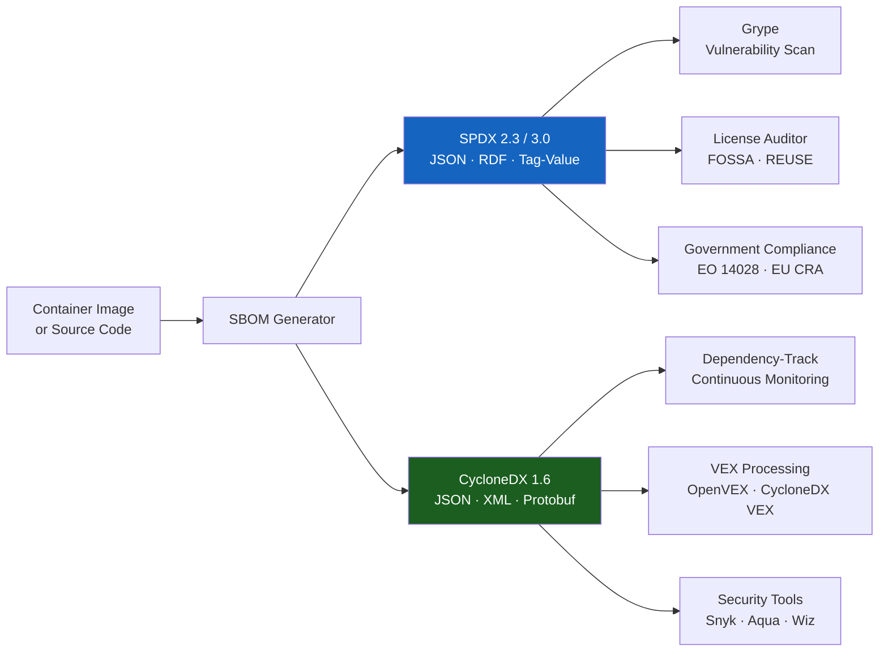

# Chapter 5: SBOM Format — SPDX and CycloneDX

---

## Table of Contents

1. [Why SBOM Formats Matter](#1-why-sbom-formats-matter)
2. [What Is an SBOM Format?](#2-what-is-an-sbom-format)
3. [SPDX Format — Deep Dive](#3-spdx-format--deep-dive)
   - [SPDX Structure and Sections](#spdx-structure-and-sections)
   - [SPDX Document Example — nginx](#spdx-document-example--nginx)
   - [SPDX Package Example — grep](#spdx-package-example--grep)
   - [SPDX File Information Example](#spdx-file-information-example)
   - [SPDX Relationships](#spdx-relationships)
   - [SPDX 3.0 — What Changed](#spdx-30--what-changed)
4. [CycloneDX Format — Deep Dive](#4-cyclonedx-format--deep-dive)
   - [CycloneDX Structure and Sections](#cyclonedx-structure-and-sections)
   - [CycloneDX BOM Example](#cyclonedx-bom-example)
   - [CycloneDX 1.6 — New Features](#cyclonedx-16--new-features)
   - [VEX in CycloneDX](#vex-in-cyclonedx)
5. [SPDX vs CycloneDX — Full Comparison](#5-spdx-vs-cyclonedx--full-comparison)
6. [The PURL Standard — Linking Formats to Ecosystems](#6-the-purl-standard--linking-formats-to-ecosystems)
7. [As a DevSecOps / Kubernetes Security Engineer](#7-as-a-devsecops--kubernetes-security-engineer)
8. [Real Present-Day Scenarios](#8-real-present-day-scenarios)
9. [What Happens If You Don't Follow This](#9-what-happens-if-you-dont-follow-this)
10. [Most Common Commands and Syntax](#10-most-common-commands-and-syntax)
11. [Other Tools and Services Available](#11-other-tools-and-services-available)
12. [How AI Is Impacting SBOM Formats](#12-how-ai-is-impacting-sbom-formats)
13. [CKS Exam Tips](#13-cks-exam-tips)
14. [Extra Information and References](#14-extra-information-and-references)

---

## 1. Why SBOM Formats Matter

An SBOM is only as useful as its ability to be **read, shared, compared, and queried by machines**. A free-form text file describing your software components cannot be ingested by a vulnerability scanner, cannot be merged with another SBOM, and cannot be verified for completeness. That is why standardised formats exist.

Choosing the right SBOM format determines:

- Which **vulnerability scanners** can consume your SBOM (Trivy, Grype, Dependency-Track).
- Whether your SBOM satisfies **regulatory requirements** (US EO 14028 references NTIA minimum elements; EU CRA requires machine-readable SBOMs).
- How easily **downstream consumers** (customers, auditors, security teams) can query your component inventory.
- Whether your SBOM can carry **VEX statements** (vulnerability exploitability context).
- How well your SBOM captures **transitive dependencies and relationships** — not just a flat list.

The two dominant standards are **SPDX** (Software Package Data Exchange) and **CycloneDX**. They are not competitors — they solve overlapping but distinct problems, and many mature organisations generate both.

---

## 2. What Is an SBOM Format?

An SBOM format is a **machine-readable schema** that defines exactly how software component data must be structured, what fields are required vs optional, how packages relate to each other, and how security information is expressed.

```
Without a format (informal):
  "Our nginx image uses: nginx 1.25, openssl 3.0.11, debian bookworm packages"
  → Machine-unreadable. Cannot be queried. Cannot be verified.

With SPDX 2.3 (structured):
  { "spdxVersion": "SPDX-2.3", "packages": [...], "relationships": [...] }
  → Grype/Trivy can parse it. CVEs can be cross-referenced. Auditors can verify.

With CycloneDX 1.6 (structured):
  { "bomFormat": "CycloneDX", "components": [...], "vulnerabilities": [...] }
  → VEX statements embedded. Dependency-Track can ingest it. DORA metrics possible.
```



---

## 3. SPDX Format — Deep Dive

### SPDX Structure and Sections

**SPDX** (Software Package Data Exchange) was created by the Linux Foundation in 2010 and became an **ISO/IEC international standard (ISO/IEC 5962:2021)** — making it the only SBOM format with ISO certification. This is why US federal agencies and many enterprise procurement teams prefer SPDX.


SPDX organises information into eight interconnected sections:

| Section | Purpose | Key Fields |
|---------|---------|-----------|
| **Document Information** | SBOM metadata | `spdxVersion`, `dataLicense`, `SPDXID`, `name`, `documentNamespace`, `creationInfo` |
| **Package Information** | Each software component | `name`, `versionInfo`, `supplier`, `originator`, `downloadLocation`, `licenseDeclared`, `externalRefs` |
| **File Information** | Individual files within packages | `fileName`, `checksums` (SHA1/SHA256), `fileTypes`, `licenseConcluded` |
| **Snippet Information** | Code fragments (open-source excerpts) | `snippetFromFile`, `ranges`, `licenseConcluded` |
| **License Information** | Custom license text | `licenseId`, `extractedText`, `name` |
| **Relationships** | How elements connect | `DESCRIBES`, `DEPENDS_ON`, `GENERATED_FROM`, `VARIANT_OF`, `DYNAMIC_LINK` |
| **Annotations** | Reviewer notes | `annotator`, `annotationType`, `comment` |
| **Review Information** | Human review records | `reviewer`, `reviewDate`, `comment` |

**Document Namespace** — a unique URI that globally identifies this SBOM document. This allows two SBOMs to reference each other without collision:

```
documentNamespace: https://anchore.com/syft/image/nginx-2a35db70-da10-45cd-b82d-00921857780f
                   ─────────────────── ──────── ───── ─────────────────────────────────────
                   base URI            tool     type  unique UUID
```

---

### SPDX Document Example — nginx

This is the exact document header generated by Syft 1.13.0 for the nginx container image:

```json
{
  "spdxVersion": "SPDX-2.3",
  "dataLicense": "CC0-1.0",
  "SPDXID": "SPDXRef-DOCUMENT",
  "name": "nginx",
  "documentNamespace": "https://anchore.com/syft/image/nginx-2a35db70-da10-45cd-b82d-00921857780f",
  "creationInfo": {
    "licenseListVersion": "3.25",
    "creators": [
      "Organization: Anchore, Inc",
      "Tool: syft-1.13.0"
    ],
    "created": "2024-09-24T18:17:42Z"
  }
}
```

**Field-by-field explanation:**

| Field | Value | Meaning |
|-------|-------|---------|
| `spdxVersion` | `SPDX-2.3` | Schema version — parse rules to apply |
| `dataLicense` | `CC0-1.0` | The SBOM document itself is CC0 (public domain) — the **SBOM data is free to share** even if the software is proprietary |
| `SPDXID` | `SPDXRef-DOCUMENT` | Every element in SPDX has a unique ID; `SPDXRef-DOCUMENT` refers to the document root |
| `name` | `nginx` | Human-readable name of the subject |
| `documentNamespace` | `https://anchore.com/...uuid` | Globally unique URI — enables cross-document SBOM references |
| `licenseListVersion` | `3.25` | Which version of the SPDX License List was used — important for correct license identifier matching |
| `creators` | `Organization + Tool` | Who generated this SBOM — required for audit trail |
| `created` | `2024-09-24T18:17:42Z` | ISO 8601 UTC timestamp — required NTIA field |

> **Why `CC0-1.0` for `dataLicense`?** SPDX mandates that the SBOM document itself must be licensed CC0 (no restrictions). This ensures that even if the software described is proprietary, the *inventory data* can flow freely to vulnerability databases, customers, and regulators without license restrictions.

---

### SPDX Package Example — grep

This shows how a single Debian package (`grep 3.8-5`) is represented in SPDX:

```json
{
  "package": {
    "name": "grep",
    "SPDXID": "SPDXRef-Package-deb-grep-a86139312d2f5a59d",
    "versionInfo": "3.8-5",
    "supplier": "Person: Anibal Monsalve Salazar (anibal@debian.org)",
    "originator": "Person: Anibal Monsalve Salazar (anibal@debian.org)",
    "downloadLocation": "NOASSERTION",
    "filesAnalyzed": true,
    "packageVerificationCode": {
      "packageVerificationCodeValue": "6da86e7e3a9f53bf5faee3942e2c8e2551ca7d8d"
    },
    "sourceInfo": "acquired package info from DPKG DB: /usr/share/doc/grep/copyright, /var/lib/dpkg/info/grep.md5sums, /var/lib/dpkg/status",
    "licenseConcluded": "NOASSERTION",
    "licenseDeclared": "GPL-3.0-only AND GPL-3.0-or-later",
    "copyrightText": "NOASSERTION",
    "externalRefs": [
      {
        "referenceCategory": "SECURITY",
        "referenceType": "cpe23Type",
        "referenceLocator": "cpe:2.3:a:grep:grep:3.8-5:*:*:*:*:*:*:*"
      },
      {
        "referenceCategory": "PACKAGE-MANAGER",
        "referenceType": "url",
        "referenceLocator": "pkg:deb/debian/grep@3.8-5?arch=amd64&distro=debian-12"
      }
    ]
  }
}
```

**Critical fields explained:**

```
packageVerificationCode: "6da86e7e3a9f53bf5..."
  → SHA-1 of all file checksums in the package (sorted, concatenated, hashed)
  → If ANY file in the grep package is modified after installation,
    this hash changes — tamper detection at the package level

licenseDeclared: "GPL-3.0-only AND GPL-3.0-or-later"
  → What the package CLAIMS its license is (from LICENSE file)
  → "AND" means both licenses apply simultaneously (must comply with both)
  → Compliance implication: if you distribute software containing grep,
    you MUST make the source code available under GPL-3.0

externalRefs[SECURITY] → cpe23Type
  → CPE 2.3: cpe:2.3:a:grep:grep:3.8-5:*:*:*:*:*:*:*
  → Vulnerability scanners use CPE to look up known CVEs in NVD
  → Without this, a scanner doesn't know which CVEs apply

externalRefs[PACKAGE-MANAGER] → PURL
  → pkg:deb/debian/grep@3.8-5?arch=amd64&distro=debian-12
  → Universal package reference — works across all tools
  → Grype, Trivy, and Dependency-Track all understand PURLs
```

**`NOASSERTION` vs actual value:**
```
NOASSERTION: The tool could not determine this field
  (often used for licenseConcluded — requires human legal review)
  
NONE: The field is definitively empty
  (package has no license — rare for open source)

Actual value: "GPL-3.0-only"
  (the tool found the license and is asserting it)
```

---

### SPDX File Information Example

This shows how individual files within packages are tracked:

```json
{
  "file": {
    "fileName": "/usr/lib/systemd/system/pam_namespace.service",
    "SPDXID": "SPDXRef-File---systemd-system-pam-namespace.service-87d70ca1b93138b1",
    "fileTypes": [
      "TEXT"
    ],
    "checksums": [
      {
        "algorithm": "SHA1",
        "checksumValue": "9b870dae75ff7a0c34eeb85e4c9c42a8cfdc10f8"
      },
      {
        "algorithm": "SHA256",
        "checksumValue": "e4dcd011776e596cbb73dcffde737aa043b5308fobf797a23d4229de54d716"
      }
    ],
    "licenseConcluded": "NOASSERTION",
    "licenseInfoInFiles": [
      "NOASSERTION"
    ],
    "copyrightText": "",
    "comment": "layerID: sha256:82e2ab394fabf575000041a8f0801b04e91c7027b7c174fe95332c7ebb6501cb"
  }
}
```

**Security significance of file-level checksums:**

```
SHA256: e4dcd011776e596cbb73dcffde737aa...
  → If this file is modified inside the container (e.g., by a supply chain attack),
    the checksum changes.
  → Forensic tool can re-hash the file at runtime and compare against SBOM:
    if they don't match, the file was tampered with post-build.

layerID: sha256:82e2ab394fabf575...
  → Links the file to a specific Docker image layer
  → Enables layer-level provenance tracking
  → "This file came from layer 82e2ab..." which was added by which Dockerfile command?
```

**SPDX file types:**

| `fileType` | Meaning |
|-----------|---------|
| `TEXT` | Plain text (configs, scripts) |
| `BINARY` | Compiled binary |
| `ARCHIVE` | Compressed archive (tar, zip) |
| `APPLICATION` | Executable application |
| `SOURCE` | Source code file |
| `DOCUMENTATION` | Docs, README |
| `SPDX` | Nested SPDX document |
| `OTHER` | Anything else |

---

### SPDX Relationships

Relationships are what elevate SPDX from a flat list to a dependency graph. This is critical for understanding what depends on what:

```json
{
  "relationships": [
    {
      "spdxElementId": "SPDXRef-DOCUMENT",
      "relationshipType": "DESCRIBES",
      "relatedSpdxElement": "SPDXRef-nginx-image"
    },
    {
      "spdxElementId": "SPDXRef-nginx-image",
      "relationshipType": "CONTAINS",
      "relatedSpdxElement": "SPDXRef-Package-deb-openssl-1.1.1"
    },
    {
      "spdxElementId": "SPDXRef-Package-myapp",
      "relationshipType": "DEPENDS_ON",
      "relatedSpdxElement": "SPDXRef-Package-requests-2.31.0"
    },
    {
      "spdxElementId": "SPDXRef-Package-myapp",
      "relationshipType": "GENERATED_FROM",
      "relatedSpdxElement": "SPDXRef-SourceRepo-github.com-myorg-myapp"
    }
  ]
}
```

**Key relationship types:**

| Relationship | Meaning | Security Use |
|-------------|---------|-------------|
| `DESCRIBES` | Document describes this element | Root anchor for the SBOM |
| `CONTAINS` | Package/image contains this component | Hierarchical composition |
| `DEPENDS_ON` | Direct dependency | Transitive vulnerability tracking |
| `DYNAMIC_LINK` | Runtime dynamic library link | Identifies shared library CVE impact |
| `STATIC_LINK` | Statically compiled in | Identifies compiled-in CVE impact |
| `GENERATED_FROM` | Built from this source | Provenance — links binary to source |
| `VARIANT_OF` | Modified version of another package | Fork tracking |
| `PATCH_APPLIED` | A patch was applied | Remediation tracking |

---

### SPDX 3.0 — What Changed

SPDX 3.0 (released March 2024) is a major architectural overhaul:

```
SPDX 2.3 → SPDX 3.0 key changes:

1. Profile-based architecture
   → Core profile (always required)
   → Software profile (packages, files, snippets)
   → Security profile (vulnerabilities, VEX — previously only CycloneDX)
   → AI profile (model cards, training data provenance) ← NEW
   → Dataset profile (for ML training datasets) ← NEW
   → Licensing profile (enhanced license expression)

2. Modular design
   → Pick only the profiles you need
   → Lighter documents when full compliance not required

3. Native AI/ML support
   → Tracks: model architecture, training datasets, energy consumption
   → Critical for AI supply chain security (model provenance)

4. Better VEX support
   → Security profile includes VEX statements natively
   → Closes the gap with CycloneDX

5. JSON-LD serialisation
   → Linked Data format — SBOMs can be linked across the web
   → Better for regulatory reporting and public disclosure
```

---

## 4. CycloneDX Format — Deep Dive

### CycloneDX Structure and Sections

**CycloneDX** is an OWASP project that began in 2017, initially designed for application dependency tracking and later expanded to cover containers, firmware, and entire supply chains. Its defining characteristic is **security-first design** — vulnerability information and VEX are native, not bolted on.

Current version: **CycloneDX 1.6** (2024). Next: CycloneDX 2.0.

Key sections:

| Section | Purpose | Security Relevance |
|---------|---------|-------------------|
| **BOM Metadata** | Version, timestamp, tools, authors | Audit trail — who generated this and when |
| **Components** | All software components with PURLs | The core inventory |
| **Services** | External services the software calls | API dependencies, SaaS integrations |
| **Vulnerabilities** | Known CVEs with CVSS scores | Direct CVE inventory in the SBOM |
| **Annotations** | Notes and review comments | Compliance documentation |
| **Dependencies** | Dependency graph (which needs which) | Transitive impact analysis |
| **Compositions** | Aggregate/aggregate-with-dependencies | Completeness attestation |
| **Extensions** | Vendor-specific metadata | Tool-specific enrichment |
| **Formulation** (1.5+) | Build process documentation | SLSA-level provenance |
| **VEX** (1.5+) | Vulnerability exploitability | Justified CVE suppression |

---

### CycloneDX BOM Example

```json
{
  "$schema": "http://cyclonedx.org/schema/bom-1.6.schema.json",
  "bomFormat": "CycloneDX",
  "specVersion": "1.4",
  "serialNumber": "urn:uuid:e7f6caab-6589-430d-bb7f-0076d23e9efb",
  "version": 1,
  "metadata": {
    "timestamp": "2024-09-24T18:46:28Z",
    "tools": {
      "components": [
        {
          "type": "application",
          "author": "anchore",
          "name": "syft",
          "version": "1.13.0"
        }
      ]
    }
  },
  "component": {
    "bom-ref": "eb2d7db1213e6155",
    "type": "container",
    "name": "nginx",
    "version": "sha256:edf555d07d2ddeb6b616d9024442feac12a91310c9a156fa6f60cd602881a"
  },
  "properties": [
    {
      "name": "syft:image:labels:maintainer",
      "value": "NGINX Docker Maintainers <docker-maint@nginx.com>"
    }
  ],
  "components": [
    {
      "bom-ref": "pkg:deb/debian/adduser@3.134?arch=all&distro=debian-12&package-id=8a498975e59f569c2",
      "type": "library",
      "publisher": "Debian Adduser Developers <adduser@packages.debian.org>"
    }
  ]
}
```

**Field-by-field explanation:**

| Field | Value | Meaning |
|-------|-------|---------|
| `$schema` | `bom-1.6.schema.json` | JSON Schema URI — validators use this to check the document |
| `bomFormat` | `CycloneDX` | Self-identifying — parsers can detect format without file extension |
| `specVersion` | `1.4` | Schema version (note: shown as 1.4 in this example; 1.6 is current) |
| `serialNumber` | `urn:uuid:...` | Globally unique BOM identifier — used when referencing this BOM from other systems |
| `version` | `1` | BOM revision number — increments when the BOM is updated |
| `metadata.timestamp` | `2024-09-24T18:46:28Z` | Generation time — NTIA required field |
| `metadata.tools` | `syft 1.13.0` | Which tool generated this BOM — enables tool provenance auditing |
| `component.type` | `container` | Subject type: `library`, `application`, `container`, `device`, `firmware`, `framework`, `file`, `operating-system` |
| `bom-ref` | `pkg:deb/debian/adduser@3.134...` | Internal reference ID — same as PURL here (common pattern) |

**`bom-ref` vs `purl` in CycloneDX:**

```json
// Full component entry with both bom-ref and purl
{
  "bom-ref": "pkg:deb/debian/openssl@3.0.11-1",  // Internal reference ID
  "type": "library",
  "name": "openssl",
  "version": "3.0.11-1",
  "purl": "pkg:deb/debian/openssl@3.0.11-1?arch=amd64&distro=debian-12",
  "cpe": "cpe:2.3:a:openssl:openssl:3.0.11:*:*:*:*:*:*:*",
  "hashes": [
    {
      "alg": "SHA-256",
      "content": "a1b2c3d4e5f6..."
    }
  ],
  "licenses": [
    {"expression": "Apache-2.0"}
  ]
}
```

---

### CycloneDX 1.6 — New Features

CycloneDX 1.6 (released 2024) adds:

```
1. Attestations
   → Cryptographically signed statements about the SBOM
   → "I, Anchore, attest that this BOM was generated from source code
      at commit abc123, built on GitHub Actions runner, on 2024-09-24"

2. Standards and Requirements
   → Reference compliance frameworks directly in the BOM
   → "This BOM satisfies NIST SP 800-218 requirement PS.2.1"

3. Cryptographic Assets
   → Inventory of cryptographic libraries and algorithms used
   → "This image uses: AES-256-GCM, SHA-256, RSA-4096"
   → Enables: quantum readiness auditing (which algorithms need post-quantum upgrades?)

4. CBOM (Cryptography BOM)
   → Subset of CycloneDX 1.6 focused entirely on crypto inventories
   → Critical for FIPS compliance auditing

5. Machine Learning BOM
   → Model components, training datasets, hyperparameters
   → Fills the same role for AI that CycloneDX fills for software
```

---

### VEX in CycloneDX

CycloneDX 1.4+ includes native VEX (Vulnerability Exploitability eXchange) support. This is one of CycloneDX's strongest advantages over SPDX 2.x:

```json
{
  "vulnerabilities": [
    {
      "id": "CVE-2021-44228",
      "source": {
        "name": "NVD",
        "url": "https://nvd.nist.gov/vuln/detail/CVE-2021-44228"
      },
      "ratings": [
        {
          "source": {"name": "NVD"},
          "score": 10.0,
          "severity": "critical",
          "method": "CVSSv31",
          "vector": "CVSS:3.1/AV:N/AC:L/PR:N/UI:N/S:C/C:H/I:H/A:H"
        }
      ],
      "affects": [
        {
          "ref": "pkg:maven/org.apache.logging.log4j/log4j-core@2.14.1"
        }
      ],
      "analysis": {
        "state": "not_affected",
        "justification": "code_not_reachable",
        "response": ["will_not_fix"],
        "detail": "The JNDI lookup feature is disabled by JVM argument -Dlog4j2.formatMsgNoLookups=true in the container entrypoint. The vulnerable code path is unreachable in this deployment."
      }
    }
  ]
}
```

**VEX states in CycloneDX:**

| State | Meaning | Action Required |
|-------|---------|----------------|
| `in_triage` | Under investigation | None yet |
| `affected` | Exploitable as-is | Patch immediately |
| `not_affected` | Present but not exploitable | Document justification |
| `fixed` | Patched in this version | Verify fix is correct |
| `resolved` | Fixed and verified | Closed |

---

## 5. SPDX vs CycloneDX — Full Comparison


| Dimension | SPDX 2.3 / 3.0 | CycloneDX 1.6 |
|-----------|----------------|---------------|
| **Governing body** | Linux Foundation | OWASP |
| **ISO Standard** | ✅ ISO/IEC 5962:2021 | ❌ (ECMA TC54 in progress) |
| **Primary focus** | Licensing + compliance | Security + vulnerability management |
| **Serialisation formats** | JSON, YAML, RDF/XML, Tag-Value | JSON, XML, Protobuf |
| **VEX support** | ✅ SPDX 3.0 Security Profile | ✅ Native since CycloneDX 1.4 |
| **AI/ML BOM** | ✅ SPDX 3.0 AI Profile | ✅ CycloneDX ML BOM |
| **Cryptography BOM** | ❌ | ✅ CBOM (CycloneDX 1.6) |
| **Native vulnerability listing** | ❌ (via externalRefs CPE) | ✅ `vulnerabilities[]` array |
| **License model** | Very rich (SPDX License Expressions) | Basic (SPDX identifiers) |
| **Relationship types** | 20+ named relationship types | `dependencies[]` array |
| **Completeness flag** | ❌ | ✅ `compositions.aggregate` |
| **File-level tracking** | ✅ Detailed | ❌ Component-level only |
| **Snippet tracking** | ✅ Code fragment level | ❌ |
| **US EO 14028** | ✅ Recommended | ✅ Recommended |
| **EU CRA** | ✅ Accepted | ✅ Accepted |
| **Tool support** | Syft, SPDX-tools, Trivy, tern | Syft, cdxgen, Trivy, Grype, Dependency-Track |
| **Learning curve** | High (extensive spec) | Medium (security-focused, cleaner) |
| **Maturity** | Since 2010 | Since 2017 |

**Decision guide:**

```
Use SPDX when:
  ✓ Selling software to US federal agencies (ISO standard preferred)
  ✓ License compliance is the primary concern (GPL, MIT, AGPL auditing)
  ✓ Need file-level or snippet-level tracking
  ✓ Procurement requires internationally recognised standard

Use CycloneDX when:
  ✓ Security team needs to track CVEs and VEX statements
  ✓ Using Dependency-Track for continuous monitoring
  ✓ Cryptography inventory (CBOM) is needed
  ✓ Need ML model provenance tracking
  ✓ Faster tooling integration (JSON-first, simpler schema)

Use both (recommended for mature programmes):
  syft scan image -o spdx-json > sbom.spdx.json     # For compliance
  syft scan image -o cyclonedx-json > sbom.cdx.json  # For security scanning
```

---

## 6. The PURL Standard — Linking Formats to Ecosystems

The **Package URL (PURL)** is the universal identifier that appears in both SPDX and CycloneDX. It is the Rosetta Stone of the SBOM world — the same identifier works across all tools and formats.

```
Format: pkg:<type>/<namespace>/<name>@<version>?<qualifiers>#<subpath>

Examples by ecosystem:
  pkg:deb/debian/grep@3.8-5?arch=amd64&distro=debian-12        (Debian)
  pkg:apk/alpine/openssl@3.1.3-r0?arch=x86_64                  (Alpine)
  pkg:rpm/redhat/openssl@1.1.1k-6.el8_5?arch=x86_64            (Red Hat)
  pkg:pypi/requests@2.31.0                                       (Python PyPI)
  pkg:npm/%40angular/core@17.0.0                                 (npm scoped)
  pkg:maven/org.apache.logging.log4j/log4j-core@2.14.1          (Java Maven)
  pkg:golang/github.com/gin-gonic/gin@v1.9.1                    (Go)
  pkg:cargo/serde@1.0.193                                        (Rust)
  pkg:nuget/Newtonsoft.Json@13.0.3                               (NuGet .NET)
  pkg:gem/rails@7.1.2                                            (Ruby)
  pkg:composer/guzzlehttp/guzzle@7.8.0                           (PHP)
  pkg:docker/library/nginx@sha256:a484819eb...                   (Docker image)
  pkg:oci/nginx@sha256:a484819eb...?repository_url=docker.io     (OCI image)
  pkg:github/myorg/myrepo@abc1234                                (GitHub repo)
```

**Why PURL matters:**

```bash
# Vulnerability scanner uses PURL to look up CVEs:
# pkg:maven/org.apache.logging.log4j/log4j-core@2.14.1
# → OSV database: CVE-2021-44228 affects log4j-core 2.0-beta9 to 2.15.0
# → Match found → CRITICAL vulnerability reported

# Without PURL, scanners must parse different formats per ecosystem:
# Maven: groupId:artifactId:version
# npm: name@version
# pip: name==version
# → Inconsistent, error-prone, tool-specific

# With PURL: one format, one lookup, any tool
```

---

## 7. As a DevSecOps / Kubernetes Security Engineer

As a DevSecOps or Kubernetes security engineer working with SBOM formats, these are your day-to-day responsibilities and standards to uphold:

### Choose and Standardise Formats Early

```
Organisation-wide decisions to make:
  1. Which format(s) do we generate? (SPDX, CycloneDX, or both)
  2. Which tools generate our SBOMs? (Syft for images, cdxgen for source)
  3. Which schema version? (SPDX 2.3 or 3.0, CycloneDX 1.5 or 1.6)
  4. Where do SBOMs live? (OCI registry alongside images, S3, Dependency-Track)
  5. Who consumes them? (security team, customers, auditors, scanners)
  6. How are they signed? (Cosign attestation, keyless or key-based)
```

### Validate SBOMs for Completeness

Not all SBOM generators produce complete, valid SBOMs. Validation is your responsibility:

```bash
# Validate SPDX document
pip install spdx-tools --break-system-packages
pyspdxtools validate sbom.spdx.json
# Reports: missing required fields, invalid license expressions, broken relationships

# Validate CycloneDX document
npm install -g @cyclonedx/cyclonedx-cli
cyclonedx validate --input-file sbom.cdx.json --input-format json --input-version v1_6
# Reports: schema violations, missing required fields

# Check NTIA minimum element compliance
python -m ntia_conformance_checker sbom.spdx.json
# Reports: which of the 7 NTIA minimum elements are present/missing
```

### Maintain SBOM Versioning Alongside Image Versioning

```bash
# SBOMs must be versioned alongside images
registry.company.com/myapp:v1.2.3          → sbom-v1.2.3.spdx.json
registry.company.com/myapp:v1.2.4          → sbom-v1.2.4.spdx.json
# (never overwrite old SBOMs — they're audit evidence)

# CycloneDX BOM version field for updates:
{
  "version": 2,    ← Increment when SBOM is revised (not when image is rebuilt)
  "serialNumber": "urn:uuid:same-uuid-as-original"  ← Same serial = same BOM lineage
}
```

### Establish a SBOM Retention Policy

```
Regulatory requirements for SBOM retention:
  EU CRA: must maintain SBOMs for expected product lifetime + 10 years
  FDA medical devices: must maintain for product lifecycle
  US federal (EO 14028): as long as software is in use

Practical policy:
  Active image versions:   SBOM stored in OCI registry (signed, accessible)
  Deprecated versions:     SBOM archived in S3/GCS with lifecycle policy
  End-of-life:             SBOM retained in cold storage minimum 7 years
```

### Integrate with Incident Response Playbooks

```bash
# IR Playbook: "New critical CVE announced"

# Step 1: Update Grype/Trivy vulnerability database
grype db update
trivy image --download-db-only

# Step 2: Query all SBOMs
for sbom in $(find /sbom-archive -name "*.spdx.json"); do
  result=$(grype sbom:$sbom 2>/dev/null | grep "CVE-XXXX-YYYY")
  [ -n "$result" ] && echo "AFFECTED: $sbom → $result"
done

# Step 3: For affected images, check VEX status (if exists)
cosign verify-attestation --type vuln registry.company.com/myapp:v1.2.3 | \
  jq '.payload | @base64d | fromjson | .predicate.scanner.result.Results[] | .Vulnerabilities[] | select(.VulnerabilityID=="CVE-XXXX-YYYY")'

# Step 4: Generate updated SBOMs after patching
# Step 5: Issue VEX statement if not exploitable in your deployment
```

---

## 8. Real Present-Day Scenarios

### Scenario 1: US Federal Contract SBOM Requirement (2024)

A SaaS company wins a US Department of Defense contract. The contract includes Clause 252.239-7097 requiring SBOMs for all software deliverables.

```
Challenge: Customer requires SPDX format (ISO standard preference for DoD)
           with NTIA minimum elements, delivered with each software release

Solution:
  1. Syft generates SPDX 2.3 JSON for every container image in CI/CD
  2. Cosign attaches signed SBOM to each image in the registry
  3. Portal: customer portal exposes API endpoint per image version
     GET /sbom/myapp/v1.2.3 → returns signed SPDX JSON
  4. Automated NTIA checker validates each SBOM before customer delivery
  5. SBOMs archived for 10 years per contract requirement

Tools used: Syft, Cosign, pyspdxtools, S3 + lifecycle policies
Format: SPDX 2.3 JSON (ISO standard, DoD preference)
```

### Scenario 2: EU Cyber Resilience Act Compliance (2025)

A European software vendor must comply with the EU CRA by December 2027 but is starting preparation now.

```
Challenge: CRA requires:
  - Machine-readable SBOM for each product version
  - CVE disclosure within 24 hours of awareness
  - Security updates for expected product lifetime

Solution:
  1. CycloneDX 1.6 chosen (native vulnerability section matches CRA disclosure needs)
  2. Dependency-Track ingests SBOMs, auto-correlates new CVEs → Slack/email alerts
  3. CycloneDX VEX statements document justified non-remediations
  4. Automated 24-hour CVE disclosure pipeline:
     CVE → Dependency-Track alert → Jira ticket → Customer disclosure email
  5. SBOM published on public website per CRA Article 13(3)

Tools used: cdxgen (source SBOMs), Syft (image SBOMs), Dependency-Track, CycloneDX CLI
Format: CycloneDX 1.6 JSON (VEX native, CVE section, best for security-focused CRA)
```

### Scenario 3: Log4Shell Retrospective — Fortune 500 Bank

A major bank was affected by Log4Shell (CVE-2021-44228) in December 2021. Post-incident, the CISO mandated SBOM programmes:

```
Before SBOM (actual 2021 experience):
  Day 0:  CVE announced
  Day 3:  Bank still unsure which of 800 microservices use log4j
  Day 5:  Manual audit of all Dockerfiles finds 23 direct uses
  Day 8:  Transitive dependencies found in 14 more services
  Day 14: Emergency patches deployed (2 weeks of incident response)
  Cost:   $2.1M in engineering hours, emergency cloud costs, consultants

After SBOM programme (2023 test with similar CVE):
  Day 0:  CVE announced
  Day 0.5: Automated SBOM query across 800 services: 8 affected
  Day 1:  All 8 services patched and redeployed
  Day 1:  Incident closed
  Savings: ~$2M per major CVE event
```

### Scenario 4: SaaS Product — Customer SBOM Delivery Pipeline

A cloud security startup builds an automated SBOM delivery system for its enterprise customers:

```
Customer request: "Provide SBOM for each of your microservices, 
                  in both SPDX and CycloneDX, for every release"

Implementation:
  1. CI/CD: syft generates both formats per image per release
  2. Cosign signs and attests both SBOMs to images in registry
  3. Customer portal: authenticated REST API
     GET /api/sbom/{image}/{version}?format=spdx    → SPDX JSON
     GET /api/sbom/{image}/{version}?format=cdx     → CycloneDX JSON
  4. WebHook: customer is notified when new SBOM available (Slack/email)
  5. Format conversion: sfpx→cdx using CycloneDX CLI for customers who only want one

Outcome: Enterprise customers can run SBOMs through their own Grype/Trivy
         instances and get independent CVE reports — building trust
```

---

## 9. What Happens If You Don't Follow This

### Regulatory Consequences

```
EU Cyber Resilience Act (2025–2027 enforcement):
  → Up to €15,000,000 OR 2.5% of global annual revenue (whichever higher)
  → Market withdrawal (product banned from EU market)
  → Public disclosure of non-compliance

US Executive Order 14028:
  → Loss of federal contracts — immediate disqualification
  → Cannot bid on new federal opportunities until compliant

FDA (medical devices):
  → FDA rejection of 510(k) premarket notification
  → Product cannot be sold in US medical market
  → Recall orders for non-compliant devices already on market
```

### Security Consequences

```
Without SBOM format standardisation:
  → Scanners cannot parse proprietary/inconsistent inventory formats
  → CVE response takes days/weeks instead of hours
  → Transitive dependencies missed → blind spots in vulnerability coverage

Real example — 2021 Log4Shell without SBOMs:
  → 72 hours to identify affected systems (vs <1 hour with SBOMs)
  → $2M+ average enterprise incident cost
  → Missed transitive dependencies discovered weeks later

Without PURL standardisation:
  → Cross-tool incompatibility (Grype can't read what Syft generates if formats differ)
  → Manual mapping between tool-specific identifier formats
  → False negatives in vulnerability scanning (CVE present but not matched)
```

### Operational Consequences

```
Wrong format for the use case:
  → SPDX (no native VEX) used for a CVE management programme
    → VEX statements cannot be embedded → separate file management
    → Higher operational complexity
    → Risk of VEX and SBOM going out of sync

  → CycloneDX (weaker license model) used for legal licence compliance
    → "GPL-2.0 OR GPL-3.0" expressions not correctly parsed
    → Legal team makes incorrect licensing decisions
    → GPL violation risk → lawsuit, forced source disclosure

Invalid/incomplete SBOM:
  → Dependency-Track rejects document (schema validation failure)
  → Auditor flags SBOM as non-compliant → contract penalty
  → Missing packages → false sense of security
```

---

## 10. Most Common Commands and Syntax

### Generating SBOMs

```bash
# ===== SYFT — Most common for container images =====

# Install Syft
curl -sSfL https://raw.githubusercontent.com/anchore/syft/main/install.sh | \
  sh -s -- -b /usr/local/bin

# Generate SPDX 2.3 JSON
syft scan <image>:<tag> -o spdx-json > sbom.spdx.json

# Generate CycloneDX 1.6 JSON
syft scan <image>:<tag> -o cyclonedx-json > sbom.cdx.json

# Generate SPDX Tag-Value format (human-readable, required by some regulators)
syft scan <image>:<tag> -o spdx > sbom.spdx

# Generate from local directory (source code scan)
syft scan dir:./src -o cyclonedx-json > src-sbom.cdx.json

# Generate from OCI archive (air-gapped environments)
syft scan oci-archive:./image.tar -o spdx-json > sbom.spdx.json

# Generate from running container ID
syft scan container:abc1234 -o cyclonedx-json

# Table view (human-readable, not machine-parseable)
syft scan <image> -o table

# Verbose output — show all detected packages and confidence
syft scan <image> -o json | jq '.artifacts | length'   # Count total packages

# Exclude test and dev patterns
syft scan <image> -o cyclonedx-json \
  --exclude "./test/**" \
  --exclude "**/*_test.go"

# ===== CDXGEN — Best for source code / language-native =====

# Install
npm install -g @cyclonedx/cdxgen

# Python project
cdxgen -t python . -o sbom.cdx.json

# Java project (Maven)
cdxgen -t maven . -o sbom.cdx.json

# Node.js
cdxgen -t nodejs . -o sbom.cdx.json

# Go modules
cdxgen -t go . -o sbom.cdx.json

# Rust (Cargo)
cdxgen -t rust . -o sbom.cdx.json

# Multi-language auto-detect
cdxgen . -o sbom.cdx.json

# Generate with deep dependency analysis
cdxgen --deep . -o sbom.cdx.json

# ===== TRIVY — Combined scan + SBOM =====

# Generate CycloneDX SBOM
trivy image --format cyclonedx --output sbom.cdx.json <image>

# Generate SPDX SBOM
trivy image --format spdx-json --output sbom.spdx.json <image>

# Scan an existing SBOM for CVEs
trivy sbom sbom.spdx.json
trivy sbom sbom.cdx.json --severity HIGH,CRITICAL
```

### Validating SBOMs

```bash
# ===== SPDX Validation =====
pip install spdx-tools --break-system-packages
pyspdxtools validate sbom.spdx.json              # Validate JSON format
pyspdxtools validate sbom.spdx                   # Validate tag-value format
pyspdxtools convert sbom.spdx.json sbom.spdx     # Convert JSON to tag-value

# NTIA minimum elements check
pip install ntia-conformance-checker --break-system-packages
ntia-checker validate sbom.spdx.json

# ===== CycloneDX Validation =====
npm install -g @cyclonedx/cyclonedx-cli
cyclonedx validate \
  --input-file sbom.cdx.json \
  --input-format json \
  --input-version v1_6

# ===== Format Conversion =====

# CycloneDX to SPDX (using CycloneDX CLI)
cyclonedx convert \
  --input-file sbom.cdx.json \
  --output-file sbom.spdx.json \
  --output-format spdx_json

# SPDX to CycloneDX
cyclonedx convert \
  --input-file sbom.spdx.json \
  --output-format json
```

### Attaching and Verifying SBOMs with Cosign

```bash
# Attach SBOM to image in registry
cosign attach sbom \
  --sbom sbom.spdx.json \
  --type spdx \
  registry.company.com/myapp:v1.2.3

# Sign the SBOM attestation (with key)
cosign attest \
  --predicate sbom.spdx.json \
  --type spdxjson \
  --key cosign.key \
  registry.company.com/myapp:v1.2.3

# Sign the SBOM attestation (keyless — GitHub Actions OIDC)
cosign attest \
  --predicate sbom.cdx.json \
  --type cyclonedx \
  --yes \
  registry.company.com/myapp:v1.2.3

# Verify SBOM attestation
cosign verify-attestation \
  --key cosign.pub \
  --type spdxjson \
  registry.company.com/myapp:v1.2.3 | \
  jq '.payload | @base64d | fromjson | .predicate'

# Download attached SBOM from registry
cosign download sbom registry.company.com/myapp:v1.2.3 > downloaded.spdx.json
```

### Querying SBOMs

```bash
# Count total packages in SPDX SBOM
cat sbom.spdx.json | jq '.packages | length'

# List all packages with versions
cat sbom.spdx.json | jq -r '.packages[] | "\(.name) \(.versionInfo)"'

# Find all GPL-licensed packages (compliance check)
cat sbom.spdx.json | \
  jq -r '.packages[] | select(.licenseDeclared | test("GPL"; "i")) | "\(.name): \(.licenseDeclared)"'

# Find packages from a specific supplier
cat sbom.spdx.json | \
  jq -r '.packages[] | select(.supplier | test("Apache"; "i")) | .name'

# Find a specific package in CycloneDX SBOM
cat sbom.cdx.json | \
  jq '.components[] | select(.name == "openssl") | {name, version, purl}'

# List all PURLs in CycloneDX SBOM
cat sbom.cdx.json | jq -r '.components[].purl // empty'

# Check for log4j presence
cat sbom.spdx.json | \
  jq '.packages[] | select(.name | test("log4j"; "i")) | {name, version: .versionInfo}'
```

### Scanning SBOMs for Vulnerabilities

```bash
# Grype — cross-reference SBOM against CVE databases
curl -sSfL https://raw.githubusercontent.com/anchore/grype/main/install.sh | sh

# Update vulnerability database
grype db update

# Scan SBOM
grype sbom:sbom.spdx.json
grype sbom:sbom.cdx.json

# Filter by severity
grype sbom:sbom.spdx.json --only-fixed      # Only CVEs with available fixes
grype sbom:sbom.spdx.json -f high           # Fail if HIGH or above found
grype sbom:sbom.spdx.json -o json > report.json

# Trivy SBOM scan
trivy sbom sbom.spdx.json --severity HIGH,CRITICAL --exit-code 1
```

---

## 11. Other Tools and Services Available

### SBOM Generation Tools

| Tool | Best For | Formats | Open Source |
|------|---------|---------|-------------|
| **Syft** (Anchore) | Container images, filesystems | SPDX, CycloneDX, JSON | ✅ |
| **cdxgen** (OWASP) | Source code, language-native | CycloneDX | ✅ |
| **Trivy** (Aqua) | Combined scan+SBOM | SPDX, CycloneDX | ✅ |
| **tern** | Container image layers | SPDX, JSON | ✅ |
| **ko** | Go container images | SBOM embedded | ✅ |
| **SPDX-tools** | SPDX manipulation | SPDX all formats | ✅ |
| **Microsoft SBOM Tool** | Windows + Linux | SPDX | ✅ |
| **Bomber** | SBOM scanning | CycloneDX, SPDX | ✅ |
| **Snyk** | Source + container scan | CycloneDX | ❌ (paid) |
| **Black Duck** (Synopsys) | Enterprise licence compliance | SPDX | ❌ (paid) |
| **FOSSA** | Licence compliance at scale | SPDX, CycloneDX | ❌ (paid) |

### SBOM Management Platforms

| Platform | Purpose | Key Feature |
|---------|---------|------------|
| **Dependency-Track** (OWASP) | Continuous SBOM monitoring | Free, self-hosted, NVD/OSV integration |
| **Anchore Enterprise** | Commercial SBOM management | Policy engine, registry integration |
| **Snyk Container** | Developer-friendly scanning | IDE plugins, PR comments |
| **Aqua Security** | Container + K8s security | SBOM + runtime protection |
| **Wiz** | Cloud-native SBOM | Agentless, all cloud providers |
| **Chainguard** | Hardened image SBOM | Signed + 0-CVE SBOMs built in |
| **JFrog Xray** | Artifact repository + SBOM | Integrated with Artifactory |
| **GitHub SBOM Export** | Built-in GitHub feature | Free for public repos |
| **GUAC** (Google) | SBOM graph analysis | Cross-SBOM relationship queries |

### SBOM Validation Tools

| Tool | Validates | Source |
|------|----------|--------|
| `pyspdxtools` | SPDX JSON, RDF, Tag-Value | Python pip |
| `cyclonedx-cli` | CycloneDX JSON, XML | npm / GitHub |
| `ntia-conformance-checker` | NTIA minimum elements | Python pip |
| `bomber` | SBOM vulnerability scan | Go binary |
| `sbomqs` | SBOM quality scoring | Go binary |

```bash
# sbomqs — quality score your SBOM
go install github.com/interlynk-io/sbomqs@latest
sbomqs score sbom.spdx.json
# Output:
# Scores for sbom.spdx.json
# 9.3/10 NTIA compliance score
# 8.1/10 SBOM quality score
# Missing: Package URLs for 3 packages
```

---

## 12. How AI Is Impacting SBOM Formats

### AI-Powered SBOM Generation

Traditional SBOM generators work by parsing known package manager manifests (`package.json`, `requirements.txt`, `pom.xml`). They struggle with:
- Vendored code (copy-pasted libraries with no manifest)
- Obfuscated dependencies
- Custom build systems

**AI-enhanced SBOM generation (2024–2025):**

```
1. LLM-assisted package detection:
   → Scan source code with LLMs to identify library usage patterns
   → Detect vendored code: "This function signature matches requests 2.31.0"
   → Generate SBOM entries for libraries with no manifest entry

2. Automated license detection:
   → LLMs classify license type from raw license text
   → Previously: regex matching against known license templates (30-40% accuracy)
   → Now: transformer models achieve 95%+ accuracy on novel/hybrid licenses

3. Dependency inference:
   → For legacy code with no lock files, AI infers likely dependency versions
   → Based on API usage patterns and library version histories
```

### AI-Powered SBOM Analysis

```
1. GUAC (Graph for Understanding Artifact Composition — Google):
   → Ingests SBOMs from multiple sources (registries, GitHub, npm, PyPI)
   → Builds a graph database of all component relationships
   → AI query: "Which of our images transitively depend on openssl 1.1.x?"
   → Returns: graph traversal answer in seconds across millions of components

2. Automated VEX generation:
   → AI analyses CVE description + source code context
   → Generates VEX statement: "CVE-XXXX not exploitable because code_not_reachable"
   → Human reviews and approves (AI accelerates, human decides)
   → Tools: Parlay (Snyk), automated VEX workflows in Dependency-Track 5.0

3. SBOM anomaly detection:
   → ML model learns "normal" SBOM for a given image type
   → Alerts when SBOM deviates unexpectedly between versions
   → "New package XYZ appeared in version 1.2.4 but not in 1.2.3 — investigate"
   → Could have caught the XZ Utils backdoor (new obfuscated files appeared)

4. Natural language SBOM queries:
   → "Are any of our images affected by the OpenSSL heartbleed vulnerability?"
   → AI translates → PURL query → SBOM scan → human-readable answer
   → Enables non-security-experts to query SBOMs
```

### AI-Generated SBOM Risks

```
New threat: AI hallucinating SBOM content
  → LLMs used to generate SBOMs may fabricate package versions or relationships
  → A hallucinated SBOM that says "openssl 3.1.5" when image has "openssl 3.0.11"
    → False sense of security — vulnerability scanner misses real CVEs

Mitigation:
  → Always use deterministic tools (Syft, cdxgen) as primary SBOM generators
  → Use AI only for enrichment (license classification, VEX generation)
  → Validate generated SBOMs with pyspdxtools/cyclonedx-cli before trusting

Emerging standard: AI Bill of Materials (AI BOM / AIBOM)
  → SPDX 3.0 AI Profile tracks: model architecture, training data, hyperparameters
  → CycloneDX ML BOM tracks: model components, datasets, quantization
  → Critical for AI supply chain security: "What training data was this model trained on?"
  → Relevant when deploying AI models in Kubernetes (inference pods)
```

### AI Impact on SBOM Format Evolution

```
1. SPDX 3.0 AI Profile (March 2024):
   → New element types: AIPackage, MLModel, Dataset
   → Fields: energyConsumption, safetyRiskAssessment, autonomyType
   → Purpose: Track provenance of AI models like we track software packages

2. CycloneDX ML BOM (2024):
   → Tracks: model cards, training pipelines, inference serving
   → Integrates with HuggingFace Hub (model registry equivalent of Docker Hub)

3. Model signing (sigstore for AI models):
   → Hugging Face now supports Cosign-compatible model signatures
   → SBOM + signed model = full AI supply chain provenance
   → "This Llama 3 model came from Meta's official HuggingFace page, unchanged"
```

---

## 13. CKS Exam Tips

1. **Know both format names:** SPDX = Software Package Data Exchange; CycloneDX = OWASP standard. Know which emphasises licensing (SPDX) vs security/vulnerabilities (CycloneDX).

2. **Know the KodeKloud comparison table cold:**
   - SPDX: JSON/RDF/tag-value, complex, licensing focus, ISO standard
   - CycloneDX: JSON/XML, simpler, security focus, VEX native

3. **SPDX is an ISO standard:** ISO/IEC 5962:2021 — this is why US federal agencies and enterprise procurement prefer it. This fact can be a differentiating answer.

4. **`dataLicense: CC0-1.0` always appears in SPDX** — this is mandatory. The SBOM data itself must be public domain even if the software is proprietary.

5. **`externalRefs` in SPDX has two types you must know:**
   - `SECURITY` with `cpe23Type` → links to CVE databases
   - `PACKAGE-MANAGER` with PURL → universal package identifier

6. **`bomFormat: "CycloneDX"` and `specVersion`** appear in every CycloneDX document — a scanner checks these to know how to parse the rest.

7. **Syft generates both formats:** `syft scan <image> -o spdx-json` or `-o cyclonedx-json`. Trivy also generates both with `--format spdx-json` or `--format cyclonedx`.

8. **PURL format for exam:** `pkg:<type>/<namespace>/<name>@<version>`. Know at least: `pkg:deb/debian/<name>@<version>` for Debian packages and `pkg:pypi/<name>@<version>` for Python.

9. **`licenseConcluded` vs `licenseDeclared`:**
   - `licenseDeclared`: what the package says its license is
   - `licenseConcluded`: what the SBOM author concluded after analysis (may differ)
   - `NOASSERTION`: the tool couldn't determine it — human review needed

10. **If exam asks which SBOM format supports VEX natively:** CycloneDX 1.4+. SPDX added it in version 3.0 Security Profile.

---

## 14. Extra Information and References

### NTIA Minimum Elements for an SBOM

The US NTIA (National Telecommunications and Information Administration) defined 7 minimum elements every SBOM must contain to qualify as compliant:

| # | Minimum Element | SPDX Field | CycloneDX Field |
|---|----------------|-----------|-----------------|
| 1 | Supplier name | `supplier` | `supplier.name` / `publisher` |
| 2 | Component name | `name` | `name` |
| 3 | Version of component | `versionInfo` | `version` |
| 4 | Other unique identifiers | `externalRefs` PURL/CPE | `purl`, `cpe` |
| 5 | Dependency relationship | `relationships[]` | `dependencies[]` |
| 6 | Author of SBOM data | `creationInfo.creators` | `metadata.authors` |
| 7 | Timestamp | `creationInfo.created` | `metadata.timestamp` |

### SPDX License Expression Syntax

SPDX uses a formal expression syntax for licenses. This is richer than a simple string:

```
Single license:          MIT
OR expression:           MIT OR Apache-2.0       (either license applies)
AND expression:          GPL-2.0-only AND MIT    (both must be complied with)
WITH exception:          GPL-2.0-only WITH Classpath-exception-2.0
Complex:                 (MIT OR Apache-2.0) AND GPL-2.0-only WITH Classpath-exception-2.0
NOASSERTION:             Could not determine
NONE:                    No license (public domain or unlicensed)
```

### SBOM Maturity Model

Organisations should aim to progress through maturity levels:

```
Level 0 — No SBOM:
  → No inventory of software components
  → CVE response: days/weeks

Level 1 — Ad hoc SBOM:
  → SBOMs generated occasionally, stored inconsistently
  → No validation, no signing

Level 2 — Defined SBOM:
  → SBOMs generated in CI/CD for every build
  → NTIA minimum elements validated
  → Stored alongside images in registry

Level 3 — Managed SBOM:
  → Both SPDX and CycloneDX generated
  → Signed with Cosign, stored with images
  → Ingested by Dependency-Track for continuous monitoring
  → VEX statements issued for justified CVE suppressions

Level 4 — Optimised SBOM:
  → SBOMs compared between versions (diff → anomaly detection)
  → Customer SBOM delivery portal operational
  → AI-assisted VEX generation
  → SBOM drives automated patching decisions
  → Regulatory submission pipeline automated
```

### Key RFCs and Standards Documents

| Document | Source | What It Defines |
|---------|--------|----------------|
| SPDX 2.3 Specification | Linux Foundation | SPDX schema, all fields |
| ISO/IEC 5962:2021 | ISO | SPDX as international standard |
| SPDX 3.0 Specification | Linux Foundation (2024) | AI profile, security profile |
| CycloneDX 1.6 Specification | OWASP | CycloneDX schema, VEX, CBOM |
| NTIA Minimum Elements | US NTIA (2021) | 7 mandatory SBOM fields |
| CISA SBOM Sharing Lifecycle | CISA (2023) | How to share SBOMs |
| OpenVEX Specification | sigstore (2023) | Standalone VEX format |
| PURL Specification | GitHub/packageurl-spec | Universal package URL format |
| GUAC | Google/OpenSSF | SBOM graph analysis platform |

### Useful Online Resources

- **SPDX license list**: https://spdx.org/licenses/ — canonical list of all SPDX license identifiers
- **PURL specification**: https://github.com/package-url/purl-spec
- **OSV vulnerability database**: https://osv.dev — open source CVE database, queryable by PURL
- **Dependency-Track**: https://dependencytrack.org — free SBOM management platform
- **GUAC**: https://guac.sh — Google's SBOM graph analysis tool
- **NTIA SBOM resources**: https://ntia.gov/sbom
- **CISA SBOM resources**: https://cisa.gov/sbom
