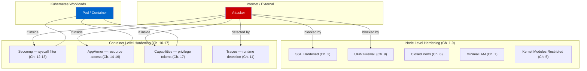
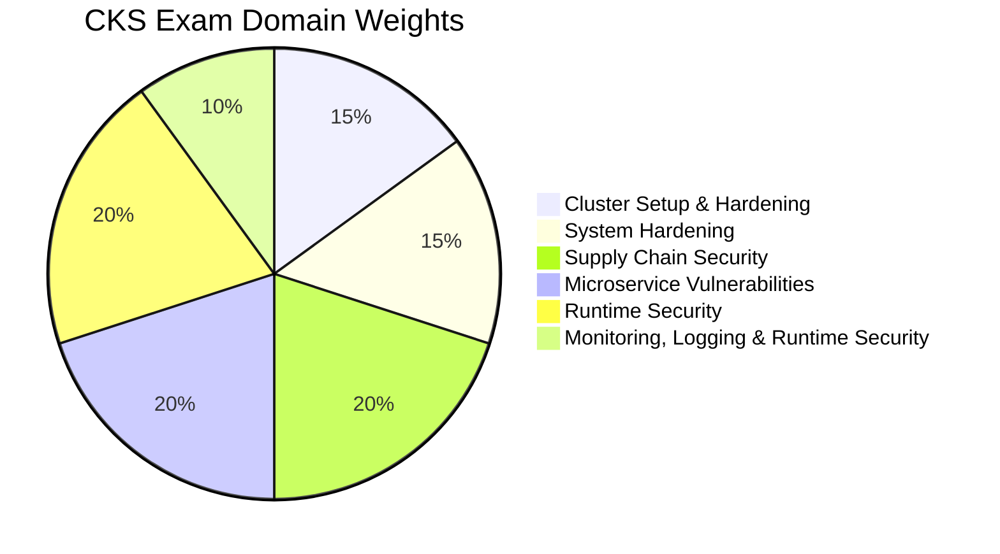
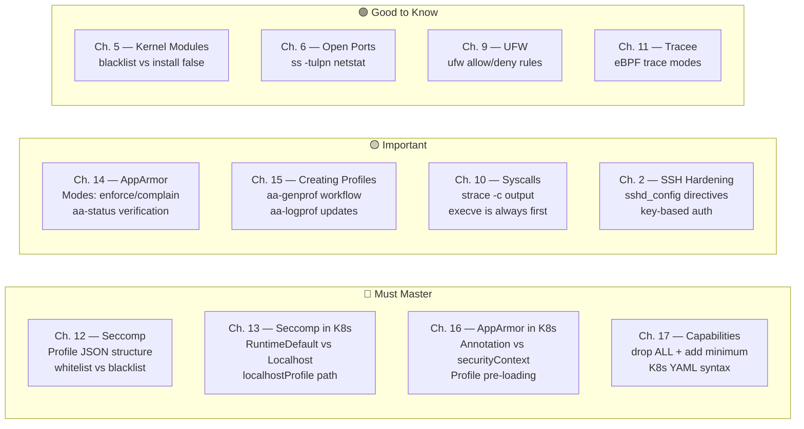
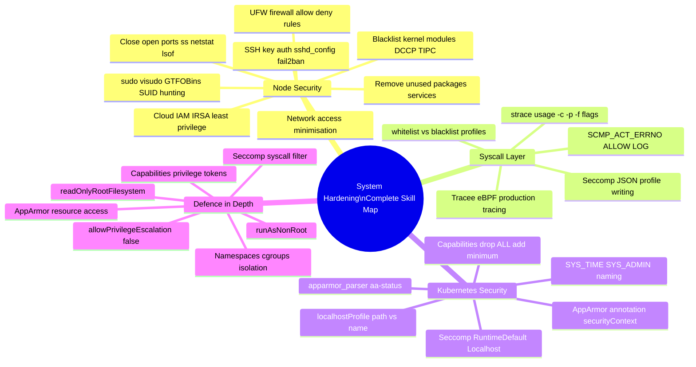
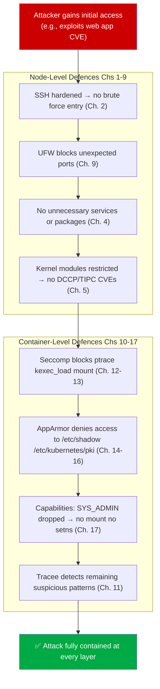

# System Hardening — Module Introduction

> **CKS Domain:** System Hardening  
> **Exam Weight:** 15% of CKS exam  
> **Total Chapters:** 17  
> **Folder:** `System Hardening/`  
> **Prerequisite Domain:** Cluster Setup & Hardening (Ch. 1–20)

---

## What Is System Hardening?

**System Hardening** is the practice of reducing a system's attack surface by eliminating unnecessary software, services, permissions, and access pathways — and then enforcing tight controls on what remains. The goal is simple: **the less your system can do that it doesn't need to do, the less damage an attacker can cause.**

In the context of Kubernetes, system hardening operates at **two levels**:

- **Node level** — hardening the Linux operating system that runs underneath every Kubernetes node (SSH, open ports, kernel modules, IAM roles, firewall rules)
- **Container/Pod level** — hardening the isolation boundary around each workload (syscall filtering, filesystem access control, privilege tokens)

Together, these two levels implement **defence-in-depth**: even if an attacker gets code execution inside a container, multiple independent security layers prevent them from escalating privileges, reading sensitive data, or escaping to the host.



---

## CKS Exam Perspective

System Hardening carries **15% of the total CKS exam weight** — making it the third-largest domain after Cluster Setup & Hardening (15%) and Supply Chain Security (20%). The exam tests both conceptual understanding and hands-on ability to apply configurations directly in a live cluster.



### What the CKS Exam Actually Tests in This Domain

| Topic | Exam Task Style | Chapters |
|-------|----------------|---------|
| Seccomp profiles in Kubernetes | Apply a `RuntimeDefault` or `Localhost` profile to a pod | 12, 13 |
| AppArmor in Kubernetes | Load a profile on a node, apply via annotation or securityContext | 14, 15, 16 |
| Linux Capabilities | Add/drop specific capabilities in pod securityContext | 17 |
| Syscall tracing | Identify syscalls made by a process using strace or Tracee | 10, 11 |
| SSH hardening | Identify insecure sshd settings and correct them | 2 |
| Open ports | Use ss/netstat to find and disable unnecessary listeners | 6 |
| Kernel module restriction | Blacklist a module via /etc/modprobe.d/ | 5 |
| IAM least privilege | Identify over-permissioned roles and scopes | 7 |
| UFW rules | Write and apply allow/deny rules | 9 |

### High-Priority Chapters for the CKS Exam



---

## Module Overview — All 17 Chapters

### Part 1 — Foundations and Philosophy (Ch. 1)

---

#### Chapter 1 — Least Privilege Principle
**File:** `1 -- Least Privilege Principle.md`

**What it covers:**  
The philosophical and practical foundation for everything in this module. Every security control in Chapters 2–17 is an implementation of this one principle. Covers the airport security analogy (three zones = three clearance levels), the six Kubernetes security measures mapped to PoLP, and how over-privileged identities become the primary vector for lateral movement.

**Key outcomes:**
- Understand *why* minimum access is the correct default (not "allow everything, restrict what breaks")
- Map PoLP to real Kubernetes constructs: RBAC scoping, `automountServiceAccountToken: false`, `default-deny` NetworkPolicy
- Identify common privilege violations: shared service accounts, wildcard RBAC verbs, containers running as root

**CKS relevance:** Conceptual foundation — every exam question about Seccomp, AppArmor, Capabilities, and RBAC is asking you to apply this principle.

---

### Part 2 — Node-Level Hardening (Ch. 2–9)

---

#### Chapter 2 — SSH Hardening
**File:** `2 -- SSH Hardening.md`

**What it covers:**  
Securing the primary remote access pathway into every Kubernetes node. Covers the full SSH handshake, key algorithm comparison (Ed25519 vs RSA), the complete production `sshd_config` with every directive explained, `fail2ban` configuration, and multi-key management with `~/.ssh/config`.

**Key outcomes:**
- Disable password authentication, enable key-based auth
- Harden sshd_config: `PermitRootLogin no`, `MaxAuthTries 3`, `AllowUsers`, cipher/MAC hardening
- Set up fail2ban to block brute-force attempts automatically
- Understand the 5-phase SSH handshake and where each security control applies

**CKS relevance:** The exam may ask you to identify insecure `sshd_config` directives and fix them, or explain why a node is vulnerable to brute-force.

---

#### Chapter 3 — Privilege Escalation in Linux
**File:** `3 -- Privilege Escalation in Linux.md`

**What it covers:**  
How legitimate privilege escalation (sudo) works and how attackers abuse it. Full `/etc/sudoers` field-by-field breakdown, the `visudo` vs `nano` safety lesson, GTFOBins attack patterns (vim, less, awk, find, python escaping to shells), and SUID binary hunting.

**Key outcomes:**
- Read and write `/etc/sudoers` correctly — Host/User/Command aliases, NOPASSWD implications
- Use `visudo` — never edit sudoers directly with a text editor
- Identify SUID binaries with `find / -perm -4000` and assess their risk
- Understand GTFOBins: why `sudo vim` is equivalent to `sudo bash`

**CKS relevance:** Understanding escalation paths informs every other hardening decision in this module.

---

#### Chapter 4 — Remove Obsolete Packages and Services
**File:** `4 -- Remove Obsolete Packages and Services.md`

**What it covers:**  
Reducing the OS attack surface by removing software the node doesn't need. Covers Kubernetes required vs blacklisted packages, systemd service states (active/inactive/failed/enabled/disabled/masked), the difference between `apt remove` and `apt remove --purge`, and snap package removal.

**Key outcomes:**
- Identify which packages belong on a Kubernetes control plane vs worker node
- Stop and disable unnecessary services: `systemctl disable --now <service>`
- Use `apt remove --purge` to eliminate config files, not just binaries
- Build an automated audit script to detect service/package drift

**CKS relevance:** Minimal OS = fewer CVEs. A common exam scenario involves identifying and removing a service that shouldn't be running on a Kubernetes node.

---

#### Chapter 5 — Restrict Kernel Modules
**File:** `5 -- Restrict Kernel Modules.md`

**What it covers:**  
Preventing the auto-loading of kernel modules that have known CVE histories or no legitimate purpose on a Kubernetes node. Covers `lsmod`, `modprobe`, `modinfo`, the critical difference between `blacklist` and `install /bin/false`, `update-initramfs`, and `kernel.modules_disabled=1` for maximum lockdown.

**Key outcomes:**
- Understand that `blacklist` only prevents auto-load — `install /bin/false` prevents manual load too
- Block dangerous modules: `sctp`, `dccp`, `rds`, `tipc`, `bluetooth`, `usb-storage`
- Apply changes correctly: write to `/etc/modprobe.d/`, run `update-initramfs -u`, reboot
- Reference CVE-2017-6074 (DCCP) and CVE-2022-0435 (TIPC) as real-world justification

**CKS relevance:** CIS Benchmark section 3.4 — the exam may ask you to block a specific module and verify it's disabled.

---

#### Chapter 6 — Identify and Disable Open Ports
**File:** `6 -- Identify and Disable Open Ports.md`

**What it covers:**  
Finding every listening service on a node and closing the ones that don't belong. Covers `ss -tulpn` and `netstat -tulpn` with full flag explanations, the Kubernetes required port reference (control plane and worker), port ownership via `ss`, `lsof`, `fuser`, and `nmap` for external scanning.

**Key outcomes:**
- Read `ss -tulpn` output and classify every listener as expected, suspicious, or dangerous
- Map Kubernetes required ports: etcd (2379-2380), API server (6443), kubelet (10250), etc.
- Use `lsof -i :<port>` to find the owning process and stop/remove it
- Understand the 2018 etcd Shodan exposure and why `0.0.0.0` binding is critical to avoid

**CKS relevance:** "Find and disable a service listening on port X" is a classic CKS task format.

---

#### Chapter 7 — Minimize IAM Roles
**File:** `7 -- Minimize IAM Roles.md`

**What it covers:**  
Cloud IAM least privilege for the nodes and pods running your Kubernetes cluster. Covers IAM Users/Groups/Roles/Policies, the difference between static access keys and role-based temporary credentials, IRSA (IAM Roles for Service Accounts) for per-pod AWS permissions, and the IMDS v2 requirement.

**Key outcomes:**
- Understand why each pod should have its own dedicated IAM role via IRSA (not a shared node role)
- Audit for over-broad permissions: credential reports, access key age, unused roles
- Compare AWS/GCP/Azure IAM models and their Kubernetes integration patterns
- Recognise the Tesla 2018 cryptomining attack as the result of overly permissive node IAM

**CKS relevance:** Particularly relevant for CKS candidates working in cloud-hosted clusters (EKS, GKE, AKS).

---

#### Chapter 8 — Minimize External Access to the Network
**File:** `8 -- Minimize External Access to the Network.md`

**What it covers:**  
Controlling what can reach your cluster from the outside and what your cluster exposes to the internet. Covers perimeter firewalls vs host-based firewalls, the four-layer defence model, `0.0.0.0` vs `127.0.0.1` vs specific IP binding, AWS/GCP security group CLI examples, and the service binding decision tree.

**Key outcomes:**
- Classify every listening service as: internet-facing, internal-only, or localhost-only
- Understand the difference between perimeter (cloud security group) and host-based (UFW/iptables) controls
- Use the bash one-liner to auto-classify all ports by exposure level
- Know why `kubectl proxy --address=0.0.0.0` is a critical misconfiguration

**CKS relevance:** Directly tested — recognising dangerous binding configurations and knowing how to fix them.

---

#### Chapter 9 — UFW Firewall Basics
**File:** `9 -- UFW Firewall Basics.md`

**What it covers:**  
Practical host-based firewall management using UFW (Uncomplicated Firewall), an iptables frontend. Covers the safe enable procedure (prevent lock-out), default deny policy, rule syntax for IP/CIDR/port/range, the delete-by-number gotcha, and a complete Kubernetes node UFW configuration.

**Key outcomes:**
- Apply the safe UFW enable sequence without locking yourself out
- Write allow rules by source IP, CIDR range, port, protocol, and port range
- Delete rules correctly: by spec for simple rules, by number (highest first) for ordered rules
- Configure a Kubernetes control plane node: etcd ports scoped to internal IPs, API server limited to known clients

**CKS relevance:** UFW command syntax is examinable — writing specific `ufw allow from X to any port Y proto Z` rules.

---

### Part 3 — Container-Level Hardening (Ch. 10–17)

---

#### Chapter 10 — Linux Syscalls
**File:** `10 -- Linux Syscalls.md`

**What it covers:**  
The foundational concept that underlies Seccomp, AppArmor, and Tracee. Covers user space vs kernel space (Ring 3 vs Ring 0), the syscall interface, `strace` usage (`-c` summary, `-p` attach, `-e` filter, `-f` follow children), the syscall number table, and dangerous syscalls in containers.

**Key outcomes:**
- Understand that all container security tools operate at the syscall boundary
- Use `strace -c` to profile an application's syscall usage before writing a Seccomp profile
- Identify dangerous syscalls: `ptrace`, `mount`, `kexec_load`, `bpf`, `clone --CLONE_NEWUSER`
- Know that `execve` is always the first syscall of any program execution

**CKS relevance:** Conceptual foundation for Seccomp and Tracee exam questions.

---

#### Chapter 11 — AquaSec Tracee
**File:** `11 -- AquaSec Tracee.md`

**What it covers:**  
eBPF-based runtime syscall monitoring with near-zero overhead — the production-safe alternative to `strace`. Covers eBPF architecture and the verifier safety guarantee, the three Tracee trace modes (`comm=`, `pid=new`, `container=new`), the three required bind mounts, JSON output, and the Kubernetes DaemonSet deployment pattern.

**Key outcomes:**
- Deploy Tracee correctly: `--privileged`, `--pid=host`, three bind mounts (`/tmp/tracee`, `/lib/modules`, `/usr/src`)
- Use `--trace container=new` to monitor all new containers in a Kubernetes cluster
- Parse Tracee output columns: TIME, UID, COMM, PID, TID, RET, EVENT, ARGS
- Use Tracee to safely profile an application's syscalls for Seccomp profile creation

**CKS relevance:** Tracee tool usage and its relationship to Seccomp is directly tested.

---

#### Chapter 12 — Restrict Syscalls Using Seccomp
**File:** `12 -- Restrict Syscalls Using Seccomp.md`

**What it covers:**  
The Seccomp kernel feature for syscall filtering, and how to write profiles. Covers the Dirty COW CVE (CVE-2016-5195) as motivation, three Seccomp modes (disabled/strict/filter), profile JSON anatomy, whitelist vs blacklist profiles, the `SCMP_ACT_LOG` discovery pattern, Docker's default profile, and argument-level filtering.

**Key outcomes:**
- Write both whitelist (`defaultAction: SCMP_ACT_ERRNO`) and blacklist (`defaultAction: SCMP_ACT_ALLOW`) profiles
- Understand all five Seccomp actions: ALLOW, ERRNO, KILL, LOG, TRAP
- Verify Seccomp mode: `cat /proc/<pid>/status | grep Seccomp` → 0/1/2
- Know that Docker auto-applies a whitelist Seccomp profile blocking ~60 dangerous syscalls

**CKS relevance:** Profile structure, defaultAction values, and the whitelist/blacklist distinction are all exam-tested.

---

#### Chapter 13 — Implement Seccomp in Kubernetes
**File:** `13 -- Implement Seccomp in Kubernetes.md`

**What it covers:**  
Applying Seccomp profiles to Kubernetes pods — which works differently from Docker. Covers the K8s default (NO Seccomp), the three profile types (`RuntimeDefault`, `Unconfined`, `Localhost`), the kubelet profile directory (`/var/lib/kubelet/seccomp/`), and the three-step audit → violation → custom workflow.

**Key outcomes:**
- Apply `RuntimeDefault` immediately to any pod as a hardening baseline
- Place custom profiles at `/var/lib/kubelet/seccomp/profiles/` before pod creation
- `localhostProfile` is a **relative path** (not absolute) from the kubelet seccomp dir
- Diagnose `ContainerCannotRun` → missing required syscall in the profile

**CKS exam critical:** The `localhostProfile` path format and the three profile type names are heavily tested.

---

#### Chapter 14 — AppArmor
**File:** `14 -- AppArmor.md`

**What it covers:**  
AppArmor — the Linux Security Module that controls resource access at the path/network/capability level, complementing Seccomp which controls at the syscall level. Covers AppArmor vs Seccomp vs SELinux, LSM hook architecture, profile syntax, file permission tokens (`r`, `w`, `a`, `x`, `m`, `ix`), and the three profile modes.

**Key outcomes:**
- Understand that Seccomp says "which syscalls" while AppArmor says "what can those syscalls access"
- Verify AppArmor is running: `cat /sys/module/apparmor/parameters/enabled` → Y
- List all profiles: `aa-status` or `cat /sys/kernel/security/apparmor/profiles`
- Write basic profiles: `deny /** w,` for deny all writes; `flags=(attach_disconnected)` required for containers

**CKS relevance:** AppArmor verification commands and mode concepts are tested.

---

#### Chapter 15 — Creating AppArmor Profiles
**File:** `15 -- Creating AppArmor Profiles.md`

**What it covers:**  
The practical skill of generating real AppArmor profiles using `aa-genprof`. Covers the two-terminal workflow (aa-genprof waiting + app running), all interactive session options (Inherit/Allow/Deny/Glob), the generated profile anatomy (`mrix`, `owner`, abstractions), `aa-logprof` for incremental updates, and profile lifecycle management.

**Key outcomes:**
- Run `aa-genprof /path/to/binary` and conduct a full interactive profiling session
- Respond correctly to execute events (Inherit = `i`) and file access events (Allow = `a`, Deny = `d`)
- Understand `mrix` = memory-map + read + inherit-profile + execute
- Update existing profiles with `aa-logprof` when application changes introduce new access patterns

**CKS relevance:** `aa-genprof` usage and the resulting profile syntax are directly examinable.

---

#### Chapter 16 — AppArmor in Kubernetes
**File:** `16 -- AppArmor in Kubernetes.md`

**What it covers:**  
Applying AppArmor profiles to Kubernetes pods — the operational workflow and the two API methods. Covers the three node requirements, legacy annotation syntax (pre-1.30), modern `securityContext.appArmorProfile` (1.30+), profile distribution strategy for multi-node clusters, and diagnosing `CreateContainerError`.

**Key outcomes:**
- Load a profile on a node: `apparmor_parser -r /etc/apparmor.d/<profile>`
- Apply via annotation: `container.apparmor.security.beta.kubernetes.io/<container-name>: localhost/<profile-name>`
- Apply via securityContext: `appArmorProfile.type: Localhost` + `localhostProfile: <profile-name>` (name only, not a file path)
- Diagnose `CreateContainerError` — profile not found on the scheduled node

**CKS exam critical:** Both annotation and securityContext syntax, and the distinction that `localhostProfile` is a **name** (not a path) for AppArmor.

---

#### Chapter 17 — Linux Capabilities
**File:** `17 -- Linux Capabilities.md`

**What it covers:**  
The finest-grained layer of privilege control — Linux capability tokens that split the all-powerful root identity into 41 discrete operations. Covers the pre/post-2.2 kernel model, why `date -s` fails even as UID 0, Docker's 13 default capabilities, `getcap`/`getpcaps` inspection, and adding/dropping capabilities in both Docker and Kubernetes.

**Key outcomes:**
- Understand that UID 0 without `CAP_SYS_TIME` cannot set the clock — capability check is independent of UID
- Apply `capabilities.drop: [ALL]` then `add` only the minimum required tokens
- Know Kubernetes naming: `SYS_TIME` not `CAP_SYS_TIME` (no prefix, uppercase)
- `capabilities` is container-level only — cannot be set at pod level
- `CAP_SYS_ADMIN` is the most dangerous capability — enables mount, setns, namespace operations → container escape

**CKS exam critical:** Capability YAML syntax, naming convention, and `drop: [ALL]` + `add` pattern are heavily tested.

---

## What You've Learned — Complete Skill Map



---

## The Defence-in-Depth Stack — How All 17 Chapters Connect



---

## Key Commands — Module-Wide Cheat Sheet

```bash
# ── NODE HARDENING ────────────────────────────────────────────────
systemctl status sshd                          # Ch. 2
grep "PermitRootLogin\|PasswordAuth" /etc/ssh/sshd_config
ss -tulpn                                      # Ch. 6: open ports
cat /etc/modprobe.d/k8s-hardening.conf         # Ch. 5: module blacklists
ufw status numbered                            # Ch. 9: firewall rules

# ── SECCOMP ───────────────────────────────────────────────────────
cat /proc/<pid>/status | grep Seccomp          # Ch. 12: 0=off 1=strict 2=filter
strace -c touch /tmp/test                      # Ch. 10: syscall summary
# Profile location: /var/lib/kubelet/seccomp/profiles/

# ── APPARMOR ──────────────────────────────────────────────────────
cat /sys/module/apparmor/parameters/enabled    # Ch. 14: Y = enabled
aa-status                                      # Ch. 14: all loaded profiles
apparmor_parser -r /etc/apparmor.d/<profile>   # Ch. 15: load/reload
aa-genprof /path/to/binary                     # Ch. 15: generate profile
aa-logprof                                     # Ch. 15: update from logs

# ── CAPABILITIES ──────────────────────────────────────────────────
getcap /usr/bin/ping                           # Ch. 17: file capabilities
getpcaps <PID>                                 # Ch. 17: process capabilities
capsh --decode=<hex>                           # Ch. 17: decode bitmask

# ── TRACEE ────────────────────────────────────────────────────────
docker run ... aquasec/tracee:0.4.0 --trace container=new  # Ch. 11
```

---

## Kubernetes Pod — Fully Hardened Template

This template applies every container-level hardening technique from this module:

```yaml
apiVersion: v1
kind: Pod
metadata:
  name: fully-hardened-pod
  annotations:
    # AppArmor (legacy annotation for K8s < 1.30)
    container.apparmor.security.beta.kubernetes.io/app: localhost/apparmor-deny-write
spec:
  securityContext:
    runAsNonRoot: true                  # Ch. 1: PoLP — no root
    runAsUser: 1000
    runAsGroup: 3000
    fsGroup: 2000
    seccompProfile:                     # Ch. 12-13: Seccomp
      type: RuntimeDefault              # Or Localhost with custom profile
    appArmorProfile:                    # Ch. 14-16: AppArmor (K8s 1.30+)
      type: Localhost
      localhostProfile: apparmor-deny-write
  containers:
  - name: app
    image: myapp:latest
    securityContext:
      allowPrivilegeEscalation: false   # Ch. 3: block setuid escalation
      readOnlyRootFilesystem: true      # Ch. 4: immutable container FS
      capabilities:
        drop:
        - ALL                           # Ch. 17: drop all 13 Docker defaults
        add:
        - NET_BIND_SERVICE              # Ch. 17: re-add only what app needs
```

---

## Common CKS Exam Traps — System Hardening

| Trap | Correct Answer |
|------|---------------|
| Seccomp `localhostProfile` value | Relative path from `/var/lib/kubelet/seccomp/` — e.g. `profiles/custom.json` |
| AppArmor `localhostProfile` value | Profile **name** only — e.g. `apparmor-deny-write` (NOT a file path) |
| Kubernetes capability names | **NO `CAP_` prefix**, uppercase — `SYS_TIME` not `CAP_SYS_TIME` |
| Where to set `capabilities` | Container-level `securityContext` ONLY — not pod-level |
| AppArmor annotation key suffix | **Container name** — not pod name |
| AppArmor annotation value prefix | Must have `localhost/` — e.g. `localhost/apparmor-deny-write` |
| Seccomp whitelist profile | `"defaultAction": "SCMP_ACT_ERRNO"` — deny all, allow specific |
| Seccomp blacklist profile | `"defaultAction": "SCMP_ACT_ALLOW"` — allow all, deny specific |
| AppArmor profile must be... | Pre-loaded on the **node** before pod creation (`apparmor_parser -r`) |
| Seccomp profile must be... | Pre-copied to `/var/lib/kubelet/seccomp/` before pod creation |
| Kernel module: stop manual load | `install /bin/false` — not just `blacklist` (blacklist only stops auto-load) |
| UFW delete rules | Delete by number from **highest to lowest** to avoid number shift |

---

## Learning Path — Recommended Review Order

For CKS exam preparation, review chapters in this priority order:

```
1. Ch. 12 → Ch. 13  (Seccomp — write profiles, apply in Kubernetes)
2. Ch. 14 → Ch. 16  (AppArmor — understand, apply in Kubernetes)
3. Ch. 17           (Capabilities — drop/add in YAML)
4. Ch. 15           (Creating AppArmor profiles with aa-genprof)
5. Ch. 10 → Ch. 11  (Syscalls foundation + Tracee)
6. Ch. 2, 6, 9      (SSH, Ports, UFW — node hardening)
7. Ch. 1, 3-5, 7-8  (Supporting concepts)
```

---

## What's Next

This module's tools protect **individual nodes and containers**. The next domain — **Microservice Vulnerabilities** — shifts focus to the **communication layer between services**: mTLS, service mesh security, API gateway vulnerabilities, and secrets management in a multi-service Kubernetes architecture.

The skills from this module — especially understanding Kubernetes security contexts, network access control, and least privilege — provide the foundation for Microservice Vulnerabilities work.

---

*All chapters written for CKS exam preparation. Covers KodeKloud System Hardening curriculum with extended real-world context, Mermaid diagrams, and hands-on command references.*
