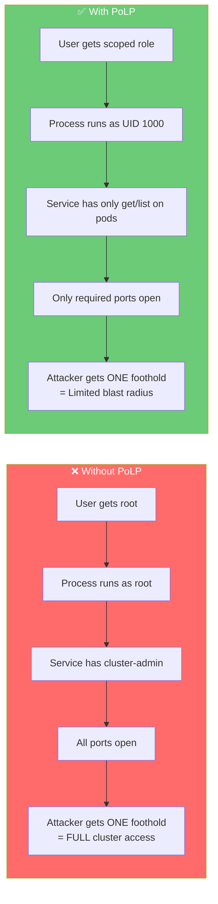
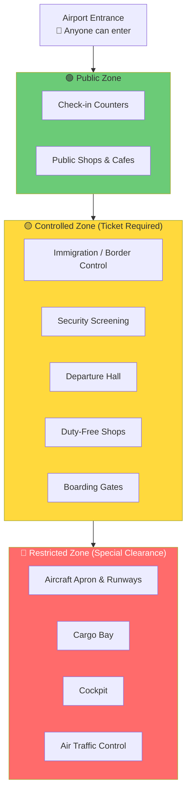
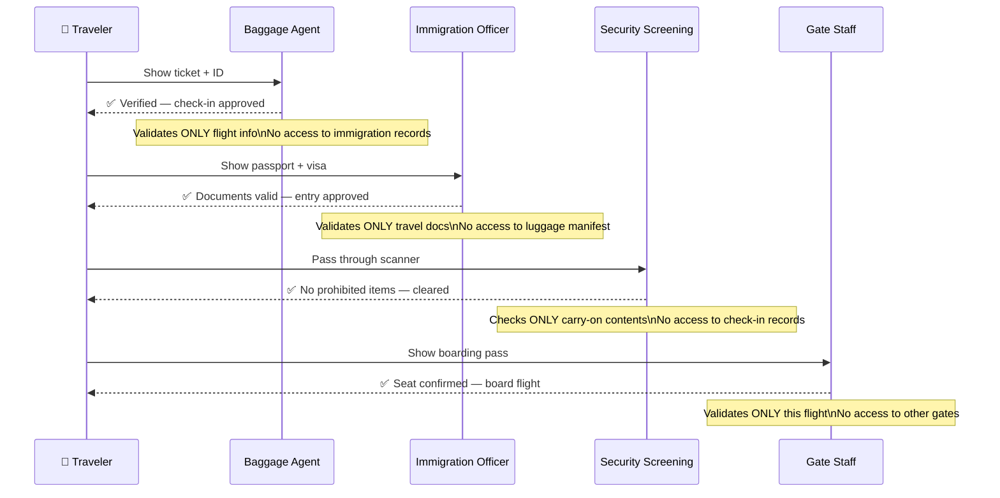
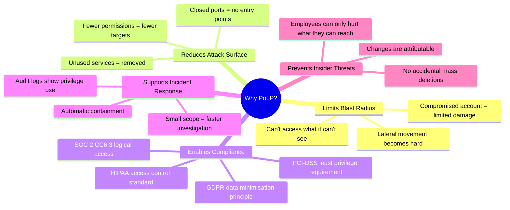
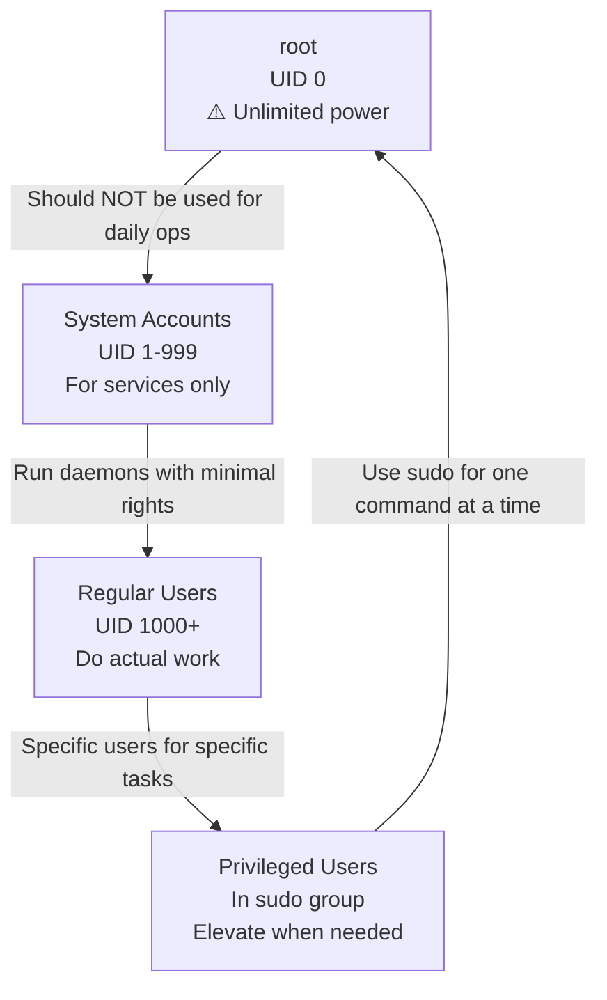
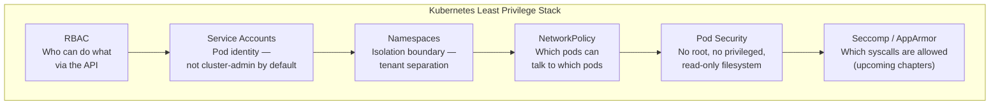
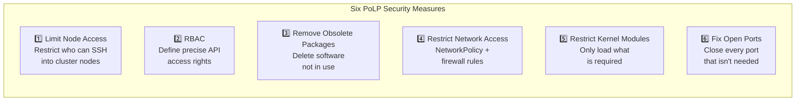
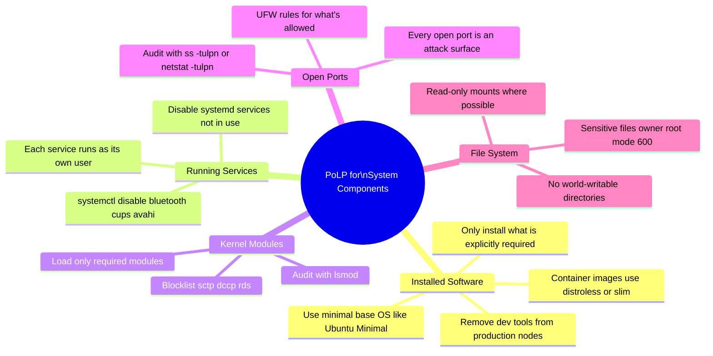
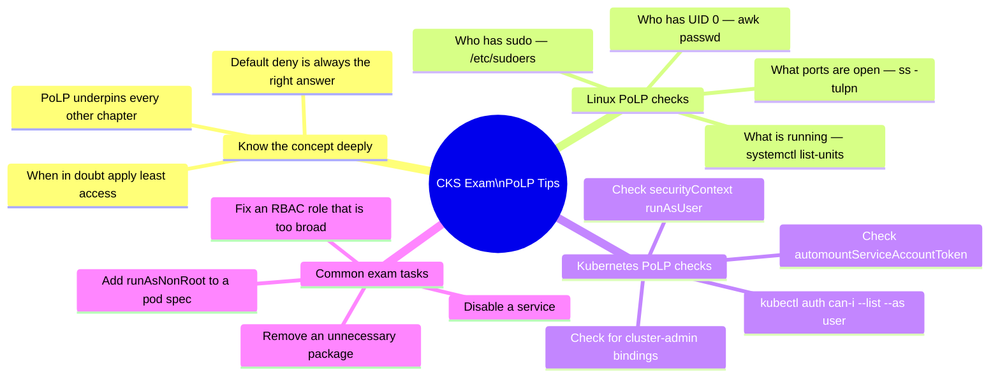
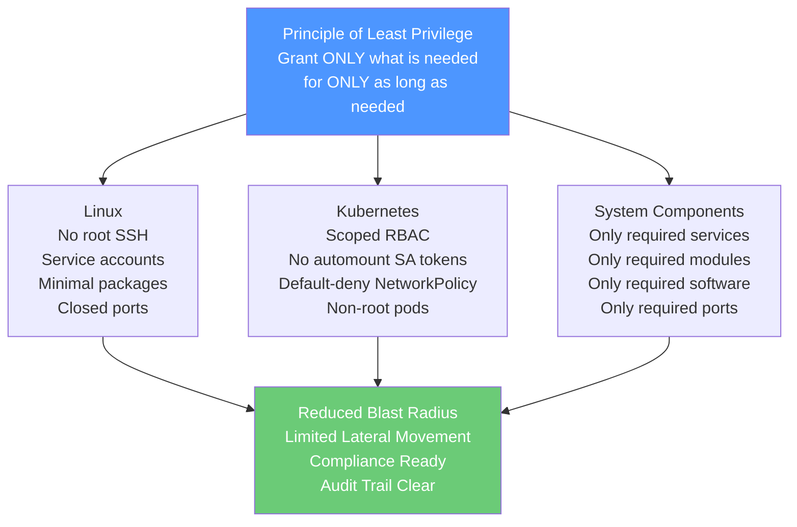

# 1 — Least Privilege Principle

> **What you'll learn:** What the Principle of Least Privilege (PoLP) is, why it is the foundation of every security hardening decision, how it applies to Linux users, Kubernetes RBAC, service accounts, network access, and kernel modules — and what real-world breaches happen when it is ignored.

---

## Table of Contents

1. [What is the Least Privilege Principle?](#1-what-is-the-least-privilege-principle)
2. [The Airport Analogy](#2-the-airport-analogy)
3. [Why PoLP Matters — The Security Case](#3-why-polp-matters--the-security-case)
4. [PoLP in Linux Systems](#4-polp-in-linux-systems)
5. [PoLP in Kubernetes](#5-polp-in-kubernetes)
6. [The Six Kubernetes Security Measures](#6-the-six-kubernetes-security-measures)
7. [PoLP Across System Components](#7-polp-across-system-components)
8. [Real-World Scenarios](#8-real-world-scenarios)
9. [Common Violations & How to Fix Them](#9-common-violations--how-to-fix-them)
10. [CKS Exam Tips](#10-cks-exam-tips)

---

## 1. What is the Least Privilege Principle?


The **Principle of Least Privilege (PoLP)** — also called the **Principle of Minimal Privilege** or **Principle of Least Authority (POLA)** — states:

> *Every user, process, service, or system component should have access to only the minimum resources and permissions required to perform its specific function — nothing more.*

This sounds simple, but it is one of the most consistently violated security principles in practice. Developers give services `cluster-admin` because it's easier. Operators open all ports because they're unsure which ones are needed. Admins leave root SSH enabled because they've always done it that way.

**PoLP is not just a best practice — it is a force multiplier for every other security control you implement.**



### Core Properties

| Property | Description |
|---|---|
| **Minimal access** | Grant only what is explicitly needed for the task |
| **Time-bounded** | Access should expire when the task is done |
| **Task-specific** | Different tasks = different roles/permissions |
| **Revocable** | Access must be able to be taken away immediately |
| **Auditable** | Every grant of privilege must be traceable |

---

## 2. The Airport Analogy

The airport is one of the best real-world models of least privilege in action. Every person in the building has a different level of access, defined by their role and verified at every boundary.



### Role-by-Role Access Map


| Role | Public Zone | Controlled Zone | Restricted Zone | Notes |
|---|---|---|---|---|
| **Traveler** | ✅ | ✅ (with ticket) | ❌ | Only at their designated gate |
| **Baggage Counter Staff** | ✅ | ✅ (work area only) | ❌ | Airline-specific counter access |
| **Security Officers** | ✅ | ✅ (screening area) | ❌ | Cannot access gates or cargo |
| **Store Employees** | ✅ | ✅ (their store) | ❌ | May access backroom storage |
| **Boarding Gate Staff** | ✅ | ✅ | ❌ | Their gate only |
| **Cleaning Staff** | ✅ | ✅ | Partial | Some terminal/cargo access |
| **Cargo Loaders** | ✅ | Partial | ✅ (cargo bay) | No cockpit or ATC access |
| **Maintenance Workers** | ✅ | Partial | ✅ (apron/bay) | Aircraft maintenance zones only |
| **Pilots & Crew** | ✅ | ✅ | ✅ (their aircraft) | Cockpit is airline-specific |

The key insight: **no one gets a master key**. Even the CEO of the airline cannot walk onto the runway without a specific clearance for a specific reason. This is PoLP in physical form.

### The Journey Through Checkpoints



Each checkpoint sees only what it needs to. An immigration officer has no reason to know your seat number. A gate agent has no reason to see your passport details. **Compartmentalisation = least privilege.**

---

## 3. Why PoLP Matters — The Security Case



### The Cost of Ignoring PoLP

| Violation | What Happens | Real-World Example |
|---|---|---|
| Pod runs as root | Attacker escapes container → owns node | Docker socket mount attack |
| Service account has cluster-admin | Compromised pod can delete namespaces | Shopify K8s breach pattern |
| All ports open on nodes | Attackers probe and enter via exposed service | Exposed etcd on port 2379 |
| SSH root login enabled | Brute-force → full server compromise | 70% of cloud breaches involve SSH |
| Unnecessary packages installed | Old CVE in unused package exploited | Log4Shell via unused logging lib |
| Kernel modules unrestricted | Attacker loads rootkit module | Container escape via kernel module |

---

## 4. PoLP in Linux Systems

Linux is the operating system underneath every Kubernetes node. Hardening Linux itself is the first layer of defence.

### Users and Groups



**Linux PoLP rules:**

```bash
# Create a service account with no login shell (can't be SSH'd into)
sudo useradd -r -s /sbin/nologin -M myservice

# Verify the account has no shell
grep myservice /etc/passwd
# myservice:x:999:999::/home/myservice:/sbin/nologin

# Lock a user account (disable without deleting)
sudo usermod -L username

# Check who has sudo rights
sudo cat /etc/sudoers
sudo grep -r 'sudo\|wheel' /etc/group

# Audit users with UID 0 (should only be root)
awk -F: '($3 == "0") {print}' /etc/passwd

# Check for accounts with empty passwords (security risk!)
sudo awk -F: '($2 == "") {print $1}' /etc/shadow
```

### File Permissions

```bash
# Check sensitive file permissions
ls -la /etc/passwd /etc/shadow /etc/sudoers

# /etc/shadow should ONLY be readable by root
# -rw-r----- root shadow  (or -r-------- root root)
chmod 640 /etc/shadow

# SUID binaries (run as file owner, not as caller)
# These are PoLP violations — audit them
find / -perm -4000 -type f 2>/dev/null

# SGID binaries
find / -perm -2000 -type f 2>/dev/null

# World-writable files (anyone can modify — dangerous)
find / -perm -002 -type f 2>/dev/null
```

### The /proc Filesystem — A PoLP Risk

The `/proc` filesystem exposes running process information. In containers, access to `/proc` can leak host information:

```bash
# Restrict /proc visibility for non-root users
# Mount /proc with hidepid=2: users see only their own processes
# In /etc/fstab:
proc /proc proc defaults,hidepid=2 0 0

# Verify
mount | grep proc
```

---

## 5. PoLP in Kubernetes

In Kubernetes, the same principle operates at multiple layers simultaneously:



### The "Default Deny" Philosophy

In Kubernetes, the secure default is to deny everything and explicitly allow only what is needed:

```yaml
# Default deny all ingress and egress traffic
apiVersion: networking.k8s.io/v1
kind: NetworkPolicy
metadata:
  name: default-deny-all
  namespace: production
spec:
  podSelector: {}     # Applies to ALL pods in namespace
  policyTypes:
  - Ingress
  - Egress
```

```yaml
# Minimal RBAC: developer can only read pods in their namespace
apiVersion: rbac.authorization.k8s.io/v1
kind: Role
metadata:
  name: pod-reader
  namespace: dev-team
rules:
- apiGroups: [""]
  resources: ["pods"]
  verbs: ["get", "list", "watch"]   # No create/delete/update
```

```yaml
# Service account with no unnecessary permissions
apiVersion: v1
kind: ServiceAccount
metadata:
  name: app-service-account
  namespace: production
automountServiceAccountToken: false   # Don't mount token unless needed
```

---

## 6. The Six Kubernetes Security Measures


These six measures are the practical implementation of PoLP across a Kubernetes cluster. Each has its own dedicated chapter in this module:



### Measure-by-Measure Detail

| Measure | What It Prevents | How It Is Done | Covered In |
|---|---|---|---|
| **Limit Node Access** | Unauthorized SSH to cluster nodes | Disable root login, SSH keys only, no password auth | Ch. 2 — SSH Hardening |
| **RBAC** | Over-permissive API access; privilege escalation | Roles scoped to namespace, verbs, and resources | Cluster Hardening Ch. 8, 9 |
| **Remove Obsolete Packages** | CVEs in unused software | `apt remove`, `snap remove`, minimize base images | Ch. 4 — Remove Packages |
| **Restrict Network Access** | Lateral movement between pods | NetworkPolicy, UFW, cloud security groups | Ch. 9 — UFW, Ch. 8 — Ext. Access |
| **Restrict Kernel Modules** | Container escape via kernel module | Blocklist in `/etc/modprobe.d/`, disable module loading | Ch. 5 — Restrict Kernel Modules |
| **Fix Open Ports** | Exploitation of unneeded listening services | `ss -tulpn`, close unused ports, disable services | Ch. 6 — Disable Open Ports |

---

## 7. PoLP Across System Components

PoLP isn't just about user accounts and RBAC. It extends to every component that runs on a Kubernetes node:



### Practical System Audit Commands

```bash
# ── What's installed? ─────────────────────────────────────────────
# List all installed packages (Debian/Ubuntu)
dpkg --list

# Check which packages have had no security updates
apt list --upgradeable 2>/dev/null | grep -i security

# ── What's running? ───────────────────────────────────────────────
# List all active systemd services
systemctl list-units --type=service --state=active

# Find services that should probably be disabled on a K8s node
systemctl status bluetooth avahi-daemon cups snapd 2>/dev/null

# ── What ports are open? ─────────────────────────────────────────
# Show all listening ports with the process that owns them
ss -tulpn
# or
netstat -tulpn

# ── What kernel modules are loaded? ───────────────────────────────
lsmod

# Check if a specific module is loaded
lsmod | grep sctp

# ── What kernel modules auto-load on boot? ────────────────────────
cat /etc/modules
ls /etc/modules-load.d/
```

---

## 8. Real-World Scenarios

### Scenario 1 — The Over-Permissive CI/CD Pipeline

**Situation:** A startup runs their Jenkins CI/CD pipeline with a Kubernetes service account that has `cluster-admin`. A developer accidentally pushes a misconfigured job that deletes all namespaces in the cluster.

**Root cause:** Violation of PoLP — CI/CD only needs to deploy to specific namespaces, not administer the entire cluster.

**Fix:**

```yaml
# Before: cluster-admin (dangerous)
apiVersion: rbac.authorization.k8s.io/v1
kind: ClusterRoleBinding
metadata:
  name: jenkins-admin
roleRef:
  apiGroup: rbac.authorization.k8s.io
  kind: ClusterRole
  name: cluster-admin      # ← WAY too broad
subjects:
- kind: ServiceAccount
  name: jenkins
  namespace: ci-cd
```

```yaml
# After: scoped to deploy/update in specific namespaces only
apiVersion: rbac.authorization.k8s.io/v1
kind: Role
metadata:
  name: jenkins-deployer
  namespace: production
rules:
- apiGroups: ["apps"]
  resources: ["deployments", "replicasets"]
  verbs: ["get", "list", "create", "update", "patch"]
  # Note: NO delete, NO clusterwide access
---
apiVersion: rbac.authorization.k8s.io/v1
kind: RoleBinding
metadata:
  name: jenkins-deployer-binding
  namespace: production
subjects:
- kind: ServiceAccount
  name: jenkins
  namespace: ci-cd
roleRef:
  kind: Role
  name: jenkins-deployer
  apiGroup: rbac.authorization.k8s.io
```

**Lesson:** The blast radius of the mistake was the entire cluster. With PoLP it would have been one namespace.

---

### Scenario 2 — The Compromised Node with Root SSH

**Situation:** A Kubernetes node has root SSH enabled with password authentication. An attacker brute-forces the password. Since they land as root, they immediately have full node access, can read kubelet credentials, and pivot to the entire cluster.

**Root cause:** Violation of PoLP — SSH should require keys, root should be disabled, and a regular user with `sudo` only for specific operations should be used.

**Fix:**

```bash
# /etc/ssh/sshd_config hardening
PermitRootLogin no               # Never allow root SSH
PasswordAuthentication no        # Keys only — no passwords
PubkeyAuthentication yes
AuthorizedKeysFile .ssh/authorized_keys
MaxAuthTries 3                   # Limit brute-force attempts
AllowUsers k8s-admin             # Whitelist specific users only

# Restart SSH after changes
sudo systemctl restart sshd

# Verify root cannot log in
ssh root@node-ip  # Should be rejected
```

**Lesson:** Disabling root SSH is the single highest-impact PoLP change on a Linux server.

---

### Scenario 3 — CVE in an Unused Package

**Situation:** A financial services company runs Kubernetes nodes with full Ubuntu Server installs, including Apache2 installed as a test during initial setup and never removed. Apache2 has a critical CVE. The vulnerability is exploited via port 80, which was accidentally left open.

**Root cause:** Violation of PoLP — unused software should be removed; unused ports should be closed.

**Fix:**

```bash
# Remove the unused package
sudo apt remove --purge apache2 apache2-utils -y
sudo apt autoremove -y

# Close port 80 with UFW
sudo ufw deny 80/tcp
sudo ufw status verbose

# Verify port 80 is no longer listening
ss -tulpn | grep ':80'
# Should return nothing
```

**Lesson:** Every installed package is a potential attack surface. If you're not using it, remove it.

---

## 9. Common Violations & How to Fix Them

| Violation | Severity | Detection Command | Fix |
|---|---|---|---|
| Pod running as UID 0 (root) | 🔴 Critical | `kubectl get pods -o jsonpath='{..securityContext.runAsUser}'` | Set `runAsNonRoot: true` in pod spec |
| Service account with cluster-admin | 🔴 Critical | `kubectl get clusterrolebindings -o wide \| grep cluster-admin` | Create scoped Role/RoleBinding |
| `automountServiceAccountToken: true` (default) when not needed | 🟠 High | `kubectl get pods -o yaml \| grep automountServiceAccountToken` | Set `automountServiceAccountToken: false` |
| Root SSH enabled | 🔴 Critical | `grep PermitRootLogin /etc/ssh/sshd_config` | Set `PermitRootLogin no` |
| Password SSH authentication | 🔴 Critical | `grep PasswordAuthentication /etc/ssh/sshd_config` | Set `PasswordAuthentication no` |
| Unused services running | 🟠 High | `systemctl list-units --state=active --type=service` | `systemctl disable --now <service>` |
| Open unused ports | 🟠 High | `ss -tulpn` | `ufw deny <port>` + disable service |
| Unnecessary packages installed | 🟡 Medium | `dpkg --list` | `apt remove --purge <package>` |
| Loaded unnecessary kernel modules | 🟠 High | `lsmod` | Add to `/etc/modprobe.d/blacklist.conf` |
| World-writable files outside /tmp | 🟠 High | `find / -perm -002 -not -path '/tmp/*' -type f` | `chmod o-w <file>` |
| SUID binaries beyond OS defaults | 🟡 Medium | `find / -perm -4000 -type f` | `chmod u-s <binary>` if not needed |

---

## 10. CKS Exam Tips



### PoLP Is the "Why" Behind Every Chapter

| Chapter | The PoLP Connection |
|---|---|
| Ch. 2 — SSH Hardening | No root login, no password auth = limit what attackers can do if they guess credentials |
| Ch. 3 — Privilege Escalation | Understanding how privilege is gained = understanding what to lock down |
| Ch. 4 — Remove Packages | Unused software = unnecessary attack surface |
| Ch. 5 — Kernel Modules | Only needed modules loaded = reduce kernel attack surface |
| Ch. 6 — Disable Ports | Only required ports open = no unexpected entry points |
| Ch. 7 — Minimize IAM | Cloud roles scoped to function = no broad cloud access from node |
| Ch. 8 — Minimize External Access | Only required external traffic allowed = network isolation |
| Ch. 9 — UFW Firewall | Whitelist-based port rules = default deny network |
| Ch. 12-13 — Seccomp | Only required syscalls allowed = limit kernel attack surface |
| Ch. 14-16 — AppArmor | Only required file/network access for process = MAC enforcement |
| Ch. 17 — Linux Capabilities | Drop all capabilities, add back only needed ones = root without root |

> **The single most important mindset for the CKS exam:** *start from zero access and add only what is explicitly needed*. If a question asks you to configure something and you're unsure, always pick the option that grants less.

---

## Summary



| Concept | Key Point |
|---|---|
| **What is PoLP** | Every identity/process gets the minimum permissions needed for its task |
| **The airport model** | Different zones, different roles, different access — no master keys |
| **Why it matters** | Limits blast radius, reduces attack surface, enables compliance |
| **In Linux** | No root SSH, scoped users, minimal packages, closed ports |
| **In Kubernetes** | Scoped RBAC, non-root pods, no auto-mounted SA tokens, NetworkPolicy |
| **The six measures** | Limit node access, RBAC, remove packages, restrict network, restrict modules, fix ports |
| **The mindset** | Default deny — start from zero and add only what is explicitly required |
