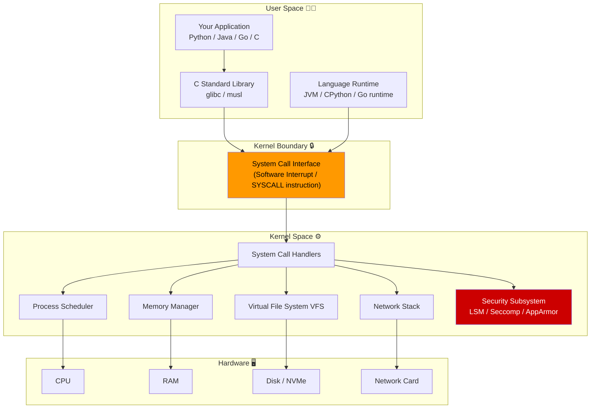
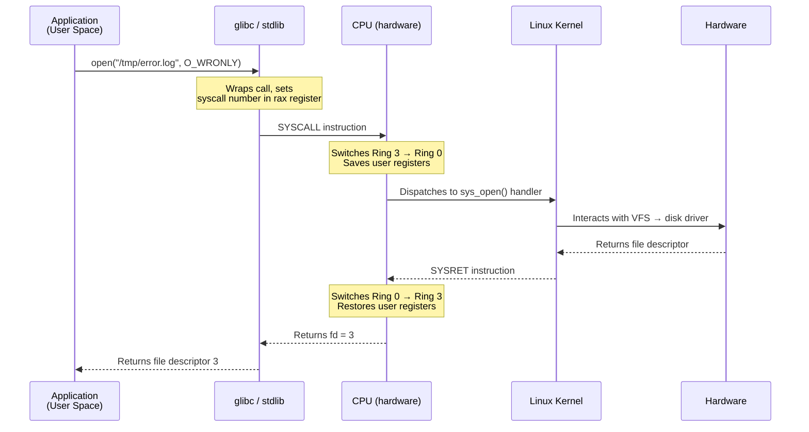
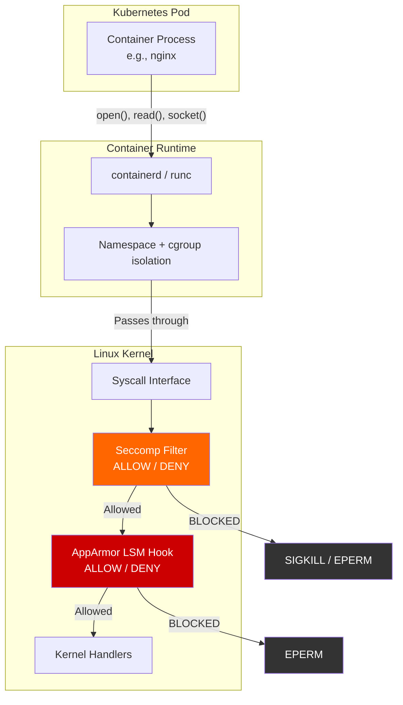
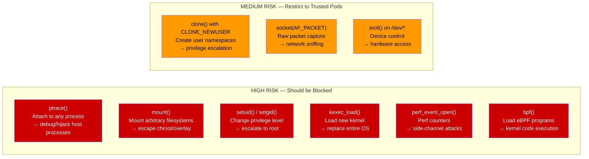
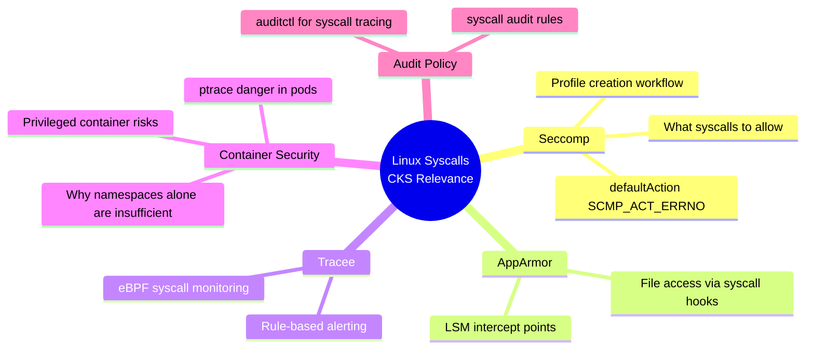
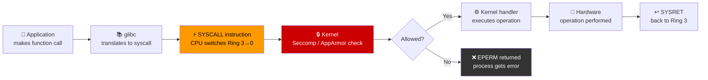

# 10 — Linux Syscalls

> **Domain:** System Hardening | **CKS Exam Weight:** Medium  
> **Prerequisites:** Ch. 5 (Kernel Modules), Ch. 3 (Privilege Escalation)  
> **Leads Into:** Ch. 11 (AquaSec Tracee), Ch. 12 (Seccomp)

---

## Why This Matters

Every single action a running program takes — reading a file, opening a socket, spawning a child process — must eventually pass through the **Linux kernel**. Programs cannot touch hardware, memory outside their sandbox, or other processes directly. They must **ask the kernel** using a formal handshake called a **system call (syscall)**.

This single mechanism is the reason container security tools like **Seccomp**, **AppArmor**, and **Tracee** work. They all intercept or restrict syscalls. If you don't understand syscalls, you can't understand why these tools matter or how to configure them correctly.

From an attacker's perspective, syscalls are the **final frontier**: even a malicious container process that breaks out of its namespace still has to make kernel syscalls, and those calls can be audited, filtered, and blocked.

```
"All security is ultimately about controlling what calls programs can make to the kernel."
                                                          — Container Security Fundamentals
```

---

## What Is a Linux Syscall?

A **system call (syscall)** is the **only legal way for a user-space program to ask the Linux kernel to do something on its behalf**. Because applications run in an unprivileged CPU mode (Ring 3) and the kernel runs in a privileged mode (Ring 0), programs cannot directly touch hardware, access other processes' memory, or open files — they must request these operations through the syscall interface.

Every action you take as a developer — opening a file, sending a network packet, allocating memory, creating a thread — ultimately translates into one or more syscalls at the hardware level.

| Category | Example Syscalls | What They Enable |
|----------|-----------------|-----------------|
| **File I/O** | `open`, `read`, `write`, `close`, `openat` | Reading configs, writing logs, serving files |
| **Process control** | `execve`, `fork`, `clone`, `exit_group` | Starting programs, creating threads |
| **Memory** | `mmap`, `brk`, `mprotect`, `munmap` | Heap allocation, shared memory |
| **Network** | `socket`, `bind`, `connect`, `sendto`, `recvfrom` | Every network connection |
| **Signals** | `rt_sigaction`, `rt_sigprocmask`, `kill` | Process signalling, interrupts |
| **Kernel/System** | `ptrace`, `mount`, `kexec_load`, `init_module` | ⚠️ Privileged operations — attack targets |

> 💡 **Key insight for CKS:** Linux has 435+ syscalls. Most applications use only 40–60 of them. The remaining 375+ are **unused attack surface** — which is exactly what Seccomp (Ch. 12) and AppArmor (Ch. 14) exist to eliminate.

---

## The Big Picture — User Space vs Kernel Space



### Why Two Spaces?

| Aspect | User Space | Kernel Space |
|--------|-----------|--------------|
| **Privilege level** | Ring 3 (unprivileged) | Ring 0 (privileged) |
| **Memory access** | Own virtual address space only | All physical memory |
| **Hardware access** | None — must ask kernel | Direct |
| **Crash impact** | Process dies, OS survives | System panic (kernel oops) |
| **Security implication** | Isolated — damage is contained | Compromise = full system owned |
| **Examples** | nginx, kubelet, etcd, your app | Kernel drivers, VFS, TCP/IP stack |

The hard boundary between these two privilege levels is enforced by the **CPU itself** — the x86-64 `SYSCALL` instruction switches the processor from Ring 3 to Ring 0 atomically, and back again with `SYSRET`. This is not a software construct; it is a hardware guarantee.

---

## What Is a System Call?

A **system call** is a controlled entry point from user space into the kernel. Think of it as a formal request window:



### The Syscall Number Table

Each syscall has a unique **number** that the kernel uses to look up the handler. On x86-64 Linux:

| Number | Syscall Name | What It Does |
|--------|-------------|--------------|
| 0 | `read` | Read from file descriptor |
| 1 | `write` | Write to file descriptor |
| 2 | `open` | Open/create file |
| 3 | `close` | Close file descriptor |
| 9 | `mmap` | Map memory |
| 11 | `munmap` | Unmap memory |
| 56 | `clone` | Create thread or process |
| 57 | `fork` | Create child process |
| 59 | `execve` | Execute program |
| 60 | `exit` | Terminate process |
| 102 | `getuid` | Get user ID |
| 105 | `setuid` | Set user ID (needs privilege) |
| 157 | `prctl` | Process control (used by Seccomp) |
| 293 | `seccomp` | Set Seccomp filter |
| 317 | `seccomp` | (varies by arch) |

> The full table for your architecture: `/usr/include/asm/unistd_64.h` or `/usr/include/sys/syscall.h`

---

## Linux Kernel Architecture — The KodeKloud View


This diagram captures the layered nature of the Linux kernel:

- **User space applications** cannot reach hardware directly
- All requests funnel through the **system call interface**
- The kernel then coordinates with subsystems: VFS for files, network stack for sockets, memory manager for allocation
- The **LSM (Linux Security Module) hooks** sit inline — AppArmor and SELinux use these hooks to intercept and allow/deny operations

---

## Tracing Syscalls with `strace`

`strace` is the essential tool for observing what syscalls a process makes. It works by using the `ptrace()` syscall to attach to a process and intercept every kernel entry.

### Basic Usage — Trace a New Command

```bash
# Trace all syscalls made by the touch command
strace touch /tmp/error.log
```

The first line of output shows `execve` — always the first syscall when any program starts:

```
execve("/usr/bin/touch", ["touch", "/tmp/error.log"], 0x7ffce8f874f8 /* 23 vars */) = 0
```

Breaking this down field by field:

| Field | Value | Meaning |
|-------|-------|---------|
| Syscall name | `execve` | Execute a program |
| Arg 1 | `/usr/bin/touch` | Absolute path to the binary |
| Arg 2 | `["touch", "/tmp/error.log"]` | argv array (what was typed) |
| Arg 3 | `0x7ffce8f874f8 /* 23 vars */` | Pointer to environment variables array |
| Return value | `= 0` | Success (0 = OK; negative = errno) |

### Verifying the 23 Environment Variables

```bash
# Count your current environment variables
env | wc -l
# Output: 23
```

The `/* 23 vars */` comment strace adds is automatically counting your shell's exported variables.

### Reading Full strace Output

After `execve`, a typical `touch` call produces output like this:

```
execve("/usr/bin/touch", ["touch", "/tmp/error.log"], 0x7fff... /* 23 vars */) = 0
brk(NULL)                                = 0x55f8d0e47000   # Heap boundary query
access("/etc/ld.so.preload", R_OK)       = -1 ENOENT       # Library preload check (not found)
openat(AT_FDCWD, "/etc/ld.so.cache", O_RDONLY|O_CLOEXEC) = 3  # Open shared lib cache
fstat(3, {st_mode=S_IFREG|0644, ...})   = 0                # Stat the cache file
mmap(NULL, 138934, PROT_READ, ...)       = 0x7f...          # Map it into memory
close(3)                                 = 0                # Done with cache
openat(AT_FDCWD, "/lib/x86_64.../libc.so.6", ...) = 3      # Load libc
...
utimensat(1, NULL, NULL, 0)             = 0                 # Update file timestamp (the actual work!)
close(1)                                 = 0
close(2)                                 = 0
exit_group(0)                            = ?                 # Exit cleanly
```

**Key insight:** `touch /tmp/error.log` ultimately does only ONE meaningful action (`utimensat` to update timestamps), but it first makes a dozen syscalls just to load shared libraries. This is why syscall filtering must be precise.

---

## Tracing a Running Process

You don't need to restart a process to trace it. Use `-p <PID>` to attach to an already-running process:

```bash
# Find the PID of etcd
pidof etcd
# Output: 3596

# Attach strace to the running etcd process
strace -p 3596
```

Output while etcd runs:

```
strace: Process 3596 attached
futex(0x1ac6be8, FUTEX_WAIT_PRIVATE, 0, NULL) = 0
futex(0xc000540bc8, FUTEX_WAKE_PRIVATE, 1) = 1
futex(0x1ac6be8, FUTEX_WAIT_PRIVATE, 0, NULL) = 0
...
```

`futex` (fast userspace mutex) appears constantly in multi-threaded apps — it's how Go goroutines and Java threads coordinate without unnecessary kernel roundtrips.

```bash
# Press Ctrl+C to detach without killing the process
^C
strace: Process 3596 detached
```

> ⚠️ **Warning:** `strace -p` on a production process causes **significant performance overhead** (up to 100× slowdown). Use only for brief debugging windows.

---

## Getting a Syscall Summary with `-c`

Instead of seeing every call, get a statistical summary:

```bash
strace -c touch /tmp/error.log
```

Output:

```
% time     seconds  usecs/call  calls  errors  syscall
------ ----------- ----------- ------ ------- -----------
  0.00    0.000000           0      1       0  read
  0.00    0.000000           0      6       0  close
  0.00    0.000000           0      2       0  fstat
  0.00    0.000000           0      5       0  mmap
  0.00    0.000000           0      4       0  mprotect
  0.00    0.000000           0      1       0  munmap
  0.00    0.000000           0      3       0  brk
  0.00    0.000000           0      3       3  access     ← 3 errors (files not found)
  0.00    0.000000           0      1       0  dup2
  0.00    0.000000           0      1       0  execve
  0.00    0.000000           0      1       0  arch_prctl
  0.00    0.000000           0      1       0  openat
  0.00    0.000000           0      1       0  utimensat  ← The actual touch operation
------ ----------- ----------- ------ ------- -----------
100.00    0.000000              32       3  total
```

### Reading the Summary Columns

| Column | Meaning |
|--------|---------|
| `% time` | Percentage of elapsed time in this syscall |
| `seconds` | Total wall-clock time spent |
| `usecs/call` | Average microseconds per call |
| `calls` | How many times this syscall was invoked |
| `errors` | How many calls returned an error (non-fatal is normal) |
| `syscall` | The syscall name |

### The `access` Errors Are Normal

The 3 `access` errors with `ENOENT` are the dynamic linker checking for optional library files (like `/etc/ld.so.preload`) that don't exist. These are expected and harmless.

---

## Advanced `strace` Flags

```bash
# -e trace=<set>  — filter to specific syscalls only
strace -e trace=open,read,write touch /tmp/error.log

# -e trace=file   — all file-related syscalls
strace -e trace=file ls /etc

# -e trace=network — all network-related syscalls
strace -e trace=network curl https://example.com

# -f              — follow child processes (fork/exec)
strace -f bash -c "ls && pwd"

# -o <file>       — write output to file instead of stderr
strace -o /tmp/trace.log touch /tmp/error.log

# -T              — show time spent in each syscall
strace -T touch /tmp/error.log

# -t              — timestamp each syscall
strace -t touch /tmp/error.log

# -tt             — microsecond timestamps
strace -tt touch /tmp/error.log

# Combine: full trace of a running process, save to file
strace -p $(pidof kubelet) -o /tmp/kubelet-trace.log -f
```

---

## Syscalls in the Kubernetes Context

Understanding syscalls is critical for Kubernetes security because **every container is ultimately a Linux process making syscalls**. The container runtime (containerd/runc) and the kernel don't distinguish between "container code" and "host code" at the syscall level — the kernel just sees processes.



### Why Containers Don't Fully Isolate Syscalls

Namespaces isolate *what you can see*, but not *what syscalls you can make*:

| Namespace | What it isolates | What it does NOT isolate |
|-----------|-----------------|--------------------------|
| PID | Process tree view | Syscall numbers or handlers |
| NET | Network interfaces | Raw socket syscalls |
| MNT | Filesystem view | File syscall access (AppArmor/Seccomp needed) |
| USER | UID/GID mapping | Kernel-level privilege escalation paths |
| IPC | IPC objects | Shared memory syscalls |

This is exactly why **Seccomp** (Ch. 12) and **AppArmor** (Ch. 14) are needed on top of namespaces.

---

## Dangerous Syscalls in Containers

Some syscalls are particularly dangerous if a container can call them freely:



---

## Practical Workflow: Profiling a Container's Syscalls

Before writing a Seccomp profile (Ch. 12), you need to know which syscalls your application actually uses. Here's the standard workflow:

```bash
# Step 1: Run your app with strace in a test environment
strace -c -f -o /tmp/app-syscalls.txt ./your-app

# Step 2: Extract just the syscall names
grep -v "^%" /tmp/app-syscalls.txt | awk '{print $NF}' | sort -u

# Step 3: For a Docker container
docker run --rm --security-opt seccomp=unconfined \
  your-image strace -c -f your-entrypoint

# Step 4: For a running Kubernetes pod
kubectl debug -it <pod-name> \
  --image=docker.io/library/alpine \
  --target=<container-name> -- strace -p 1 -c -f

# Step 5: Convert to Seccomp allowlist (used in Ch. 12-13)
# Only allow syscalls you observed — deny everything else
```

---

## Comparing Syscall Inspection Tools

| Tool | How it works | Overhead | Best for |
|------|-------------|----------|---------|
| `strace` | `ptrace()` intercept | Very high (up to 100×) | Dev/debug, short traces |
| `perf trace` | In-kernel perf buffers | Low | Brief production tracing |
| `bpftrace` | eBPF programs | Minimal | Production-safe tracing |
| `Tracee` (AquaSec) | eBPF-based | Minimal | Continuous K8s security monitoring |
| Seccomp + audit | Kernel filter + audit log | Negligible | Policy enforcement + logging |

> **Note:** Tracee (Ch. 11) and Seccomp (Ch. 12-13) build directly on the concepts here — Tracee uses eBPF to watch syscalls non-intrusively, and Seccomp uses a BPF filter installed in-kernel to block them.

---

## Real-World Scenarios

### Scenario 1 — Debugging a CrashLooping Pod with strace

**Situation:** A pod keeps crashing with `Error: exit code 1` but the application logs show nothing useful.

**Investigation:**

```bash
# Run the container with strace as the entrypoint
kubectl run debug-pod \
  --image=your-app:latest \
  --overrides='{"spec":{"containers":[{"name":"debug","image":"your-app:latest","command":["strace","-f","-e","trace=file","/entrypoint.sh"]}]}}' \
  -it --restart=Never

# strace reveals:
openat(AT_FDCWD, "/etc/ssl/certs/ca-bundle.crt", O_RDONLY) = -1 ENOENT (No such file or directory)
# The app is crashing because it can't find a certificate file!
```

**Fix:** Mount the certificate as a ConfigMap or use an image that includes the ca-bundle.

---

### Scenario 2 — Security Audit: What Is This Pod Really Doing?

**Situation:** Security team suspects a third-party container image is doing more than advertised (e.g., mining cryptocurrency or exfiltrating data).

**Investigation using strace + network filtering:**

```bash
# Trace only network syscalls on a suspicious pod
kubectl exec -it suspicious-pod -- strace -e trace=network -f -p 1

# Suspicious output:
socket(AF_INET, SOCK_STREAM, IPPROTO_TCP) = 4
connect(4, {sa_family=AF_INET, sin_port=htons(3333), sin_addr=inet_addr("185.x.x.x")}, 16) = 0
# Port 3333 is a common crypto-mining pool port!
# The IP resolves to a known mining pool

# Cross-check with ss
kubectl exec -it suspicious-pod -- ss -tulpn
# Shows established connection to 185.x.x.x:3333
```

**Outcome:** The image was exfiltrating to a mining pool. Pod killed, image added to blocklist, OPA/Gatekeeper policy added to deny images from that registry.

---

### Scenario 3 — Building a Minimal Seccomp Profile

**Situation:** You want to lock down a simple nginx pod to only the syscalls it actually needs.

**Step 1 — Profile the application:**

```bash
# Run nginx with all syscalls recorded
strace -c -f nginx -g "daemon off;" 2>&1 | tee /tmp/nginx-syscalls.txt

# Summary shows nginx uses:
# read, write, open, close, stat, fstat, mmap, mprotect, socket,
# bind, listen, accept4, recvfrom, sendto, epoll_wait, epoll_ctl,
# brk, futex, clone, setuid, setgid, exit_group
```

**Step 2 — Create a minimal allowlist:**

```json
{
  "defaultAction": "SCMP_ACT_ERRNO",
  "syscalls": [
    {
      "names": [
        "read", "write", "open", "close", "stat", "fstat",
        "mmap", "mprotect", "socket", "bind", "listen",
        "accept4", "recvfrom", "sendto", "epoll_wait",
        "epoll_ctl", "brk", "futex", "clone", "setuid",
        "setgid", "exit_group", "openat", "getdents64"
      ],
      "action": "SCMP_ACT_ALLOW"
    }
  ]
}
```

**Step 3 — Apply in Kubernetes (preview of Ch. 12-13):**

```yaml
securityContext:
  seccompProfile:
    type: Localhost
    localhostProfile: nginx-minimal.json
```

**Result:** If the container is ever compromised and tries to call `ptrace()`, `kexec_load()`, or `bpf()`, the kernel returns `EPERM` — the exploit fails at the kernel level.

---

## Common Mistakes and Pitfalls

| Mistake | Why It's a Problem | Correct Approach |
|---------|--------------------|-----------------|
| Running `strace -p` on a production process | Up to 100× slowdown, can crash time-sensitive services | Use `bpftrace` or Tracee in production |
| Assuming syscall names are the same across architectures | x86-64, ARM64, and MIPS have different syscall number tables | Always specify architecture in Seccomp profiles |
| Not using `-f` flag when tracing multi-threaded apps | Misses all child thread and subprocess syscalls | Always use `strace -f` for containers |
| Blocking `futex()` in a Seccomp profile | Breaks all multi-threaded apps (Go, Java, etc.) | `futex()` must always be allowed |
| Blocking `brk()` and `mmap()` | Breaks memory allocation — app crashes immediately | Memory management syscalls are mandatory |
| Profiling in dev with different workload than prod | Seccomp profile misses syscalls only triggered in prod | Profile under realistic load, use permissive logging first |

---

## `strace` Quick Reference Card

```bash
# ── BASIC ─────────────────────────────────────────────────────────
strace <command>                    # Trace command from start
strace -p <pid>                     # Attach to running process
strace -f <command>                 # Follow child processes

# ── OUTPUT ────────────────────────────────────────────────────────
strace -c <command>                 # Summary table only
strace -o /tmp/out.txt <command>   # Write to file
strace -t <command>                 # Add timestamps
strace -T <command>                 # Show time per syscall

# ── FILTERING ─────────────────────────────────────────────────────
strace -e trace=open,read <cmd>    # Specific syscalls
strace -e trace=file <command>     # All file syscalls
strace -e trace=network <command>  # All network syscalls
strace -e trace=process <command>  # Process-related syscalls
strace -e trace=signal <command>   # Signal-related syscalls

# ── COMMON PATTERNS ───────────────────────────────────────────────
# Find all files a process opens
strace -e trace=openat,open -p <pid> 2>&1 | grep -v ENOENT

# Find all network connections
strace -e trace=connect,socket -p <pid> 2>&1

# Summarize a running process for 10 seconds
timeout 10 strace -c -p <pid>

# Trace a container's init process
kubectl exec <pod> -- strace -c -f -p 1
```

---

## Syscalls and the CKS Exam

The CKS exam does not directly test `strace` command syntax, but it tests the **concepts** heavily:



**Key exam facts to remember:**

- `execve` is always the **first** syscall when a program starts
- `strace -c` gives a **summary**; `strace` alone gives verbose output  
- `strace -p <pid>` attaches to a **running** process
- Seccomp filters work by intercepting **syscall numbers** before the kernel handler runs
- `ptrace` is the syscall that `strace` itself uses internally — and why blocking it in Seccomp breaks strace
- `futex`, `brk`, `mmap`, `exit_group` — never block these; they are required by virtually all programs

---

## Chapter Summary



| Concept | Key Takeaway |
|---------|-------------|
| **Kernel/User Space** | Hard CPU-enforced boundary; Ring 0 vs Ring 3 |
| **System Call** | The only legal entry point from user space to kernel |
| **execve** | First syscall of every program execution |
| **strace** | Uses `ptrace()` to intercept and log all syscalls |
| **strace -c** | Statistical summary — use before building Seccomp profiles |
| **strace -p** | Attach to already-running process |
| **Security relevance** | All container security tools (Seccomp, AppArmor, Tracee) operate at the syscall boundary |

---

## What's Next

- **Chapter 11 — AquaSec Tracee:** eBPF-based runtime syscall monitoring that detects attacks by watching for suspicious syscall patterns — without the overhead of `strace`
- **Chapter 12 — Restrict Syscalls Using Seccomp:** Build and apply syscall allowlists using Seccomp BPF filters  
- **Chapter 13 — Implement Seccomp in Kubernetes:** Apply Seccomp profiles to pods via `securityContext`

> The syscall knowledge from this chapter is the **foundation** for all three of those — you cannot reason about what to block without understanding what syscalls do.

---

*Sources: Linux Kernel Documentation, KodeKloud CKS Course, `man 2 syscall`, `man 1 strace`, Linux Programmer's Manual*
