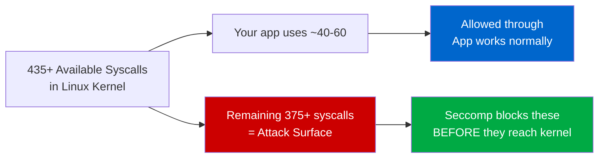
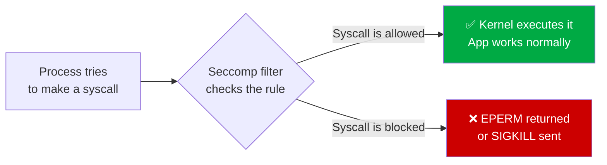
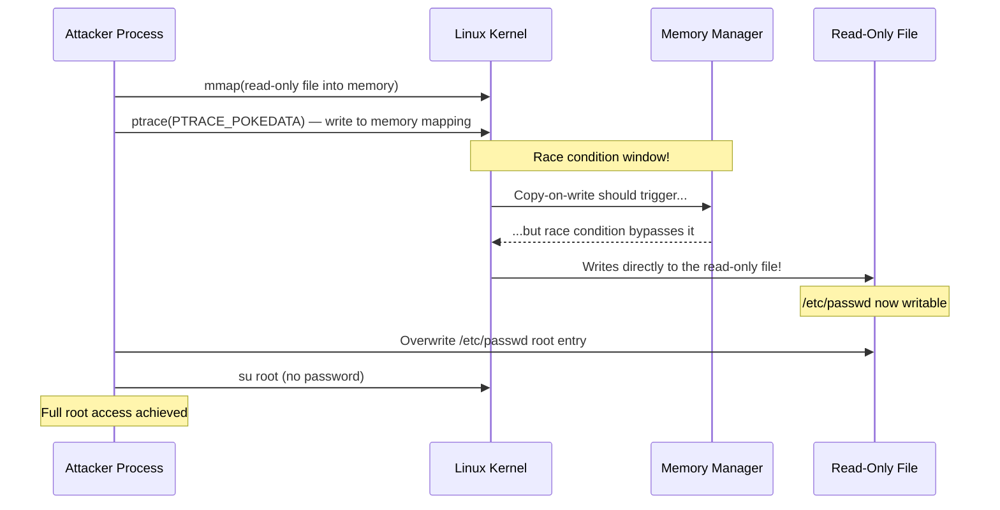
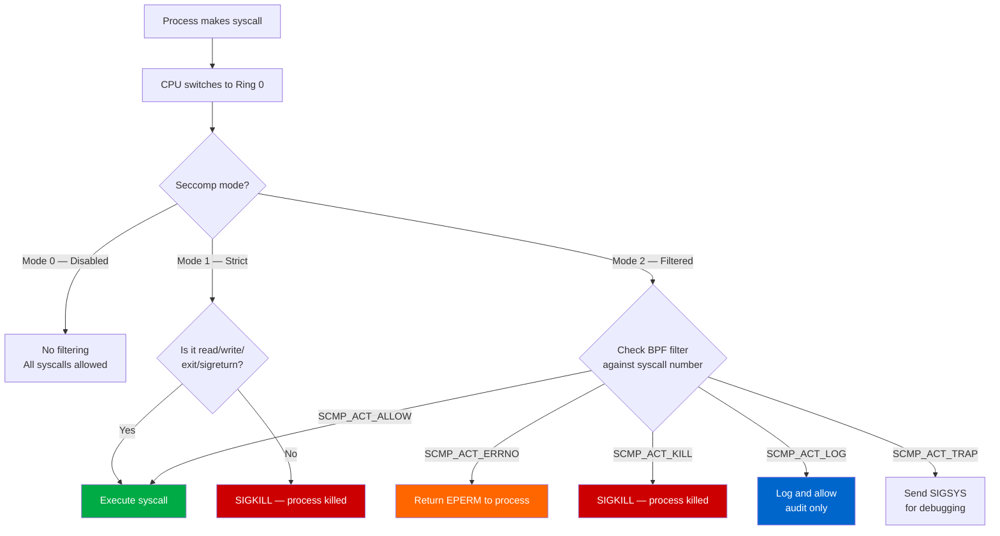
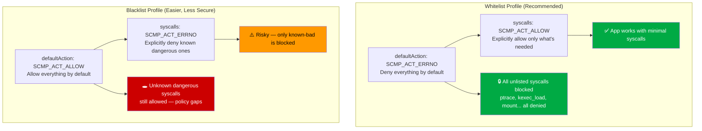
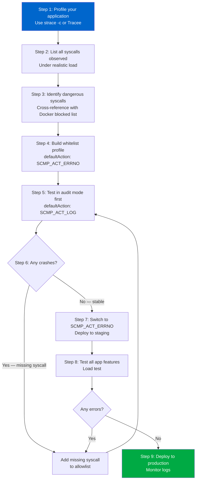
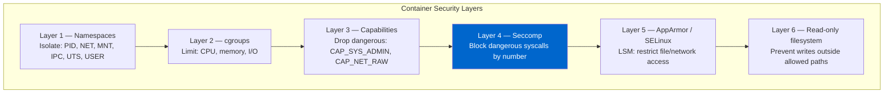
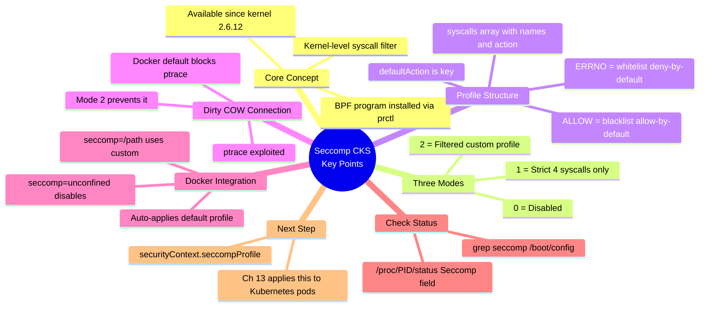

# 12 — Restrict Syscalls Using Seccomp

> **Domain:** System Hardening | **CKS Exam Weight:** High  
> **Prerequisites:** Ch. 10 (Linux Syscalls), Ch. 11 (Tracee)  
> **Leads Into:** Ch. 13 (Seccomp in Kubernetes)

---

## Why This Matters

Linux has **435+ syscalls**. A typical web server only needs about 40–60 of them. Every syscall your application can make but doesn't need is a **potential attack surface** — a weapon available to any attacker who exploits your container.

Tracee (Ch. 11) shows you what syscalls are being made. Seccomp lets you **enforce** which ones are allowed — at the kernel level, before the syscall handler even runs.

The stakes are real. In 2016, **Dirty COW** (CVE-2016-5195) exploited the `ptrace` syscall to write to read-only memory — achieving privilege escalation and container escape on any unprotected Linux system. If `ptrace` had been blocked by Seccomp, the exploit would have been dead on arrival.



---

## What Is Seccomp?

**Seccomp** (short for **Secure Computing**) is a **Linux kernel security feature** that restricts which system calls (syscalls) a process is allowed to make. Once a Seccomp filter is applied to a process, any syscall not explicitly permitted is immediately denied — either returning `EPERM` to the caller, or killing the process outright with `SIGKILL`.



### Seccomp at a Glance

| Attribute | Detail |
|-----------|--------|
| **Full name** | Secure Computing Mode |
| **Introduced** | Linux kernel 2.6.12 (2005) |
| **Filter mode** | Available since kernel 3.5 (2012) — uses BPF programs |
| **Where it runs** | Inside the kernel — zero cost when syscall is allowed |
| **What it filters** | Syscall numbers (and optionally syscall arguments) |
| **Used by** | Docker, Kubernetes, Chrome, Firefox, OpenSSH, systemd |
| **Configured via** | JSON profile files (in Docker/Kubernetes) or `prctl()` / `seccomp()` syscall |
| **Scope** | Per-process (inherited by child processes) |

### Seccomp vs Other Security Tools

| Tool | What it controls | How it works |
|------|-----------------|-------------|
| **Seccomp** | Which syscalls a process can call | BPF filter applied at kernel entry point |
| **AppArmor** | What files/network a process can access | LSM hooks on kernel operations |
| **Linux Capabilities** | Which privileged operations are permitted | Capability bitmask checked per-operation |
| **Namespaces** | What a process can *see* | Virtualized views of PIDs, mounts, network |
| **Seccomp** works best when combined with **all of the above** — each layer catches different threat vectors. |

---

## The Dirty COW Vulnerability — Why Seccomp Exists

**CVE-2016-5195** (nicknamed "Dirty COW" — Dirty Copy-On-Write) was one of the most serious Linux privilege escalation vulnerabilities ever discovered, present for **9 years** before being patched.


### How Dirty COW Worked



**The exploit chain in a container:**
1. Attacker exploits a web app vulnerability (e.g., RCE via Log4Shell)
2. Now has shell inside the container as www-data
3. Uses Dirty COW (`ptrace` + race condition) to write to `/etc/passwd`
4. Escalates to root inside container
5. Uses root to escape container namespace
6. **Full host compromise**

**If Seccomp had blocked `ptrace`:** Step 3 fails. The exploit chain breaks. The attacker is contained.

---

## What Is Seccomp?

**Seccomp** (Secure Computing) is a Linux kernel feature introduced in 2005 (kernel 2.6.12) that creates a syscall sandbox around a process. Once enabled, the process can only make the syscalls that Seccomp's filter allows — all others return `EPERM` or trigger `SIGKILL`.

### How the Kernel Enforces Seccomp



### Seccomp Modes at a Glance


| Mode | Value | Name | Allowed Syscalls | Use Case |
|------|-------|------|-----------------|----------|
| Mode 0 | 0 | Disabled | All 435+ syscalls | No restriction (default without Seccomp) |
| Mode 1 | 1 | Strict | Only 4: `read`, `write`, `exit`, `sigreturn` | Ultra-locked-down processes (e.g., crypto key storage) |
| Mode 2 | 2 | Filter | Custom BPF filter list | Containers, sandboxes, most production use |

---

## Verify Kernel Seccomp Support

Before relying on Seccomp, confirm your kernel was compiled with it enabled:

```bash
grep -i seccomp /boot/config-$(uname -r)
```

Expected output (all three must be `y`):

```
CONFIG_HAVE_ARCH_SECCOMP_FILTER=y    # Architecture supports filtering
CONFIG_SECCOMP_FILTER=y              # Filter mode (Mode 2) is compiled in
CONFIG_SECCOMP=y                     # Seccomp itself is compiled in
```

If any are `=n` or missing, Seccomp won't work on this system (rare on modern Ubuntu/CentOS/Debian — it's on by default).

### Check Seccomp Status of a Running Process

```bash
# Check Seccomp mode of a specific process
cat /proc/<PID>/status | grep Seccomp

# Example — checking a Docker container's PID 1
docker run -d docker/whalesay sleep 3600
CPID=$(docker inspect --format '{{.State.Pid}}' $(docker ps -lq))
cat /proc/$CPID/status | grep Seccomp
```

Output:

```
Seccomp:  2    ← Mode 2 = Filtered (Docker's default profile is active)
```

| Value | Meaning |
|-------|---------|
| `0` | Seccomp disabled (vulnerable) |
| `1` | Strict mode |
| `2` | Filter mode (custom or default profile active) |

---

## Demonstrating Seccomp in Action with Docker

### The Whalesay Example

```bash
# Normal run — works fine
docker run docker/whalesay cowsay hello!
```

Output:
```
 ________
< hello! >
 --------
     \
      \
       ## ##
    ## ## ## ==
    ## ## ## ===
  '""""""'  /
   ~~~ ~~~~~~~~~~~~~~~~~~~ ~~~  ---
```

### Blocked Syscall — Changing System Time

```bash
# Interactive shell inside the container
docker run -it --rm docker/whalesay /bin/sh

# Try to change the system time
# date -s '19 APR 2012 22:00:00'
date: cannot set date: Operation not permitted
```

**Why did it fail?** The `date -s` command calls `clock_settime()` (syscall number 227 on x86-64). Docker's default Seccomp profile blocks this syscall because setting system time is a privileged kernel operation that containers have no business doing.

### Verifying the Seccomp Mode Inside the Container

```bash
# Inside the container
cat /proc/1/status | grep Seccomp
Seccomp:    2
```

Mode 2 — Docker's default filter profile is active.

---

## The Seccomp Profile JSON Format

Seccomp profiles are defined as JSON documents. Here's the complete anatomy:

```json
{
  "defaultAction": "SCMP_ACT_ERRNO",     ← What to do with unlisted syscalls
  "architectures": [                      ← Which CPU architectures this applies to
    "SCMP_ARCH_X86_64",
    "SCMP_ARCH_X86",
    "SCMP_ARCH_X32"
  ],
  "syscalls": [                           ← The rules list
    {
      "names": [                          ← Syscall names to match
        "arch_prctl",
        "brk",
        "close",
        "execve",
        "read",
        "write"
      ],
      "action": "SCMP_ACT_ALLOW"         ← Action for these specific syscalls
    }
  ]
}
```

### Profile Fields Explained

| Field | Location | Purpose |
|-------|----------|---------|
| `defaultAction` | Top level | Applied to any syscall NOT in the `syscalls` list |
| `architectures` | Top level | CPU architecture scope (omit for all arch) |
| `syscalls[].names` | Rules | List of syscall names this rule applies to |
| `syscalls[].action` | Rules | What to do when these syscalls are matched |

### Available Actions

| Action | Effect | Return Value | Use Case |
|--------|--------|-------------|---------|
| `SCMP_ACT_ALLOW` | Permit the syscall | Normal syscall return | Whitelist allowed calls |
| `SCMP_ACT_ERRNO` | Deny, return error | `-EPERM` (Operation not permitted) | Blacklist/block |
| `SCMP_ACT_KILL` | Kill the process immediately | Process receives `SIGKILL` | Zero-tolerance blocking |
| `SCMP_ACT_KILL_PROCESS` | Kill the entire process group | `SIGKILL` to all threads | Aggressive termination |
| `SCMP_ACT_LOG` | Allow but log | Normal return | Audit mode — discover without blocking |
| `SCMP_ACT_TRAP` | Send `SIGSYS` | Signal for handler | Debugging/testing |

---

## Whitelist vs Blacklist Profiles



### Whitelist Profile

```json
{
  "defaultAction": "SCMP_ACT_ERRNO",
  "architectures": [
    "SCMP_ARCH_X86_64",
    "SCMP_ARCH_X86",
    "SCMP_ARCH_X32"
  ],
  "syscalls": [
    {
      "names": [
        "read",
        "write",
        "open",
        "close",
        "stat",
        "fstat",
        "mmap",
        "mprotect",
        "brk",
        "execve",
        "exit_group",
        "futex",
        "openat",
        "arch_prctl"
      ],
      "action": "SCMP_ACT_ALLOW"
    }
  ]
}
```

**Behaviour:** Every syscall not in this list — including `ptrace`, `mount`, `kexec_load`, `setuid`, `socket` — returns `EPERM` immediately.

### Blacklist Profile

```json
{
  "defaultAction": "SCMP_ACT_ALLOW",
  "architectures": [
    "SCMP_ARCH_X86_64",
    "SCMP_ARCH_X86",
    "SCMP_ARCH_X32"
  ],
  "syscalls": [
    {
      "names": [
        "ptrace",
        "mount",
        "umount2",
        "kexec_load",
        "reboot",
        "swapon",
        "swapoff",
        "syslog",
        "settimeofday",
        "clock_settime",
        "adjtimex",
        "init_module",
        "finit_module",
        "delete_module"
      ],
      "action": "SCMP_ACT_ERRNO"
    }
  ]
}
```

**Behaviour:** All syscalls allowed except the explicitly denied ones. Easier to write, but any syscall you forgot to list is a gap in your defences.

> ⚠️ **CKS Exam Key Point:** Blacklist profiles are `"defaultAction": "SCMP_ACT_ALLOW"`. Whitelist profiles are `"defaultAction": "SCMP_ACT_ERRNO"`. This is the most important thing to remember about profile structure.

---

## Docker's Default Seccomp Profile

Docker automatically applies a default Seccomp filter when you run a container on a Seccomp-enabled host. This profile:

- **Allows ~375 syscalls** (the safe majority)
- **Blocks ~60 syscalls** that are considered dangerous or unnecessary for containers

### Key Syscalls Blocked by Docker's Default Profile

| Blocked Syscall | Why Blocked |
|----------------|------------|
| `ptrace` | Dirty COW exploit vector; container escape via process injection |
| `kexec_load` | Replace the running kernel — catastrophic if misused |
| `mount` / `umount2` | Mount arbitrary filesystems — container escape path |
| `reboot` | Reboot the host — DoS |
| `clock_settime` | Change system time — disrupts logging, auth, TLS |
| `settimeofday` | Same as above |
| `syslog` | Access kernel message buffer — information disclosure |
| `init_module` | Load kernel modules — kernel code execution |
| `delete_module` | Unload kernel modules |
| `acct` | Enable process accounting — info disclosure |
| `kcmp` | Compare kernel pointers — sandbox escape tool |
| `lookup_dcookie` | Profiling — kernel pointer disclosure |
| `perf_event_open` | Perf counters — side-channel attack vector |

### Verifying Docker's Default Is Active

```bash
# Run without any --security-opt — default profile applies
docker run -it --rm docker/whalesay /bin/sh
/ # cat /proc/1/status | grep Seccomp
Seccomp:    2    ← Mode 2 = Docker default filter active
```

### Disabling Docker's Default (NOT recommended)

```bash
# Disable Seccomp entirely — NEVER do this in production
docker run -it --rm --security-opt seccomp=unconfined docker/whalesay /bin/sh

/ # cat /proc/1/status | grep Seccomp
Seccomp:    0    ← Mode 0 = No filtering — fully exposed!
```

Even with `seccomp=unconfined`, some syscalls may still fail because **Linux capabilities** (a separate security mechanism, covered in Ch. 17) haven't been granted. But `ptrace` will now work — the Dirty COW exploit vector is open.

---

## Creating and Using Custom Seccomp Profiles

### Scenario: Block `mkdir` in a Container

**Goal:** Prevent any process in the container from creating directories, while allowing everything else Docker normally allows.

**Step 1 — Create `custom.json`:**

```json
{
  "defaultAction": "SCMP_ACT_ERRNO",
  "architectures": [
    "SCMP_ARCH_X86_64",
    "SCMP_ARCH_X86",
    "SCMP_ARCH_X32"
  ],
  "syscalls": [
    {
      "names": [
        "arch_prctl",
        "brk",
        "capget",
        "capset",
        "chdir",
        "close",
        "dup2",
        "dup3",
        "execve",
        "exit",
        "exit_group",
        "fstat",
        "fstatfs",
        "futex",
        "getdents64",
        "getppid",
        "ioctl",
        "mmap",
        "mprotect",
        "munmap",
        "nanosleep",
        "openat",
        "prctl",
        "read",
        "rt_sigaction",
        "rt_sigprocmask",
        "rt_sigreturn",
        "setgid",
        "setuid",
        "stat",
        "write"
      ],
      "action": "SCMP_ACT_ALLOW"
    }
  ]
}
```

Notice: `mkdir` is **absent** from the `SCMP_ACT_ALLOW` list. Because `defaultAction` is `SCMP_ACT_ERRNO`, any attempt to call `mkdir` (syscall 83) will return `EPERM`.

**Step 2 — Save the profile:**

```bash
# Save to a known location
cat > /root/custom.json << 'EOF'
{
  "defaultAction": "SCMP_ACT_ERRNO",
  ...
}
EOF
```

**Step 3 — Run a container with the custom profile:**

```bash
docker run -it --rm \
  --security-opt seccomp=/root/custom.json \
  docker/whalesay /bin/sh
```

**Step 4 — Test the restriction:**

```bash
# Inside the container
/ # mkdir test
mkdir: can't create directory 'test': Operation not permitted

/ # echo "mkdir is blocked"
mkdir is blocked     ← Normal shell commands still work

/ # ls /tmp
<empty>              ← ls works — read syscalls are allowed
```

**Step 5 — Verify the Seccomp mode:**

```bash
/ # cat /proc/1/status | grep Seccomp
Seccomp:    2    ← Our custom filter profile is active
```

---

## Building a Seccomp Profile from Scratch

The professional workflow for creating a minimal, application-specific Seccomp profile:



### Using `SCMP_ACT_LOG` for Safe Discovery

Before going straight to `SCMP_ACT_ERRNO`, start with `SCMP_ACT_LOG`. This allows all syscalls but logs the ones that would be blocked — your app keeps running while you discover what it actually needs:

```json
{
  "defaultAction": "SCMP_ACT_LOG",
  "architectures": ["SCMP_ARCH_X86_64"],
  "syscalls": [
    {
      "names": ["execve", "read", "write", "close", "mmap"],
      "action": "SCMP_ACT_ALLOW"
    }
  ]
}
```

```bash
# Run with log profile
docker run --security-opt seccomp=/root/audit.json your-app

# Check what got logged
journalctl -k | grep seccomp | tail -20
# Output shows which additional syscalls your app tried to use
# Add those to the allowlist, then switch to SCMP_ACT_ERRNO
```

---

## Advanced Profile Features

### Conditional Rules — Filter by Arguments

Seccomp can filter not just by syscall number but also by **syscall arguments**. This enables fine-grained control:

```json
{
  "defaultAction": "SCMP_ACT_ERRNO",
  "syscalls": [
    {
      "names": ["socket"],
      "action": "SCMP_ACT_ALLOW",
      "args": [
        {
          "index": 0,
          "value": 2,
          "op": "SCMP_CMP_EQ"
        }
      ]
    }
  ]
}
```

This allows `socket()` calls **only when the first argument (domain) is `2` (AF_INET — IPv4)**. Calls to `socket(AF_PACKET, ...)` (raw packet capture) or `socket(AF_UNIX, ...)` would be blocked.

### Argument Filter Operators

| Operator | Meaning |
|----------|---------|
| `SCMP_CMP_EQ` | Equal to value |
| `SCMP_CMP_NE` | Not equal to value |
| `SCMP_CMP_GT` | Greater than value |
| `SCMP_CMP_GE` | Greater than or equal |
| `SCMP_CMP_LT` | Less than value |
| `SCMP_CMP_LE` | Less than or equal |
| `SCMP_CMP_MASKED_EQ` | Bitmasked comparison |

### Multiple Rules — First Match Wins

When multiple rules match the same syscall, the **first rule** in the list takes priority:

```json
{
  "syscalls": [
    {
      "names": ["socket"],
      "action": "SCMP_ACT_ALLOW",
      "args": [{"index": 0, "value": 2, "op": "SCMP_CMP_EQ"}]
    },
    {
      "names": ["socket"],
      "action": "SCMP_ACT_ERRNO"
    }
  ]
}
```

This allows `socket(AF_INET, ...)` but blocks all other socket families.

---

## Seccomp and the Docker Security Layering Model

It's important to understand that Seccomp is **one layer** among several Docker security mechanisms:



This is why `date -s` still fails even with `seccomp=unconfined` — **Linux capabilities** (Layer 3) also need to grant `CAP_SYS_TIME` for clock changes. Seccomp is not the only defence.

---

## Syscall Reference — What Docker's Default Profile Blocks

```bash
# View Docker's complete default Seccomp profile
docker info --format '{{.SecurityOptions}}'
# Look for: name=seccomp,profile=default

# Download the full default profile for inspection
curl -o docker-default.json \
  https://raw.githubusercontent.com/moby/moby/master/profiles/seccomp/default.json

# Count allowed syscalls
cat docker-default.json | jq '[.syscalls[] | select(.action=="SCMP_ACT_ALLOW") | .names[]] | length'
# ~375

# See defaultAction (what happens to unlisted calls)
cat docker-default.json | jq '.defaultAction'
# "SCMP_ACT_ERRNO"  ← It's a whitelist!
```

Docker's default is a **whitelist** profile with `SCMP_ACT_ERRNO` as the default — it explicitly allows the safe 375 and blocks everything else.

---

## Real-World Scenarios

### Scenario 1 — Dirty COW Container Escape (CVE-2016-5195) — Blocked by Seccomp

**Timeline without Seccomp:**

```
1. Attacker exploits Log4Shell → gets shell inside container as 'nobody'
2. Downloads Dirty COW exploit binary to /tmp
3. Runs exploit: uses ptrace() + mmap() race condition
4. Writes to /etc/passwd — changes root password
5. su root → full root inside container
6. Mount host /proc → maps host filesystem
7. Container escape → full host compromise
```

**Timeline with Docker's default Seccomp profile:**

```
1. Attacker exploits Log4Shell → gets shell inside container as 'nobody'
2. Downloads Dirty COW exploit binary to /tmp
3. Runs exploit: calls ptrace(PTRACE_ATTACH, ...)
   → EPERM returned immediately
   → ptrace is blocked by Seccomp
4. Exploit fails at step 1
5. Attacker is contained
```

**Lesson:** Docker's default profile blocked `ptrace` — which has been blocked since Seccomp profiles were introduced in Docker 1.10 (2016), the same year Dirty COW was discovered.

---

### Scenario 2 — Custom Profile for a Microservice

**Situation:** A Go microservice that serves HTTP requests needs to be locked down for production. The security team wants a custom Seccomp profile tighter than Docker's default.

**Step 1 — Profile with strace during load testing:**

```bash
strace -c -f ./api-service 2>&1 | tee /tmp/syscall-profile.txt
# Run load test for 5 minutes
k6 run --vus 100 --duration 5m load-test.js
# Ctrl+C strace
```

**Step 2 — Extract observed syscalls:**

```bash
grep -v "^%" /tmp/syscall-profile.txt | awk 'NR>2 {print $NF}' | sort -u
# brk, clone, close, epoll_ctl, epoll_wait, execve, exit_group,
# fstat, futex, getpid, getsockopt, listen, madvise, mmap,
# mprotect, munmap, nanosleep, openat, read, recvfrom,
# rt_sigaction, rt_sigprocmask, sendto, setsockopt, socket,
# stat, write
```

**Step 3 — Build tight custom profile:**

```json
{
  "defaultAction": "SCMP_ACT_ERRNO",
  "architectures": ["SCMP_ARCH_X86_64"],
  "syscalls": [
    {
      "names": [
        "brk", "clone", "close", "epoll_ctl", "epoll_wait",
        "execve", "exit_group", "fstat", "futex", "getpid",
        "getsockopt", "listen", "madvise", "mmap", "mprotect",
        "munmap", "nanosleep", "openat", "read", "recvfrom",
        "rt_sigaction", "rt_sigprocmask", "sendto", "setsockopt",
        "socket", "stat", "write"
      ],
      "action": "SCMP_ACT_ALLOW"
    }
  ]
}
```

**Step 4 — Deploy:**

```bash
docker run --security-opt seccomp=/etc/seccomp/api-service.json \
  -p 8080:8080 my-api-service:latest
```

**Result:** The container can serve HTTP traffic perfectly, but if compromised, an attacker cannot call `ptrace`, `mount`, `kexec_load`, `fork` (not needed for this threaded service), or any of the other 400+ blocked syscalls. Attack surface reduced by ~90%.

---

### Scenario 3 — Detecting a Missing Syscall in Production

**Situation:** After deploying a custom Seccomp profile to staging, a feature that uses file locking (`flock` syscall) breaks. The error is `EPERM` on what appears to be a normal file operation.

**Diagnosis:**

```bash
# Run the failing operation with strace to see what's happening
strace -e trace=all ./api-service feature-that-breaks 2>&1 | grep EPERM
# flock(3, LOCK_EX) = -1 EPERM (Operation not permitted)
# ← flock() syscall is missing from our allowlist!
```

**Fix:** Add `flock` to the Seccomp profile:

```json
{
  "names": [
    "brk", "clone", "close", ..., "flock", ...
  ],
  "action": "SCMP_ACT_ALLOW"
}
```

**Better approach — use `SCMP_ACT_LOG` first:**

If this had been caught earlier, using an audit profile (`SCMP_ACT_LOG` as default) would have logged `flock()` usage without breaking the feature, allowing the team to discover it before switching to `SCMP_ACT_ERRNO`.

---

## Seccomp Common Mistakes

| Mistake | Impact | Fix |
|---------|--------|-----|
| Missing `futex` in allowlist | Crashes any multi-threaded app (Go, Java) | Always include `futex` |
| Missing `brk` / `mmap` | Memory allocation fails — app crashes at startup | Always include memory management calls |
| Missing `exit_group` | Process can't exit cleanly — zombie processes | Always include `exit` and `exit_group` |
| Using `SCMP_ACT_KILL` as default | App can't log errors before dying | Use `SCMP_ACT_ERRNO` — app can handle errors gracefully |
| Not testing under realistic load | Missing syscalls only triggered by edge cases | Always load test before finalising profile |
| Hardcoding architecture | Profile won't work on ARM64 nodes | Use `"architectures": ["SCMP_ARCH_X86_64", "SCMP_ARCH_AARCH64"]` or omit the field |
| Forgetting `arch_prctl` | Crashes on x86-64 (used by glibc startup) | Include `arch_prctl` for x86-64 profiles |
| Using blacklist in high-security environments | New dangerous syscalls added by kernel upgrades won't be blocked | Prefer whitelist (`defaultAction: SCMP_ACT_ERRNO`) |

---

## Quick Reference Card

```bash
# ── VERIFY KERNEL SUPPORT ──────────────────────────────────────────
grep -i seccomp /boot/config-$(uname -r)
# Must see: CONFIG_SECCOMP=y, CONFIG_SECCOMP_FILTER=y

# ── CHECK PROCESS SECCOMP STATUS ──────────────────────────────────
cat /proc/<PID>/status | grep Seccomp
# 0 = disabled, 1 = strict, 2 = filtered

# ── DOCKER: USE DEFAULT PROFILE ────────────────────────────────────
docker run image                               # Default profile auto-applied
docker run --security-opt seccomp=unconfined   # Disable (AVOID)

# ── DOCKER: USE CUSTOM PROFILE ─────────────────────────────────────
docker run --security-opt seccomp=/path/to/profile.json image

# ── PROFILE ACTIONS ────────────────────────────────────────────────
SCMP_ACT_ALLOW      # Let the syscall through
SCMP_ACT_ERRNO      # Return EPERM (process continues, handles error)
SCMP_ACT_KILL       # Kill the process (SIGKILL)
SCMP_ACT_LOG        # Allow + log (audit/discovery mode)
SCMP_ACT_TRAP       # Send SIGSYS (debugging)

# ── PROFILE STRUCTURE ──────────────────────────────────────────────
# Whitelist (recommended): defaultAction=SCMP_ACT_ERRNO, rules=ALLOW
# Blacklist (less secure):  defaultAction=SCMP_ACT_ALLOW, rules=ERRNO
```

---

## CKS Exam Tips



**Critical exam facts:**
- `"defaultAction": "SCMP_ACT_ERRNO"` = **whitelist** (safe, deny-by-default)
- `"defaultAction": "SCMP_ACT_ALLOW"` = **blacklist** (less safe, allow-by-default)
- Check Seccomp mode: `cat /proc/<pid>/status | grep Seccomp`
- Docker's default **automatically applies** a whitelist Seccomp profile
- `--security-opt seccomp=unconfined` disables it (never do in production)
- Dirty COW (CVE-2016-5195) was blocked by `ptrace` being in Docker's deny list

---

## Chapter Summary

| Concept | Key Takeaway |
|---------|-------------|
| **Seccomp** | Kernel feature that filters syscalls via BPF programs |
| **Why it matters** | 435+ syscalls; most apps need ~40-60; rest = attack surface |
| **Dirty COW** | 2016 CVE that used `ptrace`; blocked by Docker's Seccomp default |
| **Mode 0/1/2** | Disabled / Strict (4 syscalls) / Filtered (custom BPF) |
| **Whitelist profile** | `defaultAction: SCMP_ACT_ERRNO` — deny all, allow specific |
| **Blacklist profile** | `defaultAction: SCMP_ACT_ALLOW` — allow all, deny specific |
| **Docker default** | Whitelist profile auto-applied; blocks ~60 dangerous syscalls |
| **Custom profile** | `--security-opt seccomp=/path/to/profile.json` |
| **`SCMP_ACT_LOG`** | Discovery mode — logs but doesn't block; use before production |
| **Check status** | `cat /proc/<pid>/status \| grep Seccomp` → 0/1/2 |

---

## What's Next

- **Chapter 13 — Implement Seccomp in Kubernetes:** Apply Seccomp profiles to pods using `securityContext.seccompProfile`, use RuntimeDefault, and apply node-level profiles via kubelet configuration
- **Chapter 14 — AppArmor:** While Seccomp filters by **syscall number**, AppArmor filters by **what those syscalls access** — file paths, network addresses, capabilities. Both tools together provide defence in depth.

---

*Sources: Linux `man 2 seccomp`, Docker Seccomp Documentation, KodeKloud CKS Course, CVE-2016-5195 (Dirty COW), Kernel.org Seccomp BPF Documentation*
