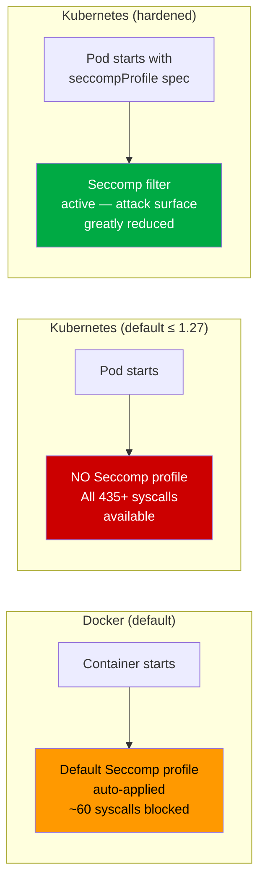
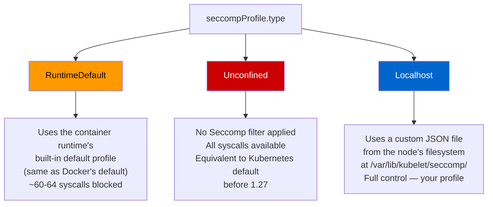
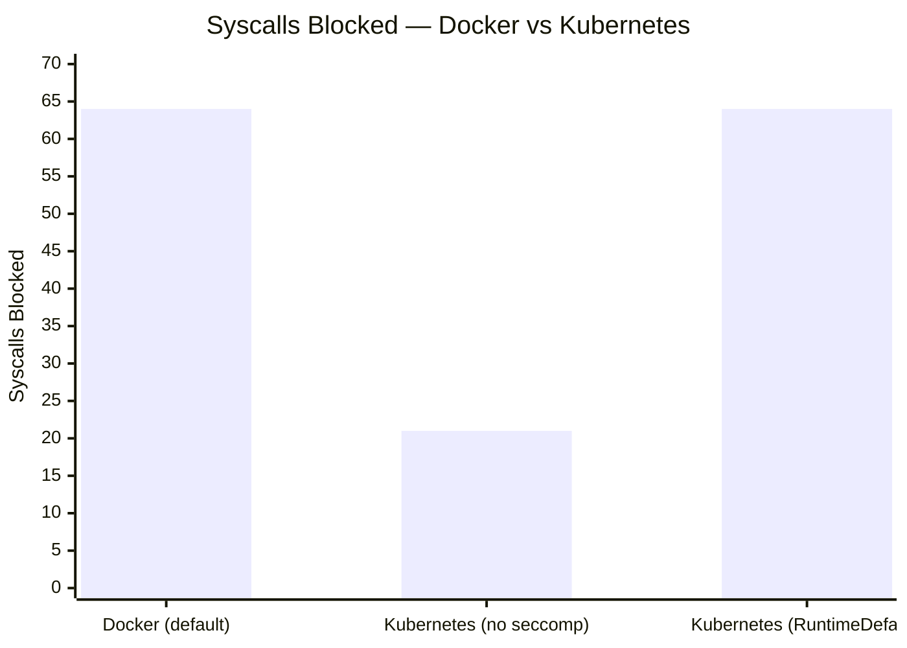
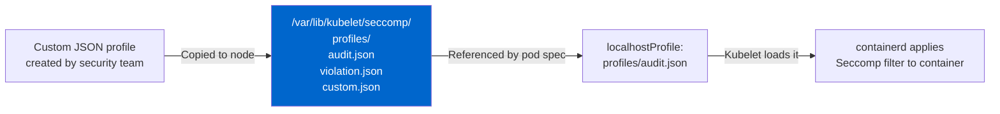
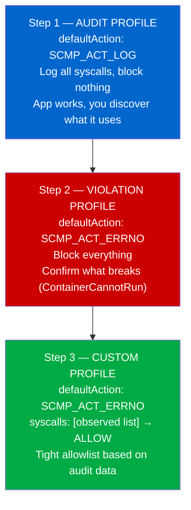
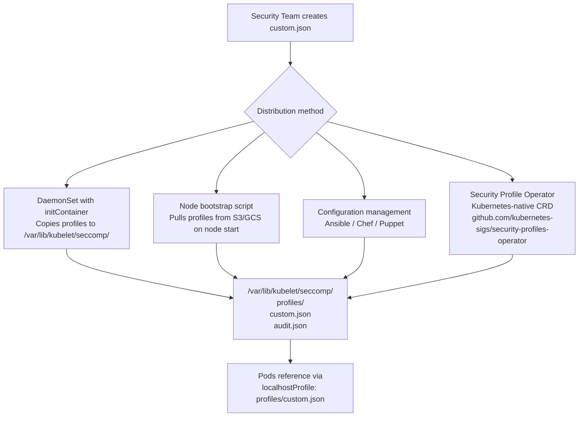
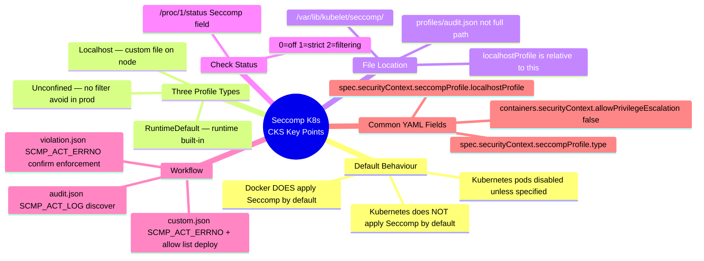

# 13 — Implement Seccomp in Kubernetes

> **Domain:** System Hardening | **CKS Exam Weight:** High  
> **Prerequisites:** Ch. 12 (Restrict Syscalls Using Seccomp), Ch. 10 (Linux Syscalls)  
> **Leads Into:** Ch. 14 (AppArmor)

---

## Why This Matters

Chapter 12 taught you how Seccomp profiles work in Docker. But in Kubernetes, things work differently — and the difference matters for your exam and for real cluster security.

By default, **Kubernetes does not apply any Seccomp profile** to pods. This means every pod you deploy — unless you explicitly configure otherwise — runs with all 435+ Linux syscalls available, including dangerous ones like `ptrace`, `mount`, and `kexec_load`. This is a step backwards from Docker, which auto-applies a default filter.

The CKS exam tests whether you know how to close this gap: specifying the right `seccompProfile` type, placing custom profiles in the right directory on the node, and understanding the three profile types (`RuntimeDefault`, `Unconfined`, `Localhost`).



---

## What Is Seccomp in Kubernetes?

**Seccomp in Kubernetes** is the mechanism by which you apply a Linux syscall filter to a running pod's container process — scoping which kernel calls that container is permitted to make, at the kernel level.

Kubernetes exposes Seccomp through the **`seccompProfile`** field inside a pod or container's `securityContext`. This field tells the container runtime (containerd/CRI-O) which Seccomp filter to install before the container process starts.

### The Three Profile Types



| Type | Seccomp Applied | Syscalls Blocked | When to Use |
|------|----------------|-----------------|-------------|
| `RuntimeDefault` | Yes — runtime's built-in profile | ~60-64 (containerd default) | Good baseline for most workloads |
| `Unconfined` | No — fully open | 0 (kernel default only) | Legacy/testing only — avoid in production |
| `Localhost` | Yes — your custom JSON profile | Whatever your profile specifies | Production workloads needing precise control |

### Where Seccomp Lives in a Pod Spec

Seccomp can be set at **two levels** — pod-level or container-level:

```yaml
spec:
  securityContext:              ← Pod-level: applies to ALL containers
    seccompProfile:
      type: RuntimeDefault
  containers:
  - name: my-container
    securityContext:            ← Container-level: overrides pod-level for THIS container
      seccompProfile:
        type: Localhost
        localhostProfile: profiles/custom.json
```

> **Container-level always overrides pod-level.** If a pod has `RuntimeDefault` but one container specifies `Localhost`, that container uses the custom profile.

---

## Comparing Docker vs Kubernetes Seccomp Behaviour

The best way to see this difference is with **`amicontained`** — a tool that reports exactly what security policies are active inside a container.

### Running in Docker (default Seccomp active)

```bash
docker run r.j3ss.co/amicontained amicontained
```

Output:

```
Container Runtime: docker
Has Namespaces:
    pid: true
    user: false
AppArmor Profile: docker-default (enforce)
Capabilities:
    BOUNDING -> chown dac_override fowner fsetid kill setgid setuid setpcap
                net_bind_service net_raw sys_chroot mknod audit_write setcap
Seccomp: filtering                          ← Mode 2: filter active
Blocked Syscalls (64):
    MSGRCV SYSCFG SETPGID SETSID USELIB USTAT SYSFS VHANGUP PIVOT_ROOT
    _SYSCTL ACCT SETTIMEOFDAY MOUNT UMOUNT2 SWAPON SWAPOFF REBOOT
    SETHOSTNAME SETDOMAINNAME IOPL IOPERM CREATE_MODULE INIT_MODULE
    DELETE_MODULE GET_KERNEL_SYMS QUERY_MODULE QUOTACTL NFSSERVCTL
    GETPMSG PUTPMSG AFS_SYSCALL TUXCALL SECURITY LOOKUP_DCOOKIE
    CLOCK_SETTIME VSERVER MBIND SET_MEMPOLICY GET_MEMPOLICY KEXEC_LOAD
    ADD_KEY REQUEST_KEY KEYCTL MIGRATE_PAGES UNSHARE MOVE_PAGES
    PERF_EVENT_OPEN FANOTIFY_INIT NAME_TO_HANDLE_AT OPEN_BY_HANDLE_AT
    CLOCK_ADJTIME SETNS PROCESS_VM_READV PROCESS_VM_WRITEV KCMP
    FINIT_MODULE KEXEC_FILE_LOAD
```

**64 syscalls blocked** — Docker's default whitelist profile is active.

### Running the Same Image as a Kubernetes Pod (no Seccomp configured)

```bash
# Create the pod
kubectl run amicontained \
  --image=r.j3ss.co/amicontained \
  -- amicontained

# Read the logs
kubectl logs amicontained
```

Output:

```
Container Runtime: docker
Has Namespaces:
    pid: true
    user: false
AppArmor Profile: docker-default (enforce)
Capabilities:
    BOUNDING -> chown dac_override fowner fsetid kill setgid setuid setpcap
                net_bind_service net_raw sys_chroot mknod audit_write setcap
Seccomp: disabled                           ← No filter! Kubernetes default
Blocked Syscalls (21):
    SYSLOG SETGID SETSID VHANGUP PIVOT_ROOT ACCT SETTIMEOFDAY UMOUNT2
    SWAPON SWAPOFF REBOOT SETHOSTNAME SETDOMAINNAME INIT_MODULE DELETE_MODULE
    LOOKUP_DCOOKIE KEXEC_LOAD FANOTIFY_INIT OPEN_BY_HANDLE_AT FINIT_MODULE
    KEXEC_FILE_LOAD
```

**Only 21 syscalls blocked** — and those are only because of Linux capabilities restrictions, not Seccomp. **Seccomp is completely disabled.** The 43 additional syscalls that Docker blocked (including `ptrace`, `perf_event_open`, `process_vm_readv`) are now fully available.

### The Side-by-Side Comparison



| Environment | Seccomp Status | Syscalls Blocked | Dangerous Calls Exposed |
|-------------|---------------|-----------------|------------------------|
| Docker (default) | `filtering` (Mode 2) | 64 | None — ptrace, kexec etc. all blocked |
| Kubernetes (default) | `disabled` (Mode 0) | 21 (caps only) | ptrace, perf_event_open, process_vm_readv, mount, ... |
| Kubernetes + `RuntimeDefault` | `filtering` (Mode 2) | 64 | None — same as Docker default |
| Kubernetes + custom profile | `filtering` (Mode 2) | Depends on profile | Depends on profile |

---

## Enabling Seccomp: RuntimeDefault

The quickest way to harden a pod is to set `type: RuntimeDefault`. This applies the container runtime's built-in default Seccomp profile — giving you the same protection as Docker's default, with zero profile management.

```yaml
apiVersion: v1
kind: Pod
metadata:
  name: amicontained
  labels:
    run: amicontained
spec:
  securityContext:
    seccompProfile:
      type: RuntimeDefault       # ← Use runtime's built-in default profile
  containers:
  - name: amicontained
    image: r.j3ss.co/amicontained
    args:
    - amicontained
    securityContext:
      allowPrivilegeEscalation: false   # ← Also disable privilege escalation
```

```bash
kubectl apply -f pod-runtimedefault.yaml
kubectl logs amicontained
```

Output confirms Seccomp is now filtering again, and **64 syscalls are blocked** — including the dangerous ones:

```
Seccomp: filtering
Blocked Syscalls (64):
    SYSLOG SETPGID SETSID USELIB USTAT SYSFS VHANGUP PIVOT_ROOT _SYSCTL
    ACCT SETTIMEOFDAY MOUNT UMOUNT2 SWAPON SWAPOFF REBOOT SETHOSTNAME
    SETDOMAINNAME IOPL CREATE_MODULE INIT_MODULE DELETE_MODULE GET_KERNEL_SYMS
    QUERY_MODULE QUOTACTL NFSSERVCTL GETMSG PUTMSG AFS_SYSCALL TUXCALL
    SECURITY LOOKUP_DCOOKIE CLOCK_SETTIME VSERVER MBIND SET_MEMPOLICY
    GET_MEMPOLICY KEXEC_LOAD ADD_KEY REQUEST_KEY KEYCTL MIGRATE_PAGES
    UNSHARE MOVE_PAGES PERF_EVENT_OPEN FANOTIFY_INIT NAME_TO_HANDLE_AT
    OPEN_BY_HANDLE_AT CLOCK_ADJTIME SETNS PROCESS_VM_READV PROCESS_VM_WRITEV
    KCMP FINIT_MODULE KEXEC_FILE_LOAD BPF USERFAULTFD
```

### `allowPrivilegeEscalation: false` — Why Include It?

This is a separate security control from Seccomp that prevents a process from calling `setuid()` or using `sudo`/`su` to gain more privileges than it was started with. Best practice is to combine both:

```
Seccomp (filter syscalls) + allowPrivilegeEscalation: false (block privilege gain)
= defence in depth
```

---

## Disabling Seccomp: Unconfined (Know This to Avoid It)

If you explicitly want no Seccomp filtering (or need to troubleshoot whether Seccomp is causing an issue), use `type: Unconfined`:

```yaml
apiVersion: v1
kind: Pod
metadata:
  name: amicontained
spec:
  securityContext:
    seccompProfile:
      type: Unconfined            # ← No Seccomp filter — same as K8s default
  containers:
  - name: amicontained
    image: r.j3ss.co/amicontained
    args:
    - amicontained
    securityContext:
      allowPrivilegeEscalation: false
```

> ⚠️ **CKS Exam Note:** `Unconfined` is semantically equivalent to not specifying `seccompProfile` at all in older Kubernetes versions. In production, you should never use `Unconfined` — it exists for debugging and legacy compatibility only. OPA/Gatekeeper policies should deny pods with `Unconfined` profiles.

---

## Custom Seccomp Profiles: The Localhost Type

For production workloads, `RuntimeDefault` is a good baseline but it's still a one-size-fits-all profile. A custom profile allows you to build a **minimal, application-specific** allowlist.

### The Kubelet Seccomp Directory

Custom profiles must be **placed on the node's filesystem** before the pod references them. The kubelet expects profiles in a specific directory:

```
/var/lib/kubelet/seccomp/
```



> 💡 **Important:** The `localhostProfile` path is **relative to** `/var/lib/kubelet/seccomp/`. So if your file is at `/var/lib/kubelet/seccomp/profiles/audit.json`, the spec value is `profiles/audit.json` — not the full path.

```bash
# Create the profiles directory on the node
mkdir -p /var/lib/kubelet/seccomp/profiles

# Copy your profile there
cp audit.json /var/lib/kubelet/seccomp/profiles/audit.json
cp violation.json /var/lib/kubelet/seccomp/profiles/violation.json
cp custom.json /var/lib/kubelet/seccomp/profiles/custom.json
```

---

## Custom Profile Workflow: Audit → Violation → Custom

The professional three-step approach to building a custom Seccomp profile for any application:



---

### Step 1 — Audit Profile: Discover Syscalls Without Blocking

**Create `/var/lib/kubelet/seccomp/profiles/audit.json`:**

```json
{
  "defaultAction": "SCMP_ACT_LOG"
}
```

This profile allows **every syscall** but logs each one to the kernel audit log. Your app runs normally, and you harvest the syscall list from the logs.

**Pod spec using audit profile:**

```yaml
apiVersion: v1
kind: Pod
metadata:
  name: test-audit
spec:
  securityContext:
    seccompProfile:
      type: Localhost
      localhostProfile: profiles/audit.json   # ← relative to /var/lib/kubelet/seccomp/
  containers:
  - name: ubuntu
    image: ubuntu
    command: ["bash", "-c", "echo 'I just made some syscalls' && sleep 100"]
    securityContext:
      allowPrivilegeEscalation: false
```

```bash
kubectl apply -f test-audit.yaml

# Wait for pod to run
kubectl get pods test-audit
# NAME         READY   STATUS    RESTARTS   AGE
# test-audit   1/1     Running   0          10s

# Read syscall logs from the node's syslog
grep syscall /var/log/syslog | tail -20
```

Sample syslog output:

```
Mar 19 23:53:45 node01 kernel: [264.340952] audit: type=1326 audit(1616198025.076:14):
  auid=4294967295 uid=0 gid=0 ses=4294967295 pid=8816 comm="runc:[2:INIT]" exe="/"
  sig=0 arch=c000003e syscall=257 compat=0 ip=0x5642801010aa code=0x7ffc0000

Mar 19 23:53:45 node01 kernel: [264.340954] audit: type=1326 audit(1616198025.076:15):
  auid=4294967295 uid=0 gid=0 ses=4294967295 pid=8816 comm="runc:[2:INIT]" exe="/"
  sig=0 arch=c000003e syscall=35 compat=0 ip=0x564280fcc662 code=0x7ffc0000
```

**Decoding syscall numbers:**

```bash
# Convert syscall number to name
# syscall=257 → openat, syscall=35 → nanosleep
ausyscall --dump | grep "^257"
# 257  openat

# Easier: use ausyscall directly
ausyscall 257
# openat
```

**Using Tracee instead (from Ch. 11) for cleaner output:**

```bash
# Run Tracee to monitor the test-audit pod's container
sudo docker run --name tracee --rm --privileged --pid=host \
  -v /lib/modules/:/lib/modules:ro \
  -v /usr/src:/usr/src:ro \
  -v /tmp/tracee:/tmp/tracee \
  aquasec/tracee:0.4.0 --trace container=new

# In another terminal — launch the pod
kubectl apply -f test-audit.yaml

# Tracee output shows clean syscall names directly:
# execve, openat, read, close, fstat, mmap, mprotect, brk,
# write, exit_group, nanosleep...
```

---

### Step 2 — Violation Profile: Confirm the Blast Radius

**Create `/var/lib/kubelet/seccomp/profiles/violation.json`:**

```json
{
  "defaultAction": "SCMP_ACT_ERRNO"
}
```

This blocks **every single syscall** — including the ones the container runtime needs to start the process. The pod will fail immediately. This is intentional: it proves that Seccomp enforcement is working and shows you what happens when the profile is wrong.

**Pod spec using violation profile:**

```yaml
apiVersion: v1
kind: Pod
metadata:
  name: test-violation
spec:
  securityContext:
    seccompProfile:
      type: Localhost
      localhostProfile: profiles/violation.json
  containers:
  - name: ubuntu
    image: ubuntu
    command: ["bash", "-c", "echo 'I just made some syscalls' && sleep 100"]
    securityContext:
      allowPrivilegeEscalation: false
  restartPolicy: Never
```

```bash
kubectl apply -f test-violation.yaml

kubectl get pods
```

Expected output:

```
NAME             READY   STATUS                RESTARTS   AGE
test-violation   0/1     ContainerCannotRun    0          2m2s
```

**`ContainerCannotRun`** means the container runtime tried to start the process but failed because even the first syscall (`execve`) was blocked by the profile. This confirms the filter is working.

```bash
# Check the events for detail
kubectl describe pod test-violation
# Events:
#   Warning  Failed  ... Error: failed to start container ...:
#   OCI runtime create failed: container_linux.go:380:
#   starting container process caused: process_linux.go:545:
#   container init caused: rootfs_linux.go:76: ... 
#   seccomp: blocked system call
```

---

### Step 3 — Custom Profile: Minimal Allowlist for Your App

Using the syscall list discovered in Step 1, build a tight allowlist:

**Create `/var/lib/kubelet/seccomp/profiles/custom.json`:**

```json
{
  "defaultAction": "SCMP_ACT_ERRNO",
  "architectures": [
    "SCMP_ARCH_X86_64",
    "SCMP_ARCH_X86",
    "SCMP_ARCH_X32"
  ],
  "syscalls": [
    {
      "names": [
        "arch_prctl",
        "brk",
        "capget",
        "capset",
        "chdir",
        "close",
        "execve",
        "exit",
        "exit_group",
        "fstat",
        "fstatfs",
        "futex",
        "getdents64",
        "getpid",
        "getppid",
        "gettimeofday",
        "mmap",
        "mprotect",
        "munmap",
        "nanosleep",
        "openat",
        "prctl",
        "prlimit64",
        "read",
        "rt_sigaction",
        "rt_sigprocmask",
        "rt_sigreturn",
        "seccomp",
        "set_robust_list",
        "set_tid_address",
        "setgid",
        "setgroups",
        "setuid",
        "stat",
        "statfs",
        "write"
      ],
      "action": "SCMP_ACT_ALLOW"
    }
  ]
}
```

**Pod spec using custom profile:**

```yaml
apiVersion: v1
kind: Pod
metadata:
  name: test-custom
spec:
  securityContext:
    seccompProfile:
      type: Localhost
      localhostProfile: profiles/custom.json   # ← your tailored profile
  containers:
  - name: ubuntu
    image: ubuntu
    command: ["bash", "-c", "echo 'I just made some syscalls' && sleep 100"]
    securityContext:
      allowPrivilegeEscalation: false
  restartPolicy: Never
```

```bash
kubectl apply -f test-custom.yaml

kubectl get pods
```

Expected output:

```
NAME          READY   STATUS    RESTARTS   AGE
test-custom   1/1     Running   0          2m2s
```

**Pod runs successfully.** The container has exactly the syscalls it needs — and nothing more. Attempting to call `ptrace`, `mount`, `kexec_load`, or any syscall not in the list returns `EPERM` immediately.

---

## Applying Seccomp Across the Cluster: Pod Security Standards

For cluster-wide enforcement of Seccomp (so every pod gets at least `RuntimeDefault`), use **Pod Security Standards** (PSS):

```yaml
# Apply to a namespace — all pods must have at least RuntimeDefault
apiVersion: v1
kind: Namespace
metadata:
  name: production
  labels:
    pod-security.kubernetes.io/enforce: restricted   # ← restricted profile requires seccomp
    pod-security.kubernetes.io/enforce-version: latest
```

Under the `restricted` Pod Security Standard, pods that don't specify a Seccomp profile (or use `Unconfined`) are **rejected at admission**. This makes `RuntimeDefault` the mandatory baseline for the namespace.

---

## Node-Level Profile Management

In real clusters with multiple nodes, you need a strategy for distributing custom profile files:



### Security Profile Operator (SPO) — The Modern Approach

The **Security Profiles Operator** (maintained by Kubernetes SIG Security) allows you to manage Seccomp profiles as Kubernetes custom resources instead of raw files:

```yaml
# Define a Seccomp profile as a CRD — no manual file copying needed
apiVersion: security-profiles-operator.x-k8s.io/v1beta1
kind: SeccompProfile
metadata:
  name: my-api-profile
  namespace: production
spec:
  defaultAction: SCMP_ACT_ERRNO
  syscalls:
  - action: SCMP_ACT_ALLOW
    names:
    - read
    - write
    - close
    - openat
    - execve
    - exit_group
    - futex
    - mmap
    - mprotect
```

```yaml
# Reference it in a pod — SPO distributes the file automatically
spec:
  securityContext:
    seccompProfile:
      type: Localhost
      localhostProfile: operator/production/my-api-profile.json
```

---

## Complete Reference: seccompProfile in Pod Spec

```yaml
# ── POD-LEVEL (applies to all containers unless overridden) ────────
spec:
  securityContext:
    seccompProfile:
      type: RuntimeDefault         # Option 1: runtime's built-in default
      # type: Unconfined           # Option 2: no filter (avoid in production)
      # type: Localhost            # Option 3: custom file on node
      # localhostProfile: profiles/custom.json   # required when type=Localhost

# ── CONTAINER-LEVEL (overrides pod-level for this container only) ──
  containers:
  - name: my-container
    securityContext:
      seccompProfile:
        type: Localhost
        localhostProfile: profiles/my-container-profile.json
      allowPrivilegeEscalation: false    # Always add this too
      readOnlyRootFilesystem: true       # Recommended companion setting
      runAsNonRoot: true                 # Recommended companion setting
      runAsUser: 1000
      capabilities:
        drop:
        - ALL                            # Drop all Linux capabilities too
```

---

## Real-World Scenarios

### Scenario 1 — Hardening an Existing Deployment with RuntimeDefault

**Situation:** Security audit reveals all pods in the `payments` namespace are running with `Seccomp: disabled`. You need to fix this without breaking any workloads.

**Approach: Start with RuntimeDefault — no profile research needed.**

```bash
# Check current Seccomp status of running pods
for pod in $(kubectl get pods -n payments -o name); do
  pid=$(kubectl get $pod -n payments -o jsonpath='{.status.containerStatuses[0].containerID}' | sed 's/containerd:\/\///g' | cut -c1-12)
  echo "$pod: $(cat /proc/$(crictl inspect $pid | jq -r '.info.pid')/status | grep Seccomp)"
done
```

**Patch deployments to add RuntimeDefault:**

```bash
# Patch all deployments in the namespace
kubectl get deployment -n payments -o name | xargs -I {} kubectl patch {} \
  -n payments \
  --type='json' \
  -p='[{"op":"add","path":"/spec/template/spec/securityContext","value":{"seccompProfile":{"type":"RuntimeDefault"}}}]'
```

**Verify:**

```bash
kubectl rollout status deployment -n payments
# Waiting for deployment "payment-api" rollout to finish: 0 of 3 updated replicas...
# deployment "payment-api" successfully rolled out

# Check pods again
kubectl exec -it payment-api-xxx -- cat /proc/1/status | grep Seccomp
# Seccomp:    2    ← filtering active
```

**Result:** All payment workloads now have 64+ dangerous syscalls blocked, with zero application code changes.

---

### Scenario 2 — Building a Custom Profile for a Go API Service

**Situation:** A Go REST API service is being onboarded to production. The security team wants a custom profile tighter than RuntimeDefault.

**Complete end-to-end workflow:**

```bash
# 1. Copy audit profile to all nodes
# (Using a DaemonSet initContainer in practice; simplified here)
ssh node01 "mkdir -p /var/lib/kubelet/seccomp/profiles && \
  cat > /var/lib/kubelet/seccomp/profiles/audit.json << 'EOF'
{\"defaultAction\": \"SCMP_ACT_LOG\"}
EOF"

# 2. Deploy with audit profile
kubectl apply -f - <<EOF
apiVersion: v1
kind: Pod
metadata:
  name: go-api-audit
  namespace: staging
spec:
  securityContext:
    seccompProfile:
      type: Localhost
      localhostProfile: profiles/audit.json
  containers:
  - name: go-api
    image: mycompany/go-api:v1.0.0
    ports:
    - containerPort: 8080
    securityContext:
      allowPrivilegeEscalation: false
EOF

# 3. Run load test to exercise all code paths
k6 run --vus 50 --duration 10m api-load-test.js

# 4. Harvest syscall numbers from syslog
grep syscall /var/log/syslog | grep go-api | \
  awk '{print $NF}' | sort -u | \
  while read num; do ausyscall $num 2>/dev/null; done | sort -u > /tmp/go-api-syscalls.txt

cat /tmp/go-api-syscalls.txt
# brk, clone, close, epoll_ctl, epoll_wait, execve, exit_group,
# fstat, futex, getpid, listen, mmap, mprotect, munmap, openat,
# read, recvfrom, rt_sigaction, rt_sigprocmask, sendto, socket,
# stat, write

# 5. Build custom profile
cat > /tmp/go-api-custom.json << 'EOF'
{
  "defaultAction": "SCMP_ACT_ERRNO",
  "architectures": ["SCMP_ARCH_X86_64"],
  "syscalls": [{
    "names": ["brk","clone","close","epoll_ctl","epoll_wait",
              "execve","exit_group","fstat","futex","getpid",
              "listen","mmap","mprotect","munmap","openat",
              "read","recvfrom","rt_sigaction","rt_sigprocmask",
              "sendto","socket","stat","write"],
    "action": "SCMP_ACT_ALLOW"
  }]
}
EOF

# 6. Copy to nodes
ssh node01 "cp /tmp/go-api-custom.json /var/lib/kubelet/seccomp/profiles/"

# 7. Deploy production pod with custom profile
kubectl apply -f go-api-production.yaml
# localhostProfile: profiles/go-api-custom.json

# 8. Verify
kubectl exec -it go-api-prod -- cat /proc/1/status | grep Seccomp
# Seccomp:    2

# Confirm ptrace is blocked (attack surface test)
kubectl exec -it go-api-prod -- strace echo hello
# strace: ptrace(PTRACE_TRACEME, ...): Operation not permitted
# ← ptrace blocked by our custom profile ✅
```

---

### Scenario 3 — Debugging a `ContainerCannotRun` Error

**Situation:** A pod using a custom Seccomp profile keeps failing with `ContainerCannotRun`. The profile was copied from a working service, and the team doesn't know what's missing.

**Diagnosis workflow:**

```bash
# Step 1: Check the events
kubectl describe pod broken-pod
# Events:
#   Warning  Failed  seccomp: blocked system call

# Step 2: Temporarily switch to audit profile to discover missing syscalls
kubectl patch pod broken-pod --type='json' \
  -p='[{"op":"replace","path":"/spec/securityContext/seccompProfile","value":{"type":"Localhost","localhostProfile":"profiles/audit.json"}}]'
# Note: pods are immutable — delete and recreate with audit profile

# Step 3: Deploy with audit profile, check logs
kubectl apply -f broken-pod-audit.yaml
grep syscall /var/log/syslog | grep broken-pod | tail -30
# syscall=273  ← new syscall appearing — let's decode it
ausyscall 273
# set_robust_list   ← missing from our profile!

# Step 4: Add missing syscalls to custom profile
# Edit profiles/custom.json → add "set_robust_list" to names list
# Copy updated profile to node
# Redeploy with custom profile

# Step 5: Verify pod runs
kubectl get pods broken-pod
# NAME         READY   STATUS    RESTARTS   AGE
# broken-pod   1/1     Running   0          15s ✅
```

---

## Common Mistakes and Pitfalls

| Mistake | Symptom | Fix |
|---------|---------|-----|
| `localhostProfile` path is absolute | Pod fails with profile not found | Use path relative to `/var/lib/kubelet/seccomp/` |
| Profile file not on the node | `ContainerCannotRun` — profile not found error | Copy profile to node BEFORE creating the pod |
| Profile file on only one node | Pod works on that node, fails on others (scheduling) | Use DaemonSet or node bootstrap to distribute to all nodes |
| Missing `futex` in custom profile | Crashes any Go/Java/multi-threaded app immediately | Always include `futex` |
| Missing `rt_sigreturn` | Signal handling broken — app can't handle Ctrl+C gracefully | Always include signal-related syscalls |
| Using `seccompProfile` at container level only | Other containers in the pod are unprotected | Set at pod level as the baseline |
| `SCMP_ACT_ERRNO` as default without testing | Pod immediately fails — `ContainerCannotRun` | Always start with `SCMP_ACT_LOG`, then move to `SCMP_ACT_ERRNO` |
| Not running `allowPrivilegeEscalation: false` | Seccomp blocks syscalls but container can still gain capabilities via setuid | Always combine with `allowPrivilegeEscalation: false` |

---

## CKS Exam Quick Reference

```bash
# ── CHECK SECCOMP STATUS OF A RUNNING CONTAINER ───────────────────
kubectl exec -it <pod> -- cat /proc/1/status | grep Seccomp
# 0=disabled, 1=strict, 2=filtering

# ── APPLY RUNTIMEDEFAULT TO A POD ─────────────────────────────────
# In pod spec:
# spec.securityContext.seccompProfile.type: RuntimeDefault

# ── APPLY CUSTOM (LOCALHOST) PROFILE ──────────────────────────────
# 1. Put JSON file at: /var/lib/kubelet/seccomp/profiles/my.json
# 2. In pod spec:
#    spec.securityContext.seccompProfile.type: Localhost
#    spec.securityContext.seccompProfile.localhostProfile: profiles/my.json

# ── AUDIT PROFILE (log everything, block nothing) ──────────────────
# { "defaultAction": "SCMP_ACT_LOG" }

# ── VIOLATION PROFILE (block everything) ──────────────────────────
# { "defaultAction": "SCMP_ACT_ERRNO" }

# ── THREE PROFILE TYPES ───────────────────────────────────────────
# RuntimeDefault  → runtime's built-in default (same as Docker)
# Unconfined      → no filter (K8s legacy default — avoid)
# Localhost       → custom file on node filesystem
```

---

## CKS Exam Tips



---

## Chapter Summary

| Concept | Key Takeaway |
|---------|-------------|
| **K8s default** | NO Seccomp — all 435+ syscalls available (unlike Docker) |
| **RuntimeDefault** | Applies runtime's built-in default — same protection as Docker |
| **Unconfined** | No filter — legacy default; avoid in production |
| **Localhost** | Custom JSON profile from `/var/lib/kubelet/seccomp/` |
| **localhostProfile path** | Relative to `/var/lib/kubelet/seccomp/` — NOT an absolute path |
| **Audit profile** | `SCMP_ACT_LOG` — discover syscalls without breaking the app |
| **Violation profile** | `SCMP_ACT_ERRNO` with no allowlist — confirms enforcement works |
| **Custom profile** | `SCMP_ACT_ERRNO` + allowlist — minimal attack surface in production |
| **ContainerCannotRun** | Pod fails because Seccomp blocked a required syscall |
| **Check status** | `cat /proc/1/status \| grep Seccomp` → 0/1/2 |

---

## What's Next

- **Chapter 14 — AppArmor:** While Seccomp says "which syscalls can be called," AppArmor says "what can those syscalls access?" — file paths, network addresses, capabilities. Together they cover the full attack surface.
- **Chapter 15 — Creating AppArmor Profiles:** Build AppArmor profiles using `aa-genprof` and `aa-logprof` — the AppArmor equivalent of the audit → violation → custom workflow you learned here.
- **Chapter 16 — AppArmor in Kubernetes:** Apply AppArmor profiles to pods using annotations and the AppArmor controller.

---

*Sources: Kubernetes Seccomp Documentation, KodeKloud CKS Course, Security Profiles Operator (SIG Security), Docker Seccomp Profile Reference*
