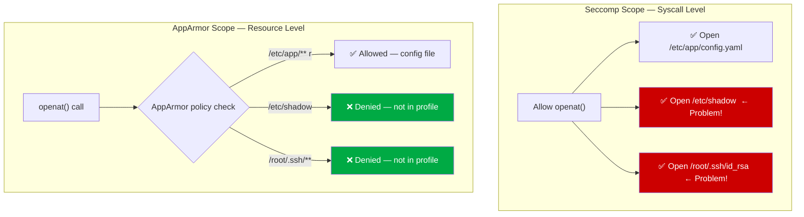
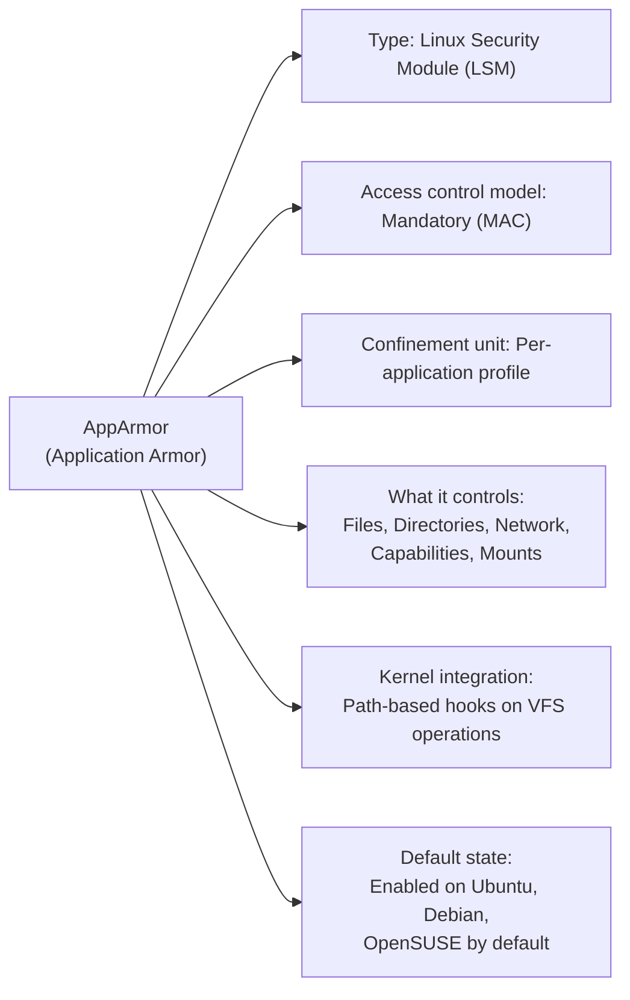
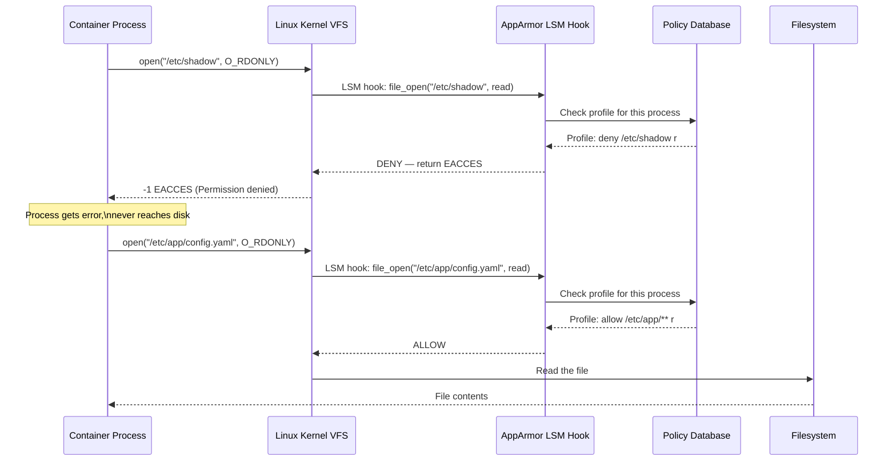
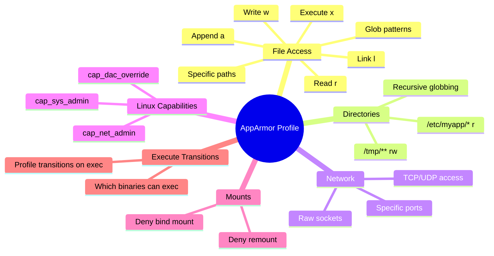
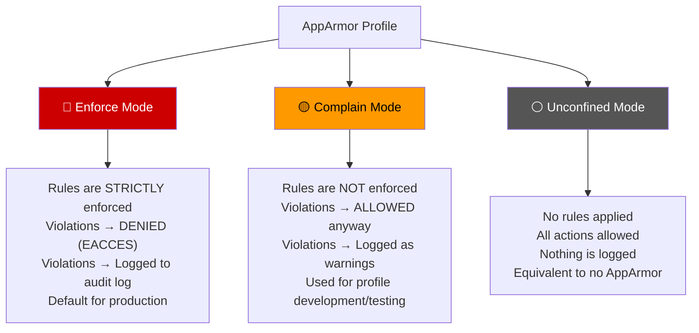
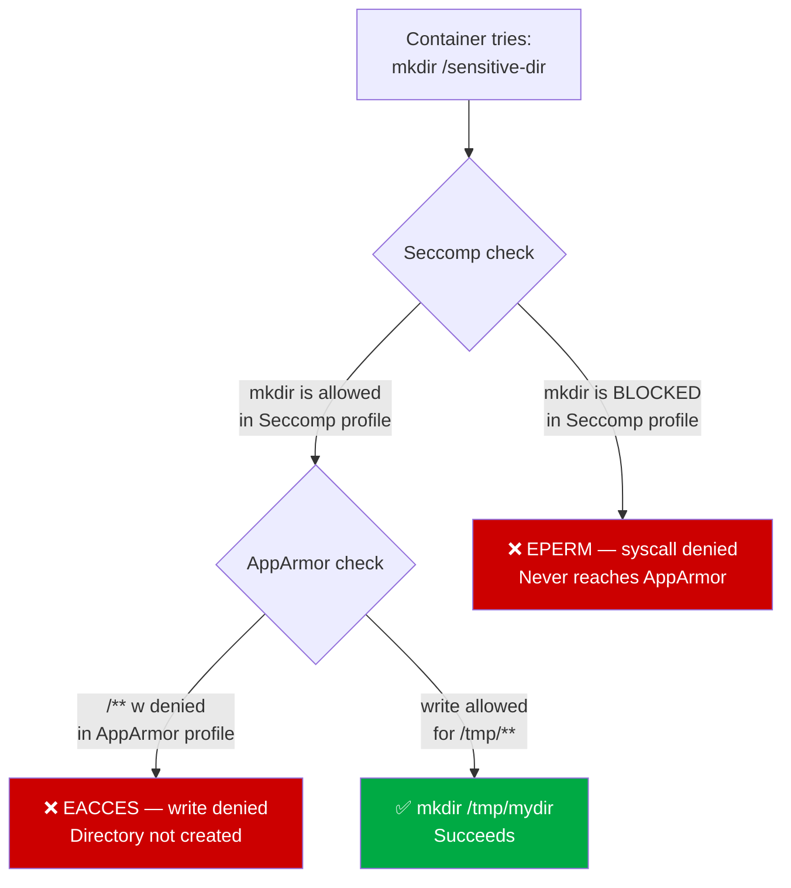
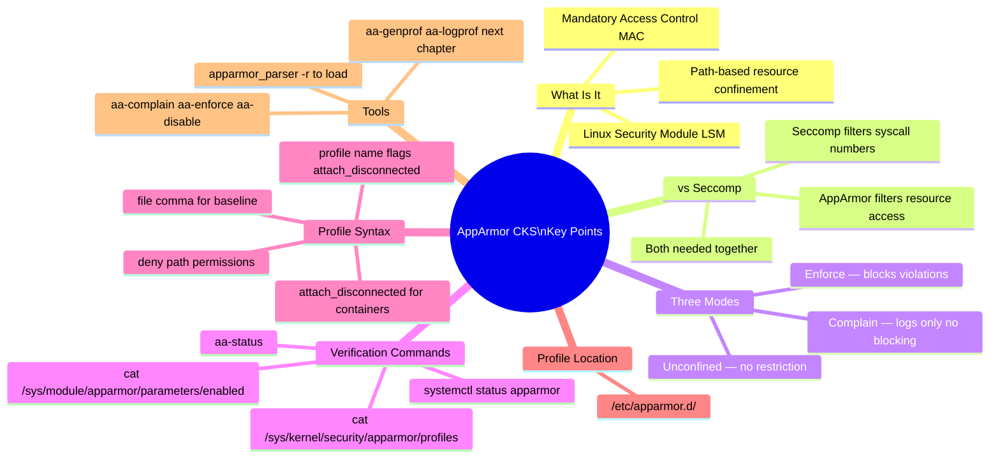

# 14 — AppArmor

> **Domain:** System Hardening | **CKS Exam Weight:** High  
> **Prerequisites:** Ch. 12 (Seccomp), Ch. 13 (Seccomp in Kubernetes)  
> **Leads Into:** Ch. 15 (Creating AppArmor Profiles), Ch. 16 (AppArmor in Kubernetes)

---

## Why This Matters

Seccomp (Ch. 12-13) was a powerful tool — it let you control **which syscalls** a container can make. But syscalls are a blunt instrument. Consider this:

The `openat()` syscall is perfectly legitimate — your app needs it to open config files, log files, and libraries. But with Seccomp alone, if you allow `openat()`, the container can use it to open **any file on the filesystem** — including `/etc/shadow`, `/etc/kubernetes/pki/ca.key`, or `/root/.kube/config`.

**Seccomp cannot tell the difference between openat("/etc/app/config.yaml") and openat("/etc/shadow").** It only sees the syscall number.

This is the gap AppArmor fills.



AppArmor operates at the **resource access level** — after the syscall is permitted, it intercepts the kernel's operation and asks: "Is this process allowed to access *this specific resource*?"

---

## What Is AppArmor?

**AppArmor** (Application Armor) is a **Linux Security Module (LSM)** that implements **mandatory access control (MAC)** by confining individual programs to a limited set of resources. It works by assigning a **security profile** to each application — a profile that explicitly defines what files, directories, network operations, and Linux capabilities that application is allowed to use.



### AppArmor vs Seccomp — The Full Picture

| Dimension | Seccomp | AppArmor |
|-----------|---------|---------|
| **What it filters** | Syscall numbers (0–435) | Resources accessed via syscalls |
| **Granularity** | Per-syscall | Per-file, per-directory, per-network-operation |
| **Example rule** | Block `mkdir` (syscall 83) entirely | Allow `mkdir` only under `/tmp/` |
| **Can allow specific paths only?** | ❌ No — syscall is all-or-nothing | ✅ Yes — fine-grained path rules |
| **Network control** | Block `socket()` entirely | Allow TCP on port 443 only |
| **Profile format** | JSON | Plain text (AppArmor profile language) |
| **Profile location** | `/var/lib/kubelet/seccomp/` | `/etc/apparmor.d/` |
| **Kernel mechanism** | BPF filter at syscall entry | LSM hooks on VFS, network, capability operations |
| **Best for** | Blocking entire syscall categories | Fine-grained per-path and per-operation access control |
| **Used together?** | ✅ Yes — complementary, not competing |

### AppArmor vs SELinux

Both are LSMs but take different approaches:

| | AppArmor | SELinux |
|--|---------|---------|
| **Model** | Path-based | Label-based (every object gets a security label) |
| **Complexity** | Moderate — human-readable profiles | High — complex policy language |
| **Default on** | Ubuntu, Debian, OpenSUSE | RHEL, CentOS, Fedora, Amazon Linux |
| **Profile creation** | `aa-genprof` / `aa-logprof` | `audit2allow` / `sepolicy` |
| **CKS exam** | ✅ Tested | Not directly tested |

---

## How AppArmor Works — Under the Hood

AppArmor operates through **LSM hooks** — callback points embedded in the Linux kernel's Virtual File System (VFS), network stack, and capability system. When any process attempts a resource access, the kernel calls the registered LSM hook, which checks the AppArmor policy:



Key observation: **the enforcement happens in the kernel**, before any actual I/O occurs. The process never gets a chance to read the file — the access is denied at the policy check point.

### What AppArmor Profiles Control



---

## Verifying AppArmor on Your System

Before using AppArmor, confirm it's running correctly on each node.

### Step 1 — Check the AppArmor Service

```bash
systemctl status apparmor
```

Expected output (healthy):

```
● apparmor.service - AppArmor initialization
     Loaded: loaded (/lib/systemd/system/apparmor.service; enabled; vendor preset: enabled)
     Active: active (exited) since Mon 2024-01-15 10:23:44 UTC; 2h 15min ago
    Process: 428 ExecStart=/etc/init.d/apparmor start (code=exited, status=0/SUCCESS)
   Main PID: 428 (code=exited, status=0/SUCCESS)
```

`active (exited)` is correct — AppArmor loads at boot and stays resident in the kernel. The service exits after loading profiles.

### Step 2 — Confirm the Kernel Module Is Loaded

```bash
cat /sys/module/apparmor/parameters/enabled
```

Expected:

```
Y
```

If the output is `N` or the file doesn't exist, AppArmor is not available on this kernel.

### Step 3 — List All Loaded Profiles

```bash
cat /sys/kernel/security/apparmor/profiles
```

Sample output:

```
docker-default (enforce)
/usr/sbin/tcpdump (enforce)
/usr/sbin/ntpd (enforce)
/usr/lib/snapd/snap-confine (enforce)
/usr/lib/snapd/snap-confine/mount-namespace-capture-helper (enforce)
/usr/lib/connman/scripts/dhclient-script (enforce)
/usr/lib/NetworkManager/nm-dhcp-helper (enforce)
/usr/lib/NetworkManager/nm-dhcp-client.action (enforce)
/sbin/dhclient (enforce)
/usr/bin/man (enforce)
/usr/bin/man_filter (enforce)
```

Each entry shows the profile name and its current mode (`enforce`, `complain`, or `unconfined`).

### Step 4 — Full Status with `aa-status`

```bash
aa-status
```

Output:

```
apparmor module is loaded.
12 profiles are loaded.
12 profiles are in enforce mode.
    /sbin/dhclient
    /usr/bin/man
    /usr/lib/NetworkManager/nm-dhcp-client.action
    /usr/lib/NetworkManager/nm-dhcp-helper
    /usr/lib/connman/scripts/dhclient-script
    /usr/lib/snapd/snap-confine
    /usr/lib/snapd/snap-confine/mount-namespace-capture-helper
    /usr/sbin/ntpd
    /usr/sbin/tcpdump
    docker-default
    man_filter
    man_groff
0 profiles are in complain mode.
11 processes have profiles defined.
11 processes are in enforce mode:
    /sbin/dhclient (621)
    docker-default (3970)
    docker-default (4025)
    docker-default (9853)
    docker-default (9964)
0 processes are in complain mode.
0 processes are 'unconfined' but have a profile defined.
```

### Reading the `aa-status` Output

| Section | What it tells you |
|---------|-----------------|
| `X profiles are loaded` | Total AppArmor profiles in kernel memory |
| `X profiles are in enforce mode` | Profiles actively blocking violations |
| `X profiles are in complain mode` | Profiles logging but not blocking |
| `X processes have profiles defined` | Running processes currently confined |
| `processes are in enforce mode` | The specific PIDs being enforced (with PID numbers) |
| `processes are 'unconfined' but have a profile defined` | Profile exists but process is not using it |

---

## AppArmor Profile Modes

Every loaded AppArmor profile operates in one of three modes:



| Mode | Rules Enforced? | Violations Blocked? | Violations Logged? | Use Case |
|------|----------------|--------------------|--------------------|---------|
| **Enforce** | ✅ Yes | ✅ Yes — `EACCES` | ✅ Yes | Production |
| **Complain** | ❌ No | ❌ No — allowed | ✅ Yes — as warnings | Profile development |
| **Unconfined** | N/A | ❌ No | ❌ No | No restriction |

### Switching Between Modes

```bash
# Load a profile in enforce mode
apparmor_parser -r /etc/apparmor.d/my-profile

# Switch a profile to complain mode
aa-complain /etc/apparmor.d/my-profile

# Switch a profile to enforce mode
aa-enforce /etc/apparmor.d/my-profile

# Disable a profile (unloads it from kernel)
aa-disable /etc/apparmor.d/my-profile
```

---

## AppArmor Profile Syntax

AppArmor profiles are stored in `/etc/apparmor.d/` as plain text files. The profile language is human-readable and expressive.

### Profile Structure

```
profile <profile-name> flags=(<flags>) {
    # Include other profiles or abstractions
    #include <abstractions/base>

    # File rules
    <path> <permissions>,

    # Capability rules
    capability <cap-name>,

    # Network rules
    network <domain> <type>,

    # Mount rules
    mount options=(<options>) <path>,
    deny mount ...,
}
```

### File Permission Tokens

| Token | Permission | What it allows |
|-------|-----------|---------------|
| `r` | Read | `open()`, `read()`, `stat()` on the file |
| `w` | Write | `write()`, `truncate()`, `creat()` |
| `a` | Append | `write()` in append mode only (safer than `w`) |
| `x` | Execute | `exec()` — run the file as a program |
| `m` | Memory map | `mmap()` with `PROT_EXEC` (shared library loading) |
| `k` | Lock | `flock()`, `fcntl()` locking |
| `l` | Link | Create hard links to the file |
| `ix` | Inherit + exec | Execute and inherit the current profile |
| `cx` | Child profile | Execute and transition to a child profile |
| `px` | Profile exec | Execute and transition to a named profile |
| `ux` | Unconfined exec | Execute without any profile (avoid!) |

### Path Globbing Rules

| Pattern | Matches |
|---------|---------|
| `/etc/app/config.yaml` | Exactly that file |
| `/etc/app/*` | Any file directly in `/etc/app/` (not subdirs) |
| `/etc/app/**` | Any file anywhere under `/etc/app/` recursively |
| `/tmp/` | The directory itself |
| `/tmp/**` | Everything under `/tmp/` |
| `/var/log/*.log` | Any `.log` file directly in `/var/log/` |

---

## Example Profiles

### Profile 1 — Deny All File Writes

```
profile apparmor-deny-write flags=(attach_disconnected) {
    file,                  ← Shorthand: allow all file reads by default
    # Deny write access to any path, recursively
    deny /** w,            ← /** = any file at any depth; w = write
}
```

**Line-by-line explanation:**

| Line | Meaning |
|------|---------|
| `profile apparmor-deny-write` | Profile name — referenced when loading or applying to a container |
| `flags=(attach_disconnected)` | Allow the profile to apply even when the file is in a private mount namespace (needed for containers) |
| `file,` | Shorthand rule that permits all file operations — a permissive baseline that the deny rules override |
| `deny /** w,` | `/**` matches every path on the filesystem; `w` = write permission; `deny` overrides the preceding `file,` grant |

**Effect:** The container can read any file it can see, but cannot write to any file anywhere on the filesystem.

---

### Profile 2 — Deny Root Filesystem Remount

```
profile apparmor-deny-remount-root flags=(attach_disconnected) {
    # Deny remounting the root filesystem as read-only
    deny mount options=(ro, remount) -> /,
}
```

**Line-by-line explanation:**

| Line | Meaning |
|------|---------|
| `deny mount` | Block the `mount()` syscall for this specific operation |
| `options=(ro, remount)` | Only match when mount is called with both `ro` (read-only) and `remount` options |
| `-> /` | Only match when the target of the mount operation is the root `/` |

**Why this matters:** A container escape technique involves remounting the root filesystem as read-write to modify host files. This profile rule makes that specific attack impossible.

---

### Profile 3 — Minimal App Profile (Realistic)

A realistic profile for a simple web application:

```
#include <tunables/global>

profile my-web-app flags=(attach_disconnected,mediate_deleted) {
    #include <abstractions/base>       ← Core library access (libc, glibc etc.)
    #include <abstractions/nameservice> ← DNS resolution libraries

    # Binary execution
    /usr/bin/python3 rix,             ← Allow executing python3, inherit profile

    # Application files — read only
    /opt/myapp/** r,                  ← Read all app files
    /opt/myapp/app.py rix,            ← Execute main script

    # Config — read only
    /etc/myapp/config.yaml r,

    # Logs — write/append
    /var/log/myapp/*.log wa,          ← Write + append to log files

    # Temp files
    /tmp/myapp/** rw,                 ← Read/write temp directory

    # Networking — allow TCP on port 8080
    network tcp,

    # Explicitly deny sensitive paths
    deny /etc/shadow r,
    deny /etc/passwd w,
    deny /root/** rw,
    deny /proc/*/mem rw,              ← Block memory injection paths
    deny /sys/kernel/** rw,
}
```

---

## Seccomp Alone vs AppArmor Alone vs Both

The key conceptual point for the CKS exam:



**The Seccomp-alone limitation example:**

```bash
# Custom Seccomp profile — blocks mkdir syscall entirely
docker run -it --security-opt seccomp=/root/custom.json docker/whalesay /bin/sh

# mkdir is blocked by Seccomp:
/ # mkdir test
mkdir: can't create directory 'test': Operation not permitted   ← Seccomp blocks syscall

# BUT: Seccomp cannot say "allow mkdir in /tmp but deny in /etc"
# It's all-or-nothing per syscall
```

**With AppArmor — fine-grained path control:**

```bash
# AppArmor profile allows mkdir only in /tmp:
# deny /** w,       ← deny writes everywhere
# /tmp/** rw,       ← except /tmp

/ # mkdir /etc/malicious
mkdir: cannot create directory '/etc/malicious': Permission denied   ← AppArmor

/ # mkdir /tmp/mydir
/                                                                     ← Allowed!
```

---

## Docker's Default AppArmor Profile

Docker automatically applies the `docker-default` AppArmor profile to every container (when AppArmor is enabled). This is separate from Docker's Seccomp profile — both are applied simultaneously.

```bash
# Inspect AppArmor on a running Docker container
docker run --rm -d --name test-container ubuntu sleep 3600

# Check the AppArmor profile applied
docker inspect test-container | jq '.[0].HostConfig.SecurityOpt'
# ["seccomp=..."]   ← Seccomp profile

docker inspect test-container | jq '.[0].AppArmorProfile'
# "docker-default"  ← AppArmor profile
```

The `docker-default` profile (visible at `/etc/apparmor.d/docker`) allows typical container operations but denies dangerous ones like:
- Writing to `/proc/sys/` (kernel parameter modification)
- Remounting filesystems
- Loading kernel modules via `/proc/sysrq-trigger`
- Accessing raw `/dev/` devices

```bash
# View Docker's default AppArmor profile
cat /etc/apparmor.d/docker
# or
cat /etc/apparmor.d/docker-default
```

---

## Installing AppArmor Utilities

If `aa-status`, `aa-complain`, `aa-enforce` etc. are not available:

```bash
# Install AppArmor tools
apt-get install -y apparmor-utils

# Verify installation
which aa-status aa-complain aa-enforce aa-genprof aa-logprof
# /usr/sbin/aa-status
# /usr/sbin/aa-complain
# /usr/sbin/aa-enforce
# /usr/sbin/aa-genprof
# /usr/sbin/aa-logprof
```

### AppArmor Utility Reference

| Command | Purpose |
|---------|---------|
| `aa-status` | Show all loaded profiles and their modes |
| `aa-complain <profile>` | Switch profile to complain (log-only) mode |
| `aa-enforce <profile>` | Switch profile to enforce mode |
| `aa-disable <profile>` | Unload a profile from the kernel |
| `aa-genprof <binary>` | Generate a new profile interactively |
| `aa-logprof` | Update a profile based on logged violations |
| `apparmor_parser -r <profile>` | Reload/update a profile |
| `apparmor_parser -R <profile>` | Remove a profile from the kernel |

---

## Real-World Scenarios

### Scenario 1 — Blocking a Container from Reading Sensitive Host Files

**Situation:** A pod has a path traversal vulnerability. An attacker is trying to read `/etc/shadow` and `/etc/kubernetes/pki/ca.key` through the vulnerability.

**Without AppArmor:** The attacker succeeds — the container process has no file-level restrictions beyond normal Linux permissions. If the process runs as root (which many containers do), it can read any file.

**With AppArmor (deny-sensitive-reads profile):**

```
profile deny-sensitive-reads flags=(attach_disconnected) {
    file,                       ← Allow normal file operations

    # Block access to sensitive credential files
    deny /etc/shadow r,
    deny /etc/shadow- r,
    deny /etc/gshadow r,
    deny /etc/gshadow- r,
    deny /etc/passwd w,

    # Block Kubernetes PKI
    deny /etc/kubernetes/pki/** r,
    deny /var/lib/kubelet/pki/** r,

    # Block SSH keys
    deny /root/.ssh/** r,
    deny /home/**/.ssh/** r,

    # Block proc memory injection
    deny /proc/*/mem rw,
    deny /proc/*/maps r,
}
```

**Result:** Even if the attacker gets code execution inside the container as root, every attempt to read these files returns `EACCES`. The data is protected despite the RCE.

---

### Scenario 2 — Seccomp Allows the Syscall, AppArmor Blocks the Resource

**Situation:** A web app container needs `open()` to read its config. The Seccomp profile allows `openat`. An attacker exploits the app and tries to read `/etc/kubernetes/admin.conf`.

```bash
# Attacker has RCE, tries to read cluster admin config
cat /etc/kubernetes/admin.conf
```

**With only Seccomp:**
```
# openat() is allowed → file opens → attacker reads admin.conf
# kubeconfig is now in attacker's hands → full cluster takeover
```

**With AppArmor profile including:**
```
deny /etc/kubernetes/** r,
```

```
cat: /etc/kubernetes/admin.conf: Permission denied
# AppArmor denied at the resource level, AFTER the syscall was permitted by Seccomp
```

This is the exact scenario that demonstrates why Seccomp and AppArmor must be used **together** — they defend at different layers.

---

### Scenario 3 — Detecting a Container Escape Attempt via AppArmor Complain Mode

**Situation:** The security team suspects a newly deployed third-party container might be attempting container escape but isn't sure. They don't want to block it yet — just observe.

**Step 1 — Create a complain-mode profile:**

```
profile suspicious-container flags=(attach_disconnected) {
    file,
    network,
    capability,

    # The specific actions we suspect might happen:
    deny /proc/1/** rw,         ← Attempting to access host PID 1
    deny /sys/kernel/** rw,     ← Kernel parameter manipulation
    deny mount,                 ← Any mount operation
    deny /dev/mem rw,           ← Direct memory access
}
```

**Step 2 — Load in complain mode:**

```bash
apparmor_parser -r /etc/apparmor.d/suspicious-container
aa-complain /etc/apparmor.d/suspicious-container
```

**Step 3 — Deploy the container with this profile and run:**

```bash
docker run --security-opt apparmor=suspicious-container \
  third-party-image:latest
```

**Step 4 — Check the audit log:**

```bash
grep apparmor /var/log/audit/audit.log | grep DENIED

# Output (complain mode logs as "allowed" but marks as audit event):
# type=AVC msg=audit(1709123456.789:123):
#   apparmor="ALLOWED" operation="open" profile="suspicious-container"
#   name="/proc/1/maps" pid=8821 comm="escape-attempt"
#   requested_mask="r" denied_mask="r" fsuid=0 ouid=0
```

**The profile caught the container trying to read `/proc/1/maps`** — a classic step in container escape attempts (reading the host init process's memory maps to find kernel addresses). With this evidence, the security team switches the profile to enforce mode and opens a security incident for the vendor.

---

## Common Mistakes and Pitfalls

| Mistake | Consequence | Fix |
|---------|------------|-----|
| Not checking `attach_disconnected` flag for containers | Profile doesn't apply to containers in private mount namespaces | Always use `flags=(attach_disconnected)` in container profiles |
| Forgetting `aa-status` after loading a profile | Profile may be in complain mode without realising | Always run `aa-status` and confirm mode is `enforce` |
| Not including `#include <abstractions/base>` | App crashes — can't load glibc, dynamic linker etc. | Include base abstractions for realistic app profiles |
| Writing `deny /** w` without `file,` first | Nothing works — no implicit allow baseline exists | Use `file,` then selective `deny` overrides |
| Profile name doesn't match what Docker/K8s references | Profile not applied — container runs unconfined | Profile name in file must exactly match the name used in `--security-opt` or annotation |
| Testing only in enforce mode | First run breaks the app — missing allowed paths | Always develop in complain mode first, then enforce |
| Not reloading profile after changes | Old rules remain active — edits have no effect | Run `apparmor_parser -r /etc/apparmor.d/<profile>` after every edit |
| AppArmor not loaded on all nodes | Profile applied on some nodes but not others | Verify AppArmor status on every K8s node |

---

## AppArmor Quick Reference

```bash
# ── VERIFY APPARMOR IS RUNNING ─────────────────────────────────────
systemctl status apparmor
cat /sys/module/apparmor/parameters/enabled    # Should be Y

# ── VIEW LOADED PROFILES ───────────────────────────────────────────
cat /sys/kernel/security/apparmor/profiles
aa-status

# ── LOAD A PROFILE ─────────────────────────────────────────────────
apparmor_parser -r /etc/apparmor.d/my-profile     # Load or reload

# ── CHANGE PROFILE MODE ────────────────────────────────────────────
aa-complain /etc/apparmor.d/my-profile             # → complain mode
aa-enforce  /etc/apparmor.d/my-profile             # → enforce mode
aa-disable  /etc/apparmor.d/my-profile             # unload from kernel

# ── APPLY TO DOCKER CONTAINER ──────────────────────────────────────
docker run --security-opt apparmor=my-profile image

# ── COMMON PROFILE RULES ──────────────────────────────────────────
file,                          # Allow all file reads (baseline)
deny /** w,                    # Deny all writes
deny /etc/shadow r,            # Deny reading shadow password file
deny mount options=(ro,remount) -> /,   # Deny root remount
/var/log/app/*.log wa,         # Allow write/append to app logs
/tmp/** rw,                    # Allow read/write in /tmp
network tcp,                   # Allow TCP networking
capability net_bind_service,   # Allow binding to ports <1024

# ── FILE PERMISSION TOKENS ────────────────────────────────────────
# r=read  w=write  a=append  x=execute  m=mmap  k=lock  l=link
```

---

## CKS Exam Tips



**Key exam facts:**
- AppArmor verification: `cat /sys/module/apparmor/parameters/enabled` → `Y`
- List profiles: `cat /sys/kernel/security/apparmor/profiles`
- Full status: `aa-status`
- Three modes: **enforce** (blocks), **complain** (logs only), **unconfined** (nothing)
- Profile syntax: `deny /** w,` — note the **comma** at the end of every rule
- The `flags=(attach_disconnected)` flag is **required** for container profiles
- Docker applies `docker-default` AppArmor profile automatically
- Kubernetes does NOT apply AppArmor by default (covered in Ch. 16)
- Seccomp + AppArmor = complementary layers, not alternatives

---

## Chapter Summary

| Concept | Key Takeaway |
|---------|-------------|
| **What AppArmor is** | Linux Security Module (LSM) for mandatory access control |
| **What it controls** | Files, directories, network, capabilities, mounts — at the resource level |
| **vs Seccomp** | Seccomp = which syscalls; AppArmor = what those syscalls can access |
| **Three modes** | Enforce (block), Complain (log only), Unconfined (nothing) |
| **Profile location** | `/etc/apparmor.d/` |
| **Verify it's running** | `cat /sys/module/apparmor/parameters/enabled` → `Y` |
| **List all profiles** | `aa-status` or `cat /sys/kernel/security/apparmor/profiles` |
| **Load a profile** | `apparmor_parser -r /etc/apparmor.d/<profile>` |
| **Container flag** | `flags=(attach_disconnected)` — mandatory for container profiles |
| **Key rule syntax** | `deny /** w,` — deny all writes; comma at end is mandatory |
| **Docker integration** | `docker run --security-opt apparmor=<profile-name>` |

---

## What's Next

- **Chapter 15 — Creating AppArmor Profiles:** Use `aa-genprof` and `aa-logprof` to automatically generate profiles by observing application behaviour — the AppArmor equivalent of the audit → custom workflow from Seccomp
- **Chapter 16 — AppArmor in Kubernetes:** Apply AppArmor profiles to Kubernetes pods using annotations (pre-1.30) and the native `appArmorProfile` field (1.30+)

---

*Sources: AppArmor Wiki, KodeKloud CKS Course, Ubuntu AppArmor Documentation, Docker Security Documentation*
