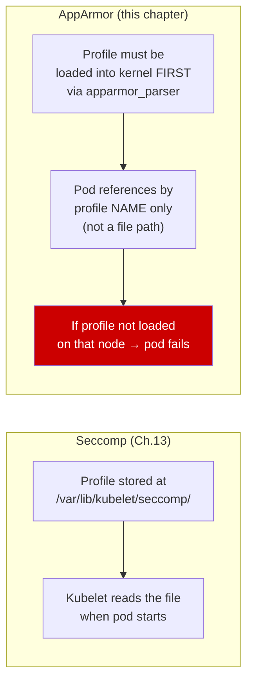
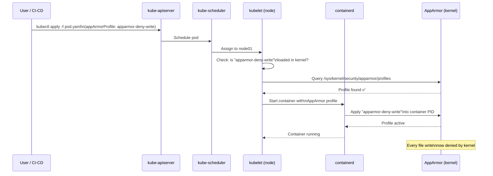
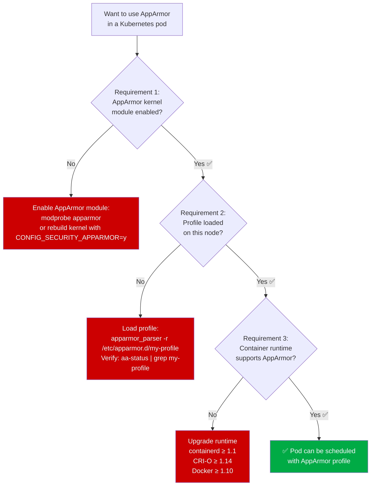
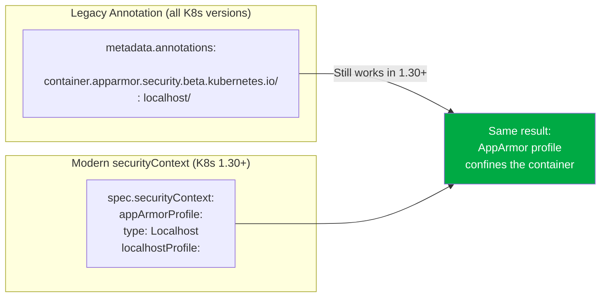
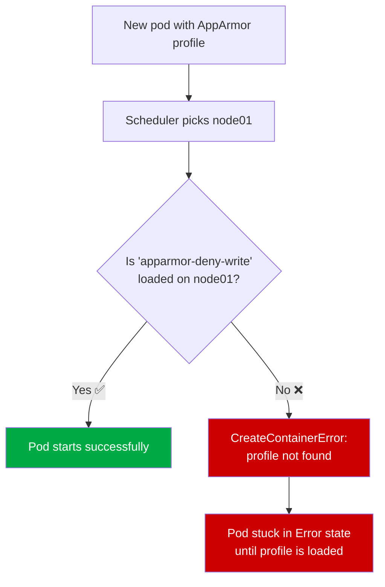
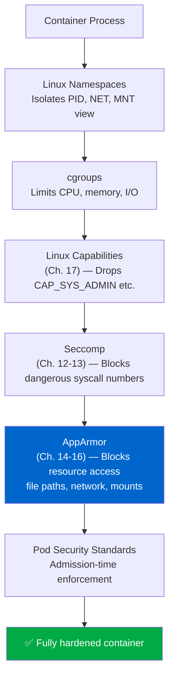
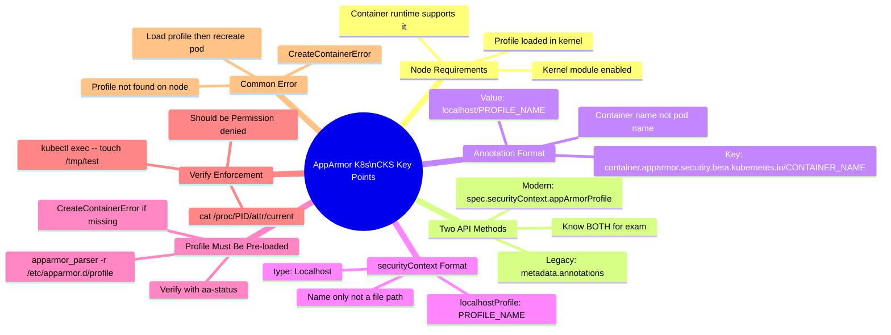

# 16 — AppArmor in Kubernetes

> **Domain:** System Hardening | **CKS Exam Weight:** High  
> **Prerequisites:** Ch. 14 (AppArmor), Ch. 15 (Creating AppArmor Profiles), Ch. 13 (Seccomp in Kubernetes)  
> **Leads Into:** Ch. 17 (Linux Capabilities)

---

## Why This Matters

You now know how to create AppArmor profiles (Ch. 15) and why AppArmor matters (Ch. 14). The final piece is applying those profiles to **Kubernetes pods** — which works differently from Docker and has evolved significantly across Kubernetes versions.

Kubernetes added AppArmor support in **v1.4** but kept it in beta status for years, meaning the implementation relied on pod annotations rather than native spec fields. In Kubernetes **1.30**, AppArmor graduated to GA (Generally Available) and moved into the `securityContext` field alongside Seccomp. The CKS exam tests **both** the legacy annotation method and the modern `securityContext` method — you need to know both.

The critical operational difference from Seccomp: **AppArmor profiles must be pre-loaded on every node** before any pod referencing them is scheduled. If a pod lands on a node where the profile isn't loaded, the pod fails to start. This makes profile distribution a first-class operational concern.



---

## What Is AppArmor in Kubernetes?

**AppArmor in Kubernetes** is the mechanism by which you attach a pre-loaded AppArmor profile to a container's process at pod creation time. The Kubernetes scheduler places the pod on a node, and the container runtime (containerd/CRI-O) instructs the Linux kernel to confine the container's main process under the specified AppArmor profile — before the container's command is executed.



### AppArmor in Kubernetes at a Glance

| Attribute | Detail |
|-----------|--------|
| **Introduced** | Kubernetes v1.4 (alpha) |
| **Beta graduation** | Kubernetes v1.20 |
| **GA graduation** | Kubernetes v1.30 |
| **Pre-1.30 method** | Pod annotations |
| **Post-1.30 method** | `securityContext.appArmorProfile` |
| **Profile storage** | In kernel memory — loaded via `apparmor_parser` on each node |
| **Profile reference** | By name only (not file path — unlike Seccomp) |
| **Scope** | Per-container (not pod-level like some Seccomp configs) |
| **Container runtimes** | containerd, CRI-O, Docker (all support AppArmor) |

---

## Prerequisites: Node Requirements

Before any pod can use an AppArmor profile, **every node that might run the pod** must satisfy three conditions:




### Verifying Requirements on a Node

```bash
# Requirement 1: Kernel module enabled
cat /sys/module/apparmor/parameters/enabled
# Expected: Y

# Requirement 2: Profile loaded (after loading it)
aa-status | grep apparmor-deny-write
# Expected: apparmor-deny-write (in enforce or complain mode)

# Alternative: check the profiles file directly
grep "apparmor-deny-write" /sys/kernel/security/apparmor/profiles
# Expected: apparmor-deny-write (enforce)

# Requirement 3: Containerd supports AppArmor
containerd --version
# containerd github.com/containerd/containerd v1.6.x ...  ← 1.6+ = AppArmor supported
```

---

## Loading an AppArmor Profile on Nodes

Profiles must be loaded before pods reference them. Here's the standard workflow:

### Create the Profile File

```bash
# Create the deny-write profile on a node
cat > /etc/apparmor.d/apparmor-deny-write << 'EOF'
profile apparmor-deny-write flags=(attach_disconnected) {
    file,
    # Deny all file writes
    deny /** w,
}
EOF
```

### Load It Into the Kernel

```bash
# Load the profile
apparmor_parser -r /etc/apparmor.d/apparmor-deny-write

# Verify it's loaded and in enforce mode
aa-status | grep apparmor-deny-write
# apparmor-deny-write   ← appears under "profiles are in enforce mode"

# Also visible in the kernel profiles list
grep "apparmor-deny-write" /sys/kernel/security/apparmor/profiles
# apparmor-deny-write (enforce)
```

### Full `aa-status` Confirming the Profile Is Ready

```
apparmor module is loaded.
13 profiles are loaded.
13 profiles are in enforce mode.
    apparmor-deny-write          ← ✅ Our profile is loaded and enforcing
    /sbin/dhclient
    /usr/bin/man
    /usr/lib/NetworkManager/nm-dhcp-client.action
    /usr/lib/NetworkManager/nm-dhcp-helper
    /usr/lib/connman/scripts/dhclient-script
    /usr/lib/snapd/snap-confine
    /usr/sbin/tcpdump
    docker-default
    man_filter
    man_groff
0 profiles are in complain mode.
11 processes have profiles defined.
11 processes are in enforce mode.
    /sbin/dhclient (621)
    docker-default (3970)
    docker-default (4025)
    docker-default (9853)
    docker-default (9964)
0 processes are in complain mode.
2 processes are unconfined but have a profile defined.
```

---

## Applying AppArmor to Kubernetes Pods

There are two methods, depending on your Kubernetes version.

### Method 1 — Legacy Annotation (Pre-1.30 / Beta Era)

Before Kubernetes 1.30, AppArmor was applied using a **pod annotation** on the `metadata` section:

```yaml
apiVersion: v1
kind: Pod
metadata:
  name: ubuntu-sleeper
  annotations:
    # Format: container.apparmor.security.beta.kubernetes.io/<container-name>: localhost/<profile-name>
    container.apparmor.security.beta.kubernetes.io/ubuntu-sleeper: localhost/apparmor-deny-write
spec:
  containers:
  - name: ubuntu-sleeper
    image: ubuntu
    command: ["sh", "-c", "echo 'Sleeping for an hour!' && sleep 1h"]
```

**Annotation anatomy:**

| Part | Value | Meaning |
|------|-------|---------|
| Key prefix | `container.apparmor.security.beta.kubernetes.io/` | Fixed prefix for AppArmor annotations |
| Key suffix | `ubuntu-sleeper` | **Container name** — must match `containers[].name` exactly |
| Value prefix | `localhost/` | Indicates a node-local profile (as opposed to runtime-default) |
| Value suffix | `apparmor-deny-write` | The profile name as it appears in `aa-status` |

> ⚠️ **CKS Exam Warning:** The annotation key suffix must be the **container name**, not the pod name. If your pod has multiple containers, each needs its own annotation line with its own container name.

**Multiple containers — each gets its own annotation:**

```yaml
metadata:
  annotations:
    container.apparmor.security.beta.kubernetes.io/frontend: localhost/apparmor-deny-write
    container.apparmor.security.beta.kubernetes.io/sidecar: localhost/apparmor-allow-logs
```

### Method 2 — Native `securityContext` (Kubernetes 1.30+ / GA)

From Kubernetes 1.30 onwards, AppArmor uses the same `securityContext` pattern as Seccomp:

```yaml
apiVersion: v1
kind: Pod
metadata:
  name: ubuntu-sleeper
spec:
  securityContext:
    appArmorProfile:               # ← Pod-level: applies to all containers
      type: Localhost
      localhostProfile: apparmor-deny-write
  containers:
  - name: ubuntu-sleeper
    image: ubuntu
    command: ["sh", "-c", "echo 'Sleeping for an hour!' && sleep 1h"]
```

**Or at the container level:**

```yaml
spec:
  containers:
  - name: ubuntu-sleeper
    image: ubuntu
    command: ["sh", "-c", "echo 'Sleeping for an hour!' && sleep 1h"]
    securityContext:
      appArmorProfile:             # ← Container-level: overrides pod-level
        type: Localhost
        localhostProfile: apparmor-deny-write
```

### AppArmor Profile Types in `securityContext`

| `type` | Meaning | Example |
|--------|---------|---------|
| `RuntimeDefault` | Use the container runtime's default AppArmor profile (if any) | `type: RuntimeDefault` |
| `Localhost` | Use a named profile pre-loaded on the node | `type: Localhost` + `localhostProfile: <name>` |
| `Unconfined` | No AppArmor profile applied | `type: Unconfined` |

> **Key difference from Seccomp:** For AppArmor `Localhost`, the `localhostProfile` value is the **profile name** (as shown in `aa-status`), not a file path. For Seccomp `Localhost`, it's a file path relative to `/var/lib/kubelet/seccomp/`.

### Annotation vs `securityContext` Comparison



| Aspect | Legacy Annotation | Modern `securityContext` |
|--------|------------------|------------------------|
| **Works from** | Kubernetes 1.4 | Kubernetes 1.30 |
| **Location in YAML** | `metadata.annotations` | `spec.securityContext` or `spec.containers[].securityContext` |
| **Scope** | Per-container (annotation key includes container name) | Pod-level or container-level |
| **Beta keyword** | Contains `beta` in annotation key | GA — no beta prefix |
| **Profile reference** | `localhost/<profile-name>` | `localhostProfile: <profile-name>` |
| **CKS exam** | Must know both | Must know both |

---

## The Ubuntu Sleeper Example — End to End

### The Scenario

Deploy an Ubuntu container that prints a message and sleeps. It has no legitimate reason to write files, so we apply the `apparmor-deny-write` profile to prevent any file write operations.

**Base pod (no AppArmor):**

```yaml
apiVersion: v1
kind: Pod
metadata:
  name: ubuntu-sleeper
spec:
  containers:
  - name: ubuntu-sleeper
    image: ubuntu
    command: ["sh", "-c", "echo 'Sleeping for an hour!' && sleep 1h"]
```

**The AppArmor profile to use:**

```
profile apparmor-deny-write flags=(attach_disconnected) {
    file,
    deny /** w,
}
```

### Step 1 — Load the Profile on All Nodes

```bash
# On every worker node:
cat > /etc/apparmor.d/apparmor-deny-write << 'EOF'
profile apparmor-deny-write flags=(attach_disconnected) {
    file,
    deny /** w,
}
EOF

apparmor_parser -r /etc/apparmor.d/apparmor-deny-write
aa-status | grep deny-write
```

### Step 2 — Apply via Modern `securityContext` (K8s 1.30+)

```yaml
# ubuntu-sleeper.yaml
apiVersion: v1
kind: Pod
metadata:
  name: ubuntu-sleeper
spec:
  securityContext:
    appArmorProfile:
      type: Localhost
      localhostProfile: apparmor-deny-write
  containers:
  - name: ubuntu-sleeper
    image: ubuntu
    command: ["sh", "-c", "echo 'Sleeping for an hour!' && sleep 1h"]
```

```bash
kubectl apply -f ubuntu-sleeper.yaml
# pod/ubuntu-sleeper created
```

### Step 3 — Verify the Pod Runs

```bash
kubectl get pod ubuntu-sleeper
# NAME              READY   STATUS    RESTARTS   AGE
# ubuntu-sleeper    1/1     Running   0          12s

kubectl logs ubuntu-sleeper
# Sleeping for an hour!
```

The pod started successfully — the `echo` and `sleep` commands don't write files, so the deny-write profile doesn't block normal operation.

### Step 4 — Test the Profile Enforcement

```bash
# Try to create a file inside the container
kubectl exec -ti ubuntu-sleeper -- touch /tmp/test
```

Output:

```
touch: cannot touch '/tmp/test': Permission denied
command terminated with exit code 1
```

**The AppArmor profile is working.** Even `/tmp` is read-only because the profile denies writes everywhere (`deny /** w,`).

```bash
# Try writing to a different path — also denied
kubectl exec -ti ubuntu-sleeper -- bash -c "echo hello > /home/test.txt"
# bash: /home/test.txt: Permission denied

# Confirm reading still works (only writes are denied)
kubectl exec -ti ubuntu-sleeper -- cat /etc/hostname
# ubuntu-sleeper   ← reading works fine
```

---

## Verifying AppArmor Is Active on a Running Pod

### Method 1 — Check via the Container's `/proc`

```bash
# Find the container PID on the node
NODE=$(kubectl get pod ubuntu-sleeper -o jsonpath='{.spec.nodeName}')
# SSH to the node, then:
CPID=$(crictl inspect $(crictl ps | grep ubuntu-sleeper | awk '{print $1}') | jq -r '.info.pid')
cat /proc/$CPID/attr/current
# apparmor-deny-write (enforce)   ← AppArmor profile is active
```

### Method 2 — Check `aa-status` on the Node

```bash
# SSH to the node running the pod
aa-status | grep "ubuntu-sleeper\|deny-write"
# apparmor-deny-write  ← profile in enforce mode
# docker-default (3970)
# apparmor-deny-write applied to container PID
```

### Method 3 — kubectl describe

```bash
kubectl describe pod ubuntu-sleeper | grep -A5 "AppArmor"
# Or check annotations/securityContext:
kubectl get pod ubuntu-sleeper -o yaml | grep -A5 apparmor
```

---

## Profile Distribution Strategy for Multi-Node Clusters

The biggest operational challenge with AppArmor in Kubernetes is ensuring the profile is loaded on **every node** before pods are scheduled there. If a pod lands on a node without the profile, it fails with a `CreateContainerError`.



### Strategy 1 — DaemonSet for Profile Distribution

The most reliable Kubernetes-native approach — a DaemonSet runs on every node and ensures profiles are always loaded:

```yaml
apiVersion: apps/v1
kind: DaemonSet
metadata:
  name: apparmor-loader
  namespace: kube-system
spec:
  selector:
    matchLabels:
      app: apparmor-loader
  template:
    metadata:
      labels:
        app: apparmor-loader
    spec:
      initContainers:
      - name: apparmor-installer
        image: ubuntu:22.04
        command:
        - /bin/bash
        - -c
        - |
          # Write the profile
          cat > /host/etc/apparmor.d/apparmor-deny-write << 'EOF'
          profile apparmor-deny-write flags=(attach_disconnected) {
              file,
              deny /** w,
          }
          EOF
          # Load it
          apparmor_parser -r /host/etc/apparmor.d/apparmor-deny-write
          echo "Profile loaded successfully"
        securityContext:
          privileged: true           # Required to load kernel profiles
        volumeMounts:
        - name: host-etc
          mountPath: /host/etc
      containers:
      - name: pause
        image: gcr.io/pause:3.9     # Keeps the DaemonSet pod running
      volumes:
      - name: host-etc
        hostPath:
          path: /etc
```

### Strategy 2 — Node Bootstrap Script

Add profile loading to your node provisioning script (Terraform, Ansible, cloud-init):

```bash
# /etc/node-bootstrap.sh (runs on node startup)
apt-get install -y apparmor-utils

# Copy and load all AppArmor profiles
aws s3 cp s3://company-security/apparmor-profiles/ /etc/apparmor.d/ --recursive
for profile in /etc/apparmor.d/apparmor-*; do
    apparmor_parser -r "$profile"
    echo "Loaded: $profile"
done

# Verify
aa-status
```

### Strategy 3 — Security Profiles Operator (SPO)

The [Kubernetes Security Profiles Operator](https://github.com/kubernetes-sigs/security-profiles-operator) manages both Seccomp and AppArmor profiles as Kubernetes CRDs, handling distribution automatically:

```yaml
# Define AppArmor profile as a Kubernetes CRD
apiVersion: security-profiles-operator.x-k8s.io/v1alpha1
kind: AppArmorProfile
metadata:
  name: apparmor-deny-write
  namespace: production
spec:
  policy: |
    profile apparmor-deny-write flags=(attach_disconnected) {
        file,
        deny /** w,
    }
```

The SPO automatically distributes the profile to all nodes and keeps it in sync as nodes join the cluster.

---

## Combined Security Context — AppArmor + Seccomp + Capabilities

For maximum container hardening, combine AppArmor with Seccomp (Ch. 12-13) and capability dropping (Ch. 17):

```yaml
apiVersion: v1
kind: Pod
metadata:
  name: hardened-pod
spec:
  securityContext:
    seccompProfile:
      type: RuntimeDefault              # Seccomp: block dangerous syscalls
    appArmorProfile:
      type: Localhost
      localhostProfile: apparmor-deny-write   # AppArmor: block file writes
    runAsNonRoot: true                  # Never run as root
    runAsUser: 1000
  containers:
  - name: app
    image: myapp:latest
    securityContext:
      allowPrivilegeEscalation: false   # Block sudo/setuid escalation
      readOnlyRootFilesystem: true      # Immutable container filesystem
      capabilities:
        drop:
        - ALL                           # Drop all Linux capabilities
        add:
        - NET_BIND_SERVICE              # Re-add only what's needed
```

### The Defence-in-Depth Security Stack



---

## Real-World Scenarios

### Scenario 1 — Hardening a Web Server Pod

**Situation:** An nginx pod is serving static content. It should only read its web root, write logs, and serve network traffic. The security team wants an AppArmor profile to prevent any other file system access.

**Profile (`/etc/apparmor.d/nginx-strict`):**

```
profile nginx-strict flags=(attach_disconnected) {
    #include <abstractions/base>
    #include <abstractions/nameservice>

    # Nginx binary
    /usr/sbin/nginx rix,

    # Web content — read only
    /var/www/html/** r,

    # Configuration — read only
    /etc/nginx/** r,

    # Logs — write/append
    /var/log/nginx/*.log wa,
    /var/log/nginx/ rw,

    # Nginx temp files
    /var/cache/nginx/** rw,
    /tmp/nginx* rw,

    # PID file
    /run/nginx.pid rw,

    # Networking
    network tcp,

    # Deny everything sensitive
    deny /etc/shadow r,
    deny /etc/kubernetes/** r,
    deny /root/** r,
    deny /proc/*/mem rw,
    deny /sys/kernel/** rw,
}
```

**Pod spec:**

```yaml
apiVersion: v1
kind: Pod
metadata:
  name: nginx-web
  annotations:
    # Legacy annotation for K8s < 1.30 compatibility
    container.apparmor.security.beta.kubernetes.io/nginx: localhost/nginx-strict
spec:
  containers:
  - name: nginx
    image: nginx:alpine
    ports:
    - containerPort: 80
```

**Test:**

```bash
kubectl exec -it nginx-web -- touch /etc/cron.d/malicious
# touch: cannot touch '/etc/cron.d/malicious': Permission denied ✅

kubectl exec -it nginx-web -- curl http://example.com
# Works — networking is allowed ✅

kubectl exec -it nginx-web -- cat /var/www/html/index.html
# Works — web root is readable ✅
```

---

### Scenario 2 — Pod Fails with `CreateContainerError` — Diagnosing Missing Profile

**Situation:** After deploying a new pod spec with an AppArmor annotation, the pod shows `CreateContainerError` and never starts.

**Diagnosis:**

```bash
kubectl get pod broken-pod
# NAME          READY   STATUS               RESTARTS   AGE
# broken-pod    0/1     CreateContainerError  0          30s

kubectl describe pod broken-pod
# Events:
#   Warning  Failed  ... Error: failed to create containerd task:
#   failed to create shim: OCI runtime create failed:
#   container_linux.go: starting container process caused:
#   process_linux.go: apparmor: Failed to apply profile:
#   profile "apparmor-deny-write" not found

# The node doesn't have the profile loaded!

# Find which node the pod was scheduled on
kubectl get pod broken-pod -o wide
# NAME         ... NODE     ...
# broken-pod   ... node02   ...

# SSH to node02 and check
ssh node02 aa-status | grep apparmor-deny-write
# (no output — profile not loaded on node02!)

# Load it
ssh node02 "apparmor_parser -r /etc/apparmor.d/apparmor-deny-write"

# Delete and recreate the pod
kubectl delete pod broken-pod
kubectl apply -f broken-pod.yaml
# pod/broken-pod created

kubectl get pod broken-pod
# NAME          READY   STATUS    RESTARTS   AGE
# broken-pod    1/1     Running   0          5s ✅
```

---

### Scenario 3 — Cluster-Wide AppArmor Enforcement via OPA/Gatekeeper

**Situation:** The security team wants to ensure every pod in the `production` namespace has an AppArmor profile — pods without one should be rejected.

**OPA Gatekeeper ConstraintTemplate:**

```yaml
apiVersion: templates.gatekeeper.sh/v1
kind: ConstraintTemplate
metadata:
  name: k8srequireapparmorprofile
spec:
  crd:
    spec:
      names:
        kind: K8sRequireAppArmorProfile
  targets:
  - target: admission.k8s.gatekeeper.sh
    rego: |
      package k8srequireapparmorprofile
      violation[{"msg": msg}] {
          container := input.review.object.spec.containers[_]
          not has_apparmor_annotation(container.name, input.review.object.metadata.annotations)
          not has_apparmor_secctx(input.review.object.spec)
          not has_apparmor_secctx(container)
          msg := sprintf("Container '%v' must have an AppArmor profile configured", [container.name])
      }
      has_apparmor_annotation(name, annotations) {
          key := sprintf("container.apparmor.security.beta.kubernetes.io/%v", [name])
          annotations[key]
      }
      has_apparmor_secctx(obj) {
          obj.securityContext.appArmorProfile.type
      }
```

```yaml
# Apply the constraint to the production namespace
apiVersion: constraints.gatekeeper.sh/v1beta1
kind: K8sRequireAppArmorProfile
metadata:
  name: require-apparmor-production
spec:
  match:
    kinds:
    - apiGroups: [""]
      kinds: ["Pod"]
    namespaces:
    - production
```

**Effect:**

```bash
# Pod without AppArmor profile is rejected
kubectl apply -f no-apparmor-pod.yaml -n production
# Error from server: admission webhook "validation.gatekeeper.sh" denied the request:
# Container 'app' must have an AppArmor profile configured

# Pod with AppArmor profile is admitted
kubectl apply -f apparmor-pod.yaml -n production
# pod/secure-app created ✅
```

---

## Common Mistakes and Pitfalls

| Mistake | Symptom | Fix |
|---------|---------|-----|
| Profile not loaded on all nodes | `CreateContainerError` on some nodes | Load profile on every node — use DaemonSet |
| Annotation key uses pod name instead of container name | Profile not applied — container runs unconfined | Key suffix must be the **container name** exactly |
| Missing `localhost/` prefix in annotation value | Profile not found or wrong profile applied | Value must be `localhost/<profile-name>` |
| Profile name in spec doesn't match `aa-status` name | `CreateContainerError` — profile not found | Use exact profile name as shown in `aa-status` |
| Using `securityContext.appArmorProfile` on K8s < 1.30 | Unknown field error | Use annotation method for older clusters |
| Profile in complain mode instead of enforce | Profile loads but violations not blocked | Run `aa-enforce /etc/apparmor.d/<profile>` before deploying pod |
| Adding annotation but not loading profile first | Pod fails to start | Always load profile on nodes **before** creating pods that reference it |
| Applying pod-level `appArmorProfile` but container has a different profile | Container-level overrides pod-level — potential confusion | Be explicit at container level for clarity |

---

## Quick Reference — AppArmor in Kubernetes

```yaml
# ── LEGACY ANNOTATION (K8s < 1.30) ─────────────────────────────────
metadata:
  annotations:
    container.apparmor.security.beta.kubernetes.io/<container-name>: localhost/<profile-name>

# ── MODERN securityContext (K8s 1.30+) ─────────────────────────────
spec:
  securityContext:           # OR containers[].securityContext
    appArmorProfile:
      type: Localhost
      localhostProfile: <profile-name>    # Name only — NOT a file path

# ── PROFILE TYPES ──────────────────────────────────────────────────
# RuntimeDefault  → runtime's built-in (if any)
# Localhost       → pre-loaded profile on node, referenced by name
# Unconfined      → no profile (avoid in production)

# ── LOAD PROFILE ON NODE ───────────────────────────────────────────
apparmor_parser -r /etc/apparmor.d/<profile-file>

# ── VERIFY PROFILE IS LOADED ───────────────────────────────────────
aa-status | grep <profile-name>
grep <profile-name> /sys/kernel/security/apparmor/profiles

# ── TEST ENFORCEMENT ON RUNNING POD ────────────────────────────────
kubectl exec -ti <pod> -- touch /tmp/test    # Should fail if deny-write applied

# ── CHECK APPARMOR ON CONTAINER PROCESS ────────────────────────────
# On the node:
cat /proc/<container-pid>/attr/current
# Expected: <profile-name> (enforce)

# ── DIAGNOSE CreateContainerError ──────────────────────────────────
kubectl describe pod <pod-name>
# Look for: apparmor: Failed to apply profile: profile "<name>" not found
# Fix: load the profile on the node the pod is scheduled on
```

---

## CKS Exam Tips



**Critical exam facts:**
- AppArmor profiles must be **loaded on the node** before the pod is created
- Legacy annotation value format: `localhost/<profile-name>` (not a file path)
- Modern `localhostProfile` value: the **profile name** as in `aa-status` (not a file path)
- `CreateContainerError` with "profile not found" = profile not loaded on that node
- The annotation key suffix is the **container name**, not the pod name
- Verify enforcement: `kubectl exec -- touch /tmp/test` should give `Permission denied`

---

## Chapter Summary

| Concept | Key Takeaway |
|---------|-------------|
| **Node requirement** | AppArmor kernel module enabled + profile loaded + runtime support |
| **Load profile** | `apparmor_parser -r /etc/apparmor.d/<profile>` on every node |
| **Legacy annotation** | `container.apparmor.security.beta.kubernetes.io/<container-name>: localhost/<name>` |
| **Modern securityContext** | `appArmorProfile.type: Localhost` + `localhostProfile: <name>` |
| **Profile reference** | By NAME only (not file path — unlike Seccomp) |
| **Verify it's loaded** | `aa-status` or `grep <name> /sys/kernel/security/apparmor/profiles` |
| **Test enforcement** | `kubectl exec -- touch /tmp/test` → `Permission denied` |
| **`CreateContainerError`** | Profile not loaded on the scheduled node — load it and recreate pod |
| **Multi-node distribution** | Use DaemonSet, node bootstrap scripts, or Security Profiles Operator |
| **Combined hardening** | AppArmor + Seccomp + Capabilities + `allowPrivilegeEscalation: false` |

---

## What's Next

- **Chapter 17 — Linux Capabilities:** The final security layer — Linux capabilities replace the all-or-nothing root/non-root model with fine-grained privilege tokens. You'll learn which capabilities to drop from containers and which rare ones are legitimately needed.
- **Chapter 0 — Intro System Hardening:** After Ch. 17, the module introduction will be written covering all 17 chapters as a cohesive reference.

---

*Sources: Kubernetes AppArmor Documentation, KodeKloud CKS Course, AppArmor Wiki, Security Profiles Operator GitHub*
