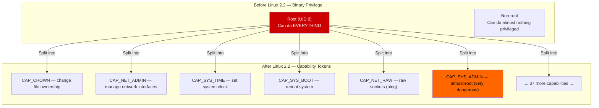
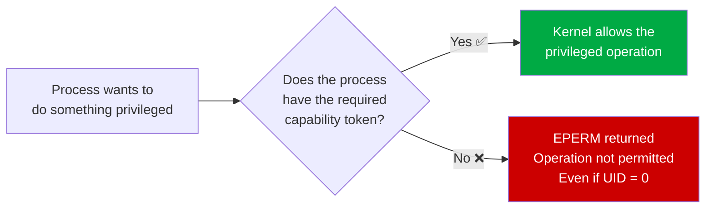
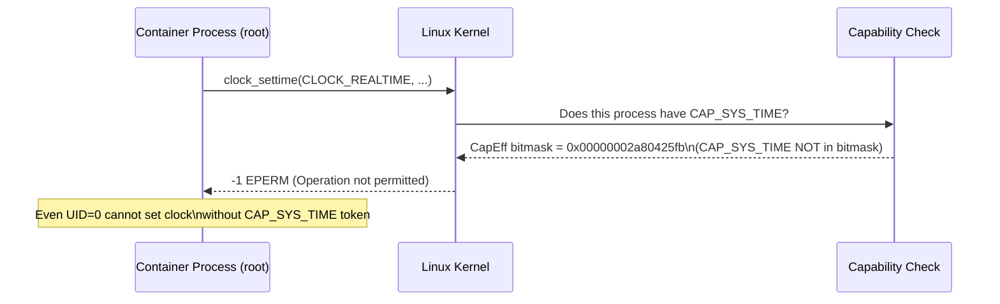
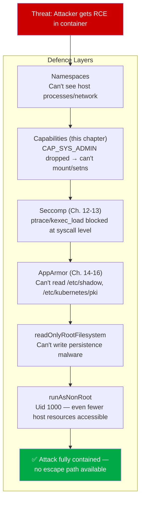
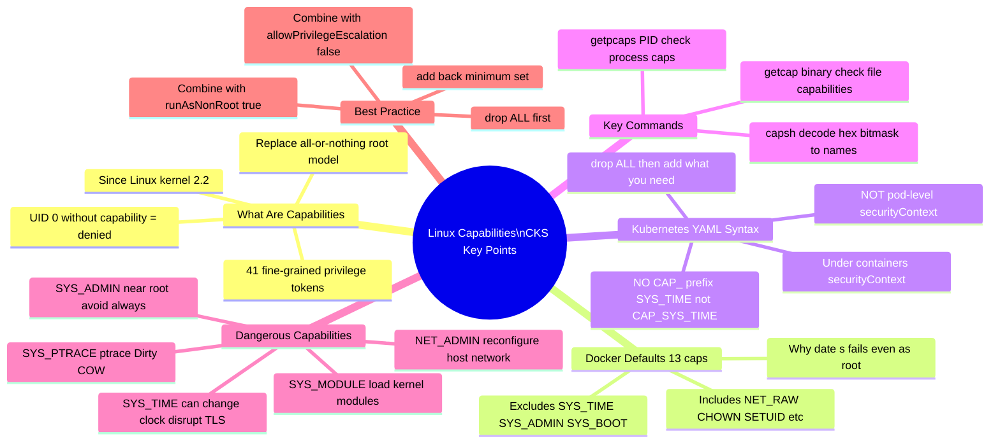

# 17 — Linux Capabilities

> **Domain:** System Hardening | **CKS Exam Weight:** High  
> **Prerequisites:** Ch. 14-16 (AppArmor), Ch. 12-13 (Seccomp)  
> **This is the final System Hardening chapter. See `0 -- Intro - System Hardening.md` for the module overview.**

---

## Why This Matters

You've restricted syscalls with Seccomp. You've locked file access with AppArmor. But there's still a question that neither of those answers: **when a process running as root tries to reboot the system, load a kernel module, or change the system clock — what stops it?**

The answer is **Linux capabilities** — the mechanism that splits the monolithic "root can do anything" model into fine-grained privilege tokens. Containers, even when running as `uid=0` (root), are started with only a subset of these tokens. The ones they don't have cannot be exercised, regardless of what UID the process runs as.

This is why `date -s` fails inside a container even as root, and why a compromised container can't simply call `mount()`, load kernel modules, or reboot the host — those operations require specific capability tokens that Docker and Kubernetes deliberately withhold.



---

## What Are Linux Capabilities?

**Linux capabilities** are fine-grained units of privilege that divide the traditional all-powerful root identity into **41 discrete permission tokens** (as of Linux 5.x). Each capability grants a specific set of privileged operations — nothing more.



### The Key Insight

**UID 0 no longer automatically means omnipotent.** Since Linux 2.2, the kernel checks for specific capability tokens independently of UID. A process with UID 0 but no `CAP_SYS_TIME` cannot set the system clock. A process with UID 1000 but with `CAP_NET_BIND_SERVICE` can bind to port 80.

This is the foundation that makes container security meaningful: Docker and Kubernetes grant containers a UID-0 process but deliberately strip most capability tokens from its **bounding set**.


### The Four Capability Sets Per Process

Every Linux process maintains **four capability sets**:

| Set | Name | Meaning |
|-----|------|---------|
| **Permitted** | `CapPrm` | The maximum set of capabilities this process can ever have |
| **Effective** | `CapEff` | Capabilities currently active — what the kernel actually checks |
| **Inheritable** | `CapInh` | Capabilities preserved across `exec()` calls |
| **Bounding** | `CapBnd` | Hard ceiling — capabilities can never exceed this set |

```bash
# See a process's capability sets
cat /proc/self/status | grep Cap
# CapInh: 0000000000000000   ← Inheritable (hex bitmask)
# CapPrm: 0000003fffffffff   ← Permitted
# CapEff: 0000003fffffffff   ← Effective (what's actually active)
# CapBnd: 0000003fffffffff   ← Bounding

# Decode the hex bitmask to human-readable capability names
capsh --decode=0000003fffffffff
# 0x0000003fffffffff=cap_chown,cap_dac_override,...,cap_audit_write
```

---

## Key Linux Capabilities Reference

| Capability | What It Grants | Risk in a Container |
|-----------|---------------|---------------------|
| `CAP_CHOWN` | Change file owner/group (`chown`) | Low — needed by many apps |
| `CAP_DAC_OVERRIDE` | Bypass file read/write/execute permission checks | Medium — bypasses normal file ACLs |
| `CAP_FOWNER` | Bypass permission checks when file UID ≠ process UID | Medium |
| `CAP_NET_BIND_SERVICE` | Bind to ports < 1024 (HTTP, HTTPS, SSH) | Low — commonly needed |
| `CAP_NET_RAW` | Raw sockets — needed by `ping`, packet capture | Medium — can sniff traffic |
| `CAP_NET_ADMIN` | Configure network interfaces, routing, firewall rules | HIGH — full network control |
| `CAP_SYS_ADMIN` | Dozens of operations: `mount()`, `setns()`, `pivot_root()`, etc. | CRITICAL — nearly root |
| `CAP_SYS_TIME` | Set system clock (`date -s`, `settimeofday`) | High — disrupts logging, auth, TLS |
| `CAP_SYS_BOOT` | `reboot()`, `kexec_load()` — restart or replace kernel | CRITICAL |
| `CAP_SYS_MODULE` | `init_module()`, `finit_module()` — load kernel modules | CRITICAL — kernel code exec |
| `CAP_SYS_PTRACE` | `ptrace()` — attach to any process — Dirty COW vector | CRITICAL |
| `CAP_SETUID` | Change UID — `setuid()`, `setresuid()` | High — escalate to root |
| `CAP_SETGID` | Change GID — `setgid()`, `setresgid()` | High |
| `CAP_MKNOD` | Create device files with `mknod()` | Medium — device access |
| `CAP_KILL` | Send signals to any process | Medium — DoS risk |
| `CAP_AUDIT_WRITE` | Write to kernel audit log | Low — needed by some auth systems |
| `CAP_SYS_CHROOT` | `chroot()` — change root filesystem | Medium — sandbox escape vector |

> 💡 **Full list:** `man 7 capabilities` — as of Linux 5.x, there are 41 capabilities total.

---

## Why `date -s` Fails in a Container (Even as Root)

This is the canonical demonstration of capabilities:

### In Docker with Seccomp Disabled

```bash
# Disable Seccomp — so we know this isn't a Seccomp block
docker run -it --rm --security-opt seccomp=unconfined docker/whalesay /bin/sh

# Try to change the system date
# date -s '19 APR 2012 22:00:00'
date: cannot set date: Operation not permitted
```

**Why?** `date -s` calls `clock_settime()` (syscall 227). That syscall requires `CAP_SYS_TIME`. Docker's default capability set does **not** include `CAP_SYS_TIME`. So even though:
- Seccomp is disabled (syscall is permitted)
- The process runs as UID 0 (root)

…the capability check fails and the operation is denied.

### In a Kubernetes Pod

```bash
kubectl run --rm -it ubuntu-sleeper --image=ubuntu -- bash

root@ubuntu-sleeper:/# date -s '19 APR 2012 22:00:00'
date: cannot set date: Operation not permitted
Thu Apr 19 22:00:00 UTC 2012
```

Same result — Kubernetes pods inherit Docker's (or containerd's) default capability set, which excludes `CAP_SYS_TIME`.



---

## Docker's Default Capability Set (14 Capabilities)

Docker starts containers with **13 capabilities** by default (the number varies slightly by Docker version; the OCI spec defines the baseline):

```go
// From the Docker/containerd source — DefaultCapabilities
func DefaultCapabilities() []string {
    return []string{
        "CAP_CHOWN",          // chown files
        "CAP_DAC_OVERRIDE",   // bypass file permission checks
        "CAP_FOWNER",         // bypass permission checks (file owner mismatch)
        "CAP_MKNOD",          // create device nodes
        "CAP_NET_RAW",        // raw sockets (ping)
        "CAP_SETGID",         // change GID
        "CAP_SETUID",         // change UID
        "CAP_SETFCAP",        // set file capabilities
        "CAP_SETPCAP",        // set process capabilities
        "CAP_NET_BIND_SERVICE", // bind to ports < 1024
        "CAP_SYS_CHROOT",     // chroot()
        "CAP_KILL",           // send signals to any process
        "CAP_AUDIT_WRITE",    // write to audit log
    }
}
```

**Notably absent from Docker defaults:**

```
CAP_SYS_ADMIN     ← No: mount, setns, pivot_root
CAP_SYS_TIME      ← No: cannot set system clock
CAP_SYS_BOOT      ← No: cannot reboot
CAP_SYS_MODULE    ← No: cannot load kernel modules
CAP_SYS_PTRACE    ← No: cannot ptrace() other processes
CAP_NET_ADMIN     ← No: cannot reconfigure network interfaces
CAP_DAC_READ_SEARCH ← No: cannot bypass read permission checks
```

---

## Checking Capabilities

### `getcap` — Capabilities on a Binary File

Some binaries need elevated capabilities to function but shouldn't run as root. Linux lets you set capabilities **on the binary file itself** so the capability is granted when the file is executed, regardless of who runs it:

```bash
# Check what capabilities the ping binary has
getcap /usr/bin/ping
# /usr/bin/ping = cap_net_raw+ep
```

**Reading the output:**
- `cap_net_raw` — the capability token
- `+e` — set in the **effective** set on exec
- `+p` — set in the **permitted** set on exec

This means any user who runs `/usr/bin/ping` gets `CAP_NET_RAW` activated — even without being root. That's how non-root users can ping.

```bash
# Check capabilities on other common binaries
getcap /usr/bin/python3
# (no output = no file capabilities set)

getcap /usr/bin/dumpcap
# /usr/bin/dumpcap = cap_net_admin,cap_net_raw+eip
# ← Wireshark's capture binary gets two network capabilities

# Set a capability on a binary (requires root)
setcap cap_net_raw+ep /usr/bin/custom-tool

# Remove capabilities from a binary
setcap -r /usr/bin/custom-tool
```

### `getpcaps` — Capabilities of a Running Process

```bash
# Find the SSH daemon PID
ps -ef | grep /usr/sbin/sshd | grep -v grep
# root  779  1  0 03:55 ?  00:00:00 /usr/sbin/sshd -D

# Check its capabilities
getpcaps 779
# 779: = cap_chown,cap_dac_override,cap_fowner,...,cap_audit_write+ep
# ← sshd has many capabilities because it needs to switch users on login

# Check your current shell's capabilities
getpcaps $$
# 12345: =   ← Empty = no capabilities (normal user shell)

# Check a container process's capabilities (from the host)
CPID=$(docker inspect --format '{{.State.Pid}}' my-container)
getpcaps $CPID
# <pid>: = cap_chown,cap_dac_override,...,cap_audit_write+ep
# Only the 13 Docker defaults — no CAP_SYS_ADMIN, CAP_SYS_TIME etc.
```

### Reading `/proc/<pid>/status` Capability Bitmasks

```bash
cat /proc/1/status | grep Cap
# CapInh: 0000000000000000
# CapPrm: 00000000a80425fb
# CapEff: 00000000a80425fb
# CapBnd: 00000000a80425fb
# CapAmb: 0000000000000000

# Decode the effective set
capsh --decode=00000000a80425fb
# 0x00000000a80425fb=cap_chown,cap_dac_override,cap_fowner,cap_fsetid,
#   cap_kill,cap_setgid,cap_setuid,cap_setpcap,cap_net_bind_service,
#   cap_net_raw,cap_sys_chroot,cap_mknod,cap_audit_write,cap_setfcap
# ← Exactly Docker's 14 defaults
```

---

## Modifying Capabilities in Docker

### Adding a Capability — Enable `date -s`

```bash
# Add CAP_SYS_TIME to allow setting the system clock
docker run -it --rm \
  --cap-add SYS_TIME \
  docker/whalesay /bin/sh

# Now date -s works:
# date -s '19 APR 2012 22:00:00'
# Thu Apr 19 22:00:00 UTC 2012   ← Success!
```

### Dropping a Capability — Disable `chown`

```bash
# Drop CAP_CHOWN — container cannot change file ownership
docker run -it --rm \
  --cap-drop CHOWN \
  ubuntu bash

# chown fails:
# chown root:root /tmp/test
# chown: changing ownership of '/tmp/test': Operation not permitted

# But other operations still work:
# touch /tmp/test    ← Writing still works (CHOWN not needed for touch)
```

### Drop ALL and Add Back Only What's Needed

```bash
# Start with zero capabilities, add only what the app needs
docker run -it --rm \
  --cap-drop ALL \
  --cap-add NET_BIND_SERVICE \
  --cap-add SETUID \
  --cap-add SETGID \
  nginx

# This nginx container can:
# - Bind to port 80 (NET_BIND_SERVICE) ✅
# - Switch to www-data user (SETUID/SETGID) ✅
# - But cannot: chown, mknod, raw sockets, chroot, audit write, etc.
```

### Full Docker Capability Flags Reference

| Docker flag | Capability | Effect |
|------------|-----------|--------|
| `--cap-add SYS_TIME` | `CAP_SYS_TIME` | Allow setting system clock |
| `--cap-add SYS_ADMIN` | `CAP_SYS_ADMIN` | Allow mount, setns (⚠️ dangerous) |
| `--cap-add NET_ADMIN` | `CAP_NET_ADMIN` | Allow network reconfiguration |
| `--cap-add SYS_PTRACE` | `CAP_SYS_PTRACE` | Allow ptrace (⚠️ dangerous) |
| `--cap-drop CHOWN` | Remove `CAP_CHOWN` | Disable chown |
| `--cap-drop NET_RAW` | Remove `CAP_NET_RAW` | Disable raw sockets/ping |
| `--cap-drop ALL` | Remove all 13 defaults | Start from zero — safest baseline |
| `--privileged` | Grants ALL capabilities | ⛔ Never in production |

---

## Capabilities in Kubernetes

Kubernetes manages capabilities via the `capabilities` field inside `securityContext`. The syntax mirrors Docker but uses YAML:

```yaml
securityContext:
  capabilities:
    add:
    - SYS_TIME          # Uppercase, no CAP_ prefix in K8s
    drop:
    - ALL               # Drop all defaults first (recommended)
    - CHOWN             # Or drop individual ones
```

> **Note:** In Kubernetes YAML, capability names are **uppercase without the `CAP_` prefix**. So `CAP_SYS_TIME` becomes `SYS_TIME`, `CAP_CHOWN` becomes `CHOWN`.

### Example 1 — Add `CAP_SYS_TIME` to Allow Clock Setting

```yaml
apiVersion: v1
kind: Pod
metadata:
  name: ubuntu-sleeper
spec:
  containers:
  - name: ubuntu-sleeper
    image: ubuntu
    command: ["bash", "-c", "date -s '19 APR 2012 22:00:00' && sleep 1h"]
    securityContext:
      capabilities:
        add:
        - SYS_TIME          # ← Grant CAP_SYS_TIME
```

```bash
kubectl apply -f ubuntu-sleeper.yaml
kubectl logs ubuntu-sleeper
# Thu Apr 19 22:00:00 UTC 2012   ← date -s now works!
```

### Example 2 — Drop `CAP_CHOWN` to Prevent File Ownership Changes

```yaml
apiVersion: v1
kind: Pod
metadata:
  name: ubuntu-sleeper
spec:
  containers:
  - name: ubuntu-sleeper
    image: ubuntu
    command: ["sleep", "1h"]
    securityContext:
      capabilities:
        drop:
        - CHOWN             # ← Remove CAP_CHOWN
```

```bash
kubectl exec -it ubuntu-sleeper -- chown root:root /tmp/test
# chown: changing ownership of '/tmp/test': Operation not permitted ✅
```

### Example 3 — Drop ALL, Add Back Only What's Needed (Best Practice)

```yaml
apiVersion: v1
kind: Pod
metadata:
  name: hardened-nginx
spec:
  containers:
  - name: nginx
    image: nginx:alpine
    securityContext:
      capabilities:
        drop:
        - ALL                      # Remove all 13 Docker defaults
        add:
        - NET_BIND_SERVICE         # Re-add: needed to bind port 80
        - SETUID                   # Re-add: needed to switch to www-data
        - SETGID                   # Re-add: needed to switch group
      allowPrivilegeEscalation: false
      readOnlyRootFilesystem: true
      runAsNonRoot: false          # nginx needs root initially to bind 80, then drops
```

### Pod-Level vs Container-Level Capabilities

Unlike `seccompProfile` which can be set at pod level, `capabilities` can **only be set at the container level**:

```yaml
spec:
  securityContext:
    # ← capabilities NOT valid here — must be per-container
    runAsNonRoot: true
    seccompProfile:
      type: RuntimeDefault
  containers:
  - name: app
    securityContext:
      capabilities:         # ← CORRECT: capabilities go here
        drop:
        - ALL
```

---

## The Complete `securityContext` Hardening Stack

Combining all System Hardening techniques from this module:

```yaml
apiVersion: v1
kind: Pod
metadata:
  name: fully-hardened
  annotations:
    # AppArmor (Ch. 16) — for K8s < 1.30
    container.apparmor.security.beta.kubernetes.io/app: localhost/apparmor-deny-write
spec:
  securityContext:
    runAsNonRoot: true              # Never run as root
    runAsUser: 1000                 # Specific non-root UID
    runAsGroup: 3000
    fsGroup: 2000
    seccompProfile:                 # Seccomp (Ch. 12-13)
      type: RuntimeDefault          # Block dangerous syscalls
    appArmorProfile:                # AppArmor (Ch. 14-16, K8s 1.30+)
      type: Localhost
      localhostProfile: apparmor-deny-write
  containers:
  - name: app
    image: myapp:latest
    securityContext:
      allowPrivilegeEscalation: false   # No sudo/setuid escalation
      readOnlyRootFilesystem: true      # Immutable container FS
      capabilities:
        drop:
        - ALL                           # Drop all capabilities (Ch. 17)
        add:
        - NET_BIND_SERVICE              # Only what the app genuinely needs
```

### Why Each Layer Is Needed



---

## Verifying Capabilities with `amicontained`

`amicontained` (introduced in Ch. 13 for Seccomp) also reports capabilities:

```bash
# In Docker — see which capabilities are active
docker run --rm r.j3ss.co/amicontained amicontained

# Output (relevant section):
Capabilities:
    BOUNDING -> chown dac_override fowner fsetid kill setgid setuid setpcap
                net_bind_service net_raw sys_chroot mknod audit_write setcap
# ← The 13 Docker defaults. Note: no sys_time, no sys_admin, no sys_boot etc.
```

```bash
# After adding SYS_TIME:
docker run --rm --cap-add SYS_TIME r.j3ss.co/amicontained amicontained

Capabilities:
    BOUNDING -> chown dac_override fowner fsetid kill setgid setuid setpcap
                net_bind_service net_raw sys_chroot mknod audit_write setcap sys_time
# ← sys_time now appears in the bounding set
```

```bash
# In a Kubernetes pod — check the pod's effective capabilities
kubectl run cap-check \
  --image=r.j3ss.co/amicontained \
  --restart=Never \
  -- amicontained

kubectl logs cap-check
# Capabilities:
#     BOUNDING -> chown dac_override fowner fsetid kill setgid setuid setpcap
#                 net_bind_service net_raw sys_chroot mknod audit_write setcap
# ← Same as Docker — Kubernetes inherits the runtime's defaults
```

---

## Real-World Scenarios

### Scenario 1 — Enabling NTP Sync in a Container (Adding `CAP_SYS_TIME`)

**Situation:** A pod runs an NTP client (`chrony`) to synchronise the node's clock. It needs to call `adjtimex()` and `clock_settime()` — both require `CAP_SYS_TIME`.

**Wrong approach — `--privileged`:**

```yaml
securityContext:
  privileged: true    # ← Grants ALL 40+ capabilities. Way too broad.
```

**Correct approach — grant only what's needed:**

```yaml
apiVersion: v1
kind: Pod
metadata:
  name: chrony-ntp
spec:
  containers:
  - name: chrony
    image: chrony:latest
    securityContext:
      capabilities:
        drop:
        - ALL
        add:
        - SYS_TIME        # ← Only the specific capability chrony needs
        - SYS_NICE        # ← Adjust scheduling priority (also needed by chrony)
      allowPrivilegeEscalation: false
```

**Result:** chrony can synchronise the clock, but cannot mount filesystems, load kernel modules, ptrace other processes, or perform any of the other 38+ dangerous operations that `--privileged` would have allowed.

---

### Scenario 2 — Hardening a Web Application — Drop Everything Unnecessary

**Situation:** A Node.js web API runs in production. Security audit finds the container has `CAP_NET_RAW` (allowing raw packet sniffing) and `CAP_MKNOD` (allowing device file creation) — neither is needed.

**Audit the current capabilities:**

```bash
kubectl exec -it node-api-pod -- cat /proc/1/status | grep CapEff
# CapEff: 00000000a80425fb

# Decode
capsh --decode=00000000a80425fb
# cap_chown,cap_dac_override,cap_fowner,cap_fsetid,cap_kill,
# cap_setgid,cap_setuid,cap_setpcap,cap_net_bind_service,
# cap_net_raw,cap_sys_chroot,cap_mknod,cap_audit_write,cap_setfcap
# ← cap_net_raw and cap_mknod present — unnecessary!
```

**Harden the deployment:**

```yaml
containers:
- name: node-api
  image: node-api:v2.1
  securityContext:
    capabilities:
      drop:
      - ALL                    # Drop all 13 defaults
      add:
      - NET_BIND_SERVICE       # Port 80/443 binding (if running as root)
      - SETUID                 # Drop to non-root after startup
      - SETGID
    allowPrivilegeEscalation: false
    runAsUser: 1001            # Run as non-root after startup
```

**Verify after deploy:**

```bash
kubectl exec -it node-api-pod -- cat /proc/1/status | grep CapEff
# CapEff: 0000000000002c00
capsh --decode=0000000000002c00
# cap_net_bind_service,cap_setgid,cap_setuid
# ← Only 3 capabilities remain. Attack surface reduced by ~77%.
```

---

### Scenario 3 — Preventing a Container Escape via `CAP_SYS_ADMIN`

**Situation:** A security scan flags several pods in the cluster as having `CAP_SYS_ADMIN` in their bounding set (added by a developer for debugging). `CAP_SYS_ADMIN` is the most dangerous capability — it allows `mount()`, `setns()`, `pivot_root()`, creating new namespaces, and dozens of other operations that can be chained into a container escape.

**Find offending pods:**

```bash
# Audit all pods for capabilities
kubectl get pods -A -o json | jq -r '
  .items[] |
  select(.spec.containers[].securityContext.capabilities.add[]? == "SYS_ADMIN") |
  "\(.metadata.namespace)/\(.metadata.name)"
'
# default/debug-pod
# staging/data-processor
```

**How `CAP_SYS_ADMIN` enables container escape:**

```bash
# Attacker has RCE in a pod with CAP_SYS_ADMIN
# Step 1: Mount the host filesystem
mkdir /tmp/hostfs
mount /dev/sda1 /tmp/hostfs    # ← Requires CAP_SYS_ADMIN

# Step 2: Access host's sensitive files
cat /tmp/hostfs/etc/kubernetes/admin.conf  # Full cluster admin credentials!

# Step 3: Full host and cluster compromise
```

**Fix — remove `SYS_ADMIN` and use specific capabilities:**

```yaml
# Before (insecure):
securityContext:
  capabilities:
    add: [SYS_ADMIN]

# After (hardened) — identify WHAT the developer needed SYS_ADMIN for,
# then grant only that specific capability:
securityContext:
  capabilities:
    drop:
    - ALL
    add:
    - SYS_NICE          # If they needed priority adjustment
    # - NET_ADMIN       # If they needed network configuration
    # (never add SYS_ADMIN in production)
```

---

## Common Mistakes and Pitfalls

| Mistake | Risk | Fix |
|---------|------|-----|
| Using `--privileged` / `privileged: true` | Grants ALL 40+ capabilities — essentially host root | Grant only specific needed capabilities |
| Adding `SYS_ADMIN` "for debugging" | Near-root — enables mount, setns, namespace creation → escape | Use specific caps; never leave in production |
| Not dropping unused defaults (e.g. `NET_RAW`, `MKNOD`) | Unnecessary attack surface — raw socket sniffing, device creation | Start with `drop: [ALL]`, add only what's tested as needed |
| Setting capabilities at pod level | YAML error — `capabilities` is container-level only | Move `capabilities` under `containers[].securityContext` |
| Using `CAP_` prefix in Kubernetes | Unknown capability error | Kubernetes uses `SYS_TIME` not `CAP_SYS_TIME` |
| Not combining with `allowPrivilegeEscalation: false` | App can regain dropped capabilities via setuid binary | Always pair with `allowPrivilegeEscalation: false` |
| Assuming `runAsNonRoot` removes need for capability management | Non-root UID but same bounding set — attacker still has NET_RAW etc. | Do both: non-root UID AND minimal capabilities |

---

## Quick Reference

```yaml
# ── KUBERNETES CAPABILITY SYNTAX ─────────────────────────────────────
securityContext:
  capabilities:
    drop:
    - ALL               # Drop all defaults first (best practice)
    add:
    - NET_BIND_SERVICE  # Grant only what the app specifically needs
    - SETUID
    - SETGID

# ── DOCKER CAPABILITY FLAGS ───────────────────────────────────────────
docker run --cap-drop ALL --cap-add NET_BIND_SERVICE image
docker run --cap-add SYS_TIME image
docker run --cap-drop CHOWN image

# ── CHECK CAPABILITIES ────────────────────────────────────────────────
getcap /usr/bin/ping              # Capabilities on a binary
getpcaps <PID>                    # Capabilities of a running process
cat /proc/<PID>/status | grep Cap # Raw bitmasks
capsh --decode=<hex>              # Decode hex bitmask to names

# ── KUBERNETES CAPABILITY NAMES (no CAP_ prefix, uppercase) ──────────
# SYS_TIME, SYS_ADMIN, NET_ADMIN, NET_BIND_SERVICE, NET_RAW,
# CHOWN, DAC_OVERRIDE, FOWNER, SETUID, SETGID, KILL, MKNOD,
# SYS_PTRACE, SYS_BOOT, SYS_MODULE, SYS_CHROOT, AUDIT_WRITE

# ── VERIFY ON RUNNING POD ─────────────────────────────────────────────
kubectl exec -it <pod> -- cat /proc/1/status | grep CapEff
capsh --decode=<hex value>
# Or use amicontained:
kubectl run cap-test --image=r.j3ss.co/amicontained --restart=Never -- amicontained
kubectl logs cap-test
```

---

## CKS Exam Tips



**Critical exam facts:**
- Kubernetes capability names have **NO `CAP_` prefix** and are **UPPERCASE** (`SYS_TIME` not `CAP_SYS_TIME`)
- `capabilities` is a **container-level** field, not pod-level
- Docker starts containers with **13 capabilities** by default — excludes `SYS_TIME`, `SYS_ADMIN`, `SYS_BOOT`
- `date -s` fails because `CAP_SYS_TIME` is not in the default set
- `drop: [ALL]` then `add: [only-what-is-needed]` is the best practice
- `privileged: true` grants ALL capabilities — never use in production
- `allowPrivilegeEscalation: false` prevents regaining capabilities via setuid

---

## Chapter Summary

| Concept | Key Takeaway |
|---------|-------------|
| **What capabilities are** | 41 fine-grained privilege tokens splitting root's power (since Linux 2.2) |
| **Why `date -s` fails** | `CAP_SYS_TIME` is not in Docker/K8s default capability set |
| **Docker defaults** | 13 capabilities — `NET_RAW`, `CHOWN`, `SETUID` etc. — not `SYS_TIME`, `SYS_ADMIN` |
| **`getcap`** | Check what capabilities are set on a binary file |
| **`getpcaps <pid>`** | Check what capabilities a running process has |
| **K8s YAML syntax** | `capabilities.add/drop` under `containers[].securityContext` |
| **K8s naming** | Uppercase, no `CAP_` prefix: `SYS_TIME`, not `CAP_SYS_TIME` |
| **Best practice** | `drop: [ALL]` first, then `add` only what the app specifically needs |
| **`SYS_ADMIN` danger** | Allows mount, setns, namespace operations → container escape vector |
| **Combined hardening** | Capabilities + Seccomp + AppArmor + `allowPrivilegeEscalation: false` + `runAsNonRoot` |

---

## 🎉 System Hardening Module Complete

You have now completed all chapters of the **System Hardening** domain. The complete set of tools in your security toolkit:

| Chapter | Topic | Core Defence |
|---------|-------|-------------|
| 1 | Least Privilege Principle | Philosophy — minimum access, maximum containment |
| 2 | SSH Hardening | Key-based auth, hardened sshd_config, fail2ban |
| 3 | Privilege Escalation | sudoers control, GTFOBins awareness |
| 4 | Remove Obsolete Packages | Reduced attack surface at the OS level |
| 5 | Restrict Kernel Modules | Block CVE-exploitable modules (DCCP, TIPC, SCTP) |
| 6 | Identify Open Ports | Close unused listening services |
| 7 | Minimize IAM Roles | Least privilege in cloud — IRSA for pods |
| 8 | Minimize External Access | Perimeter + host-based network controls |
| 9 | UFW Firewall | iptables frontend — allow/deny by IP and port |
| 10 | Linux Syscalls | The foundation — what syscalls are and how strace works |
| 11 | AquaSec Tracee | eBPF-based runtime observation — detect without blocking |
| 12 | Seccomp | Syscall filtering by number — block dangerous calls |
| 13 | Seccomp in Kubernetes | Apply Seccomp profiles to pods via securityContext |
| 14 | AppArmor | Resource-level MAC — file paths, network, capabilities |
| 15 | Creating AppArmor Profiles | aa-genprof, aa-logprof, complain → enforce workflow |
| 16 | AppArmor in Kubernetes | Apply profiles to pods — annotations and securityContext |
| **17** | **Linux Capabilities** | **Fine-grained privilege tokens — drop ALL, add minimum** |

**Next step:** Create `0 -- Intro - System Hardening.md` as the module overview, covering all 17 chapters.

---

*Sources: `man 7 capabilities`, KodeKloud CKS Course, Docker Default Capabilities Source, Kubernetes Security Context Documentation, Linux Kernel Capabilities Documentation*
