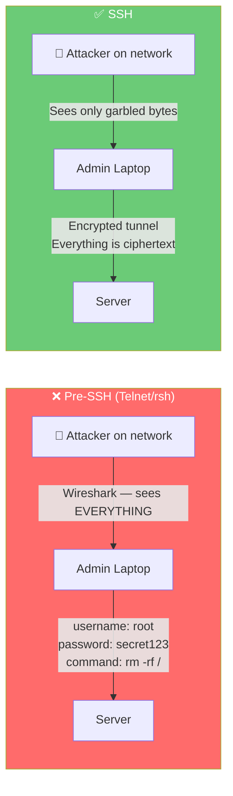
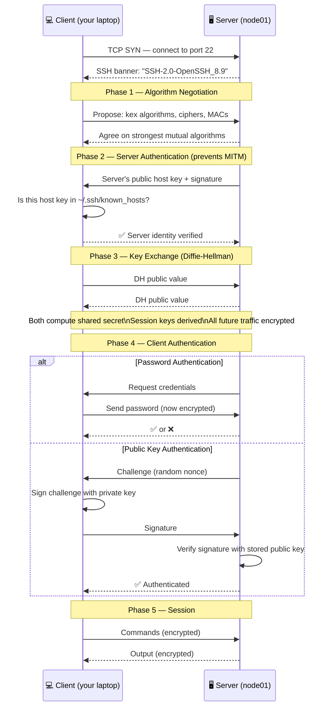
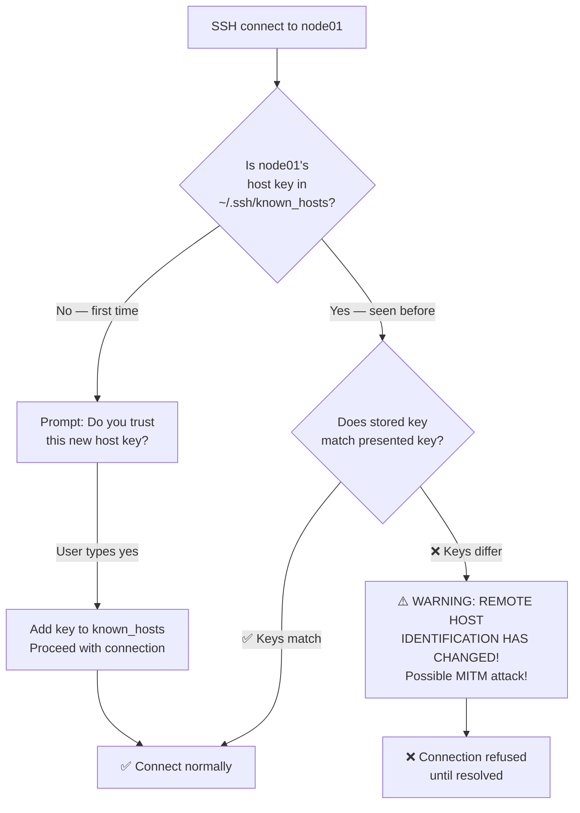
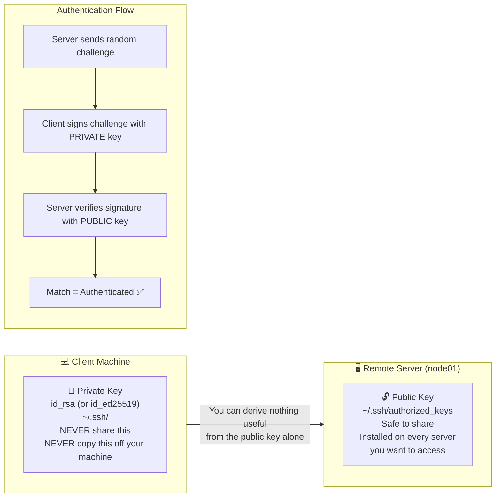
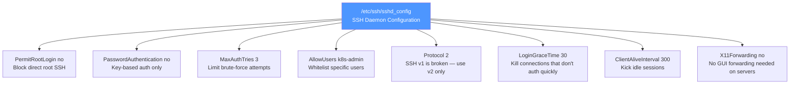
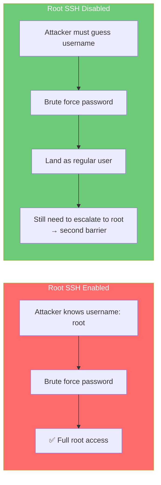
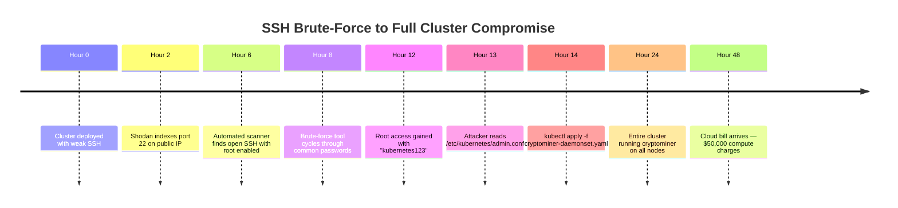
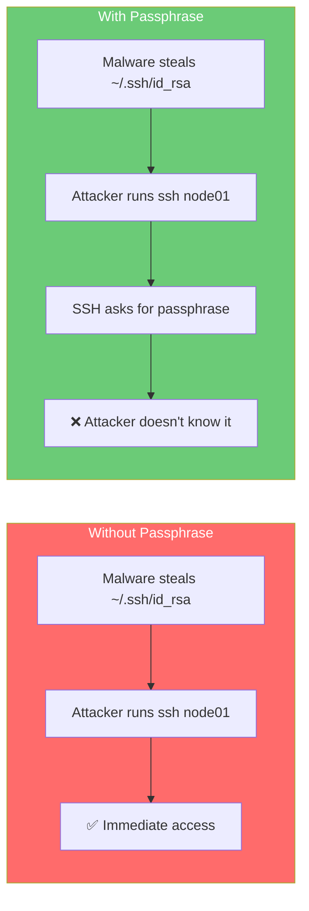
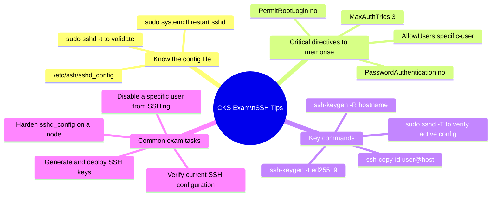
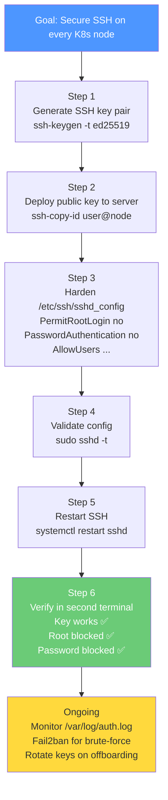

# 2 — SSH Hardening

> **What you'll learn:** What SSH is, how it works under the hood, why default SSH configuration is insecure, how to set up key-based authentication, how to harden `sshd_config` for production Kubernetes nodes, and what real attacks exploit weak SSH setups.

---

## Table of Contents

1. [What is SSH?](#1-what-is-ssh)
2. [How SSH Works — The Handshake](#2-how-ssh-works--the-handshake)
3. [Basic SSH Connection](#3-basic-ssh-connection)
4. [SSH Key Pairs — The Secure Way](#4-ssh-key-pairs--the-secure-way)
5. [Generating an SSH Key Pair](#5-generating-an-ssh-key-pair)
6. [Copying the Public Key to the Remote Server](#6-copying-the-public-key-to-the-remote-server)
7. [Hardening the SSH Configuration](#7-hardening-the-ssh-configuration)
8. [Full sshd_config Hardening Reference](#8-full-sshd_config-hardening-reference)
9. [SSH Agent and Key Management](#9-ssh-agent-and-key-management)
10. [Monitoring SSH Access](#10-monitoring-ssh-access)
11. [Real-World Scenarios](#11-real-world-scenarios)
12. [Common Mistakes & Gotchas](#12-common-mistakes--gotchas)
13. [CKS Exam Tips](#13-cks-exam-tips)

---

## 1. What is SSH?

**SSH (Secure Shell)** is a cryptographic network protocol that provides a secure channel over an unsecured network. It is the standard way to remotely administer Linux servers — including every Kubernetes node.

Before SSH existed, administrators used `telnet` and `rsh` to manage remote servers. These protocols sent everything — including **passwords** — in **plain text**. Anyone on the same network could capture the traffic and read credentials.



SSH replaced these insecure protocols and provides:

| Feature | What It Does |
|---|---|
| **Encryption** | All traffic is encrypted — passwords, commands, output |
| **Authentication** | Verify the identity of both client and server |
| **Integrity** | Detect if traffic is tampered with in transit |
| **Port Forwarding** | Tunnel other protocols securely through SSH |
| **Remote Execution** | Run commands on remote machines |
| **File Transfer** | SCP and SFTP for secure file transfer |

### SSH in the Context of Kubernetes

Every Kubernetes node (control plane and worker) runs the SSH daemon (`sshd`). Operators use SSH to:
- Access nodes for troubleshooting
- Inspect kubelet logs and config
- Apply OS-level patches
- Run `crictl` to manage containers directly

**This makes SSH a critical attack surface.** If an attacker gains SSH access to a control-plane node, they potentially own the entire cluster.

```mermaid
flowchart TD
    ATTK[🔴 Attacker]
    SSH[Weak SSH on Control Plane Node]
    ETCD[etcd — all cluster secrets]
    KUBECONFIG[/etc/kubernetes/admin.conf\ncluster-admin kubeconfig]
    PKI[/etc/kubernetes/pki/\nAll cluster certificates + CA]
    KUBELET[Kubelet credentials\n→ pivot to all workers]

    ATTK -->|Brute force SSH| SSH
    SSH --> ETCD
    SSH --> KUBECONFIG
    SSH --> PKI
    SSH --> KUBELET

    style ATTK fill:#ff6b6b,color:#fff
    style SSH fill:#ff6b6b,color:#fff
```

---

## 2. How SSH Works — The Handshake

Understanding how SSH establishes a connection helps you understand *why* certain hardening steps matter.



### Why Key Auth is More Secure Than Passwords

| Factor | Password Auth | Key Auth |
|---|---|---|
| **Brute-forceable** | ✅ Yes — automated tools can guess millions of passwords | ❌ No — 2048/4096-bit key space is computationally infeasible |
| **Phishable** | ✅ Yes — users can be tricked into entering credentials | ❌ No — key never leaves your machine |
| **Network sniffable** | ✅ Partially — metadata leaks possible | ❌ No — private key never transmitted |
| **Reusable across sites** | ✅ Often — users reuse passwords | ❌ Usually not — keys are per-user/per-machine |
| **Compromised by data breach** | ✅ Yes — hashed passwords can be cracked | ❌ No — server only stores public key |
| **Requires memorisation** | ✅ Yes — forgotten passwords cause lockouts | ❌ No — key file handles it |

---

## 3. Basic SSH Connection

### Connecting to a Remote Server

```bash
# Basic connection — SSH uses your local username by default
ssh node01

# Specify a different remote username
ssh mark@node01

# Or use the -l flag
ssh -l mark node01

# Specify a non-standard port (default is 22)
ssh -p 2222 mark@node01

# Connect with verbose output (useful for debugging)
ssh -v mark@node01    # verbose
ssh -vv mark@node01   # more verbose
ssh -vvv mark@node01  # maximum verbosity — shows every step of handshake

# Run a single command without opening an interactive shell
ssh mark@node01 "systemctl status kubelet"

# Copy files securely with SCP
scp /local/file.txt mark@node01:/remote/path/
scp mark@node01:/remote/file.txt /local/path/

# Copy a directory recursively
scp -r /local/dir/ mark@node01:/remote/path/
```

### The `known_hosts` File — Server Verification

The first time you SSH to a server, you see:

```
The authenticity of host 'node01 (192.168.1.100)' can't be established.
ED25519 key fingerprint is SHA256:abc123xyz...
Are you sure you want to continue connecting (yes/no/[fingerprint])?
```

This is your client asking: "I've never seen this server before — do you trust it?"



```bash
# View your known hosts
cat ~/.ssh/known_hosts

# Remove a specific host (if you rebuilt the server and its key changed)
ssh-keygen -R node01

# Verify a host key fingerprint before accepting
ssh-keyscan node01 | ssh-keygen -lf -
```

> ⚠️ **Never blindly type `yes` without verifying the fingerprint.** In a production environment, distribute known host keys via configuration management (Ansible, Puppet) so SSH clients have pre-loaded trust anchors.

---

## 4. SSH Key Pairs — The Secure Way

An SSH key pair consists of two mathematically linked keys:



**The private key never leaves your machine.** Only the signature of a challenge is sent across the network — and a signature is useless without the original private key.

### Key Algorithm Comparison

| Algorithm | Key Size | Security | Speed | Recommended? |
|---|---|---|---|---|
| `RSA` | 2048 / 4096 bit | Good (2048), Strong (4096) | Slower | ✅ Yes, use 4096 |
| `ECDSA` | 256 / 384 / 521 bit | Strong | Fast | ✅ Yes |
| `Ed25519` | 256 bit (fixed) | Very strong | Fastest | ✅ **Best choice** |
| `DSA` | 1024 bit | Weak (deprecated) | N/A | ❌ Never use |

> **Use Ed25519** for new keys. It is smaller, faster, and more secure than RSA. Fall back to RSA-4096 only when older servers don't support Ed25519.

---

## 5. Generating an SSH Key Pair

### Generate a Key Pair

```bash
# Best practice: Ed25519 (modern, fast, secure)
ssh-keygen -t ed25519 -C "mark@laptop-work"

# RSA 4096 (for compatibility with older systems)
ssh-keygen -t rsa -b 4096 -C "mark@laptop-work"

# With custom file name (useful when you manage multiple keys)
ssh-keygen -t ed25519 -f ~/.ssh/k8s_node_key -C "k8s-node-access"
```

**Walking through the prompts:**

```
Generating public/private ed25519 key pair.

Enter file in which to save the key (/home/mark/.ssh/id_ed25519):
# Press Enter to accept default, or type a custom path

Enter passphrase (empty for no passphrase):
# STRONGLY recommended: enter a passphrase
# Even if your private key file is stolen, the attacker
# cannot use it without the passphrase

Enter same passphrase again:

Your identification has been saved in /home/mark/.ssh/id_ed25519
Your public key has been saved in /home/mark/.ssh/id_ed25519.pub

The key fingerprint is:
SHA256:PCRTdbxxzffzmi8uunjn5V/1LZCG0BvhVJYXBr9gYsE mark@laptop-work

The key's randomart image is:
+--[ED25519 256]--+
|      .o=oo+     |
|       +E=++     |
|      o * o=. o  |
|       = o*.o.   |
+----[SHA256]-----+
```

### Understanding What Was Created

```bash
# List the key files
ls -la ~/.ssh/
# id_ed25519      ← Private key (permissions MUST be 600)
# id_ed25519.pub  ← Public key (safe to share)

# View the public key (this is what goes on the server)
cat ~/.ssh/id_ed25519.pub
# ssh-ed25519 AAAAC3NzaC1lZDI1NTE5AAAA... mark@laptop-work

# Verify private key permissions (must be 600, otherwise SSH refuses to use it)
stat ~/.ssh/id_ed25519
# Should show: Access: (0600/-rw-------)

# Fix permissions if wrong
chmod 700 ~/.ssh
chmod 600 ~/.ssh/id_ed25519
chmod 644 ~/.ssh/id_ed25519.pub
```

> ⚠️ If your private key file has permissions wider than `600`, SSH will refuse to use it and print: `WARNING: UNPROTECTED PRIVATE KEY FILE!`

### Managing Multiple Keys

When you have different keys for different servers, use `~/.ssh/config` to map keys to hosts automatically:

```bash
# Create/edit SSH client config
vi ~/.ssh/config
```

```
# Kubernetes control plane
Host controlplane
    HostName 192.168.56.10
    User k8s-admin
    IdentityFile ~/.ssh/k8s_node_key
    Port 22

# Kubernetes worker nodes
Host node01 node02 node03
    HostName 192.168.56.1%n  # %n = last digit of hostname
    User k8s-admin
    IdentityFile ~/.ssh/k8s_node_key

# GitHub (different key)
Host github.com
    User git
    IdentityFile ~/.ssh/github_key
```

Now `ssh controlplane` automatically uses the right key and user.

---

## 6. Copying the Public Key to the Remote Server

### Method 1 — `ssh-copy-id` (Easiest)

```bash
# Copy your default public key to the remote server
ssh-copy-id mark@node01

# Copy a specific key
ssh-copy-id -i ~/.ssh/k8s_node_key.pub mark@node01

# Copy to a non-standard port
ssh-copy-id -p 2222 mark@node01
```

Behind the scenes, `ssh-copy-id` does this:

```bash
# What ssh-copy-id actually does:
cat ~/.ssh/id_ed25519.pub | ssh mark@node01 "mkdir -p ~/.ssh && chmod 700 ~/.ssh && cat >> ~/.ssh/authorized_keys && chmod 600 ~/.ssh/authorized_keys"
```

### Method 2 — Manual Copy

```bash
# On the client — display your public key
cat ~/.ssh/id_ed25519.pub
# Copy the entire output

# On the server — paste it into authorized_keys
mkdir -p ~/.ssh
chmod 700 ~/.ssh
echo "ssh-ed25519 AAAAC3Nza... mark@laptop" >> ~/.ssh/authorized_keys
chmod 600 ~/.ssh/authorized_keys
```

### Verify the Key Was Added

```bash
# On the server — confirm the key is there
cat ~/.ssh/authorized_keys

# Test key-based login from the client (should NOT ask for password)
ssh mark@node01
```

### The `authorized_keys` File Format

Each line in `authorized_keys` can have options:

```
# Simple public key
ssh-ed25519 AAAAC3... mark@laptop

# Restrict this key to only run one specific command (useful for backup scripts)
command="/usr/bin/backup.sh" ssh-ed25519 AAAAC3... backup-script

# Restrict to specific source IP only
from="192.168.1.50" ssh-ed25519 AAAAC3... restricted-key

# No port forwarding, no X11 for this key
no-port-forwarding,no-X11-forwarding ssh-ed25519 AAAAC3... limited-key
```

---

## 7. Hardening the SSH Configuration

The main SSH server configuration file is `/etc/ssh/sshd_config`. Every change here requires restarting the `sshd` service.



### Step 1 — Disable Root Login

```bash
sudo vi /etc/ssh/sshd_config
```

Find and change:

```
# Before (default — dangerous)
#PermitRootLogin prohibit-password

# After (hardened)
PermitRootLogin no
```

**Why?** The root account is the #1 target for brute-force attacks because its username is always known. Disabling root SSH means an attacker must first know a valid username AND compromise that account before attempting privilege escalation — two barriers instead of one.



### Step 2 — Disable Password Authentication

```
# Before (default — allows passwords)
#PasswordAuthentication yes

# After (keys only)
PasswordAuthentication no
```

> ⚠️ **Critical:** Only disable password authentication **after** you have confirmed key-based login works. If you disable passwords before adding your key to `authorized_keys`, you will lock yourself out of the server.

### Step 3 — Restrict Which Users Can SSH

```
# Only allow specific users
AllowUsers mark k8s-admin monitoring-bot

# Or restrict by group
AllowGroups ssh-users sre-team

# Deny specific users (even if they have keys)
DenyUsers guest temp-user contractor
```

### Step 4 — Restart and Verify

```bash
# Check your config file for syntax errors BEFORE restarting
sudo sshd -t
# If no output = no errors

# Restart the SSH daemon
sudo systemctl restart sshd

# Verify it's running
sudo systemctl status sshd

# Confirm the config loaded correctly
sudo sshd -T | grep -E 'permitrootlogin|passwordauthentication|allowusers'
```

> ⚠️ **Safety tip:** Always keep your **current SSH session open** while testing the new config. Open a **second terminal window** and try connecting with the new settings before closing the first. If something breaks, you still have the original session to fix it.

---

## 8. Full `sshd_config` Hardening Reference

Here is a production-hardened `sshd_config` for a Kubernetes node, with every directive explained:

```bash
# /etc/ssh/sshd_config — Hardened for Kubernetes Nodes
# Apply with: sudo systemctl restart sshd

# ── Protocol & Port ─────────────────────────────────────────────
# SSH protocol version (v1 is broken and must not be used)
Protocol 2

# Keep port 22, or change to a non-standard port to reduce scan noise
# Note: changing port is security through obscurity — not a real defence
Port 22

# ── Host Keys (server identity) ─────────────────────────────────
# Only allow modern key types (remove DSA and old RSA)
HostKey /etc/ssh/ssh_host_ed25519_key
HostKey /etc/ssh/ssh_host_rsa_key

# ── Authentication ───────────────────────────────────────────────
# CRITICAL: Disable root login entirely
PermitRootLogin no

# CRITICAL: Keys only — no passwords
PasswordAuthentication no

# Don't allow empty passwords (just in case)
PermitEmptyPasswords no

# Challenge-response auth (also password-based) — disable
ChallengeResponseAuthentication no

# Enable public key authentication
PubkeyAuthentication yes
AuthorizedKeysFile .ssh/authorized_keys

# Kerberos and GSSAPI — disable if not in use
KerberosAuthentication no
GSSAPIAuthentication no

# ── Access Control ───────────────────────────────────────────────
# Whitelist specific users who are allowed to SSH
AllowUsers k8s-admin monitoring-user

# Maximum attempts before disconnecting (prevent brute force)
MaxAuthTries 3

# Maximum concurrent unauthenticated connections
MaxStartups 5:50:10
# Format: start:rate:full
# 5 = allow 5 unauthenticated connections with 0% drop rate
# 50 = at 6th connection, start dropping at 50%
# 10 = reject all at 10 unauthenticated connections

# Time allowed to authenticate before being kicked
LoginGraceTime 30

# ── Session Settings ─────────────────────────────────────────────
# Send keepalive packets — detect dead connections
ClientAliveInterval 300   # Every 5 minutes
ClientAliveCountMax 2     # Disconnect after 2 missed keepalives (10 minutes idle)

# ── Forwarding (disable what you don't need) ─────────────────────
# No GUI forwarding (servers don't need X11)
X11Forwarding no

# Disable TCP port forwarding (prevent using SSH as a proxy/tunnel)
# Set to "yes" only if you specifically need it
AllowTcpForwarding no

# Disable agent forwarding (prevent key forwarding attacks)
AllowAgentForwarding no

# Disable SSH tunneling
PermitTunnel no

# ── Logging ──────────────────────────────────────────────────────
# Log authentication events (INFO = default, VERBOSE = more detail)
SyslogFacility AUTH
LogLevel VERBOSE

# ── Security Hardening ───────────────────────────────────────────
# Only allow modern ciphers (remove old/weak ones)
Ciphers chacha20-poly1305@openssh.com,aes256-gcm@openssh.com,aes128-gcm@openssh.com,aes256-ctr,aes192-ctr,aes128-ctr

# Only allow strong MACs (message authentication codes)
MACs hmac-sha2-512-etm@openssh.com,hmac-sha2-256-etm@openssh.com,umac-128-etm@openssh.com

# Only allow modern key exchange algorithms
KexAlgorithms curve25519-sha256,curve25519-sha256@libssh.org,diffie-hellman-group16-sha512,diffie-hellman-group18-sha512

# Banner shown before login (legal warning — useful for compliance)
Banner /etc/ssh/banner.txt

# Don't reveal OS version in banner
DebianBanner no
```

### Create a Legal Warning Banner

```bash
sudo tee /etc/ssh/banner.txt <<'EOF'
*******************************************************************************
                    AUTHORISED ACCESS ONLY
This system is for authorised use only. All connections are monitored and
logged. Unauthorised access or use of this system is strictly prohibited
and may be subject to legal action.
*******************************************************************************
EOF
```

### Verify Your Hardened Config

```bash
# Check the effective configuration (what sshd is actually using)
sudo sshd -T

# Spot-check critical settings
sudo sshd -T | grep -E 'permitrootlogin|passwordauthentication|x11forwarding|allowusers|maxauthtries|allowtcpforwarding'

# Expected output:
# permitrootlogin no
# passwordauthentication no
# x11forwarding no
# allowusers k8s-admin monitoring-user
# maxauthtries 3
# allowtcpforwarding no
```

---

## 9. SSH Agent and Key Management

### SSH Agent — Avoid Typing Your Passphrase Repeatedly

If you protected your private key with a passphrase (recommended), typing it every connection gets tedious. `ssh-agent` stores your decrypted key in memory for the session:

```bash
# Start the SSH agent
eval "$(ssh-agent -s)"
# Output: Agent pid 12345

# Add your key to the agent (type passphrase once)
ssh-add ~/.ssh/id_ed25519

# List keys loaded in the agent
ssh-add -l

# Remove all keys from agent (when done)
ssh-add -D

# SSH will now use the agent automatically — no passphrase prompt
ssh node01
```

### Key Rotation

Keys should be rotated periodically, especially after staff changes:

```bash
# 1. Generate a new key pair
ssh-keygen -t ed25519 -f ~/.ssh/id_ed25519_new -C "mark@laptop-2024"

# 2. Add the new public key to the server
ssh-copy-id -i ~/.ssh/id_ed25519_new.pub mark@node01

# 3. Verify the new key works
ssh -i ~/.ssh/id_ed25519_new mark@node01

# 4. Remove the old key from authorized_keys on all servers
# Edit ~/.ssh/authorized_keys and delete the old key line

# 5. Replace local key files
mv ~/.ssh/id_ed25519_new ~/.ssh/id_ed25519
mv ~/.ssh/id_ed25519_new.pub ~/.ssh/id_ed25519.pub
```

---

## 10. Monitoring SSH Access

### Audit SSH Login Events

SSH logs authentication events to the system journal and `/var/log/auth.log`:

```bash
# View recent SSH authentication events (systemd-based systems)
sudo journalctl -u ssh --since "24 hours ago" | grep -E 'Accepted|Failed|Invalid'

# View auth.log (traditional)
sudo tail -f /var/log/auth.log | grep -E 'sshd.*Accepted|sshd.*Failed'

# Find failed login attempts (brute-force detection)
sudo grep "Failed password" /var/log/auth.log | awk '{print $11}' | sort | uniq -c | sort -rn | head -10

# Find successful logins
sudo grep "Accepted publickey" /var/log/auth.log | tail -20

# Find which IPs are failing most (potential attackers)
sudo grep "Invalid user" /var/log/auth.log | awk '{print $10}' | sort | uniq -c | sort -rn

# Count failed attempts per source IP
sudo grep "Failed password" /var/log/auth.log | awk '{print $13}' | sort | uniq -c | sort -rn
```

### Fail2Ban — Automatic Brute-Force Protection

`fail2ban` automatically blocks IPs that repeatedly fail authentication:

```bash
# Install fail2ban
sudo apt install fail2ban -y

# Create a local jail config (don't edit the main fail2ban.conf)
sudo tee /etc/fail2ban/jail.local <<'EOF'
[sshd]
enabled = true
port = ssh
filter = sshd
logpath = /var/log/auth.log
maxretry = 3        # Ban after 3 failed attempts
findtime = 600      # Within 10 minutes
bantime = 3600      # Ban for 1 hour
EOF

sudo systemctl enable fail2ban
sudo systemctl start fail2ban

# Check banned IPs
sudo fail2ban-client status sshd

# Manually unban an IP
sudo fail2ban-client set sshd unbanip 1.2.3.4
```

---

## 11. Real-World Scenarios

### Scenario 1 — The Shodan Cluster (Real-World Pattern)

**Situation:** A startup deploys Kubernetes on cloud VMs with public IPs. Port 22 is open on all nodes. Root login is enabled. Password is `kubernetes123`. Within 48 hours, automated scanners (like Shodan bots) discover the cluster, brute-force root access, and install a cryptominer.

**Timeline of compromise:**



**Prevention — all from this chapter:**

```bash
# 1. Keys only — no passwords
PasswordAuthentication no

# 2. No root login
PermitRootLogin no

# 3. Fail2ban blocks scanners
# (configured above)

# 4. UFW blocks SSH from internet — only allow from VPN/bastion
sudo ufw default deny incoming
sudo ufw allow from 10.0.0.0/8 to any port 22   # Internal only
```

---

### Scenario 2 — Insider Threat via Shared Key

**Situation:** A team of 5 DevOps engineers all share the same private key to access Kubernetes nodes. One engineer leaves the company. The team forgets to rotate the key. Three months later, the former employee — now at a competitor — uses the key to exfiltrate configuration data.

**Fix — per-person keys and immediate revocation:**

```bash
# Each engineer has their own key
# engineer1@company: ssh-ed25519 AAAA...aaa
# engineer2@company: ssh-ed25519 AAAA...bbb

# When engineer1 leaves, remove ONLY their key from authorized_keys
# All other engineers are unaffected

# Script to remove a specific user's key from all nodes
for node in node01 node02 node03 controlplane; do
    ssh k8s-admin@$node "sed -i '/engineer1@company/d' ~/.ssh/authorized_keys"
    echo "Removed engineer1's key from $node"
done
```

**Golden rule:** One key per person. Revoke immediately on offboarding.

---

### Scenario 3 — SSH Key Stolen via Malware

**Situation:** A developer's laptop is infected with malware that exfiltrates `~/.ssh/id_rsa`. The attacker uses the stolen key to SSH into production Kubernetes nodes. Because the key had no passphrase, no password was needed.

**Why a passphrase would have helped:**



**Additional fix — restrict key to specific source IP:**

```bash
# In ~/.ssh/authorized_keys on the server:
from="10.0.1.50,10.0.1.51" ssh-ed25519 AAAAC3... mark@laptop
# Even if the key is stolen, it only works from the developer's IP
```

---

## 12. Common Mistakes & Gotchas

| Mistake | Consequence | Fix |
|---|---|---|
| Disabling password auth before testing key login | Locked out of server | Always test key login in a second terminal before disabling passwords |
| Using RSA-1024 or DSA keys | Weak encryption — breakable | Use Ed25519 or RSA-4096 |
| Private key with `chmod 644` | SSH refuses to use key (`UNPROTECTED PRIVATE KEY FILE`) | `chmod 600 ~/.ssh/id_ed25519` |
| Sharing private keys between team members | One person leaves → key can't be selectively revoked | One key per person, always |
| No passphrase on private key | Stolen laptop = immediate server access | Always set a passphrase |
| Root login enabled | #1 brute-force target (username always known) | `PermitRootLogin no` |
| No `AllowUsers` directive | Any system account could potentially SSH in | Whitelist with `AllowUsers` |
| Forgetting to `systemctl restart sshd` after config change | Changes don't take effect | Always restart after editing `sshd_config` |
| Not validating config with `sshd -t` before restart | Syntax error → SSH daemon fails to start → locked out | Always run `sudo sshd -t` first |
| Port 22 open to the internet on cloud nodes | Constant brute-force attempts in logs | Restrict to VPN/bastion IPs using UFW or cloud security groups |

---

## 13. CKS Exam Tips



### Quick Reference — The Five Minimum SSH Hardening Steps

```bash
# 1. Generate and deploy your key
ssh-keygen -t ed25519
ssh-copy-id user@node

# 2. Edit /etc/ssh/sshd_config
PermitRootLogin no
PasswordAuthentication no
AllowUsers your-username
MaxAuthTries 3

# 3. Validate config syntax
sudo sshd -t

# 4. Restart SSH daemon
sudo systemctl restart sshd

# 5. Verify (in a second terminal!)
ssh your-username@node   # Should work with key, no password
ssh root@node            # Should be rejected
```

---

## Summary



| Concept | Key Point |
|---|---|
| **What is SSH** | Encrypted remote shell — replaces insecure telnet/rsh |
| **Why harden SSH** | K8s control plane compromise = full cluster compromise |
| **Password vs Keys** | Keys are not brute-forceable, phishable, or reusable across breaches |
| **Key generation** | `ssh-keygen -t ed25519` — always add a passphrase |
| **Deploy public key** | `ssh-copy-id user@server` → appends to `~/.ssh/authorized_keys` |
| **Root login** | `PermitRootLogin no` — always, no exceptions |
| **Password auth** | `PasswordAuthentication no` — only after confirming key works |
| **Validate config** | `sudo sshd -t` before every restart |
| **Monitor** | `/var/log/auth.log` for failed attempts, fail2ban for automation |
