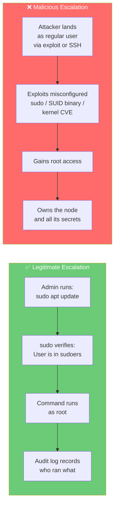
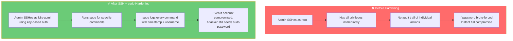
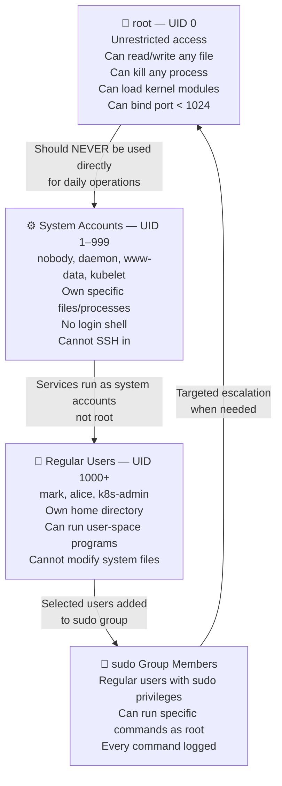
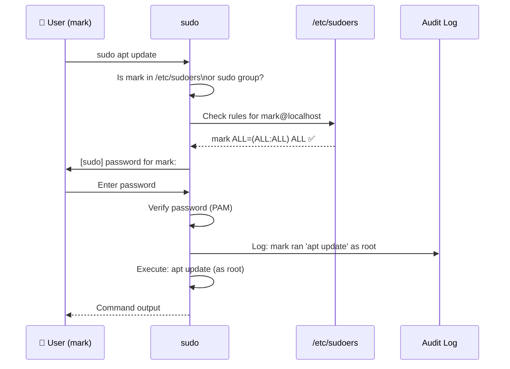
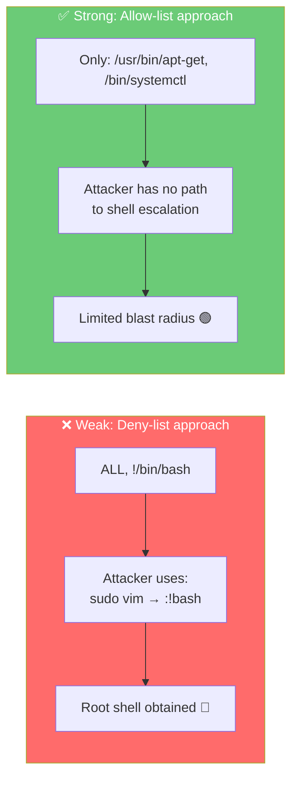
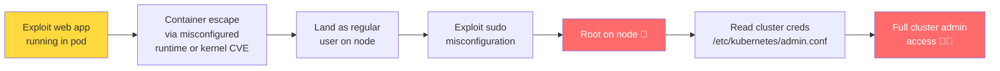
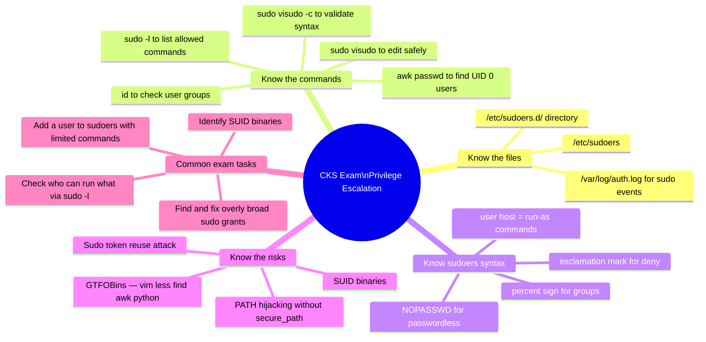
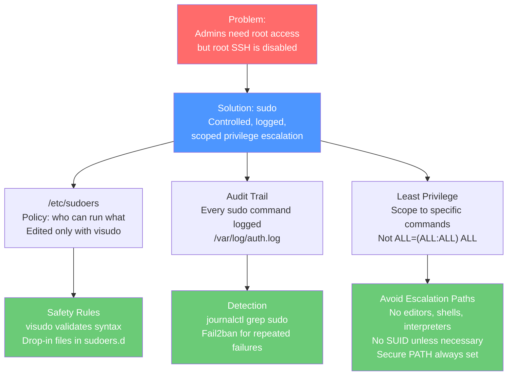

# 3 — Privilege Escalation in Linux

> **What you'll learn:** What privilege escalation is, why it's both necessary for admins and dangerous when abused, how `sudo` works internally, how to configure `/etc/sudoers` safely, how to audit privilege use, and how attackers exploit misconfigured sudo to compromise Kubernetes nodes.

---

## Table of Contents

1. [What is Privilege Escalation?](#1-what-is-privilege-escalation)
2. [Why Root Still Matters — Even Without Root SSH](#2-why-root-still-matters--even-without-root-ssh)
3. [The Linux User Privilege Model](#3-the-linux-user-privilege-model)
4. [Using sudo — The Right Way to Escalate](#4-using-sudo--the-right-way-to-escalate)
5. [Understanding the /etc/sudoers File](#5-understanding-the-etcsudoers-file)
6. [sudoers Syntax — Deep Dive](#6-sudoers-syntax--deep-dive)
7. [Editing sudoers Safely with visudo](#7-editing-sudoers-safely-with-visudo)
8. [Common sudo Patterns for Kubernetes Nodes](#8-common-sudo-patterns-for-kubernetes-nodes)
9. [sudo Logging and Auditing](#9-sudo-logging-and-auditing)
10. [How Attackers Abuse Privilege Escalation](#10-how-attackers-abuse-privilege-escalation)
11. [Real-World Scenarios](#11-real-world-scenarios)
12. [Common Mistakes & Gotchas](#12-common-mistakes--gotchas)
13. [CKS Exam Tips](#13-cks-exam-tips)

---

## 1. What is Privilege Escalation?

**Privilege escalation** is the process of gaining higher-level permissions than what was originally granted. In Linux, this almost always means going from a regular user to **root** (UID 0) — the superuser with unrestricted access to everything on the system.

There are two kinds:



Both use the same underlying mechanisms. The difference is **intent** and **authorisation**. Hardening privilege escalation means making legitimate escalation controlled and audited, while making malicious escalation as hard as possible.

### Why Privilege Escalation Matters in Kubernetes

A Kubernetes node holds extremely sensitive material:

| File / Path | What It Contains | Impact If Root Gained |
|---|---|---|
| `/etc/kubernetes/admin.conf` | Cluster-admin kubeconfig | Full kubectl access to entire cluster |
| `/etc/kubernetes/pki/` | All cluster TLS certificates + CA private key | Can issue certs for any identity |
| `/var/lib/etcd/` | All cluster state including secrets | Dump all Kubernetes secrets |
| `/var/lib/kubelet/` | Node credentials + pod specs | Pivot to all pods on node |
| `/run/containerd/` | Container runtime socket | Escape any container on node |
| `/proc/` | Running process memory | Extract secrets from running pods |

Getting root on any Kubernetes node is therefore a critical security event — not just a node-level compromise.

---

## 2. Why Root Still Matters — Even Without Root SSH

In the previous chapter we disabled SSH root login. But administrative tasks still need elevated access. The solution is a **controlled escalation path**:



**The principle:** regular users operate with minimal privileges. They escalate *only* for specific tasks, *only* using approved commands, and *every escalation is logged*.

---

## 3. The Linux User Privilege Model

Linux organises users into a simple but powerful privilege system:



### Checking User Information

```bash
# Who am I?
whoami

# What is my UID, GID, and groups?
id
# uid=1001(mark) gid=1001(mark) groups=1001(mark),27(sudo)

# What users exist on this system?
cat /etc/passwd
# Format: username:password:UID:GID:comment:home:shell

# Find all users with login shells (actual human accounts)
grep -v '/nologin\|/false' /etc/passwd

# Find all users with UID 0 (should only be root!)
awk -F: '($3 == "0") {print $1}' /etc/passwd

# What groups does a user belong to?
groups mark
id mark

# Who is in the sudo group?
getent group sudo
grep -i 'sudo\|wheel\|admin' /etc/group
```

---

## 4. Using sudo — The Right Way to Escalate

`sudo` stands for **"superuser do"** (originally "substitute user do"). It allows an authorised user to run a specific command as root (or another user) without switching to that user's shell.

### sudo vs su vs su -

| Command | What It Does | When to Use | Risk |
|---|---|---|---|
| `sudo <command>` | Run ONE command as root | Targeted privilege escalation | Low — scoped |
| `sudo -i` | Open a root shell (login shell) | Extended root session | High — all commands as root |
| `sudo -s` | Open a root shell (current env) | Extended root session | High |
| `su -` | Switch entirely to root (needs root password) | Avoid — root password required | Very high |
| `su - username` | Switch to another user | Debugging as another user | Medium |

```bash
# ✅ Good — run ONE specific command as root
sudo apt update

# ✅ Good — run as a specific other user
sudo -u postgres psql

# ⚠️ Acceptable for extended maintenance (but log out immediately after)
sudo -i   # Opens root shell

# ❌ Avoid in production — requires root password, no audit per-command
su -
```

### How sudo Decides to Allow a Command



```bash
# Install a package — without sudo you get permission denied
apt install nginx
# E: Could not open lock file /var/lib/dpkg/lock-frontend - open (13: Permission denied)
# E: Unable to acquire the dpkg frontend lock, are you root?

# With sudo — prompts for YOUR password (not root's)
sudo apt install nginx
# [sudo] password for mark:
# Reading package lists... Done
# ...

# Check what sudo commands you are allowed to run
sudo -l
# Matching Defaults entries for mark on node01:
#     env_reset, mail_badpass
# User mark may run the following commands on node01:
#     (ALL : ALL) ALL
```

---

## 5. Understanding the /etc/sudoers File

The `/etc/sudoers` file is the central policy document that controls who can use `sudo`, what they can run, and as which user.

```bash
cat /etc/sudoers
```

```
# User privilege specification
root    ALL=(ALL:ALL) ALL

# Members of the admin group may gain root privileges
%admin ALL=(ALL) ALL

# Allow members of group sudo to execute any command
%sudo   ALL=(ALL:ALL) ALL

# Allow mark to run any command
mark    ALL=(ALL:ALL) ALL

# Allow sarah to reboot the system only
sarah localhost=/usr/bin/shutdown -r now

# Include additional rules from /etc/sudoers.d/
#include /etc/sudoers.d
```

### Field-by-Field Breakdown

```
mark    ALL=(ALL:ALL)    ALL
 │       │     │    │    │
 │       │     │    │    └─ Commands allowed (ALL = any command)
 │       │     │    └────── Run-as group (ALL = any group)
 │       │     └─────────── Run-as user (ALL = any user, including root)
 │       └───────────────── Hosts where this rule applies (ALL = all hosts)
 └───────────────────────── Who this rule applies to
```

### Annotated sudoers Excerpt

```
# root can run anything, as anyone, on any host
root    ALL=(ALL:ALL) ALL

# Members of the %admin group can run anything
# % prefix = this is a group, not a user
%admin  ALL=(ALL) ALL

# Members of %sudo group can run anything
%sudo   ALL=(ALL:ALL) ALL

# mark can run any command as any user
mark    ALL=(ALL:ALL) ALL

# sarah can ONLY run shutdown -r now, and only on localhost
# This is Least Privilege in action!
sarah   localhost=/usr/bin/shutdown -r now

# bob can run apt-get as root, without a password
bob     ALL=(root) NOPASSWD: /usr/bin/apt-get

# Backup script can run rsync as root without password (for automation)
backupuser  ALL=(root) NOPASSWD: /usr/bin/rsync

# The monitoring group can read logs but nothing else
%monitoring ALL=(root) NOPASSWD: /usr/bin/journalctl, /bin/cat /var/log/*
```

### The `#include /etc/sudoers.d` Pattern

Instead of editing the main sudoers file directly, you can drop separate files into `/etc/sudoers.d/`:

```bash
# List existing drop-in files
ls /etc/sudoers.d/

# Create a new file for a specific user/role
sudo visudo -f /etc/sudoers.d/k8s-admin
```

```
# /etc/sudoers.d/k8s-admin
k8s-admin ALL=(root) NOPASSWD: /usr/bin/kubectl, /usr/bin/crictl, /usr/bin/kubeadm
```

This is cleaner and safer — you can remove a user's privileges by deleting one file without touching the main sudoers.

---

## 6. sudoers Syntax — Deep Dive

### Host Aliases, User Aliases, Command Aliases

For large environments, aliases help manage complex sudoers policies:

```
# Define groups of hosts
Host_Alias  KUBERNETES_NODES = node01, node02, node03
Host_Alias  CONTROL_PLANES   = cp01, cp02, cp03

# Define groups of users
User_Alias  K8S_ADMINS    = alice, bob, charlie
User_Alias  K8S_READONLY  = dave, eve
User_Alias  MONITORING    = prometheus-agent, datadog-agent

# Define groups of commands
Cmnd_Alias  K8S_CMDS      = /usr/bin/kubectl, /usr/bin/crictl, /usr/bin/kubeadm
Cmnd_Alias  SYSTEM_CMDS   = /bin/systemctl, /usr/bin/journalctl
Cmnd_Alias  DANGER_CMDS   = /bin/rm, /usr/bin/dd, /bin/mkfs

# Apply the aliases
K8S_ADMINS   KUBERNETES_NODES = (root) K8S_CMDS, SYSTEM_CMDS
K8S_READONLY KUBERNETES_NODES = (root) NOPASSWD: /usr/bin/kubectl get *, /usr/bin/kubectl describe *

# Never allow danger commands via sudo — not even for admins
K8S_ADMINS   ALL = !DANGER_CMDS
```

### The NOPASSWD Option

```
# Run specific commands without entering password
# Useful for: automation, monitoring agents, CI/CD
bob   ALL=(root) NOPASSWD: /usr/bin/apt-get update, /usr/bin/apt-get upgrade
```

> ⚠️ **Use NOPASSWD sparingly.** It removes the second factor of sudo (the password check). Only use it for automated scripts running as dedicated service accounts — never for human interactive users.

### Restricting Specific Dangerous Commands

```
# Allow everything EXCEPT these dangerous commands (! prefix = deny)
alice   ALL=(ALL:ALL) ALL, !/bin/su, !/usr/bin/passwd root, !/bin/bash
```

> ⚠️ **The negation bypass gotcha:** restricting with `!` can often be bypassed. For example, if you deny `/bin/bash` but allow `/usr/bin/vim`, an attacker can open a shell inside vim with `:!bash`. True least privilege means granting only specific commands, not denying specific ones from a broad grant.



### Defaults — Fine-Tuning sudo Behaviour

```
# Require password re-entry after 5 minutes (default is 15)
Defaults  timestamp_timeout=5

# Log all sudo commands to syslog
Defaults  log_output
Defaults  logfile="/var/log/sudo.log"

# Prevent shell escapes from allowed commands
Defaults  restricted

# Show a custom warning when sudo is used
Defaults  lecture=always
Defaults  lecture_file=/etc/sudo_lecture

# Require a TTY (prevent sudo from being run in non-interactive scripts)
Defaults  requiretty

# Preserve the user's PATH (sometimes needed for scripts)
Defaults  secure_path="/usr/local/sbin:/usr/local/bin:/usr/sbin:/usr/bin:/sbin:/bin"
```

---

## 7. Editing sudoers Safely with visudo

**Never** edit `/etc/sudoers` with a regular text editor. Use `visudo`.

```bash
# ✅ Correct way — always use visudo
sudo visudo

# Edit a drop-in file
sudo visudo -f /etc/sudoers.d/k8s-admin

# Check sudoers syntax without opening an editor
sudo visudo -c
# /etc/sudoers: parsed OK
```

### Why `visudo` Is Mandatory

```mermaid
flowchart LR
    subgraph NANO["❌ Using nano/vi directly"]
        N1[Edit /etc/sudoers]
        N2[Make a typo:\nmark ALL=(ALL::ALL) ALL]
        N3[Save file]
        N4[Syntax error in sudoers]
        N5[sudo stops working entirely]
        N6[Locked out — no way to fix\nwithout root password or boot rescue]
        N1 --> N2 --> N3 --> N4 --> N5 --> N6
    end

    subgraph VISUDO["✅ Using visudo"]
        V1[Edit /etc/sudoers via visudo]
        V2[Make a typo]
        V3[Try to save]
        V4[visudo detects syntax error]
        V5[Refuses to save the broken file]
        V6[Prompts: fix or abort]
        V7[Original file preserved ✅]
        V1 --> V2 --> V3 --> V4 --> V5 --> V6 --> V7
    end

    style NANO fill:#ff6b6b,color:#fff
    style VISUDO fill:#6bcb77,color:#fff
```

`visudo` validates the file before saving. A syntax error in sudoers can **completely disable sudo** on the system — and if root SSH is also disabled (which we did in Chapter 2), you may have no way back in without a console or rescue boot.

### Emergency Recovery

If you do break sudoers and lock yourself out:

```bash
# Option 1: If you have another terminal as root still open
# Just fix the file directly

# Option 2: Boot into single-user/recovery mode
# Grub menu → Advanced options → Recovery mode → root shell
# Mount filesystem read-write
mount -o remount,rw /
# Fix /etc/sudoers
visudo
# Or restore from backup
cp /etc/sudoers.bak /etc/sudoers

# Option 3: Cloud provider console access
# Most cloud providers offer a console (AWS Systems Manager, GCP Serial Console)
# This bypasses SSH entirely
```

---

## 8. Common sudo Patterns for Kubernetes Nodes

### Pattern 1 — Full Admin (CKS Lab / Emergency Only)

```
k8s-admin   ALL=(ALL:ALL) ALL
```

Only for designated cluster administrators. Avoid in shared or multi-tenant environments.

### Pattern 2 — Kubernetes Operator (Day-to-Day Operations)

```
k8s-operator  ALL=(root) NOPASSWD: /usr/bin/kubectl
k8s-operator  ALL=(root) /bin/systemctl restart kubelet
k8s-operator  ALL=(root) /usr/bin/crictl
k8s-operator  ALL=(root) NOPASSWD: /usr/bin/journalctl -u kubelet
```

Can manage workloads and restart the kubelet, but cannot modify system-level config or install packages.

### Pattern 3 — Monitoring Agent (Read-Only, No Password)

```
prometheus   ALL=(root) NOPASSWD: /usr/bin/journalctl, /bin/cat /proc/*, /usr/bin/ss
datadog      ALL=(root) NOPASSWD: /usr/bin/journalctl, /usr/bin/ps aux
```

Monitoring agents need to read system state but should never modify anything.

### Pattern 4 — Patch Management (Targeted Package Operations)

```
patch-bot    ALL=(root) NOPASSWD: /usr/bin/apt-get update, /usr/bin/apt-get upgrade -y, /usr/bin/apt-get autoremove -y
patch-bot    ALL=(root) NOPASSWD: /bin/systemctl restart *, /bin/systemctl status *
```

### Pattern 5 — Audit-Only (Log Reader)

```
auditor   ALL=(root) NOPASSWD: /usr/bin/journalctl, /bin/cat /var/log/auth.log, /bin/cat /var/log/syslog
auditor   ALL=(root) NOPASSWD: /usr/bin/last, /usr/bin/lastlog, /usr/bin/who
```

---

## 9. sudo Logging and Auditing

Every `sudo` invocation is logged. This is one of sudo's biggest security advantages over direct root login — you always know who ran what.

### Where sudo Logs Go

```bash
# sudo logs to syslog/journald by default
# View recent sudo activity
sudo journalctl | grep sudo

# On systems with /var/log/auth.log
sudo grep 'sudo' /var/log/auth.log

# View sudo log with all context
sudo journalctl -u sudo --since "24 hours ago"
```

**Sample sudo log entries:**

```
# Successful command
Jul 29 08:15:33 node01 sudo[1234]: mark : TTY=pts/0 ; PWD=/home/mark ; USER=root ; COMMAND=/usr/bin/apt-get update

# Failed authentication (wrong password)
Jul 29 08:16:01 node01 sudo[1235]: mark : 3 incorrect password attempts ; TTY=pts/0 ; PWD=/home/mark ; USER=root ; COMMAND=/usr/bin/apt-get update

# Command not in sudoers
Jul 29 08:17:45 node01 sudo[1236]: mark : command not allowed ; TTY=pts/0 ; PWD=/home/mark ; USER=root ; COMMAND=/bin/bash
```

### Enable Full Command Logging

Add to sudoers via visudo:

```bash
sudo visudo
```

```
# Log all sudo output to a dedicated log file
Defaults  log_output
Defaults  logfile="/var/log/sudo.log"
Defaults  log_input

# Keep sudo logs for 90 days
Defaults  logfile="/var/log/sudo.log"
```

### Audit Commands

```bash
# Who used sudo today?
sudo grep 'sudo' /var/log/auth.log | grep "$(date +%b %d)" | awk '{print $6}' | sort | uniq -c | sort -rn

# What commands were run via sudo?
sudo grep 'COMMAND' /var/log/auth.log | awk -F'COMMAND=' '{print $2}' | sort | uniq -c | sort -rn

# Which users failed sudo (wrong password or not in sudoers)?
sudo grep 'incorrect password\|not in sudoers\|not allowed' /var/log/auth.log

# Check if root shell was ever opened via sudo
sudo grep 'COMMAND=.*bash\|COMMAND=.*sh\b' /var/log/auth.log
```

---

## 10. How Attackers Abuse Privilege Escalation

Understanding attack techniques helps you configure defences properly.

### Attack 1 — sudo Misconfiguration (GTFOBins)

Many legitimate programs can be abused to escalate privileges when granted via sudo. This is documented at [gtfobins.github.io](https://gtfobins.github.io).

```mermaid
flowchart TD
    ATTK[Attacker lands as regular user]
    CHECK[sudo -l\nCheck what sudo is allowed]

    subgraph VULNERABLE["Common sudo Escapes (GTFOBins)"]
        VIM["sudo vim\n:!bash → root shell"]
        LESS["sudo less /etc/passwd\n!bash → root shell"]
        AWK["sudo awk 'BEGIN {system(\"/bin/bash\")}'\n→ root shell"]
        FIND["sudo find . -exec /bin/bash \\;\n→ root shell"]
        PYTHON["sudo python3 -c 'import os; os.system(\"/bin/bash\")'\n→ root shell"]
    end

    ATTK --> CHECK --> VULNERABLE
    VULNERABLE --> ROOT[Root shell obtained 🔴]

    style ATTK fill:#ff6b6b,color:#fff
    style ROOT fill:#ff6b6b,color:#fff
    style VULNERABLE fill:#ffd93d,color:#333
```

**Mitigation:** Never grant sudo to text editors, shells, interpreters, or `find`. Only grant sudo to purpose-specific, non-interactive binaries.

### Attack 2 — SUID Binary Exploitation

SUID (Set User ID) binaries run as the file owner (often root) regardless of who executes them:

```bash
# Find SUID binaries (legitimate ones exist — find non-standard ones)
find / -perm -4000 -type f 2>/dev/null

# Expected legitimate SUID binaries:
# /usr/bin/passwd  (needs root to modify /etc/shadow)
# /usr/bin/sudo    (needs root to check sudoers)
# /usr/bin/ping    (needs root to create raw sockets)

# Suspicious SUID binaries:
# /tmp/backdoor    ← definitely not expected
# /usr/local/bin/custom-script ← investigate!

# Remove SUID bit from a suspicious binary
chmod u-s /path/to/suspicious-binary

# Regularly audit for new SUID binaries
find / -perm -4000 -type f 2>/dev/null | tee /tmp/suid_audit_$(date +%Y%m%d).txt
# Compare with previous snapshot
diff /tmp/suid_audit_yesterday.txt /tmp/suid_audit_$(date +%Y%m%d).txt
```

### Attack 3 — PATH Hijacking via sudo

```bash
# If sudoers has Defaults !secure_path (dangerous!)
# And user can control PATH:
export PATH=/tmp:$PATH
cp /bin/bash /tmp/apt-get    # Create a fake 'apt-get' binary
sudo apt-get update          # sudo runs /tmp/apt-get as root!
```

**Mitigation:** Always set `Defaults secure_path` in sudoers to lock the PATH used by sudo.

### Attack 4 — Sudo Token Reuse

By default, sudo caches your authentication for 15 minutes (configurable). If an attacker gets code execution in your session within that window:

```bash
# Attacker injects into your active session and runs sudo without needing a password
# Because your sudo timestamp token is still valid

# Mitigation: reduce timestamp timeout
Defaults  timestamp_timeout=0   # Require password every time
# Or
Defaults  timestamp_timeout=5   # Require every 5 minutes
```

### The Escalation Chain on a K8s Node



Every step in this chain can be broken. Hardening sudo properly breaks the step from `NODE → ROOT`.

---

## 11. Real-World Scenarios

### Scenario 1 — The Over-Broad sudo Grant

**Situation:** A developer at a fintech company needs to check kubelet logs. The on-call engineer grants them:

```
dev-user   ALL=(ALL:ALL) ALL
```

The developer accidentally runs `sudo rm -rf /etc/kubernetes/` while trying to clean up something else. The control plane loses all its configuration and certificates.

**Prevention — scoped sudo:**

```
# Only allow reading kubelet logs — nothing destructive
dev-user   ALL=(root) NOPASSWD: /usr/bin/journalctl -u kubelet
dev-user   ALL=(root) NOPASSWD: /usr/bin/journalctl -u containerd
dev-user   ALL=(root) NOPASSWD: /usr/bin/kubectl get *, /usr/bin/kubectl describe *
```

**Lesson:** Even legitimate users with good intentions can cause catastrophic damage with overly broad sudo grants.

---

### Scenario 2 — GTFOBins Sudo Escape in Production

**Situation:** A security audit reveals that several Kubernetes worker nodes have this in sudoers:

```
deploy-user   ALL=(root) NOPASSWD: /usr/bin/vim
```

This was added so the deploy user could edit config files without a password. An attacker who compromises the `deploy-user` account (via a stolen SSH key) immediately has a path to root:

```bash
sudo vim /etc/hosts
# Inside vim, type:
:set shell=/bin/bash
:shell
# Now running as root
```

**Fix — replace vim with a purpose-built tool:**

```bash
# Remove vim from sudoers
# Use a dedicated config management approach instead
# If file editing is truly needed, use tee:
echo "new content" | sudo tee /etc/some-config
# tee has no shell escape capability
```

---

### Scenario 3 — Monitoring Agent Privilege Creep

**Situation:** A monitoring agent started with minimal sudo access. Over two years, on-call engineers kept adding permissions as needed:

```
# Original intent: read logs
prometheus   ALL=(root) NOPASSWD: /usr/bin/journalctl

# Added month 2: needed to restart exporter
prometheus   ALL=(root) NOPASSWD: /bin/systemctl

# Added month 6: needed to read proc
prometheus   ALL=(root) NOPASSWD: /bin/cat

# Added month 12: needed to check package versions
prometheus   ALL=(root) NOPASSWD: /usr/bin/apt-get
```

Now `prometheus` can restart any service, read any file (via `cat /etc/kubernetes/admin.conf`), and run `apt-get install` with root privilege. A compromised monitoring agent = full node compromise.

**Fix — periodic sudoers audit:**

```bash
# Review all sudo grants
sudo cat /etc/sudoers /etc/sudoers.d/*

# Identify what permissions each account actually needs
# Remove anything not actively used
# Apply principle of least privilege fresh — grant only what is needed today
```

---

## 12. Common Mistakes & Gotchas

| Mistake | Consequence | Fix |
|---|---|---|
| Editing `/etc/sudoers` with `vi` instead of `visudo` | Syntax error disables sudo entirely | Always use `sudo visudo` |
| Granting `ALL=(ALL:ALL) ALL` to service accounts | Service account compromise = full root | Scope commands specifically |
| Using deny-list (`!bash`) instead of allow-list | Bypassable via GTFOBins (vim, python, etc.) | Grant only specific commands |
| `NOPASSWD` for human interactive users | No second factor — silent privilege use | Reserve `NOPASSWD` for automation only |
| No `Defaults secure_path` | PATH hijacking possible | Always set `secure_path` |
| Granting sudo to interpreters (python, perl, awk) | Trivial shell escape | Never grant sudo to interpreters |
| Granting sudo to editors (vim, nano, less) | Shell escape via `!bash` | Use `tee` or `sed -i` instead |
| `timestamp_timeout` left at 15 minutes | Sudo token abuse within session | Set to 5 or 0 for sensitive nodes |
| Not auditing `/etc/sudoers.d/` | Permissions accumulate over time | Review monthly |
| Granting sudo to `find` or `cp` | Can read/write any file | Remove — use purpose-built tools |

---

## 13. CKS Exam Tips



### Quick Reference — sudoers Cheat Sheet

```bash
# Edit sudoers safely
sudo visudo

# Validate sudoers syntax without opening
sudo visudo -c

# Check what sudo can do as current user
sudo -l

# Check what sudo can do as a specific user
sudo -l -U mark

# Find who has sudo access
grep -r 'ALL' /etc/sudoers /etc/sudoers.d/ 2>/dev/null

# Find UID 0 accounts (should only be root)
awk -F: '($3 == "0") {print $1}' /etc/passwd

# Find SUID binaries
find / -perm -4000 -type f 2>/dev/null

# Check sudo log entries
grep 'sudo' /var/log/auth.log | tail -20
```

### The Least Privilege Sudoers Pattern

```
# ✅ Correct: specific user, specific host, specific commands, no shell escalation possible
k8s-operator  node01,node02,node03=(root) NOPASSWD: /usr/bin/kubectl, /bin/systemctl restart kubelet

# ❌ Wrong: everything allowed, everywhere, as any user
k8s-operator  ALL=(ALL:ALL) ALL
```

---

## Summary



| Concept | Key Point |
|---|---|
| **What is privilege escalation** | Gaining higher permissions than originally granted — legitimate or malicious |
| **Why sudo over su/root** | Scoped, logged, no root password shared, audit trail per command |
| **sudoers file** | `/etc/sudoers` — defines who can run what; always edit with `visudo` |
| **sudoers syntax** | `user host=(run-as) commands` — scope as narrowly as possible |
| **NOPASSWD** | Only for automation service accounts — never for human users |
| **GTFOBins danger** | Editors, shells, interpreters granted via sudo = trivial root escape |
| **SUID binaries** | Run as file owner — audit regularly, remove unexpected ones |
| **Audit trail** | Every sudo logged — grep `/var/log/auth.log` for investigation |
| **Emergency recovery** | Break sudoers = use rescue boot or cloud console — `visudo` prevents this |
