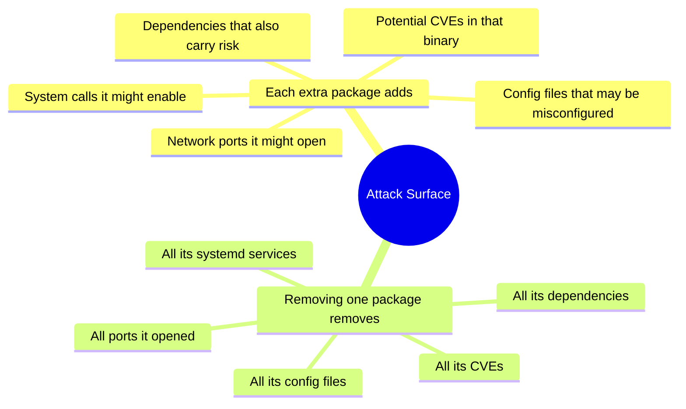
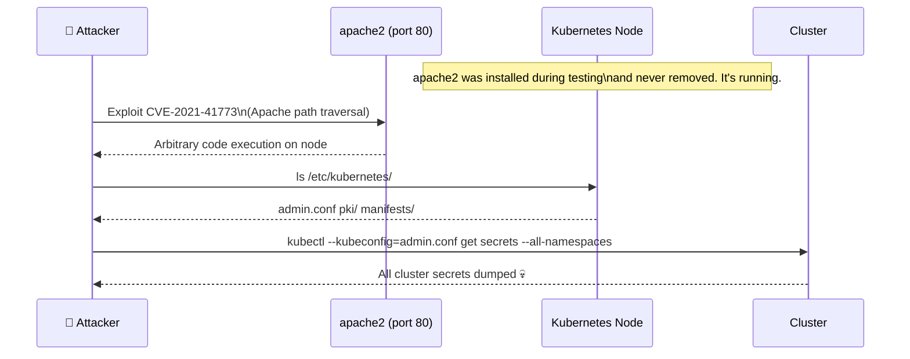
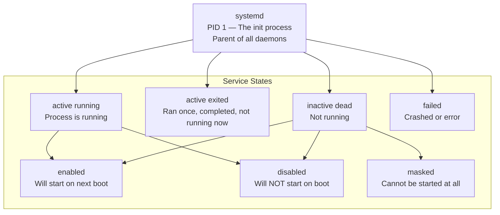
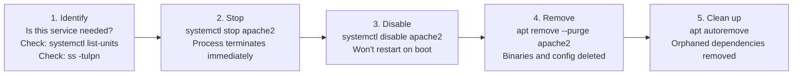
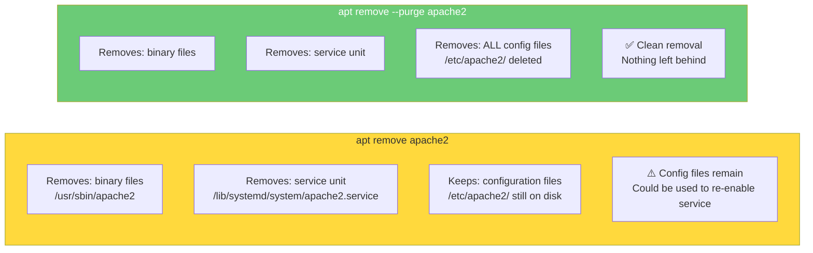
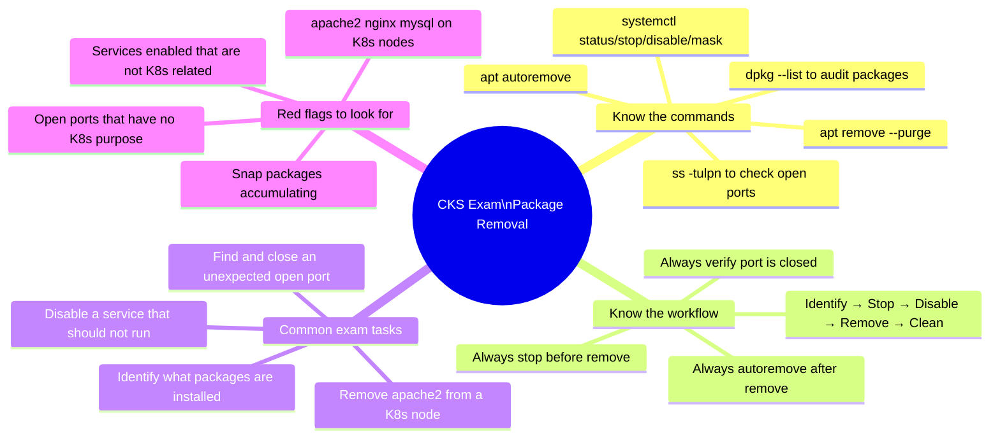
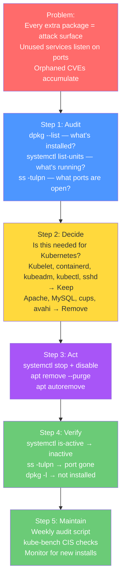

# 4 — Remove Obsolete Packages and Services

> **What you'll learn:** Why every unnecessary package is a security liability, how to audit what is installed and running on a Kubernetes node, how to safely stop, disable, and remove obsolete software using systemd and apt, and what a minimal Kubernetes node should look like.

---

## Table of Contents

1. [What is Attack Surface Reduction?](#1-what-is-attack-surface-reduction)
2. [Why Packages Accumulate and Why That's Dangerous](#2-why-packages-accumulate-and-why-thats-dangerous)
3. [What Should Be on a Kubernetes Node?](#3-what-should-be-on-a-kubernetes-node)
4. [Auditing Installed Packages](#4-auditing-installed-packages)
5. [Managing Services with systemd](#5-managing-services-with-systemd)
6. [Listing and Auditing Running Services](#6-listing-and-auditing-running-services)
7. [Disabling and Stopping Unnecessary Services](#7-disabling-and-stopping-unnecessary-services)
8. [Removing Packages with apt](#8-removing-packages-with-apt)
9. [Cleaning Up Orphaned Dependencies](#9-cleaning-up-orphaned-dependencies)
10. [Snap Packages — A Hidden Attack Surface](#10-snap-packages--a-hidden-attack-surface)
11. [Automating Audits — Keep It Clean Over Time](#11-automating-audits--keep-it-clean-over-time)
12. [Real-World Scenarios](#12-real-world-scenarios)
13. [Common Mistakes & Gotchas](#13-common-mistakes--gotchas)
14. [CKS Exam Tips](#14-cks-exam-tips)

---

## 1. What is Attack Surface Reduction?

Every piece of software running on a system is a potential entry point for an attacker. Every installed package — even if its service is not running — may contain exploitable code paths, configuration files, or binary vulnerabilities.

```mermaid
flowchart LR
    subgraph BLOATED["❌ Bloated Node"]
        S1[apache2\nListening on :80]
        S2[nginx\nInstalled but stopped]
        S3[mysql-server\nInstalled, not configured]
        S4[snapd\nRunning]
        S5[avahi-daemon\nmDNS broadcasting]
        S6[cups\nPrinting service]
        S7[bluetooth\nService]
        S8[kubelet\nRequired ✅]
        S9[containerd\nRequired ✅]
    end

    subgraph MINIMAL["✅ Minimal Node"]
        M1[kubelet\nRequired ✅]
        M2[containerd\nRequired ✅]
        M3[kubectl\nRequired ✅]
        M4[kubeadm\nRequired ✅]
        M5[sshd\nRequired & Hardened ✅]
    end

    BLOATED -->|"Remove everything\nnot in the required list"| MINIMAL

    style BLOATED fill:#ff6b6b,color:#fff
    style MINIMAL fill:#6bcb77,color:#fff
```



**The principle is simple:** if a package or service is not explicitly required for the node to perform its Kubernetes function, it should not be there.

### The Math of Attack Surface



---

## 2. Why Packages Accumulate and Why That's Dangerous


Packages end up on Kubernetes nodes for several common reasons:

| Reason | Example | Risk |
|---|---|---|
| **Golden image had extras** | VM template included `apache2` from previous web server use | Service running and listening on port 80 — not needed |
| **Dev tools left in prod** | `curl`, `wget`, `python3-pip` installed for debugging and never removed | Attacker can download malware directly from node |
| **"Just in case" installs** | `nmap`, `tcpdump` left by network troubleshooting | Reconnaissance tools already available to attacker |
| **Dependency pull-in** | Installing `X` pulled in `mysql-client` as a dependency | Extra code, extra CVE surface |
| **Snap preinstalled** | Ubuntu cloud images ship with `snapd` | Large daemon with broad privileges, attack surface |
| **Trial installs** | Someone tested `nginx` on a node, never cleaned up | Might still be listening on port 80 |

### A Real Vulnerability Chain



The apache2 service had nothing to do with Kubernetes. It was simply installed and forgotten. One unpatched CVE later — full cluster compromise.

---

## 3. What Should Be on a Kubernetes Node?

Use this as your baseline checklist. Everything NOT on this list is a candidate for removal.

### Control Plane Node — Required Software

| Package / Service | Purpose | Should Run? |
|---|---|---|
| `kubelet` | Node agent — manages pods | ✅ Always |
| `kubeadm` | Cluster lifecycle management | ✅ Yes |
| `kubectl` | CLI to interact with cluster | ✅ Yes |
| `containerd` or `cri-o` | Container runtime | ✅ Always |
| `sshd` | Remote administration (hardened) | ✅ Yes — hardened |
| `etcd` | Cluster datastore (control plane only) | ✅ Control plane only |
| `kube-apiserver` | API server (static pod) | ✅ Control plane only |
| `kube-controller-manager` | Controller loops (static pod) | ✅ Control plane only |
| `kube-scheduler` | Pod scheduling (static pod) | ✅ Control plane only |
| `ufw` or `iptables` | Node-level firewall | ✅ Yes |

### Worker Node — Required Software

| Package / Service | Purpose | Should Run? |
|---|---|---|
| `kubelet` | Node agent | ✅ Always |
| `kubeadm` | Node join / upgrade | ✅ Yes |
| `containerd` or `cri-o` | Container runtime | ✅ Always |
| `sshd` | Remote admin (hardened) | ✅ Yes — hardened |
| `ufw` or `iptables` | Node-level firewall | ✅ Yes |
| `kube-proxy` | Network rules (daemonset pod) | ✅ Runs as pod |
| `CNI plugin` | Pod networking (Calico/Cilium/etc.) | ✅ Runs as pod |

### What Should NOT Be on Any Kubernetes Node

| Package | Why Remove |
|---|---|
| `apache2`, `nginx` (standalone) | Not serving web traffic from the node itself |
| `mysql-server`, `postgresql` | Databases run in pods, not on host |
| `docker` (if using containerd) | Redundant container runtime, extra attack surface |
| `snapd` | Large daemon not needed for K8s |
| `cups` | Printing service — irrelevant on servers |
| `avahi-daemon` | mDNS discovery — broadcasts node info on network |
| `bluetooth` | Physical interface irrelevant on VMs/servers |
| `isc-dhcp-server` | DHCP server not needed |
| `nfs-server` | Unless explicitly needed for storage |
| `rpcbind` | Legacy RPC services |
| `telnet`, `ftp`, `rsh` | Insecure legacy protocols |
| `X11` / desktop packages | GUI on a server node |
| Build tools (`build-essential`, `gcc`) | Only needed during build, not runtime |

---

## 4. Auditing Installed Packages

Before removing anything, understand what is installed and why.

### List All Installed Packages

```bash
# List all installed packages (Debian/Ubuntu)
dpkg --list
dpkg -l   # Short form

# Example output:
# ii  apache2        2.4.41-4ubuntu3.10  amd64  Apache HTTP Server
# ii  containerd     1.6.12-0ubuntu1     amd64  An industry-standard container runtime
# ii  kubelet        1.29.0-00           amd64  Kubernetes Node Agent

# Count how many packages are installed
dpkg --list | wc -l

# Filter for a specific package
dpkg --list | grep apache
dpkg -l apache2

# Check if a specific package is installed
dpkg -l nginx 2>/dev/null | grep -c "^ii"
# 1 = installed, 0 = not installed

# List packages sorted by install size (find the big ones)
dpkg-query -Wf '${Installed-Size}\t${Package}\n' | sort -n | tail -20
```

### Check Package Details

```bash
# What does this package contain?
dpkg -L apache2
# Lists every file that was installed by apache2

# What installed a specific file?
dpkg -S /usr/sbin/apache2
# apache2: /usr/sbin/apache2

# Show package information
apt show apache2

# Check if a package is needed by anything else (reverse dependencies)
apt-cache rdepends apache2
```

### Find Packages That Were Auto-Installed (Pull-ins)

```bash
# Show automatically installed packages (dependencies that may now be orphaned)
apt-mark showmanual    # Manually installed packages
apt-mark showauto      # Automatically installed (can be removed if orphaned)

# Find packages that can be auto-removed (orphans)
apt autoremove --dry-run
```

---

## 5. Managing Services with systemd

Modern Linux (including Ubuntu and Debian) uses **systemd** as its init system and service manager. Every long-running process (daemon) is managed as a systemd **unit**.



### Key systemctl Commands

```bash
# ── Check service status ──────────────────────────────────────────
# Status of a specific service
systemctl status apache2
systemctl status kubelet

# ── Start / Stop / Restart ────────────────────────────────────────
sudo systemctl start apache2      # Start now
sudo systemctl stop apache2       # Stop now
sudo systemctl restart apache2    # Stop then start
sudo systemctl reload apache2     # Reload config without stopping (if supported)

# ── Enable / Disable (controls boot behaviour) ────────────────────
sudo systemctl enable apache2     # Start automatically on boot
sudo systemctl disable apache2    # Do NOT start on boot

# ── Both together ────────────────────────────────────────────────
sudo systemctl enable --now kubelet      # Enable AND start immediately
sudo systemctl disable --now apache2     # Disable AND stop immediately

# ── Mask (strongest disable — cannot be started at all) ──────────
sudo systemctl mask bluetooth            # Cannot start even manually
sudo systemctl unmask bluetooth          # Undo masking

# ── Reload systemd after adding/changing unit files ───────────────
sudo systemctl daemon-reload
```

### Understanding the Status Output

```bash
systemctl status apache2
```

```
● apache2.service - The Apache HTTP Server
     Loaded: loaded (/lib/systemd/system/apache2.service; enabled; vendor preset: enabled)
     ──────────────────────────────────────────────────────────
       ↑ Unit file found    ↑ Will start on boot    ↑ Default for this distro

    Drop-In: /lib/systemd/system/apache2.service.d
             └─apache2-system.conf
     Active: active (running) since Mon 2021-03-29 18:01:14 UTC; 1s ago
     ──────────────────────────────────────────────────────────
       ↑ Currently running   ↑ How long it has been running

    Process: 19026 ExecStart=/usr/sbin/apachectl start (code=exited, status=0/SUCCESS)
    Main PID: 19037 (apache2)
      CGroup: /system.slice/apache2.service
              ├─19037 /usr/sbin/apache2 -k start
              ├─19038 /usr/sbin/apache2 -k start
              └─19039 /usr/sbin/apache2 -k start
```

Key fields to check:

| Field | What to Look For |
|---|---|
| `Loaded` | `enabled` = starts on boot (suspicious if unexpected) |
| `Active` | `active (running)` = currently running and consuming resources |
| `Main PID` | The process ID — cross-check with `ss -tulpn` for port usage |
| `CGroup` | All child processes spawned by this service |

---

## 6. Listing and Auditing Running Services

### List All Services

```bash
# All service units (loaded into systemd)
systemctl list-units --type=service

# Only ACTIVE services (actually running right now)
systemctl list-units --type=service --state=active

# Only RUNNING services (active + process alive)
systemctl list-units --type=service --state=running

# All services including inactive and failed
systemctl list-units --type=service --all

# Services enabled to start on boot
systemctl list-unit-files --type=service --state=enabled
```

### Sample Output — What to Look For

```
UNIT                          LOAD   ACTIVE SUB     DESCRIPTION
apache2.service               loaded active running  The Apache HTTP Server      ← 🔴 Why is this here?
apparmor.service              loaded active exited   AppArmor initialization     ← ✅ Security tool
containerd.service            loaded active running  containerd container runtime ← ✅ Required
dbus.service                  loaded active running  D-Bus System Message Bus    ← ✅ System bus
docker.service                loaded active running  Docker Application Container ← ⚠️ Needed?
kubelet.service               loaded active running  kubelet: Kubernetes Node    ← ✅ Required
proxy.service                 loaded active running  kubectl proxy 8888          ← 🔴 Should not run always
avahi-daemon.service          loaded active running  Avahi mDNS/DNS-SD Stack     ← 🔴 Broadcasts node info
cups.service                  loaded active running  CUPS Printing Service       ← 🔴 Not a printer server
bluetooth.service             loaded active running  Bluetooth service           ← 🔴 No bluetooth on VM
snapd.service                 loaded active running  Snap Daemon                 ← ⚠️ Usually removable
```

### Cross-Reference with Open Ports

Every running service that listens on a network port is a direct attack surface. Always cross-check services with open ports:

```bash
# Show all listening ports and the process that owns them
ss -tulpn
# -t = TCP, -u = UDP, -l = listening, -p = show process, -n = numeric ports

# Older systems
netstat -tulpn

# Example output:
# Proto  Local Address    State   PID/Process
# tcp    0.0.0.0:80       LISTEN  19037/apache2   ← 🔴 apache2 listening on port 80!
# tcp    0.0.0.0:22       LISTEN  1234/sshd       ← ✅ SSH (hardened)
# tcp    0.0.0.0:10250    LISTEN  5678/kubelet    ← ✅ Kubelet API
# tcp    0.0.0.0:6443     LISTEN  9012/kube-apise ← ✅ API server

# Find which service owns a specific port
ss -tulpn | grep ':80'
fuser 80/tcp
```

---

## 7. Disabling and Stopping Unnecessary Services

Always follow this sequence — stop first, then disable, then remove:



### Step-by-Step: Removing Apache2

```bash
# Step 1 — Check what we're dealing with
systemctl status apache2
ss -tulpn | grep apache

# Step 2 — Stop the running service immediately
sudo systemctl stop apache2
# Verify it stopped
systemctl is-active apache2
# inactive

# Step 3 — Disable so it won't start on next boot
sudo systemctl disable apache2
# Output:
# Synchronizing state of apache2.service with SysV service script
# Executing: /lib/systemd/systemd-sysv-install disable apache2

# Step 4 — Verify it's disabled
systemctl is-enabled apache2
# disabled

# Step 5 — Remove the package
sudo apt remove apache2
# Or for a complete removal including config files:
sudo apt remove --purge apache2

# Step 6 — Clean up leftover dependencies
sudo apt autoremove
sudo apt autoclean

# Step 7 — Verify port 80 is no longer open
ss -tulpn | grep ':80'
# Should return nothing
```

### Removing Multiple Unused Services at Once

```bash
# Stop and disable multiple services in one shot
for svc in apache2 nginx mysql bluetooth cups avahi-daemon snapd; do
    if systemctl is-active --quiet $svc; then
        echo "Stopping and disabling: $svc"
        sudo systemctl disable --now $svc
    fi
done

# Remove all their packages
sudo apt remove --purge apache2 nginx mysql-server mysql-client \
  cups avahi-daemon snapd bluetooth bluez -y

# Clean orphaned dependencies
sudo apt autoremove -y
sudo apt autoclean
```

### Masking vs Disabling

```bash
# Disabled: service won't start automatically, but CAN be started manually
sudo systemctl disable apache2
sudo systemctl start apache2   # This still works!

# Masked: service is completely blocked — cannot be started by anything
sudo systemctl mask apache2
sudo systemctl start apache2
# Failed to start apache2.service: Unit apache2.service is masked.

# Use masking for services you're CERTAIN should never run
sudo systemctl mask bluetooth
sudo systemctl mask cups
sudo systemctl mask avahi-daemon
```

---

## 8. Removing Packages with apt

### `remove` vs `purge` — What's the Difference?



```bash
# Remove binaries but leave config (allows reinstall with same settings)
sudo apt remove apache2

# Remove everything including config files — PREFERRED for security
sudo apt remove --purge apache2

# Purge packages that were removed but left config behind
sudo apt purge apache2
sudo dpkg --purge apache2

# List packages that were removed but still have config left
dpkg --list | grep '^rc'
# rc = removed but Config still present
# Purge all of them at once:
dpkg --list | grep '^rc' | awk '{print $2}' | xargs sudo dpkg --purge
```

### Update and Check for Security Patches

Before removing packages, always check what security updates are pending:

```bash
# Update package lists
sudo apt update

# Show available security updates
sudo apt list --upgradeable 2>/dev/null | grep -i security

# Apply security updates only
sudo apt upgrade --only-upgrade

# Apply all updates
sudo apt upgrade -y

# Full upgrade (handles dependency changes)
sudo apt dist-upgrade -y
```

---

## 9. Cleaning Up Orphaned Dependencies

When you remove a package, its dependencies may remain — taking up space and adding unnecessary code:

```bash
# See what would be removed (dry run — doesn't actually remove)
sudo apt autoremove --dry-run

# Remove orphaned dependencies
sudo apt autoremove -y

# Clean the local apt cache (downloaded package files)
sudo apt clean        # Remove all cached package files
sudo apt autoclean    # Remove only outdated cached package files

# Full cleanup sequence
sudo apt remove --purge <package> -y
sudo apt autoremove -y
sudo apt autoclean
```

### What a Full Cleanup Looks Like

```bash
sudo apt remove --purge apache2 -y
```

```
Reading package lists... Done
Building dependency tree
Reading state information... Done
The following packages were automatically installed and are no longer required:
  apache2-bin apache2-data apache2-utils libapr1 libaprutil1
  libaprutil1-dbd-sqlite3 libaprutil1-ldap liblua5.2-0 ssl-cert
Use 'apt autoremove' to remove them.
The following packages will be REMOVED:
  apache2*
0 upgraded, 0 newly installed, 1 to remove and 23 not upgraded.
After this operation, 536 kB disk space will be freed.
Do you want to continue? [Y/n] Y
(Reading database ... 15908 files and directories currently installed.)
Removing apache2 (2.4.29-1ubuntu4.14) ...
Purging configuration files for apache2 ...
```

```bash
# Now clean up the dependencies that apache2 brought in
sudo apt autoremove -y
```

```
The following packages will be REMOVED:
  apache2-bin apache2-data apache2-utils libapr1 libaprutil1
  libaprutil1-dbd-sqlite3 libaprutil1-ldap liblua5.2-0 ssl-cert
0 upgraded, 0 newly installed, 9 to remove and 0 not upgraded.
After this operation, 9,841 kB disk space will be freed.
```

---

## 10. Snap Packages — A Hidden Attack Surface

Ubuntu systems often have `snapd` installed by default. Snaps are containerised packages that run with broad privileges:

```bash
# List installed snap packages
snap list

# Remove a specific snap
sudo snap remove lxd
sudo snap remove multipass

# Remove snapd entirely (if not needed on K8s nodes)
sudo systemctl disable --now snapd
sudo apt remove --purge snapd -y
sudo apt autoremove -y

# Prevent snapd from being reinstalled
sudo apt-mark hold snapd

# Verify snapd is gone
systemctl status snapd
# Unit snapd.service could not be found.
```

> ⚠️ **Note:** Some cloud Ubuntu images use `snap` for certain tools (e.g., the `amazon-ssm-agent` may be installed as a snap). Verify before removing that you don't lose needed management tooling.

---

## 11. Automating Audits — Keep It Clean Over Time

A one-time cleanup is not enough. Packages accumulate again over time. Automate the audit.

### Simple Audit Script for Kubernetes Nodes

```bash
#!/bin/bash
# k8s-node-package-audit.sh
# Run weekly to catch package drift

echo "=== Kubernetes Node Package Audit ==="
echo "Date: $(date)"
echo "Host: $(hostname)"
echo ""

# Required services that should be running
REQUIRED=("kubelet" "containerd" "sshd")
# Packages that should NOT be installed
BLACKLIST=("apache2" "nginx" "mysql-server" "cups" "avahi-daemon" "bluetooth" "snapd" "telnet" "ftp")

echo "--- Required Services Status ---"
for svc in "${REQUIRED[@]}"; do
    status=$(systemctl is-active $svc 2>/dev/null)
    if [ "$status" = "active" ]; then
        echo "✅ $svc: $status"
    else
        echo "❌ $svc: $status — INVESTIGATE!"
    fi
done

echo ""
echo "--- Blacklisted Packages Check ---"
for pkg in "${BLACKLIST[@]}"; do
    installed=$(dpkg -l $pkg 2>/dev/null | grep -c "^ii")
    if [ "$installed" -gt 0 ]; then
        echo "🔴 $pkg is INSTALLED — should be removed!"
    else
        echo "✅ $pkg: not installed"
    fi
done

echo ""
echo "--- Open Ports ---"
ss -tulpn | grep LISTEN

echo ""
echo "--- Active Services (non-system) ---"
systemctl list-units --type=service --state=running | grep -v "systemd\|dbus\|network\|udev\|kmod"
```

```bash
# Make executable and run
chmod +x k8s-node-package-audit.sh
sudo ./k8s-node-package-audit.sh

# Schedule weekly via cron
echo "0 6 * * 1 root /usr/local/bin/k8s-node-package-audit.sh >> /var/log/package-audit.log 2>&1" | sudo tee -a /etc/crontab
```

### Using CIS-CAT or kube-bench

```bash
# kube-bench checks CIS Kubernetes Benchmark
# Section 4 covers worker node security including package hygiene
sudo docker run --rm \
  --pid=host \
  --network=host \
  -v /etc:/etc:ro \
  -v /var/lib:/var/lib:ro \
  aquasec/kube-bench:latest \
  --section 4

# CIS Benchmark section 2 covers service management
# Refer to: https://www.cisecurity.org/cis-benchmarks/
```

---

## 12. Real-World Scenarios

### Scenario 1 — The Snapshot That Became a Liability

**Situation:** A company created a "golden image" for their Kubernetes nodes 18 months ago. The template included a full LAMP stack (Apache, MySQL, PHP) from a previous web server use case. Nodes were deployed from this template and the LAMP stack was never cleaned up.

**Discovery:** A routine vulnerability scan flags Apache CVE-2021-41773 — a path traversal and remote code execution vulnerability. All 47 cluster nodes are vulnerable because all were deployed from the same image.

```bash
# How they found it
sudo apt list --installed 2>/dev/null | grep apache
# apache2/focal-security 2.4.29-1ubuntu4.14 amd64 [installed]

# How they fixed it — across all nodes using Ansible
# ansible-playbook -i inventory remove-apache.yaml

# Manual fix per node
sudo systemctl disable --now apache2
sudo apt remove --purge apache2 -y
sudo apt autoremove -y
```

**Lesson:** Base images should be minimal and audited before use. Any image used for Kubernetes nodes should only contain Kubernetes-related software.

---

### Scenario 2 — The kubectl proxy Left Running

**Situation:** During a debugging session, a developer ran `kubectl proxy --port=8888` to access the Kubernetes dashboard. They forgot to stop it before logging out. The process keeps running as a systemd service. The next day, another developer discovers `http://node-ip:8888/api/v1/` is accessible from within the cluster — giving unauthenticated read access to the Kubernetes API.

```bash
# Identify the problem
systemctl list-units --type=service --state=running | grep proxy
# proxy.service  loaded active running  kubectl proxy 8888

ss -tulpn | grep 8888
# tcp  LISTEN  0  128  0.0.0.0:8888  0.0.0.0:*  users:(("kubectl",pid=2341))

# Fix
sudo systemctl stop proxy
sudo systemctl disable proxy

# If it's a custom service file, remove it entirely
sudo systemctl stop proxy
sudo rm /etc/systemd/system/proxy.service
sudo systemctl daemon-reload
```

**Lesson:** Never run `kubectl proxy` as a persistent service. Use it interactively only, and always scope it to localhost: `kubectl proxy --address='127.0.0.1'`.

---

### Scenario 3 — avahi-daemon Broadcasting Node Information

**Situation:** A security consultant scans an internal network and discovers that all Kubernetes worker nodes are broadcasting their hostnames, IP addresses, and services via mDNS (multicast DNS). The avahi-daemon service is running on all nodes, advertising `_http._tcp`, `_workstation._tcp`, and service info. This gives an attacker on the internal network a free network map of every node.

```bash
# Identify avahi broadcasting
systemctl status avahi-daemon
# active (running)

# What is it advertising?
avahi-browse --all --terminate 2>/dev/null
# Sees all mDNS announcements on the network

# Fix — disable and remove avahi
sudo systemctl disable --now avahi-daemon avahi-daemon.socket
sudo apt remove --purge avahi-daemon -y
sudo apt autoremove -y

# Verify mDNS port is no longer open
ss -tulpn | grep 5353
# Nothing — mDNS port 5353 closed
```

**Lesson:** Services like avahi-daemon actively leak infrastructure information. On Kubernetes nodes, no mDNS broadcasting is needed.

---

## 13. Common Mistakes & Gotchas

| Mistake | Consequence | Fix |
|---|---|---|
| Removing a package without stopping its service first | Service continues running from memory until reboot | Always `systemctl stop` before `apt remove` |
| Using `apt remove` instead of `apt remove --purge` | Config files remain — service may restart after reinstall with old config | Use `--purge` always for security-related removals |
| Forgetting `apt autoremove` | Orphaned dependencies remain (e.g., `libapr1` from apache) | Always follow up with `autoremove` |
| Removing a package that something else depends on | apt will warn but if forced, breaks other services | Check `apt-cache rdepends <package>` first |
| Disabling but not masking a critical service | `systemctl disable` doesn't prevent manual starts | Use `systemctl mask` for services that must NEVER run |
| Assuming a stopped service has no attack surface | Package binaries still on disk — SUID binaries still work | Remove the package, don't just stop the service |
| Not auditing after cloud provider updates | OS updates sometimes install new packages | Audit regularly, not just after fresh installs |
| Removing `docker` when using containerd | May remove `containerd` as a dependency | Check dependencies carefully on K8s nodes |
| Not verifying port closure after removal | Socket may be held by another process | Always verify with `ss -tulpn` after removal |

---

## 14. CKS Exam Tips



### Quick Reference — The Cleanup Sequence

```bash
# 1. Audit what's running
systemctl list-units --type=service --state=running
ss -tulpn

# 2. Audit what's installed
dpkg --list | grep <suspicious-package>

# 3. Stop the service
sudo systemctl stop <service>

# 4. Disable from boot
sudo systemctl disable <service>

# 5. Remove the package (with config)
sudo apt remove --purge <package> -y

# 6. Remove orphaned dependencies
sudo apt autoremove -y

# 7. Verify
systemctl is-active <service>     # Should be: inactive
ss -tulpn | grep <port>           # Should return: nothing
dpkg -l <package> 2>/dev/null     # Should show: not installed
```

---

## Summary



| Concept | Key Point |
|---|---|
| **Why remove packages** | Every extra package = potential CVEs + config files + open ports |
| **What belongs on a K8s node** | kubelet, kubeadm, kubectl, containerd, sshd — and nothing else |
| **systemctl stop vs disable** | Stop = now, Disable = won't restart on boot, Mask = can never start |
| **apt remove vs purge** | `remove` leaves config files, `--purge` removes everything |
| **Always autoremove** | Orphaned dependencies have CVEs too |
| **Verify after removal** | Check `systemctl is-active`, `ss -tulpn`, and `dpkg -l` |
| **Audit regularly** | Packages drift back in — automate weekly checks |
