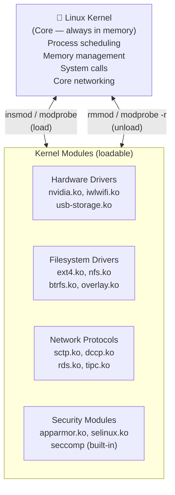
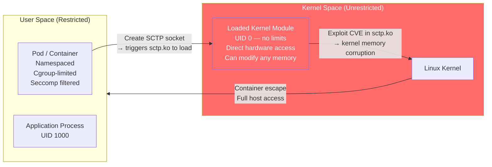
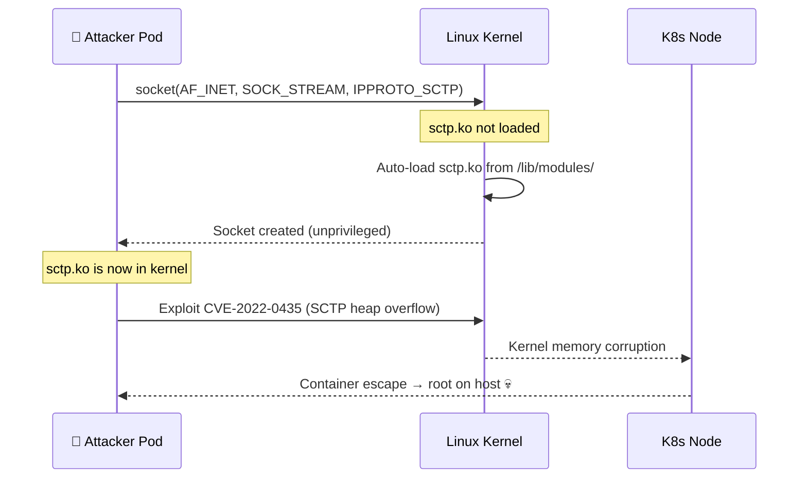
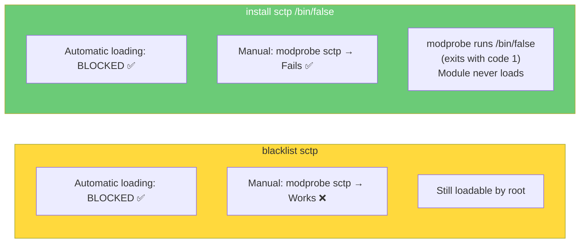
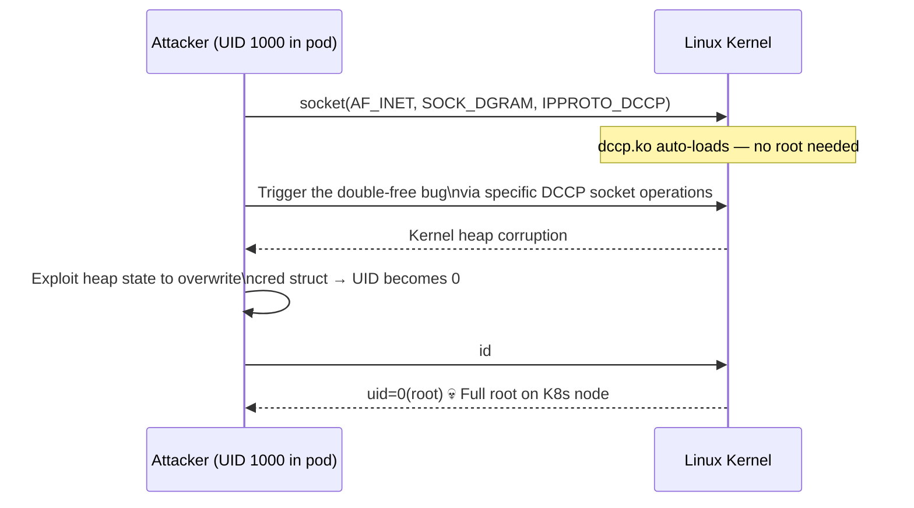
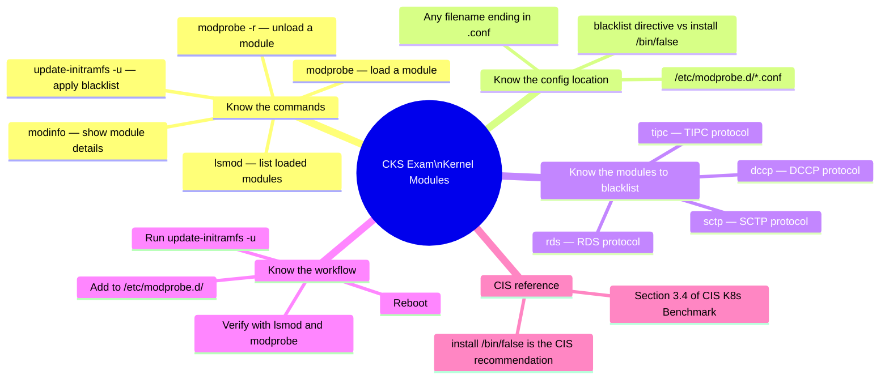
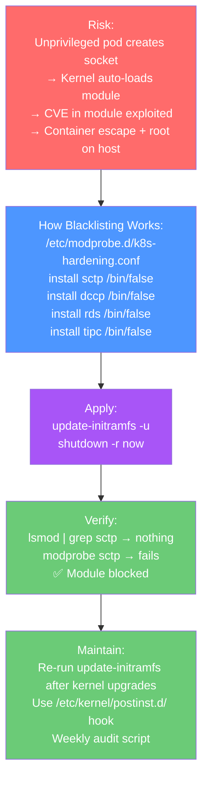

# 5 — Restrict Kernel Modules

> **What you'll learn:** What Linux kernel modules are, why unrestricted module loading is a security risk on Kubernetes nodes, how attackers exploit automatic module loading from inside pods, how to blacklist specific modules, and how to lock down the kernel module subsystem entirely.

---

## Table of Contents

1. [What are Kernel Modules?](#1-what-are-kernel-modules)
2. [Why Restricting Modules Matters for Kubernetes](#2-why-restricting-modules-matters-for-kubernetes)
3. [How Kernel Modules Load](#3-how-kernel-modules-load)
4. [Listing and Inspecting Loaded Modules](#4-listing-and-inspecting-loaded-modules)
5. [Loading Modules Manually](#5-loading-modules-manually)
6. [The Automatic Loading Risk — Pod Exploitation](#6-the-automatic-loading-risk--pod-exploitation)
7. [Blacklisting Kernel Modules](#7-blacklisting-kernel-modules)
8. [The /etc/modprobe.d/ Directory](#8-the-etcmodprobed-directory)
9. [Modules to Restrict on Kubernetes Nodes](#9-modules-to-restrict-on-kubernetes-nodes)
10. [The `install /bin/false` Technique — Stronger Blacklisting](#10-the-install-binfalse-technique--stronger-blacklisting)
11. [Verifying Blacklists Work](#11-verifying-blacklists-work)
12. [Locking Down Module Loading Entirely](#12-locking-down-module-loading-entirely)
13. [Real-World Scenarios](#13-real-world-scenarios)
14. [Common Mistakes & Gotchas](#14-common-mistakes--gotchas)
15. [CKS Exam Tips](#15-cks-exam-tips)

---

## 1. What are Kernel Modules?

The Linux kernel follows a **modular design**. Instead of building every possible driver and feature directly into the kernel binary, Linux allows functionality to be loaded and unloaded dynamically at runtime — without rebooting.



### Module File Location

```bash
# Modules are stored as .ko (kernel object) files
# Organised by kernel version
ls /lib/modules/$(uname -r)/kernel/
# drivers/  fs/  net/  sound/  crypto/  ...

# Find a specific module file
find /lib/modules/$(uname -r) -name "sctp.ko*"
# /lib/modules/5.15.0-88-generic/kernel/net/sctp/sctp.ko

# Module metadata
modinfo sctp
# filename:    /lib/modules/5.15.0.../sctp.ko
# description: Support for the SCTP protocol (RFC2960)
# license:     GPL
# depends:     libcrc32c,inet_diag
```

---

## 2. Why Restricting Modules Matters for Kubernetes

Kernel modules run in **kernel space** — the highest privilege level on a Linux system. A bug or exploit in a kernel module can:

- Read or write any memory on the host
- Bypass all security controls (AppArmor, seccomp, namespaces)
- Escape containers entirely
- Install rootkits that survive reboots



The key danger for Kubernetes: **an unprivileged process inside a pod can trigger a kernel module to load automatically just by creating a specific type of network socket**. No root required. The module loads into the kernel, and if it has a vulnerability — the attacker now owns the host.

### The Risk Matrix

| Risk | Detail |
|---|---|
| **CVE exploitation** | Network protocol modules (SCTP, DCCP, RDS) have a history of kernel CVEs — loading them expands attack surface |
| **Container escape** | A vulnerable module loaded from inside a pod can be exploited to escape the container namespace |
| **Rootkit installation** | An attacker with ability to load modules (`CAP_SYS_MODULE`) can load a malicious .ko file |
| **Information disclosure** | Some modules expose internal kernel data structures via /proc |
| **Denial of service** | Buggy modules can panic the kernel, taking down the node and all its pods |

---

## 3. How Kernel Modules Load

Modules are loaded in three ways:

```mermaid
flowchart TD
    subgraph M1["1. Manual Load (Admin)"]
        MA[Admin runs:\nmodprobe pcspkr\nor insmod pcspkr.ko]
        MB[Module loaded into kernel]
        MA --> MB
    end

    subgraph M2["2. Automatic Load (udev/kernel)"]
        UA[Hardware connected\nor kernel event]
        UB[udev detects event]
        UC[udev calls modprobe\nto load driver]
        UD[Module loaded]
        UA --> UB --> UC --> UD
    end

    subgraph M3["3. Automatic Load (Socket Creation) ⚠️"]
        SA["Process (even in pod) creates\na network socket:\nsocket(AF_SCTP, ...)"]
        SB[Kernel checks: is sctp.ko loaded?]
        SC[Not loaded → auto-loads sctp.ko\nNo root required!]
        SD[Module now in kernel]
        SA --> SB --> SC --> SD
    end

    style M3 fill:#ff6b6b,color:#fff
    style SC fill:#ff6b6b,color:#fff
```



Method 3 is the dangerous one for Kubernetes. An unprivileged pod process can load kernel modules simply by making certain system calls.

---

## 4. Listing and Inspecting Loaded Modules

### List All Currently Loaded Modules

```bash
# List all loaded modules
lsmod

# Output format: Module | Size (bytes) | Used by (count and which modules)
# Module                  Size  Used by
# floppy                 69417  0
# xt_conntrack           16384  1
# ipt_MASQUERADE         16384  1
# nf_nat_masquerade_ipv4 16384  1  ipt_MASQUERADE
# nf_conntrack_netlink   40960  0
# xfrm_user              32768  1
# iptable_filter         16384  1
# nf_conntrack_ipv4      16384  3
# overlay                147456 12           ← Container filesystem driver
# br_netfilter           28672  0            ← Required for K8s networking
```

### Column Meanings

| Column | Meaning |
|---|---|
| `Module` | Name of the loaded module |
| `Size` | Memory footprint in bytes |
| `Used by` | Number of references + which modules depend on it (`0` = nothing depends on it — safe to unload) |

### Search for a Specific Module

```bash
# Is SCTP loaded?
lsmod | grep sctp
# If nothing prints → not loaded ✅

# Is overlay loaded? (needed for containers)
lsmod | grep overlay
# overlay  147456  12 ← loaded, used by 12 things ✅

# Get detailed information about a module
modinfo sctp
# filename:    /lib/modules/.../sctp.ko
# alias:       net-pf-2-proto-132
# description: Support for the SCTP protocol (RFC2960)
# license:     GPL
# depends:     libcrc32c,inet_diag
# vermagic:    5.15.0-88-generic SMP preempt

modinfo overlay
# filename:    /lib/modules/.../overlay.ko
# description: Overlay Filesystem
# license:     GPL
```

---

## 5. Loading Modules Manually

Understanding how to load modules helps you understand blacklisting:

```bash
# Load a module (modprobe is preferred — handles dependencies)
sudo modprobe pcspkr

# Load a module with parameters
sudo modprobe nf_conntrack hashsize=65536

# Load a specific .ko file directly (insmod doesn't handle deps)
sudo insmod /lib/modules/$(uname -r)/kernel/net/sctp/sctp.ko

# Unload a module (only works if nothing uses it)
sudo modprobe -r pcspkr
sudo rmmod pcspkr

# Unload with force (dangerous — can destabilise system)
sudo rmmod -f pcspkr

# Dry run — see what modprobe WOULD do
sudo modprobe --dry-run sctp
```

---

## 6. The Automatic Loading Risk — Pod Exploitation

This is the critical security concept for Kubernetes. Let's see it in action:

### Demonstration — Loading SCTP from an Unprivileged Pod

```bash
# Before: SCTP is not loaded
lsmod | grep sctp
# (nothing) ← sctp.ko not in kernel

# Inside an unprivileged pod — no root needed
# A process creates an SCTP socket
python3 -c "import socket; s = socket.socket(socket.AF_INET, socket.SOCK_STREAM, 132)"
# 132 = IPPROTO_SCTP

# Back on the HOST — check if sctp loaded
lsmod | grep sctp
# sctp  413696  0     ← sctp.ko is now loaded!
```

The pod process triggered the kernel to auto-load `sctp.ko` **without any root privileges**. If `sctp.ko` has a CVE (and historically it has had several), the attacker now has a kernel-level vulnerability available.

### The Attack Chain



**Blacklisting SCTP prevents step 1** — the module never loads, so the CVE is never reachable.

---

## 7. Blacklisting Kernel Modules

Blacklisting tells the kernel module system: **do not load this module, even if requested**.

### Create a Blacklist Configuration File

```bash
# Create (or edit) a .conf file in /etc/modprobe.d/
sudo vi /etc/modprobe.d/blacklist.conf

# Or use tee to create it:
sudo tee /etc/modprobe.d/blacklist.conf <<'EOF'
# Kubernetes node hardening — CIS Benchmark section 3.4
# Blacklist unused and potentially dangerous network protocols

blacklist sctp
blacklist dccp
EOF
```

### Verify the File

```bash
cat /etc/modprobe.d/blacklist.conf
# blacklist sctp
# blacklist dccp
```

### Apply Changes (Requires Reboot)

```bash
# Update initramfs to embed blacklist into boot image
sudo update-initramfs -u

# Reboot to apply
sudo shutdown -r now

# After reboot — verify modules are NOT loaded
lsmod | grep sctp
# (nothing) ← sctp.ko not loaded ✅
lsmod | grep dccp
# (nothing) ← dccp.ko not loaded ✅
```

> ⚠️ **Reboot is required.** The blacklist prevents the module from loading, but if it was already loaded before you added the blacklist, it stays in memory until the system restarts. Always reboot after adding blacklist entries.

---

## 8. The /etc/modprobe.d/ Directory

The `/etc/modprobe.d/` directory contains configuration files that control module behaviour. Each file must end in `.conf`.

```bash
# List existing configuration files
ls /etc/modprobe.d/
# blacklist.conf  blacklist-framebuffer.conf  iwlwifi.conf  ...

# View all current blacklists (including system defaults)
cat /etc/modprobe.d/blacklist*.conf

# View a specific file
cat /etc/modprobe.d/blacklist.conf
```

### Configuration Directives Available

| Directive | Syntax | What It Does |
|---|---|---|
| `blacklist` | `blacklist <module>` | Prevents auto-loading. Can still be manually loaded with `modprobe -f` |
| `install` | `install <module> /bin/false` | Runs `/bin/false` instead of loading — truly blocks all loading |
| `options` | `options <module> param=value` | Set module parameters at load time |
| `alias` | `alias <alias> <module>` | Map an alias to a module name |
| `softdep` | `softdep <module> pre: <dep>` | Declare soft dependencies |

### File Naming — Best Practices

```bash
# You can use any .conf filename
# Best practice: name by purpose or CIS control

/etc/modprobe.d/blacklist.conf           # General blacklist
/etc/modprobe.d/k8s-hardening.conf       # Kubernetes-specific
/etc/modprobe.d/cis-benchmark.conf       # CIS benchmark controls
/etc/modprobe.d/blacklist-protocols.conf # Protocol-specific
```

---

## 9. Modules to Restrict on Kubernetes Nodes

The CIS Kubernetes Benchmark (Section 3.4) and CIS Distribution Independent Linux Benchmark both recommend restricting modules that are unused on Kubernetes nodes:

### Recommended Blacklist for Kubernetes Nodes

```bash
sudo tee /etc/modprobe.d/k8s-hardening.conf <<'EOF'
# ============================================================
# Kubernetes Node — Kernel Module Hardening
# Based on CIS Kubernetes Benchmark v1.9.0 Section 3.4
# ============================================================

# ── Unused Network Protocols ─────────────────────────────────
# SCTP: Stream Control Transmission Protocol
# History: CVE-2022-0435 (heap overflow), CVE-2021-3772, CVE-2019-8956
install sctp /bin/false

# DCCP: Datagram Congestion Control Protocol
# History: CVE-2017-6074 (double free — privilege escalation)
install dccp /bin/false

# RDS: Reliable Datagram Sockets
# History: CVE-2010-3904 (privilege escalation via RDS)
install rds /bin/false

# TIPC: Transparent Inter-process Communication
# History: CVE-2022-0435 (stack overflow via TIPC)
install tipc /bin/false

# ── USB Storage (VMs/Cloud Nodes — no USB needed) ───────────
install usb-storage /bin/false

# ── Bluetooth (Servers never need Bluetooth) ─────────────────
install bluetooth /bin/false

# ── IEEE 1394 (Firewire — not needed on servers) ────────────
install firewire-core /bin/false

# ── Uncommon Filesystem Types ────────────────────────────────
# Squashfs is used by snap — if snap is removed, block this too
# install squashfs /bin/false  # Comment out if snap is needed

# CramFS, FreevxFS, JFFS2, HFS, HFS+, UDF — rarely needed
install cramfs /bin/false
install freevxfs /bin/false
install jffs2 /bin/false
install hfs /bin/false
install hfsplus /bin/false
install udf /bin/false
EOF
```

### Module Risk Reference Table

| Module | Protocol/Feature | CVEs | Kubernetes Need | Action |
|---|---|---|---|---|
| `sctp` | SCTP (RFC 2960) | CVE-2022-0435, CVE-2021-3772, CVE-2019-8956 | ❌ Not needed | Blacklist |
| `dccp` | Datagram Congestion Control | CVE-2017-6074 | ❌ Not needed | Blacklist |
| `rds` | Reliable Datagram Sockets | CVE-2010-3904 | ❌ Not needed | Blacklist |
| `tipc` | Inter-process Comms | CVE-2022-0435 | ❌ Not needed | Blacklist |
| `bluetooth` | Bluetooth stack | Multiple | ❌ Not needed on VMs | Blacklist |
| `usb-storage` | USB mass storage | — | ❌ Not needed on VMs | Blacklist |
| `cramfs` | Compressed ROM FS | — | ❌ Not needed | Blacklist |
| `udf` | Universal Disk Format | — | ❌ Not needed | Blacklist |
| `overlay` | Overlay filesystem | — | ✅ Required for containers | Keep |
| `br_netfilter` | Bridge netfilter | — | ✅ Required for K8s networking | Keep |
| `nf_conntrack` | Connection tracking | — | ✅ Required for K8s networking | Keep |
| `iptable_nat` | NAT tables | — | ✅ Required for kube-proxy | Keep |

---

## 10. The `install /bin/false` Technique — Stronger Blacklisting

Plain `blacklist` has a weakness: it prevents **automatic** loading, but an admin (or attacker with root) can still load the module manually with `modprobe sctp`. The `install /bin/false` technique is stronger:



### How It Works

```bash
# Using blacklist (weaker)
echo "blacklist sctp" | sudo tee /etc/modprobe.d/blacklist.conf
# Stops auto-loading, but:
sudo modprobe sctp   # ← This STILL works!

# Using install /bin/false (stronger)
echo "install sctp /bin/false" | sudo tee /etc/modprobe.d/k8s-hardening.conf
# Now:
sudo modprobe sctp
# FATAL: Module sctp not found in directory /lib/modules/...
# (or exits silently with error code 1)

# Verify
modprobe sctp; echo "Exit code: $?"
# Exit code: 1   ← blocked
```

### Combining Both for Belt-and-Suspenders

```
# Use both directives — belt and suspenders approach
blacklist sctp
install sctp /bin/false
```

---

## 11. Verifying Blacklists Work

Always verify that your blacklist is actually working after applying it:

```bash
# Step 1 — Confirm the blacklist file exists and has correct content
cat /etc/modprobe.d/k8s-hardening.conf

# Step 2 — Update initramfs (embeds blacklist into boot image)
sudo update-initramfs -u

# Step 3 — Reboot
sudo shutdown -r now

# Step 4 — After reboot, confirm modules are not loaded
lsmod | grep sctp    # Should return nothing
lsmod | grep dccp    # Should return nothing
lsmod | grep rds     # Should return nothing
lsmod | grep tipc    # Should return nothing

# Step 5 — Try to manually load a blacklisted module
sudo modprobe sctp
# Should fail with error or exit code 1

sudo modprobe dccp
# Should fail

# Step 6 — Attempt socket-based auto-loading (simulates pod behavior)
python3 -c "import socket; s = socket.socket(socket.AF_INET, socket.SOCK_STREAM, 132)" 2>/dev/null
lsmod | grep sctp
# Still nothing ← blacklist is working ✅

# Step 7 — Verify modprobe config is applied
modprobe --showconfig | grep sctp
# install sctp /bin/false  ← confirmed
```

### Automated Verification Script

```bash
#!/bin/bash
# verify-module-blacklist.sh

MODULES=("sctp" "dccp" "rds" "tipc" "bluetooth" "usb-storage")

echo "=== Kernel Module Blacklist Verification ==="
echo "Date: $(date)"
echo ""

for mod in "${MODULES[@]}"; do
    # Check if loaded
    if lsmod | grep -q "^${mod} "; then
        echo "🔴 FAIL: $mod is currently LOADED"
    else
        echo "✅ PASS: $mod is NOT loaded"
    fi

    # Check if blacklist config exists
    if modprobe --showconfig 2>/dev/null | grep -q "install ${mod} /bin/false\|blacklist ${mod}"; then
        echo "   📋 Config: blacklist entry found"
    else
        echo "   ⚠️  Config: no blacklist entry found — add to /etc/modprobe.d/"
    fi
    echo ""
done
```

---

## 12. Locking Down Module Loading Entirely

For maximum security, you can prevent **any** new modules from being loaded after the system boots — using a kernel sysctl parameter:

```bash
# Lock the kernel — no new modules can be loaded
# (This is irreversible until reboot)
sudo sysctl -w kernel.modules_disabled=1

# Verify
sysctl kernel.modules_disabled
# kernel.modules_disabled = 1

# After setting this:
sudo modprobe sctp
# modprobe: ERROR: could not insert 'sctp': Operation not permitted
```

> ⚠️ **Warning:** Once `kernel.modules_disabled=1` is set, it **cannot be unset without rebooting**. All required modules (overlay, br_netfilter, nf_conntrack, etc.) must be loaded BEFORE setting this. This is appropriate for highly sensitive, static production nodes where you know exactly what modules are needed.

### Workflow for Maximum Lockdown

```bash
# Step 1 — Identify all required modules
lsmod > /tmp/required-modules-before-lockdown.txt

# Step 2 — Load all required modules
sudo modprobe overlay
sudo modprobe br_netfilter
sudo modprobe nf_conntrack
sudo modprobe xt_conntrack
# ... load everything needed

# Step 3 — Verify Kubernetes is working
kubectl get nodes

# Step 4 — Lock the kernel
sudo sysctl -w kernel.modules_disabled=1

# Step 5 — Make persistent across reboots (add to /etc/sysctl.d/)
# NOTE: Required modules must still be listed in /etc/modules-load.d/
# so they load at boot BEFORE the lockdown takes effect
echo "kernel.modules_disabled=1" | sudo tee /etc/sysctl.d/99-module-lockdown.conf

# Step 6 — Ensure required modules load at boot
sudo tee /etc/modules-load.d/kubernetes.conf <<EOF
overlay
br_netfilter
nf_conntrack
xt_conntrack
iptable_filter
iptable_nat
EOF
```

---

## 13. Real-World Scenarios

### Scenario 1 — CVE-2017-6074: DCCP Double Free Privilege Escalation

**Background:** CVE-2017-6074 was a critical Linux kernel vulnerability in the DCCP protocol implementation. An unprivileged local user could exploit a **use-after-free / double-free** bug in `dccp.ko` to escalate to root.

**Attack flow:**



**Prevention — just two lines:**

```bash
echo "install dccp /bin/false" | sudo tee -a /etc/modprobe.d/k8s-hardening.conf
sudo update-initramfs -u && sudo reboot
```

**After reboot:** `socket(AF_INET, SOCK_DGRAM, IPPROTO_DCCP)` fails immediately — dccp.ko never loads — the CVE is unreachable.

---

### Scenario 2 — TIPC Module Used for Container Escape (CVE-2022-0435)

**Background:** CVE-2022-0435 was a critical vulnerability in the TIPC (Transparent Inter-Process Communication) kernel module. A remote unauthenticated attacker could send specially crafted TIPC packets to trigger a stack-based buffer overflow, achieving remote code execution in the kernel.

**Why this affected Kubernetes clusters:**
- TIPC module was not loaded by default
- But creating a TIPC socket from a pod triggered auto-loading
- A pod with network access could then exploit the freshly-loaded vulnerable module

```bash
# Pod code that triggers auto-loading
import socket
s = socket.socket(socket.AF_TIPC, socket.SOCK_STREAM)
# → tipc.ko now in kernel on the HOST

# Then sends crafted packets to exploit CVE-2022-0435
# → Remote code execution in kernel space
# → Container escape + host takeover
```

**Fix:**

```bash
echo "install tipc /bin/false" | sudo tee -a /etc/modprobe.d/k8s-hardening.conf
```

TIPC socket creation now fails immediately — module never loads — remote exploit never reaches the kernel.

---

### Scenario 3 — Compliance Audit Finds Blacklist Not Applied After Kernel Upgrade

**Situation:** A company carefully blacklisted all CIS-recommended modules. Six months later, a kernel upgrade is applied (`apt upgrade`). The new kernel installs fresh module files. The upgrade process **does not automatically re-run `update-initramfs`** with the latest blacklist.

On the next reboot after the upgrade, the new kernel loads without the blacklist applied to the initramfs. An automated test suite discovers that SCTP can be loaded from pods again.

**Root cause:** `update-initramfs -u` was run once when the blacklist was created but not after the kernel upgrade.

**Fix:**

```bash
# Run after every kernel upgrade
sudo update-initramfs -u -k all   # Update all installed kernel versions

# Or automate via a hook
# Create a kernel post-install script
sudo tee /etc/kernel/postinst.d/update-blacklist <<'EOF'
#!/bin/bash
update-initramfs -u -k "$1"
EOF
sudo chmod +x /etc/kernel/postinst.d/update-blacklist
```

---

## 14. Common Mistakes & Gotchas

| Mistake | Consequence | Fix |
|---|---|---|
| Using `blacklist` instead of `install /bin/false` | Module can still be loaded manually by root | Use `install <module> /bin/false` for hard block |
| Not running `update-initramfs -u` after adding blacklist | Blacklist not embedded in boot image — reboot doesn't apply it | Always run `update-initramfs -u` |
| Not rebooting after blacklist change | Module already in memory stays loaded | Must reboot — blacklist only prevents future loading |
| Blacklisting `overlay` | Containers can't start — overlay filesystem is required | Never blacklist modules required for K8s (see keep-list) |
| Blacklisting `br_netfilter` | Pod networking breaks — iptables can't inspect bridge traffic | Never blacklist — required for K8s networking |
| Forgetting to verify after reboot | Blacklist file may have a typo — silently not applied | Always run verification script after reboot |
| Applying `kernel.modules_disabled=1` before loading required modules | K8s components crash — overlay, br_netfilter not available | Load all required modules first, then lock |
| Not re-running update-initramfs after kernel upgrade | New kernel starts without blacklist applied | Use `/etc/kernel/postinst.d/` hook |
| Using wrong file extension in modprobe.d | Files without `.conf` extension are silently ignored | Always use `.conf` extension |

---

## 15. CKS Exam Tips



### Quick Reference — Exam Cheat Sheet

```bash
# 1. List all loaded modules
lsmod

# 2. Check if a specific module is loaded
lsmod | grep sctp

# 3. Get module information
modinfo sctp

# 4. Add to blacklist (create file)
echo "install sctp /bin/false" | sudo tee /etc/modprobe.d/k8s-hardening.conf

# 5. Multiple modules
sudo tee /etc/modprobe.d/k8s-hardening.conf <<EOF
install sctp /bin/false
install dccp /bin/false
install rds /bin/false
install tipc /bin/false
EOF

# 6. Apply to initramfs
sudo update-initramfs -u

# 7. Reboot
sudo shutdown -r now

# 8. Verify after reboot
lsmod | grep sctp    # Should return nothing
modprobe sctp        # Should fail
```

### The Four Modules the CKS Exam Always Asks About

```
sctp   — Stream Control Transmission Protocol
dccp   — Datagram Congestion Control Protocol
rds    — Reliable Datagram Sockets
tipc   — Transparent Inter-process Communication
```

Memorise these four. Write the blacklist config from memory.

---

## Summary



| Concept | Key Point |
|---|---|
| **What are kernel modules** | Loadable kernel code — runs in kernel space with unlimited privilege |
| **The auto-load risk** | Unprivileged pods can trigger module loading via socket creation |
| **blacklist vs install /bin/false** | `blacklist` blocks auto-load only; `install /bin/false` blocks all loading |
| **Config location** | `/etc/modprobe.d/*.conf` — any `.conf` filename works |
| **Apply command** | `sudo update-initramfs -u` — embeds blacklist into boot image |
| **Reboot required** | Changes only take effect after reboot |
| **The four to blacklist** | `sctp`, `dccp`, `rds`, `tipc` — CIS Kubernetes Benchmark 3.4 |
| **Verify** | `lsmod \| grep sctp` and `modprobe sctp` should both show blocked |
| **Lock down entirely** | `kernel.modules_disabled=1` — no modules can load after boot |
