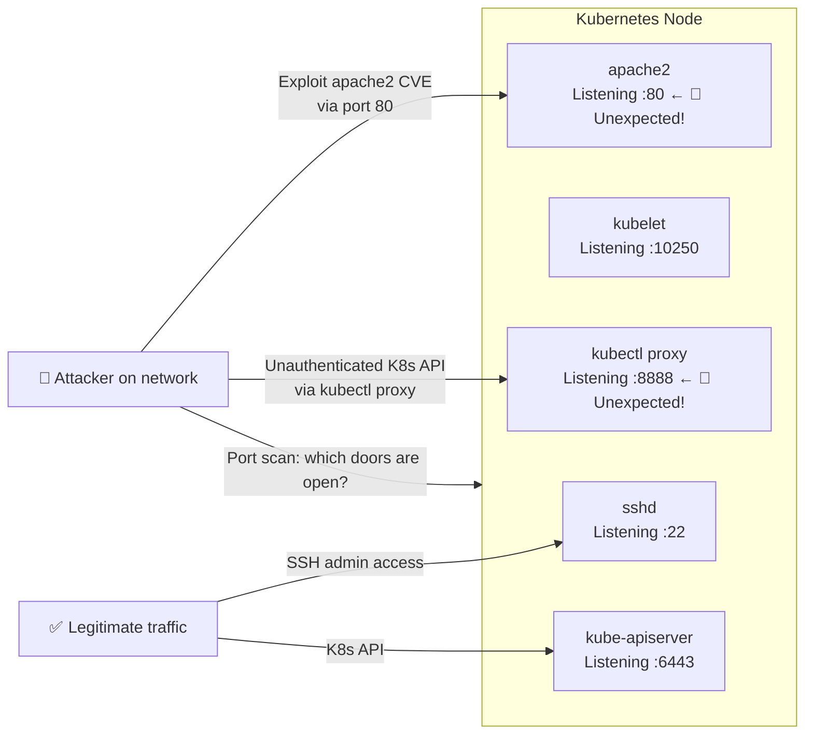
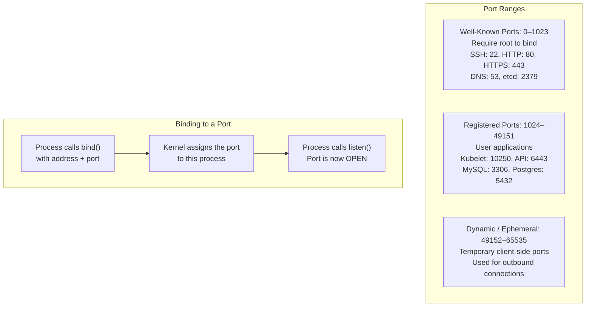
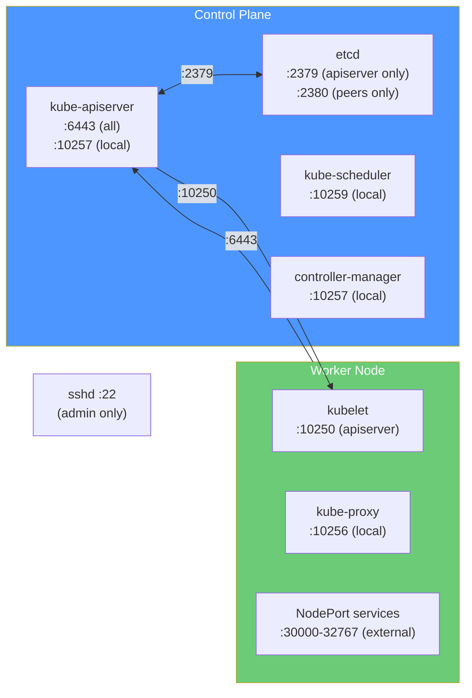
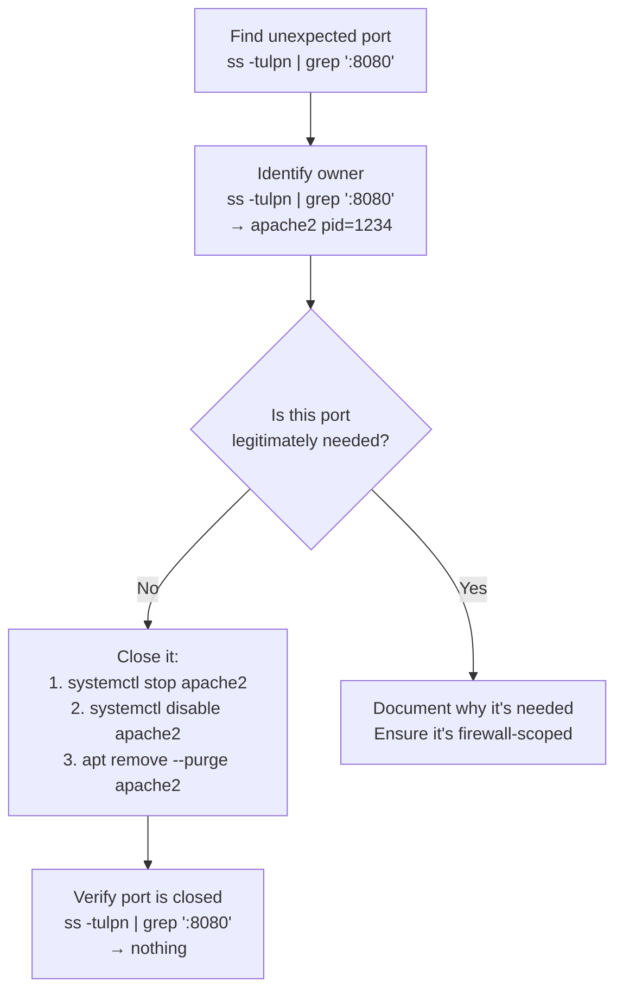
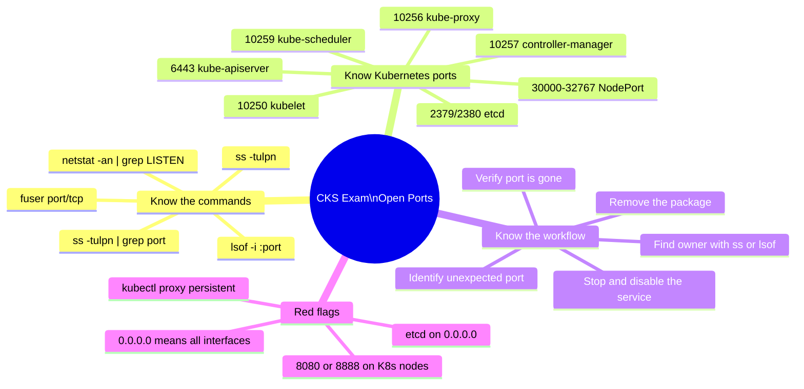
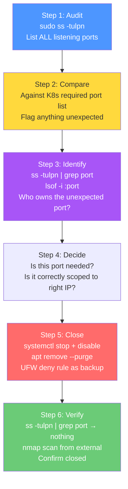

# 6 — Identify and Disable Open Ports

> **What you'll learn:** What open ports are and why they're attack surfaces, how to use `netstat` and `ss` to identify listening ports, what every Kubernetes port is and which ones should be open, how to identify and shut down unexpected ports, and how to verify your node's port exposure.

---

## Table of Contents

1. [What are Open Ports and Why Do They Matter?](#1-what-are-open-ports-and-why-do-they-matter)
2. [How Ports Work — A Quick Primer](#2-how-ports-work--a-quick-primer)
3. [Tools for Inspecting Open Ports](#3-tools-for-inspecting-open-ports)
4. [Using netstat to Check Active Ports](#4-using-netstat-to-check-active-ports)
5. [Using ss — The Modern Alternative](#5-using-ss--the-modern-alternative)
6. [The /etc/services Reference File](#6-the-etcservices-reference-file)
7. [Kubernetes Port Reference — What Should Be Open](#7-kubernetes-port-reference--what-should-be-open)
8. [Analysing a Real netstat Output](#8-analysing-a-real-netstat-output)
9. [Identifying What Owns a Port](#9-identifying-what-owns-a-port)
10. [Disabling Unnecessary Ports](#10-disabling-unnecessary-ports)
11. [Firewall-Level Port Control with UFW](#11-firewall-level-port-control-with-ufw)
12. [Automated Port Auditing](#12-automated-port-auditing)
13. [Real-World Scenarios](#13-real-world-scenarios)
14. [Common Mistakes & Gotchas](#14-common-mistakes--gotchas)
15. [CKS Exam Tips](#15-cks-exam-tips)

---

## 1. What are Open Ports and Why Do They Matter?

A **port** is a numbered endpoint on a network interface that applications use to send and receive network traffic. When a process binds to a port and starts listening, it creates an **open port** — a door into the system that any machine on the network can knock on.



**Every open port is a potential attack vector.** Even if a service is patched, its mere presence on the network means:
- Attackers know it exists (via port scanning)
- Any future 0-day in that service is immediately exploitable
- A misconfigured service may expose data without authentication

### The Principle

> *If a port doesn't need to be open, it must be closed. Period.*

---

## 2. How Ports Work — A Quick Primer



### TCP vs UDP

| Protocol | Characteristic | Kubernetes Use |
|---|---|---|
| **TCP** | Connection-oriented, reliable, ordered | API server, etcd, kubelet, SSH |
| **UDP** | Connectionless, fast, no delivery guarantee | DNS (port 53), some CNI plugins |

Both can be open ports and both are attack surfaces. `netstat` and `ss` can show both.

---

## 3. Tools for Inspecting Open Ports

| Tool | Command | Notes |
|---|---|---|
| `netstat` | `netstat -an \| grep LISTEN` | Classic tool — may need `net-tools` package |
| `ss` | `ss -tulpn` | Modern replacement for netstat — faster, more info |
| `lsof` | `lsof -i -P -n \| grep LISTEN` | Lists open files including network sockets |
| `nmap` | `nmap -sT localhost` | Network scanner — from external perspective |
| `fuser` | `fuser 80/tcp` | Find process using a specific port |

```bash
# Install netstat if missing (it's in net-tools)
sudo apt install net-tools -y

# ss is usually pre-installed (part of iproute2)
which ss
```

---

## 4. Using netstat to Check Active Ports

```bash
# Show all listening ports — numeric format (no DNS lookups)
netstat -an | grep -w LISTEN

# Show listening TCP ports with process info
netstat -tlnp

# Show listening UDP ports
netstat -ulnp

# Show both TCP and UDP
netstat -tulnp

# Show all connections (not just listening)
netstat -an
```

### Flag Reference

| Flag | Meaning |
|---|---|
| `-a` | Show all sockets (listening + established) |
| `-n` | Numeric — don't resolve IPs/ports to hostnames |
| `-t` | TCP sockets only |
| `-u` | UDP sockets only |
| `-l` | Only show listening sockets |
| `-p` | Show the PID and process name that owns the socket |

### Reading netstat Output

```
Proto  Recv-Q  Send-Q  Local Address           Foreign Address  State
tcp       0       0    127.0.0.1:10248         0.0.0.0:*        LISTEN
tcp       0       0    0.0.0.0:22              0.0.0.0:*        LISTEN
tcp6      0       0    :::6443                 :::*             LISTEN
```

| Column | Meaning |
|---|---|
| `Proto` | `tcp` = IPv4 TCP, `tcp6` = IPv6 TCP |
| `Local Address` | The IP:Port the service is listening on |
| `0.0.0.0:22` | Listening on **all interfaces** — accessible from network |
| `127.0.0.1:10248` | Listening on **localhost only** — not accessible from network |
| `:::6443` | IPv6 version of all-interfaces listen |
| `Foreign Address` | `0.0.0.0:*` = accepting connections from anywhere |
| `State` | `LISTEN` = waiting for connections |

---

## 5. Using ss — The Modern Alternative

`ss` (socket statistics) is faster and more powerful than `netstat`:

```bash
# The most useful single command for auditing
ss -tulpn
# -t = TCP, -u = UDP, -l = listening, -p = process, -n = numeric

# Show only TCP listening
ss -tlpn

# Show only UDP
ss -ulpn

# Filter to a specific port
ss -tulpn | grep ':22'
ss -tulpn | grep ':6443'
ss -tulpn | grep ':8080'   # Unexpected? Investigate!

# Show extended socket information
ss -tlpn -e

# Show socket memory usage (useful for performance + security)
ss -tlpnm
```

### Comparing ss vs netstat output

```bash
# ss output (modern)
ss -tulpn
# Netid  State   Recv-Q  Send-Q  Local Address:Port  Peer Address:Port  Process
# tcp    LISTEN  0       128     0.0.0.0:22           0.0.0.0:*          users:(("sshd",pid=1234,fd=3))
# tcp    LISTEN  0       128     127.0.0.1:10248      0.0.0.0:*          users:(("kubelet",pid=5678,fd=8))

# The Process column in ss tells you EXACTLY which binary owns the socket
# sshd owns port 22 ✅
# kubelet owns port 10248 ✅
```

---

## 6. The /etc/services Reference File

The `/etc/services` file is a local database that maps port numbers to service names. It's useful for quickly identifying what a port is conventionally used for:

```bash
# Look up a port number
grep ' 53/' /etc/services
# domain    53/tcp     # Domain Name Server
# domain    53/udp     # Domain Name Server

grep ' 22/' /etc/services
# ssh       22/tcp     # SSH Remote Login Protocol

grep ' 6443/' /etc/services
# (nothing — Kubernetes ports aren't in /etc/services)

# Look up a service name
grep '^http ' /etc/services
# http      80/tcp     www    # WorldWideWeb HTTP

# Show all services with their ports
cat /etc/services | grep -v '^#' | head -40
```

> **Note:** `/etc/services` documents conventions, not enforcement. A service can listen on any port — `apache2` can listen on port 8443, and SSH can listen on port 2222. Always verify with `ss -tulpn` which process actually owns a port, rather than assuming convention is followed.

---

## 7. Kubernetes Port Reference — What Should Be Open

Before closing ports, you must know which ones Kubernetes legitimately needs. Closing a required port breaks the cluster.

### Control Plane Node — Required Ports

| Port | Protocol | Component | Accessible From | Notes |
|---|---|---|---|---|
| `6443` | TCP | kube-apiserver | All nodes, kubectl clients | Main API endpoint — must be reachable |
| `2379` | TCP | etcd (client) | kube-apiserver only | etcd client API |
| `2380` | TCP | etcd (peer) | etcd peers only | etcd cluster communication |
| `2381` | TCP | etcd (metrics) | Monitoring only (optional) | etcd metrics endpoint |
| `10250` | TCP | kubelet | kube-apiserver | Kubelet API |
| `10257` | TCP | kube-controller-manager | Self only | HTTPS healthz |
| `10259` | TCP | kube-scheduler | Self only | HTTPS healthz |
| `22` | TCP | sshd | Admin networks | SSH (hardened per Ch. 2) |

### Worker Node — Required Ports

| Port | Protocol | Component | Accessible From | Notes |
|---|---|---|---|---|
| `10250` | TCP | kubelet | kube-apiserver | Kubelet API |
| `10256` | TCP | kube-proxy | Health checks | kube-proxy healthz |
| `30000–32767` | TCP/UDP | NodePort services | External clients | Only if NodePort services are used |
| `22` | TCP | sshd | Admin networks | SSH (hardened) |

### CNI Plugin Ports (varies by plugin)

| Plugin | Ports Needed |
|---|---|
| **Calico** | TCP 179 (BGP), UDP 4789 (VXLAN), IP-in-IP |
| **Flannel** | UDP 8285, UDP 8472 (VXLAN) |
| **Weave** | TCP 6783, UDP 6783/6784 |
| **Cilium** | UDP 8472 (VXLAN), TCP 4240 (health), TCP 4244 (Hubble) |



---

## 8. Analysing a Real netstat Output

Let's analyse the KodeKloud example output line by line:

```bash
netstat -an | grep -w LISTEN
```

```
tcp   0  0  127.0.0.1:10248     0.0.0.0:*  LISTEN   ← kubelet healthz (localhost only) ✅
tcp   0  0  127.0.0.1:10249     0.0.0.0:*  LISTEN   ← kube-proxy metrics (localhost) ✅
tcp   0  0  127.0.0.1:2379      0.0.0.0:*  LISTEN   ← etcd localhost interface ✅
tcp   0  0  10.53.64.6:2379     0.0.0.0:*  LISTEN   ← etcd node interface (api server access) ✅
tcp   0  0  10.53.64.6:2380     0.0.0.0:*  LISTEN   ← etcd peer (cluster communication) ✅
tcp   0  0  127.0.0.1:42893     0.0.0.0:*  LISTEN   ← ephemeral/dynamic port (investigate) ⚠️
tcp   0  0  127.0.0.1:2381      0.0.0.0:*  LISTEN   ← etcd metrics (localhost) ✅
tcp   0  0  127.0.0.11:46607    0.0.0.0:*  LISTEN   ← Docker embedded DNS ✅
tcp   0  0  0.0.0.0:8080        0.0.0.0:*  LISTEN   ← 🔴 UNEXPECTED! All interfaces!
tcp   0  0  127.0.0.1:10257     0.0.0.0:*  LISTEN   ← controller-manager (localhost) ✅
tcp   0  0  127.0.0.1:10259     0.0.0.0:*  LISTEN   ← kube-scheduler (localhost) ✅
tcp   0  0  127.0.0.53:53       0.0.0.0:*  LISTEN   ← systemd-resolved DNS ✅
tcp   0  0  0.0.0.0:22          0.0.0.0:*  LISTEN   ← SSH (should be hardened) ✅
tcp6  0  0  :::10250            :::*        LISTEN   ← kubelet API (all interfaces) ✅
tcp6  0  0  :::6443             :::*        LISTEN   ← kube-apiserver ✅
tcp6  0  0  :::10256            :::*        LISTEN   ← kube-proxy healthz ✅
tcp6  0  0  :::22               :::*        LISTEN   ← SSH IPv6 ✅
tcp6  0  0  :::8888             :::*        LISTEN   ← 🔴 kubectl proxy! Should not be persistent!
```

### Red Flags in This Output

| Port | Issue | Action |
|---|---|---|
| `0.0.0.0:8080` | Unknown service listening on ALL interfaces | Find owner: `ss -tulpn \| grep 8080` then kill/disable |
| `:::8888` | kubectl proxy running persistently | Stop the proxy: `systemctl stop proxy` + disable it |
| `127.0.0.1:42893` | High dynamic port — investigate | `ss -tulpn \| grep 42893` — check if expected |

---

## 9. Identifying What Owns a Port

When you find an unexpected port, immediately identify what process owns it:

```bash
# Method 1 — ss with process info
ss -tulpn | grep ':8080'
# tcp  LISTEN  0  128  0.0.0.0:8080  0.0.0.0:*  users:(("apache2",pid=1234,fd=4))
# → apache2 owns port 8080

# Method 2 — lsof (list open files including sockets)
sudo lsof -i :8080
# COMMAND   PID  USER   FD   TYPE DEVICE SIZE/OFF NODE NAME
# apache2  1234  www-data  4u  IPv4  ...  TCP *:http-alt (LISTEN)

# Method 3 — fuser
sudo fuser 8080/tcp
# 8080/tcp:  1234   ← PID 1234 owns this port

# Get process name from PID
ps aux | grep 1234
# www-data  1234  0.0  0.1  apache2 -k start

# Method 4 — /proc filesystem
sudo cat /proc/1234/cmdline | tr '\0' ' '
# /usr/sbin/apache2 -k start

# For port 8888 (kubectl proxy)
ss -tulpn | grep 8888
# users:(("kubectl",pid=9999,fd=3))
ps aux | grep 9999
# mark  9999  0.0  0.1  kubectl proxy --port=8888
```

---

## 10. Disabling Unnecessary Ports

Once you've identified an unexpected port and its owner, close it by stopping the owning process/service:

### Workflow



### Closing Specific Port Examples

```bash
# Close port 8080 — stop and remove apache2
sudo systemctl stop apache2
sudo systemctl disable apache2
sudo apt remove --purge apache2 -y
# Verify
ss -tulpn | grep ':8080'   # Nothing

# Close port 8888 — kubectl proxy running as service
sudo systemctl stop proxy
sudo systemctl disable proxy
# If it was run manually, find and kill the process
sudo kill $(sudo lsof -t -i:8888)
# Verify
ss -tulpn | grep ':8888'   # Nothing

# Close port 80 — nginx installed accidentally
sudo systemctl disable --now nginx
sudo apt remove --purge nginx -y
ss -tulpn | grep ':80'    # Nothing
```

---

## 11. Firewall-Level Port Control with UFW

Even after stopping a service, it may restart. Firewall rules provide a **second layer of defence** — blocking ports at the network level regardless of what processes are running.

```bash
# Install UFW if not present
sudo apt install ufw -y

# Set default policies — deny all incoming, allow all outgoing
sudo ufw default deny incoming
sudo ufw default allow outgoing

# Allow only required ports for a control plane node
sudo ufw allow 22/tcp      comment 'SSH'
sudo ufw allow 6443/tcp    comment 'kube-apiserver'
sudo ufw allow from 10.0.0.0/8 to any port 2379 proto tcp comment 'etcd client (internal only)'
sudo ufw allow from 10.0.0.0/8 to any port 2380 proto tcp comment 'etcd peer (internal only)'
sudo ufw allow from 10.0.0.0/8 to any port 10250 proto tcp comment 'kubelet'
sudo ufw allow from 10.0.0.0/8 to any port 10257 proto tcp comment 'controller-manager'
sudo ufw allow from 10.0.0.0/8 to any port 10259 proto tcp comment 'kube-scheduler'

# Enable UFW
sudo ufw enable

# Verify rules
sudo ufw status verbose
```

```
Status: active
Logging: on (low)
Default: deny (incoming), allow (outgoing), deny (routed)

To                         Action      From
--                         ------      ----
22/tcp                     ALLOW IN    Anywhere
6443/tcp                   ALLOW IN    Anywhere
2379/tcp                   ALLOW IN    10.0.0.0/8
2380/tcp                   ALLOW IN    10.0.0.0/8
10250/tcp                  ALLOW IN    10.0.0.0/8
```

Now even if `apache2` somehow starts and binds to port 80 — UFW drops all connections to port 80 at the network layer before they reach the process.

---

## 12. Automated Port Auditing

### Port Audit Script for Kubernetes Nodes

```bash
#!/bin/bash
# k8s-port-audit.sh — Run weekly to detect port drift

echo "=== Kubernetes Node Port Audit ==="
echo "Date: $(date)"
echo "Host: $(hostname)"
echo ""

# Control plane expected ports
CP_PORTS=(6443 2379 2380 10250 10257 10259 22)
# Worker node expected ports
WORKER_PORTS=(10250 10256 22)

# Get all currently listening ports
LISTENING=$(ss -tulpn | grep LISTEN | awk '{print $5}' | sed 's/.*://' | sort -n | uniq)

echo "--- Currently Listening Ports ---"
while IFS= read -r port; do
    process=$(ss -tulpn | grep ":${port} " | awk '{print $NF}' | head -1)
    echo "  Port $port → $process"
done <<< "$LISTENING"

echo ""
echo "--- Unexpected Ports (not in K8s whitelist) ---"
EXPECTED=(6443 2379 2380 2381 10248 10249 10250 10251 10252 10255 10256 10257 10259 22 53)

while IFS= read -r port; do
    if ! printf '%s\n' "${EXPECTED[@]}" | grep -q "^${port}$"; then
        process=$(ss -tulpn | grep ":${port} " | awk '{print $NF}' | head -1)
        echo "  🔴 UNEXPECTED: Port $port → $process"
    fi
done <<< "$LISTENING"
```

```bash
chmod +x k8s-port-audit.sh
sudo ./k8s-port-audit.sh
```

### Using nmap for External Perspective

```bash
# Install nmap
sudo apt install nmap -y

# Scan your own node from itself (localhost view)
sudo nmap -sT -O localhost

# Scan from another machine in the cluster (external view)
# Replace 10.0.1.10 with the node IP
nmap -sT -sU -p 1-65535 10.0.1.10

# Quick scan of common K8s ports
nmap -p 22,80,443,2379,2380,6443,8080,8888,10248,10250,10257,10259 10.0.1.10

# Output: Open ports visible to attackers
# PORT     STATE  SERVICE
# 22/tcp   open   ssh
# 6443/tcp open   sun-sr-https
# 8080/tcp open   http         ← 🔴 Should not be open!
```

---

## 13. Real-World Scenarios

### Scenario 1 — Exposed etcd: The $10M Mistake

**Background:** In 2018, security researchers from Shodan discovered that thousands of etcd instances were publicly accessible on port 2379 with no authentication. These were Kubernetes etcd databases — containing all secrets, service account tokens, and cluster configuration — accessible to anyone on the internet.

```bash
# What the attackers found
curl http://<public-ip>:2379/v2/keys/?recursive=true
# Returns: ALL cluster data, all secrets, service account tokens

# Why it happened
netstat -an | grep 2379
# tcp  0  0  0.0.0.0:2379  0.0.0.0:*  LISTEN  ← etcd bound to ALL interfaces!
```

**Correct configuration — etcd should only listen on internal IPs:**

```bash
# Check etcd's listen address
ss -tulpn | grep 2379
# Should show: 127.0.0.1:2379 or 10.x.x.x:2379
# Must NOT show: 0.0.0.0:2379

# In etcd's config: /etc/kubernetes/manifests/etcd.yaml
# --listen-client-urls=https://127.0.0.1:2379,https://NODE_IP:2379
# NOT: --listen-client-urls=https://0.0.0.0:2379

# Additional firewall protection
sudo ufw deny from any to any port 2379
sudo ufw allow from 10.0.0.0/8 to any port 2379
```

---

### Scenario 2 — kubectl proxy Left Running as a Service

**Background:** A developer debugged a Kubernetes dashboard issue by running `kubectl proxy --port=8888 &` to access the dashboard. The `&` (background) means the process kept running after they logged out. A team member then wrote a systemd service file to make it persistent "for convenience". For 3 months, the Kubernetes API was accessible unauthenticated on port 8888 from within the cluster network.

```bash
# Discovery
netstat -an | grep LISTEN | grep 8888
# tcp6  0  0  :::8888  :::*  LISTEN ← listening on ALL IPv6 interfaces

# Find the owner
ss -tulpn | grep 8888
# users:(("kubectl",pid=2341,fd=3))

# Verify it's kubectl proxy
ps aux | grep 2341
# mark  2341  kubectl proxy --port=8888

# Test — is it unauthenticated?
curl http://localhost:8888/api/v1/secrets
# Returns: ALL secrets — no auth required 💀

# Fix
sudo systemctl stop proxy
sudo systemctl disable proxy
sudo rm /etc/systemd/system/proxy.service
sudo systemctl daemon-reload
# Verify
ss -tulpn | grep 8888  # Nothing
```

**Rule:** `kubectl proxy` should only ever run interactively (not as a background service), scoped to `127.0.0.1` only, and killed immediately after use.

---

### Scenario 3 — NodePort Range Exposure

**Situation:** A multi-tenant Kubernetes cluster has NodePort services defined for several tenant applications. The NodePort range (30000-32767) is wide open on all worker nodes — including to the internet. Tenant A discovers they can reach Tenant B's internal service by scanning the NodePort range.

```bash
# Scan the NodePort range (what a tenant could do)
nmap -p 30000-32767 <worker-node-ip>
# PORT      STATE  SERVICE
# 30080/tcp open   unknown   ← Tenant B's internal API!
# 31234/tcp open   unknown   ← Tenant B's database admin!
```

**Fix — scope NodePort access at the firewall:**

```bash
# Only allow NodePort from specific external load balancer IPs
sudo ufw allow from 203.0.113.10 to any port 30000:32767 proto tcp comment 'NodePort from LB only'
# Deny from everything else
sudo ufw deny 30000:32767/tcp

# For production: use LoadBalancer type services + ingress controller
# instead of NodePort — gives you more control over exposure
```

---

## 14. Common Mistakes & Gotchas

| Mistake | Consequence | Fix |
|---|---|---|
| Not running `ss -tulpn` with `sudo` | Process column shows nothing — can't identify owner | Always use `sudo ss -tulpn` |
| Closing port without stopping the service | Port reopens on service restart | Stop + disable the service first |
| Blocking port 10250 with UFW | kube-apiserver can't reach kubelet — kubectl exec/logs breaks | Whitelist kube-apiserver IP to port 10250 |
| Blocking port 6443 to worker nodes | Workers can't register with API server — cluster breaks | Allow port 6443 from all cluster IPs |
| Treating `127.0.0.1:port` as safe | It is — but verify nothing does SSH tunnelling to expose it | Audit all port forwards |
| Assuming `/etc/services` is authoritative | It only documents conventions — any process can use any port | Always verify with `ss -tulpn` |
| Not auditing dynamically-assigned ports | Port 42893-style entries may be real services or attack callbacks | Investigate all unexpected high ports |
| Forgetting UDP | `netstat -an \| grep LISTEN` only shows TCP by default | Always use `ss -tulpn` for both protocols |
| Not checking IPv6 | `0.0.0.0:22` is safe but `:::22` means IPv6 all-interfaces too | Check `tcp6` entries in output |

---

## 15. CKS Exam Tips



### Quick Reference — Port Audit Commands

```bash
# 1. See all listening ports with process owners
sudo ss -tulpn

# 2. Filter to a specific port
sudo ss -tulpn | grep ':8080'

# 3. Find what owns a port by PID
sudo lsof -i :8080

# 4. Check if a specific K8s port is correctly bound
sudo ss -tulpn | grep ':2379'   # Should only show internal IP, not 0.0.0.0

# 5. Kill a process using a port
sudo kill $(sudo lsof -t -i:8888)

# 6. Check /etc/services for port convention
grep ' 22/' /etc/services

# 7. Verify a port is closed after remediation
sudo ss -tulpn | grep ':8080'   # Should return nothing
```

---

## Summary



| Concept | Key Point |
|---|---|
| **Open port** | A process listening for network connections — every one is an attack surface |
| **`ss -tulpn`** | Primary tool — shows TCP+UDP listening ports with process owners |
| **`netstat -an \| grep LISTEN`** | Classic alternative — same info, less detail |
| **`0.0.0.0:port`** | Accessible from ANY network — investigate and restrict if not intentional |
| **`127.0.0.1:port`** | Localhost only — not accessible from network |
| **K8s required ports** | 6443, 2379/2380, 10250, 10257, 10259, 10256, 22 — everything else is suspect |
| **Close a port** | Stop service → disable service → remove package → verify with `ss` |
| **UFW as defence-in-depth** | Even if a service restarts, firewall blocks the port at the network layer |
| **Audit regularly** | Port drift happens — run `ss -tulpn` after every maintenance window |
