# 8 — Minimize External Access to the Network

> **What you'll learn:** What "external access" means in a Kubernetes context, how to verify what is exposed on your servers, the two primary approaches to network security (perimeter vs host-based), how layered defence-in-depth works, the key tools available at each layer, and how to systematically reduce your cluster's network attack surface.

---

## Table of Contents

1. [What is External Network Access?](#1-what-is-external-network-access)
2. [Why Minimising External Access Matters](#2-why-minimising-external-access-matters)
3. [Verifying What Your Server Exposes](#3-verifying-what-your-server-exposes)
4. [Understanding Network Exposure — 0.0.0.0 vs 127.0.0.1](#4-understanding-network-exposure--0000-vs-127001)
5. [Analysing a Real netstat Output](#5-analysing-a-real-netstat-output)
6. [Two Approaches to Network Security](#6-two-approaches-to-network-security)
7. [Layer 1 — Network-Wide Security (Perimeter Firewalls)](#7-layer-1--network-wide-security-perimeter-firewalls)
8. [Layer 2 — Server-Level Security (Host-Based Firewalls)](#8-layer-2--server-level-security-host-based-firewalls)
9. [Layer 3 — Cloud Security Groups](#9-layer-3--cloud-security-groups)
10. [Layer 4 — Kubernetes Network Policies](#10-layer-4--kubernetes-network-policies)
11. [Defence-in-Depth: All Four Layers Together](#11-defence-in-depth-all-four-layers-together)
12. [Scoping Services to the Right Interface](#12-scoping-services-to-the-right-interface)
13. [Real-World Scenarios](#13-real-world-scenarios)
14. [Common Mistakes & Gotchas](#14-common-mistakes--gotchas)
15. [CKS Exam Tips](#15-cks-exam-tips)

---

## 1. What is External Network Access?

"External access" means any network connection that originates from **outside a defined trust boundary**. What counts as "external" depends on your context:

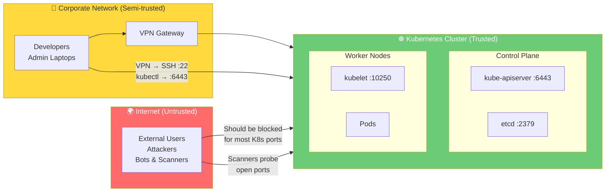

### Three Zones to Protect

| Zone Boundary | "External" Means | Enforcement Tool |
|---|---|---|
| **Internet → Network** | Any traffic from the public internet | Perimeter firewall, cloud security groups |
| **Network → Server** | Any traffic from the corporate LAN | Host-based firewall (UFW, iptables) |
| **Node → Pod** | Traffic from outside the pod's namespace | Kubernetes NetworkPolicy |
| **Pod → Pod** | Cross-namespace or cross-service traffic | Kubernetes NetworkPolicy |

---

## 2. Why Minimising External Access Matters

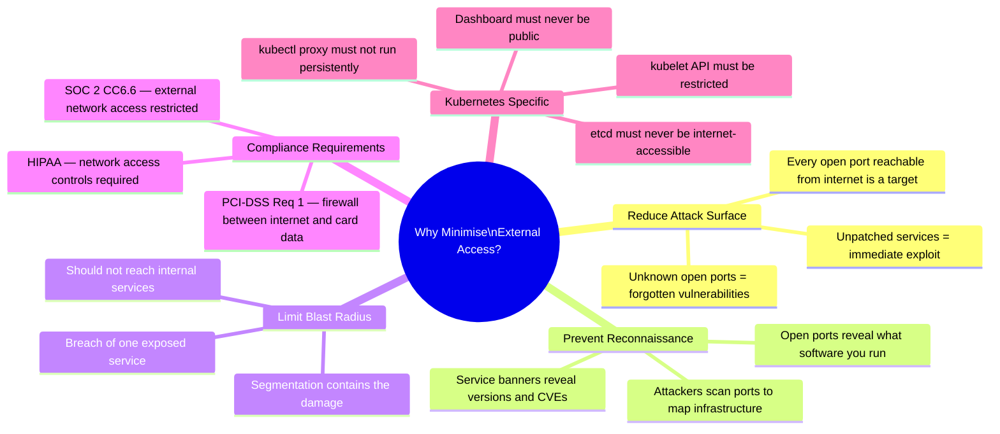

### What Happens Without Network Restriction

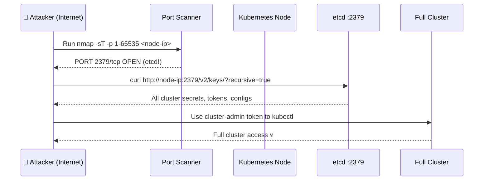

This is not theoretical — this exact attack happened repeatedly with exposed etcd instances in 2018.

---

## 3. Verifying What Your Server Exposes

Before you can restrict external access, you need to know exactly what is currently exposed.

### Check SSH Service Status

```bash
# Is SSH running and on which address?
systemctl status ssh

# What port is SSH registered for?
cat /etc/services | grep ssh
# ssh    22/tcp    # SSH Remote Login Protocol
# ssh    22/udp    # SSH Remote Login Protocol

# Verify actual listening address
ss -tlpn | grep sshd
# tcp  LISTEN  0  128  0.0.0.0:22  0.0.0.0:*  users:(("sshd",pid=1234))
# 0.0.0.0 = all interfaces = reachable from anywhere on the network!
```

### Full Port Exposure Audit

```bash
# Method 1 — netstat (classic)
netstat -an | grep -w LISTEN

# Method 2 — ss (modern, preferred)
sudo ss -tulpn

# Method 3 — lsof (verbose, shows file descriptors)
sudo lsof -i -P -n | grep LISTEN

# Method 4 — scan yourself from outside perspective
sudo nmap -sT -p 1-65535 $(hostname -I | awk '{print $1}')

# Method 5 — scan from another node in the cluster
# This shows what is ACTUALLY reachable, accounting for all firewall rules
nmap -sT 10.0.1.10   # From worker node to control plane
```

---

## 4. Understanding Network Exposure — 0.0.0.0 vs 127.0.0.1

The **binding address** of a service is the most important field to understand when assessing exposure:

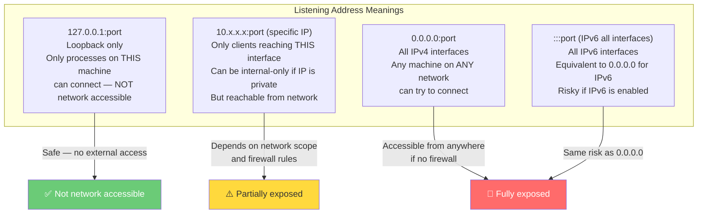

### Quick Exposure Classification

```bash
# Classify all listening ports by exposure level
sudo ss -tulpn | grep LISTEN | while read line; do
    addr=$(echo $line | awk '{print $5}')
    port=$(echo $addr | rev | cut -d: -f1 | rev)
    ip=$(echo $addr | rev | cut -d: -f2- | rev)

    if [[ "$ip" == "127.0.0.1" || "$ip" == "::1" ]]; then
        echo "✅ LOCALHOST: $addr"
    elif [[ "$ip" == "0.0.0.0" || "$ip" == "::" || "$ip" == "*" ]]; then
        echo "🔴 ALL INTERFACES: $addr"
    else
        echo "⚠️  SPECIFIC IP: $addr"
    fi
done
```

---

## 5. Analysing a Real netstat Output

Let's analyse the output from the KodeKloud lesson in detail:

```bash
netstat -an | grep -w LISTEN
```

```
tcp  0  0  127.0.0.1:10248   0.0.0.0:*  LISTEN  ← kubelet healthz      ✅ localhost only
tcp  0  0  127.0.0.1:10249   0.0.0.0:*  LISTEN  ← kube-proxy metrics   ✅ localhost only
tcp  0  0  127.0.0.1:2379    0.0.0.0:*  LISTEN  ← etcd (loopback)      ✅ localhost only
tcp  0  0  10.53.64.6:2379   0.0.0.0:*  LISTEN  ← etcd (node IP)       ⚠️ internal network
tcp  0  0  10.53.64.6:2380   0.0.0.0:*  LISTEN  ← etcd peer            ⚠️ internal network
tcp  0  0  127.0.0.1:42893   0.0.0.0:*  LISTEN  ← dynamic port         ✅ localhost only
tcp  0  0  127.0.0.1:2381    0.0.0.0:*  LISTEN  ← etcd metrics         ✅ localhost only
tcp  0  0  127.0.0.11:46607  0.0.0.0:*  LISTEN  ← Docker DNS           ✅ Docker internal
tcp  0  0  0.0.0.0:80        0.0.0.0:*  LISTEN  ← HTTP (apache?)       🔴 ALL INTERFACES
tcp  0  0  0.0.0.0:8080      0.0.0.0:*  LISTEN  ← Unknown service      🔴 ALL INTERFACES
tcp  0  0  127.0.0.1:10257   0.0.0.0:*  LISTEN  ← controller-manager   ✅ localhost only
tcp  0  0  127.0.0.1:10259   0.0.0.0:*  LISTEN  ← kube-scheduler       ✅ localhost only
tcp  0  0  0.0.0.0:53        0.0.0.0:*  LISTEN  ← DNS                  ⚠️ Investigate
tcp  0  0  0.0.0.0:22        0.0.0.0:*  LISTEN  ← SSH                  ⚠️ Restrict source IPs
tcp6 0  0  :::10250          :::*        LISTEN  ← kubelet API          ⚠️ all interfaces
tcp6 0  0  :::6443           :::*        LISTEN  ← kube-apiserver       ⚠️ Needs firewall rule
tcp6 0  0  :::10256          :::*        LISTEN  ← kube-proxy healthz   ⚠️ restrict to local
tcp6 0  0  :::22             :::*        LISTEN  ← SSH (IPv6)           ⚠️ Restrict source IPs
tcp6 0  0  :::8888           :::*        LISTEN  ← kubectl proxy!       🔴 CRITICAL — remove!
```

### Prioritised Remediation List

| Priority | Port | Issue | Action |
|---|---|---|---|
| 🔴 Critical | `:::8888` | kubectl proxy — unauthenticated K8s API | Stop immediately |
| 🔴 Critical | `0.0.0.0:8080` | Unknown service on all interfaces | Identify and remove |
| 🔴 Critical | `0.0.0.0:80` | Web server — not needed on K8s node | Remove apache/nginx |
| 🟠 High | `0.0.0.0:53` | DNS on all interfaces — is this a DNS server? | Scope to internal only |
| 🟡 Medium | `:::6443` | API server all interfaces — add firewall rules | UFW allow only admin IPs |
| 🟡 Medium | `:::10250` | Kubelet all interfaces — restrict to cluster | UFW allow only apiserver IP |
| 🟡 Medium | `0.0.0.0:22` | SSH all interfaces — restrict source | UFW allow from admin networks |
| ✅ OK | `127.0.0.1:*` | All localhost-only bindings | No action needed |

---

## 6. Two Approaches to Network Security

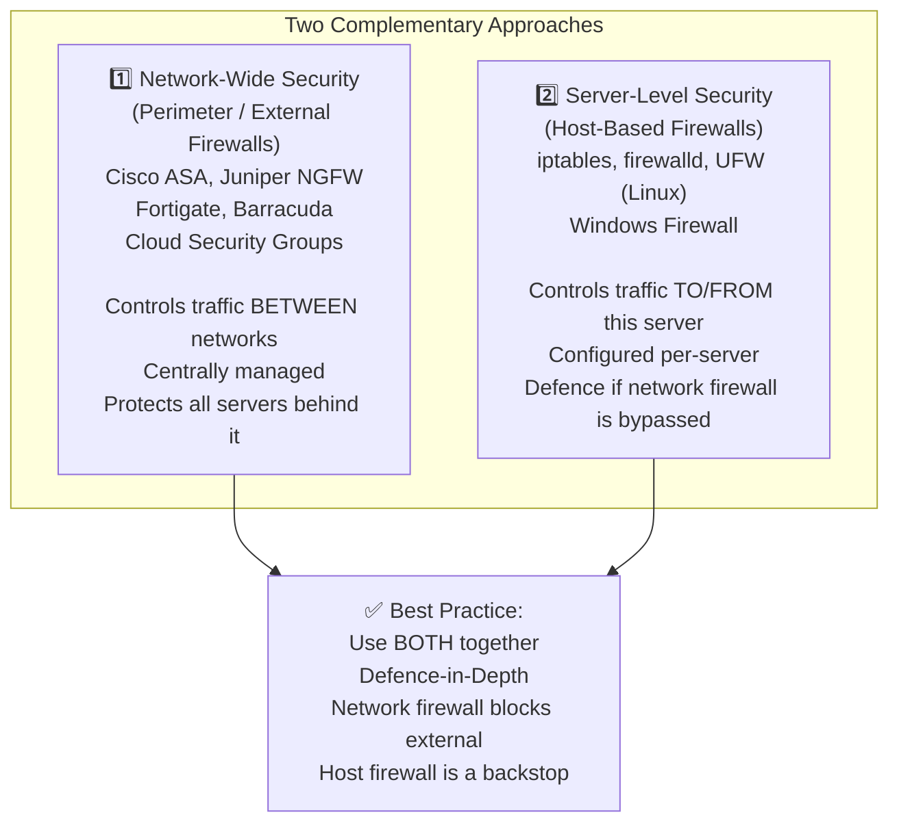

### Why You Need Both

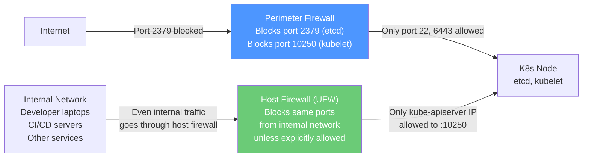

If a developer's laptop is compromised, the perimeter firewall won't help — the laptop is "inside" the network. The host firewall on each node provides the second layer of protection.

---

## 7. Layer 1 — Network-Wide Security (Perimeter Firewalls)

Perimeter firewalls operate at the **network edge** — controlling what traffic can enter or leave entire network segments.

### Enterprise Firewall Products

| Vendor | Product | Key Feature |
|---|---|---|
| **Cisco** | ASA (Adaptive Security Appliance) | Stateful inspection, VPN, IPS |
| **Juniper** | SRX Series (NextGen Firewall) | Zone-based policies, AppSecure |
| **Fortinet** | FortiGate | NGFW with SSL inspection, SD-WAN |
| **Barracuda** | CloudGen Firewall | Cloud-native, zero-trust |
| **Palo Alto** | PA Series | App-ID, User-ID, threat prevention |
| **Check Point** | Quantum Security Gateway | Unified threat management |

### What Perimeter Firewalls Do

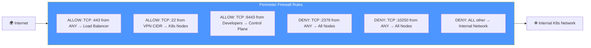

### Cloud-Native Perimeter Controls

In cloud environments, security groups and network ACLs serve as the perimeter firewall:

```bash
# AWS Security Group — restrict etcd to internal only
aws ec2 authorize-security-group-ingress \
  --group-id sg-control-plane \
  --protocol tcp \
  --port 2379 \
  --source-group sg-control-plane   # Only from other control plane nodes

# Block etcd from internet
aws ec2 revoke-security-group-ingress \
  --group-id sg-control-plane \
  --protocol tcp \
  --port 2379 \
  --cidr 0.0.0.0/0   # Remove any internet rule

# GCP Firewall Rule — allow kubelet only from apiserver
gcloud compute firewall-rules create allow-kubelet \
  --direction=INGRESS \
  --priority=1000 \
  --network=k8s-vpc \
  --action=ALLOW \
  --rules=tcp:10250 \
  --source-tags=control-plane \
  --target-tags=worker-node
```

---

## 8. Layer 2 — Server-Level Security (Host-Based Firewalls)

Host-based firewalls protect each individual server, regardless of what the network firewall allows. The three main tools on Linux:

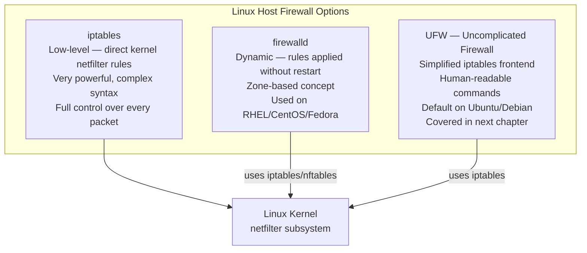

### iptables — The Foundation

Everything else (UFW, firewalld) builds on top of `iptables`. Understanding it helps you understand what the higher-level tools are doing:

```bash
# View current iptables rules
sudo iptables -L -v -n

# Allow established connections (important — don't lock yourself out!)
sudo iptables -A INPUT -m state --state ESTABLISHED,RELATED -j ACCEPT

# Allow loopback
sudo iptables -A INPUT -i lo -j ACCEPT

# Allow SSH from specific CIDR only
sudo iptables -A INPUT -p tcp --dport 22 -s 10.0.0.0/8 -j ACCEPT
sudo iptables -A INPUT -p tcp --dport 22 -j DROP   # Drop SSH from everywhere else

# Allow kube-apiserver from cluster network only
sudo iptables -A INPUT -p tcp --dport 6443 -s 10.0.0.0/8 -j ACCEPT
sudo iptables -A INPUT -p tcp --dport 6443 -j DROP

# Block a specific port entirely
sudo iptables -A INPUT -p tcp --dport 8080 -j DROP

# Block all other incoming (default deny)
sudo iptables -P INPUT DROP
sudo iptables -P FORWARD DROP
sudo iptables -P OUTPUT ACCEPT

# Save rules (persist across reboots)
sudo iptables-save > /etc/iptables/rules.v4
sudo apt install iptables-persistent  # Loads saved rules at boot
```

> **Note:** In the next chapter (Chapter 9), we cover UFW in detail — which is a friendlier interface to iptables and the primary tool you'll use on Ubuntu-based Kubernetes nodes.

---

## 9. Layer 3 — Cloud Security Groups

When Kubernetes runs on a cloud provider, **Security Groups** (AWS) or **Firewall Rules** (GCP) act as the network-level firewall before traffic even reaches the host firewall.

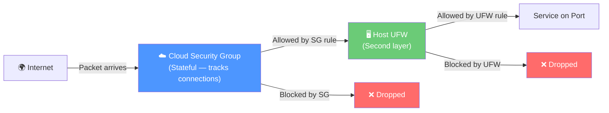

### Recommended Security Group Rules for K8s

```bash
# Control Plane Security Group
# Allow from internet: only 6443 (kubectl)
# Allow from VPN/admin: 22 (SSH)
# Allow from worker nodes: 2379, 2380 (etcd)
# Deny everything else

# Worker Node Security Group
# Allow from control plane: 10250 (kubelet)
# Allow from VPN/admin: 22 (SSH)
# Allow from internet (via LB): 30000-32767 (NodePort) — only if needed
# Deny everything else

# AWS example — control plane SG
aws ec2 create-security-group \
  --group-name k8s-control-plane \
  --description "Kubernetes control plane"

# Allow kubectl from admin CIDR
aws ec2 authorize-security-group-ingress \
  --group-id sg-12345678 \
  --protocol tcp --port 6443 \
  --cidr 10.0.0.0/8

# Allow etcd from worker nodes only (using SG reference)
aws ec2 authorize-security-group-ingress \
  --group-id sg-12345678 \
  --protocol tcp --port 2379 \
  --source-group sg-worker-nodes   # Only from worker SG

# Block everything else (SGs are default-deny for ingress)
```

---

## 10. Layer 4 — Kubernetes Network Policies

Even inside the cluster, traffic between pods should be restricted. This is the job of **Kubernetes NetworkPolicy** (covered in depth in the Cluster Setup section, Ch. 14).

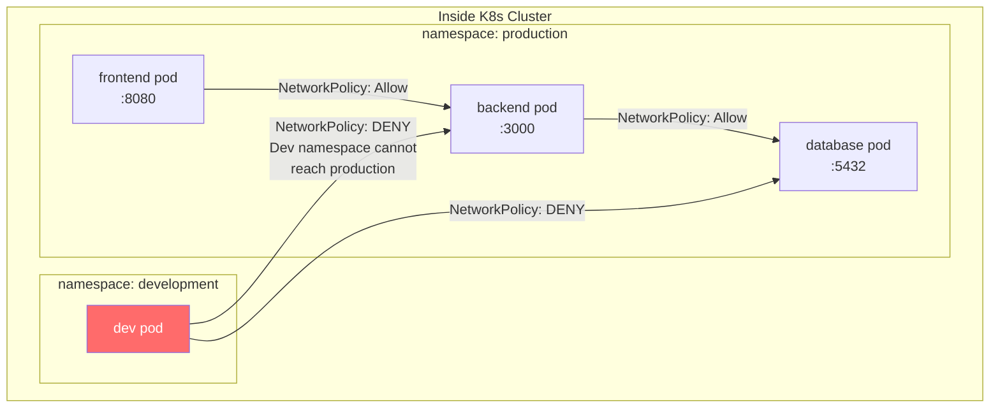

```yaml
# Default deny all in production namespace
apiVersion: networking.k8s.io/v1
kind: NetworkPolicy
metadata:
  name: default-deny-all
  namespace: production
spec:
  podSelector: {}
  policyTypes:
  - Ingress
  - Egress
---
# Allow frontend → backend only
apiVersion: networking.k8s.io/v1
kind: NetworkPolicy
metadata:
  name: allow-frontend-to-backend
  namespace: production
spec:
  podSelector:
    matchLabels:
      app: backend
  ingress:
  - from:
    - podSelector:
        matchLabels:
          app: frontend
    ports:
    - port: 3000
```

---

## 11. Defence-in-Depth: All Four Layers Together

The full security model combines all layers — each one catches what the previous one misses:

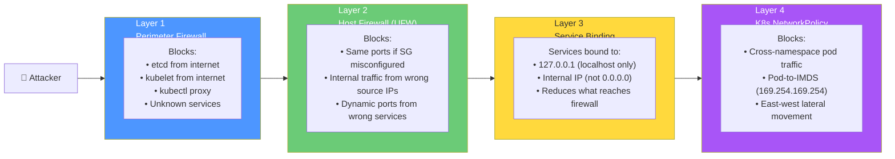

### What Each Layer Catches

| Threat | Layer 1 (Perimeter) | Layer 2 (Host FW) | Layer 3 (Binding) | Layer 4 (NetPol) |
|---|---|---|---|---|
| Internet → etcd | ✅ Blocks | ✅ Backstop | ✅ Localhost-only | — |
| Internet → kubelet | ✅ Blocks | ✅ Backstop | — | — |
| Compromised dev laptop → etcd | ❌ Misses (inside network) | ✅ Catches | — | — |
| Pod → IMDS | ❌ Misses | ❌ Misses | — | ✅ Catches |
| Pod → other namespace | ❌ Misses | ❌ Misses | — | ✅ Catches |
| kubectl proxy exposed | ✅ Blocks | ✅ Backstop | ✅ Bind to 127.0.0.1 | — |

---

## 12. Scoping Services to the Right Interface

The best network security is to bind services to the most restrictive address possible in the first place — before firewall rules even come into play.

### Configuring Services to Bind Correctly

```bash
# ── SSH — restrict to specific interface ─────────────────────────
# /etc/ssh/sshd_config
ListenAddress 10.0.1.10    # Only on internal IP — not all interfaces
# Or for admin VPN interface only:
ListenAddress 172.16.0.1

# ── kubelet — bind to node IP only ───────────────────────────────
# In kubelet config: /var/lib/kubelet/config.yaml
address: 10.0.1.10         # Not 0.0.0.0

# ── kube-proxy — metrics localhost only ──────────────────────────
# In kube-proxy ConfigMap
metricsBindAddress: "127.0.0.1:10249"   # Not 0.0.0.0

# ── etcd — bind only to required interfaces ──────────────────────
# In /etc/kubernetes/manifests/etcd.yaml
# --listen-client-urls=https://127.0.0.1:2379,https://NODE_IP:2379
# NOT: --listen-client-urls=https://0.0.0.0:2379

# ── kubectl proxy — localhost only when needed ───────────────────
kubectl proxy --address='127.0.0.1' --port=8001
# Note: NEVER bind to 0.0.0.0 and NEVER run as a persistent service
```

### Service Binding Decision Tree

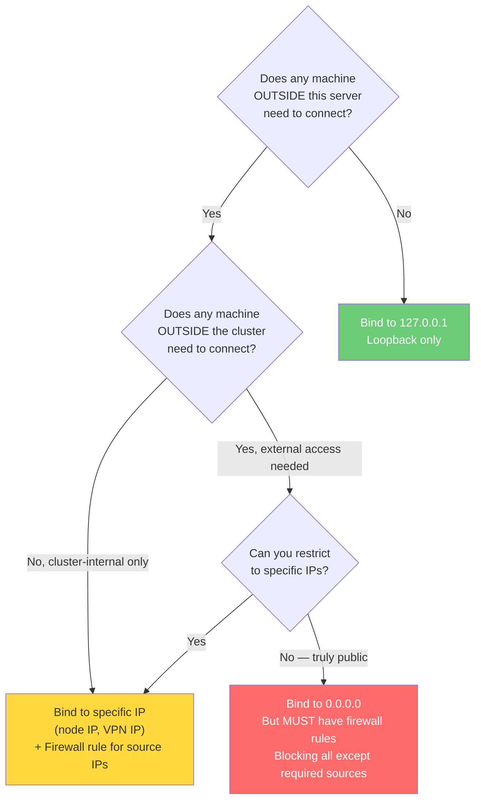

---

## 13. Real-World Scenarios

### Scenario 1 — The 2018 etcd Exposure Epidemic

**What happened:** Security researchers using Shodan (an internet port scanner) discovered over **2,000 etcd clusters** exposed on port 2379 to the public internet with no authentication. Many were Kubernetes etcd instances. Data from these clusters — including secrets, service account tokens, TLS certificates, and application configs — was freely readable.

```bash
# How the researcher found them (Shodan query)
# shodan search 'product:"etcd"'

# What was accessible
curl http://<public-ip>:2379/v2/keys/?recursive=true | python3 -m json.tool
# Returned: complete etcd database, all K8s secrets in plaintext

# Root cause
netstat -an | grep 2379
# tcp  0  0  0.0.0.0:2379  0.0.0.0:*  LISTEN  ← etcd bound to ALL interfaces!

# No authentication configured:
# --listen-client-urls=http://0.0.0.0:2379  (HTTP not HTTPS!)
# --trusted-ca-file not set
```

**Prevention — three controls needed:**

```bash
# 1. Bind etcd to internal IP only
# In /etc/kubernetes/manifests/etcd.yaml:
# --listen-client-urls=https://127.0.0.1:2379,https://10.0.1.10:2379

# 2. UFW blocks port 2379 from internet
sudo ufw deny 2379/tcp
sudo ufw allow from 10.0.0.0/8 to any port 2379

# 3. Cloud security group — no internet → port 2379
aws ec2 revoke-security-group-ingress \
  --group-id sg-control-plane \
  --protocol tcp --port 2379 --cidr 0.0.0.0/0
```

---

### Scenario 2 — Kubernetes Dashboard Publicly Exposed

**Situation:** A startup's DevOps team deployed the Kubernetes dashboard using `kubectl proxy --address=0.0.0.0 --disable-filter=true` — the `--disable-filter=true` flag removes the security check that requires requests to come from localhost. The dashboard was then accessible from any machine. The `--address=0.0.0.0` made it network-accessible. Within a week, automated tools discovered the open dashboard and used it to deploy malicious workloads.

```bash
# The dangerous command used
kubectl proxy --address='0.0.0.0' --port=8001 --disable-filter=true
# Now ANYONE can reach the K8s API via http://node-ip:8001

# Detection
ss -tulpn | grep 8001
# tcp  LISTEN  0  128  0.0.0.0:8001  ...  users:(("kubectl"))
# 0.0.0.0 = accessible from network!

# Prevention
# Option 1: Localhost only (correct way to use kubectl proxy)
kubectl proxy --address='127.0.0.1' --port=8001
# Then use SSH tunnelling: ssh -L 8001:localhost:8001 user@node
# Access dashboard at http://localhost:8001 from your laptop

# Option 2: Block at UFW level
sudo ufw deny 8001/tcp
```

---

### Scenario 3 — Lateral Movement via Unrestricted Internal Port

**Situation:** A developer's laptop is compromised with malware. The attacker uses the laptop (which has VPN access to the corporate network) to scan and probe internal Kubernetes nodes. They discover that the kubelet API (port 10250) is reachable from the developer's network segment with no authentication (anonymous auth enabled on kubelet). They use the kubelet API to exec into pods and steal secrets.

```bash
# Attacker from compromised laptop
curl -sk https://k8s-worker-01:10250/pods | jq .items[].metadata.name
# Lists all pods on the worker — no auth needed!

curl -sk https://k8s-worker-01:10250/run/default/web-app/web-app \
  -d "cmd=cat /run/secrets/kubernetes.io/serviceaccount/token"
# Runs command in container — retrieves service account token!
```

**Dual fix — kubelet auth AND host firewall:**

```bash
# Fix 1: Enable kubelet authentication (Ch. 10 — Kubelet Security)
# /var/lib/kubelet/config.yaml
# authentication:
#   anonymous:
#     enabled: false

# Fix 2: UFW restricts port 10250 to only the kube-apiserver IP
sudo ufw allow from 10.0.1.10 to any port 10250 proto tcp comment 'kubelet from apiserver'
sudo ufw deny 10250/tcp comment 'block kubelet from all others'
```

---

## 14. Common Mistakes & Gotchas

| Mistake | Consequence | Fix |
|---|---|---|
| Relying only on perimeter firewall | Compromised internal machine bypasses it | Always add host-based firewall (UFW) |
| Services bound to `0.0.0.0` without firewall | Any network access = any machine can connect | Bind to specific IP or add UFW rules |
| Thinking `127.0.0.1` services are totally safe | SSH tunnelling can expose them remotely | Audit who has SSH access, disable TCP forwarding |
| No default-deny firewall policy | Any new service that starts is immediately accessible | `ufw default deny incoming` always |
| Firewall allows port but service is removed | Port is still "open" according to firewall rules — confusing | Clean up firewall rules when services are removed |
| Security group on cloud but no host firewall | Cloud SG is misconfigured → all exposed | Both layers always |
| Kubernetes NetworkPolicy not deployed | All pods can talk to all pods | Deploy CNI plugin + default-deny NetworkPolicy |
| DNS port 53 open to internet | DNS amplification DDoS attack vector | Scope DNS to internal CIDR only |
| Not auditing after every deployment | New services introduce new ports | Scan after every change |

---

## 15. CKS Exam Tips

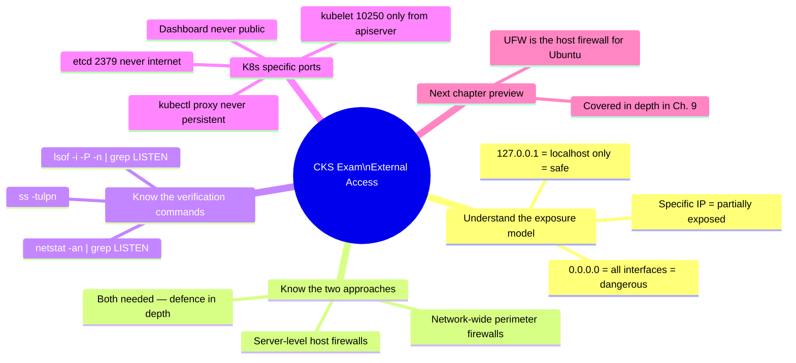

### Quick Reference — The External Access Checklist

```bash
# 1. Audit all open ports
sudo ss -tulpn

# 2. Flag all 0.0.0.0 listeners (exposed to all interfaces)
sudo ss -tulpn | grep '0.0.0.0'
sudo ss -tulpn | grep ':::'

# 3. Identify owners of unexpected ports
sudo ss -tulpn | grep ':8080'   # Who owns this?

# 4. Stop and remove unknown services
sudo systemctl stop <service>
sudo apt remove --purge <package>

# 5. Restrict SSH source IPs (UFW — next chapter)
sudo ufw allow from 10.0.0.0/8 to any port 22

# 6. Block K8s-internal ports from internet
sudo ufw deny 2379/tcp   # etcd
sudo ufw deny 10250/tcp  # kubelet — allow only from apiserver IP

# 7. Verify no internet access to sensitive ports
nmap -p 2379,10250,6443 <public-ip>   # From external machine
```

---

## Summary

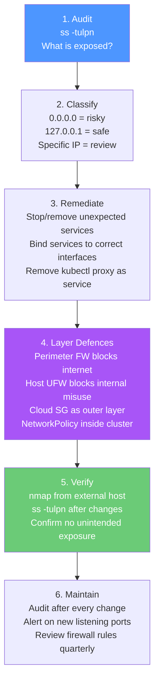

| Concept | Key Point |
|---|---|
| **0.0.0.0:port** | Service reachable from any network — highest risk |
| **127.0.0.1:port** | Localhost only — no external access |
| **Two approaches** | Perimeter (network-wide) + Host-based (per-server) — use both |
| **Perimeter tools** | Cisco ASA, Juniper NGFW, Fortinet, cloud security groups |
| **Host-based tools** | UFW, iptables, firewalld — covered in detail in Ch. 9 |
| **Critical K8s ports** | etcd (:2379) must never reach internet; kubelet (:10250) only from apiserver |
| **kubectl proxy** | Never bind to 0.0.0.0, never run as a persistent service |
| **Defence-in-depth** | Each layer catches what the previous one misses |
| **Verify exposure** | `ss -tulpn` + `nmap` from external perspective after every change |
