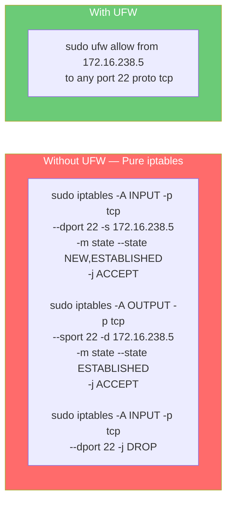
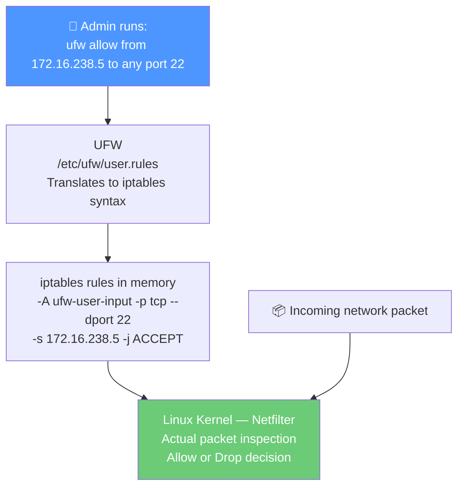
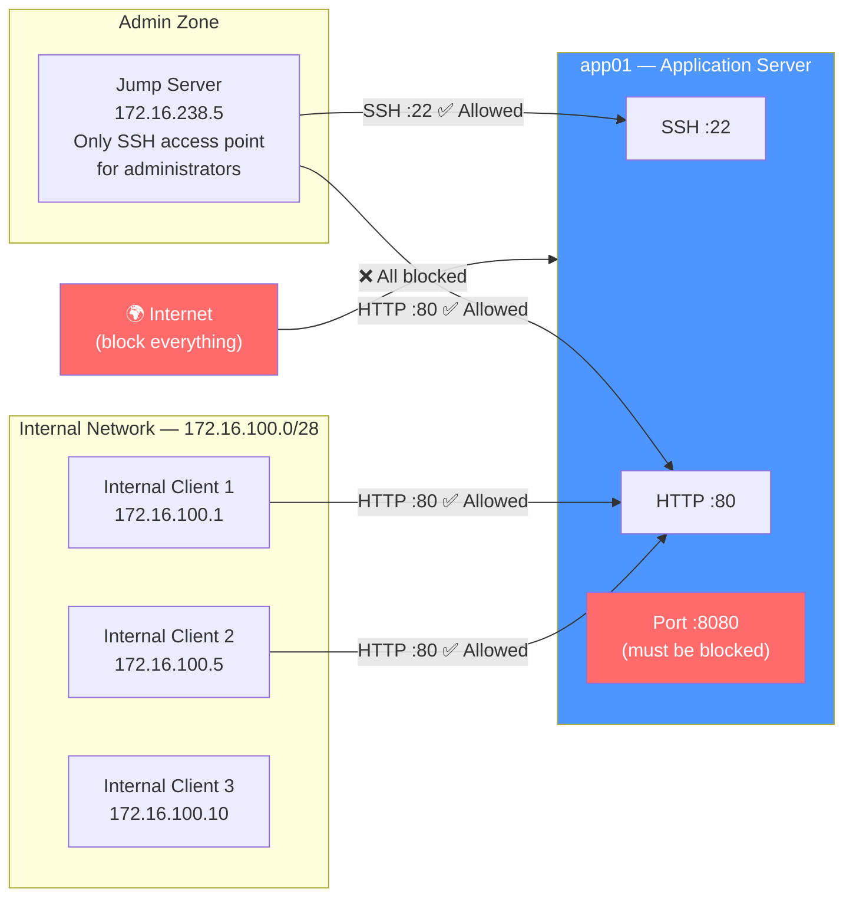
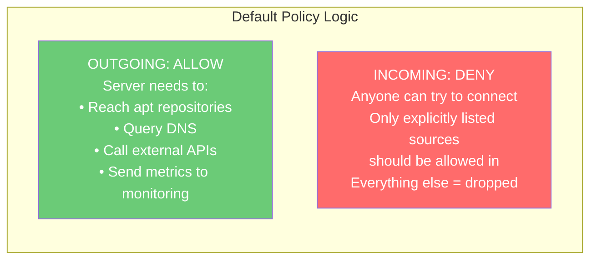
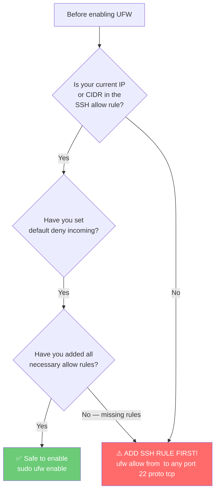
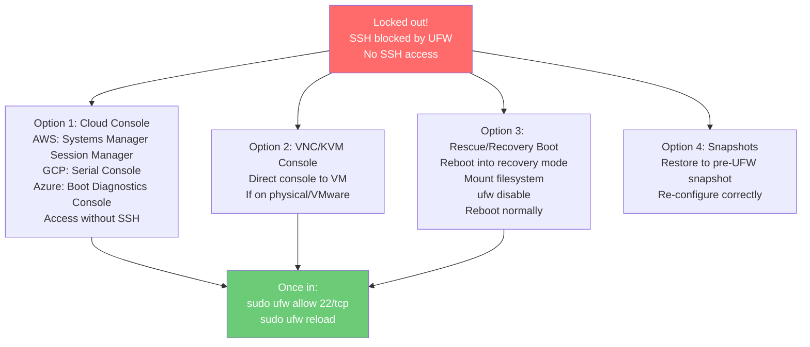
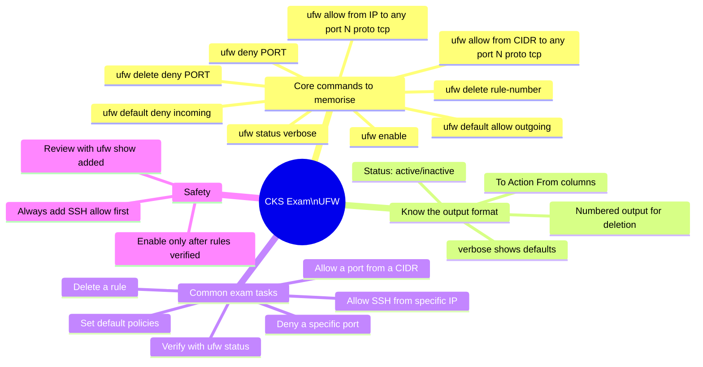
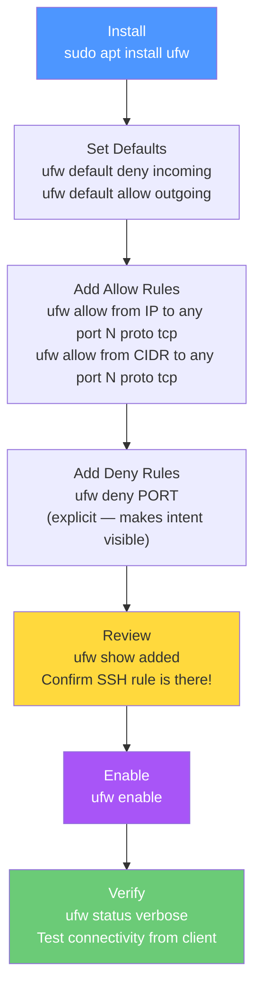

# 9 — UFW Firewall Basics

> **What you'll learn:** What UFW is and how it sits above iptables, how to configure default policies, write allow/deny rules scoped to specific IPs and CIDRs, enable and verify the firewall, delete rules safely, and apply UFW specifically to harden Kubernetes node ports.

---

## Table of Contents

1. [What is UFW?](#1-what-is-ufw)
2. [How UFW Works — The iptables Relationship](#2-how-ufw-works--the-iptables-relationship)
3. [The Scenario — Securing app01](#3-the-scenario--securing-app01)
4. [Inspecting Active Ports Before UFW](#4-inspecting-active-ports-before-ufw)
5. [Installing UFW](#5-installing-ufw)
6. [Configuring Default Policies](#6-configuring-default-policies)
7. [Writing Allow Rules](#7-writing-allow-rules)
8. [Writing Deny Rules](#8-writing-deny-rules)
9. [Enabling UFW Safely](#9-enabling-ufw-safely)
10. [Reading and Interpreting UFW Status](#10-reading-and-interpreting-ufw-status)
11. [Deleting Rules](#11-deleting-rules)
12. [UFW for Kubernetes Nodes](#12-ufw-for-kubernetes-nodes)
13. [UFW Logging](#13-ufw-logging)
14. [UFW Application Profiles](#14-ufw-application-profiles)
15. [Real-World Scenarios](#15-real-world-scenarios)
16. [Common Mistakes & Gotchas](#16-common-mistakes--gotchas)
17. [CKS Exam Tips](#17-cks-exam-tips)

---

## 1. What is UFW?

**UFW (Uncomplicated Firewall)** is a simplified command-line interface for managing Linux firewall rules. It was created specifically to make `iptables` — Linux's powerful but complex packet filtering system — accessible to administrators without deep networking expertise.



Both achieve the same result — but UFW is human-readable, less error-prone, and easier to audit.

### Where UFW Fits

UFW is the **default firewall management tool on Ubuntu and Debian systems** — which includes most Kubernetes node operating systems in production. When you install Ubuntu, UFW is installed but **inactive by default**.

| Tool | Level | Use Case |
|---|---|---|
| **Netfilter** | Kernel | The actual packet filtering engine — lowest level |
| **iptables** | Kernel interface | Direct rule management — powerful, complex |
| **nftables** | Kernel interface | Modern replacement for iptables |
| **UFW** | User-space frontend | Simplifies iptables — Ubuntu/Debian |
| **firewalld** | User-space frontend | Simplifies iptables/nftables — RHEL/CentOS |

---

## 2. How UFW Works — The iptables Relationship


UFW is a frontend — it translates your simple `ufw allow` commands into the complex iptables rules that the kernel actually enforces:



### UFW Configuration Files

```bash
# UFW stores rules in these files:
/etc/ufw/ufw.conf         # Main config — ENABLED=yes/no, logging level
/etc/ufw/user.rules       # IPv4 rules you've defined
/etc/ufw/user6.rules      # IPv6 rules (mirrors user.rules for IPv6)
/etc/ufw/before.rules     # Rules applied BEFORE user rules
/etc/ufw/after.rules      # Rules applied AFTER user rules
/etc/default/ufw          # Default policies and kernel module config

# View the raw iptables rules UFW generated
sudo iptables -L -v -n --line-numbers
```

---

## 3. The Scenario — Securing app01


The scenario we'll work through:



### The Rules We Need to Implement

| Source | Destination Port | Action | Reason |
|---|---|---|---|
| `172.16.238.5` (jump server) | `:22` TCP | ALLOW | Admin SSH access |
| `172.16.238.5` (jump server) | `:80` TCP | ALLOW | Admin web access |
| `172.16.100.0/28` (internal) | `:80` TCP | ALLOW | Internal client web access |
| `Anywhere` | `:8080` | DENY | Block explicitly |
| `Anywhere` (default) | All other | DENY | Default deny incoming |

---

## 4. Inspecting Active Ports Before UFW

Before writing any firewall rules, always audit what is currently listening:

```bash
# Check what's listening
netstat -an | grep -w LISTEN
```

```
tcp  0  0  0.0.0.0:22    0.0.0.0:*  LISTEN   ← SSH — allow from jump server only
tcp  0  0  0.0.0.0:80    0.0.0.0:*  LISTEN   ← HTTP — allow from jump + internal
tcp  0  0  0.0.0.0:8080  0.0.0.0:*  LISTEN   ← Unknown — BLOCK this
```

All three are bound to `0.0.0.0` — meaning any machine on the network can currently reach all three. Without UFW, there is no firewall protection at all.

```bash
# Also cross-reference with ss for process names
sudo ss -tulpn | grep -E ':22|:80|:8080'
# tcp  LISTEN  0.0.0.0:22    users:(("sshd",pid=1234))
# tcp  LISTEN  0.0.0.0:80    users:(("apache2",pid=5678))
# tcp  LISTEN  0.0.0.0:8080  users:(("python3",pid=9012))
```

---

## 5. Installing UFW

```bash
# Update package lists first
sudo apt-get update

# Install UFW (usually pre-installed on Ubuntu)
sudo apt-get install ufw -y

# Verify installation
which ufw
ufw --version

# Check current status — should be inactive on fresh install
sudo ufw status
# Status: inactive
```

> **Note:** UFW is pre-installed on Ubuntu 18.04+ but inactive by default. This is intentional — you configure your rules BEFORE enabling it to avoid locking yourself out.

---

## 6. Configuring Default Policies

Default policies define what happens to traffic that doesn't match any specific rule. Always set these **before** adding specific rules and **before** enabling UFW.

```bash
# Allow all outgoing traffic (servers need to make outbound connections)
sudo ufw default allow outgoing
# Default outgoing policy changed to 'allow'
# (be sure to update your rules accordingly)

# Deny all incoming traffic by default (secure baseline)
sudo ufw default deny incoming
# Default incoming policy changed to 'deny'
# (be sure to update your rules accordingly)

# Optional: deny all forwarding (this node is not a router)
sudo ufw default deny forward
```

### Why These Defaults?



### Default Policy Options

| Policy | Effect |
|---|---|
| `allow` | Permit all traffic in this direction (unless a specific DENY rule matches) |
| `deny` | Drop packets silently — sender doesn't know the port is blocked |
| `reject` | Send back a "connection refused" — sender is notified |

> **`deny` vs `reject`:** `deny` drops packets silently (attackers don't know the port exists). `reject` sends back a RST/ICMP unreachable (faster for legitimate clients, but confirms the host exists). For security, `deny` is preferred for default policy.

---

## 7. Writing Allow Rules

UFW allow rules follow this general syntax:

```
ufw allow from <source> to <destination> port <port> proto <protocol>
```

### Rule 1 — SSH from Jump Server Only

```bash
# Allow TCP port 22 ONLY from the jump server IP
sudo ufw allow from 172.16.238.5 to any port 22 proto tcp
# Rule added
# Rule added (v6)
```

**Reading this command:**
- `from 172.16.238.5` → only packets from this specific IP
- `to any` → to any of this server's IP addresses
- `port 22` → destination port 22
- `proto tcp` → TCP only (SSH doesn't use UDP)

### Rule 2 — HTTP from Jump Server

```bash
sudo ufw allow from 172.16.238.5 to any port 80 proto tcp
```

### Rule 3 — HTTP from Internal Network CIDR

```bash
# Allow port 80 from the entire 172.16.100.0/28 subnet
# /28 = 14 usable hosts (172.16.100.1 to 172.16.100.14)
sudo ufw allow from 172.16.100.0/28 to any port 80 proto tcp
```

### UFW Allow Syntax Reference

```bash
# ── By port number ────────────────────────────────────────────
sudo ufw allow 22                     # TCP + UDP port 22, from anywhere
sudo ufw allow 22/tcp                 # TCP only
sudo ufw allow 22/udp                 # UDP only

# ── By service name ───────────────────────────────────────────
sudo ufw allow ssh                    # Same as port 22/tcp
sudo ufw allow http                   # Same as port 80/tcp
sudo ufw allow https                  # Same as port 443/tcp

# ── By source IP ──────────────────────────────────────────────
sudo ufw allow from 10.0.0.5          # All ports from this IP
sudo ufw allow from 10.0.0.5 to any port 22          # Port 22 from this IP
sudo ufw allow from 10.0.0.5 to any port 22 proto tcp # TCP 22 from this IP

# ── By source CIDR ────────────────────────────────────────────
sudo ufw allow from 10.0.0.0/8       # All ports from this CIDR
sudo ufw allow from 10.0.0.0/8 to any port 6443 proto tcp

# ── Port ranges ───────────────────────────────────────────────
sudo ufw allow 30000:32767/tcp        # NodePort range
sudo ufw allow from 10.0.0.0/8 to any port 2379:2380 proto tcp

# ── To a specific local IP (multi-homed servers) ─────────────
sudo ufw allow in on eth0 to 10.0.1.10 port 80 proto tcp

# ── With a comment (great for documentation) ─────────────────
sudo ufw allow from 172.16.238.5 to any port 22 proto tcp comment 'SSH from jump server'
sudo ufw allow from 10.0.0.0/8 to any port 6443 proto tcp comment 'kubectl from admin network'
```

---

## 8. Writing Deny Rules

```bash
# Explicitly deny port 8080 (even though default policy already blocks it)
sudo ufw deny 8080
# Rule added
# Rule added (v6)
```

**Why add an explicit deny when the default is already deny?**
- Makes the intention clear — anyone reading the rules knows port 8080 is intentionally blocked
- Acts as documentation — "this port exists on the server and we know it, and we block it on purpose"
- The explicit deny also appears in `ufw status` for visibility

### Deny vs Reject

```bash
# deny — silently drop (attacker gets no feedback, best for security)
sudo ufw deny 8080

# reject — send back connection refused (polite, but confirms host exists)
sudo ufw reject 8080
```

### Deny Examples

```bash
# Block all traffic from a specific IP (ban a scanner/attacker)
sudo ufw deny from 203.0.113.100

# Block a specific port from everywhere
sudo ufw deny 23/tcp                  # Block telnet

# Block a CIDR range
sudo ufw deny from 192.168.0.0/16 to any port 3306   # Block MySQL from internal CIDR
```

---

## 9. Enabling UFW Safely

Before enabling UFW, always verify your rules are correct — especially that you haven't forgotten to allow SSH:

```bash
# Step 1 — Review all rules before enabling
sudo ufw show added
# Added user rules (see 'ufw help' for more information):
# ufw allow from 172.16.238.5 to any port 22 proto tcp
# ufw allow from 172.16.238.5 to any port 80 proto tcp
# ufw allow from 172.16.100.0/28 to any port 80 proto tcp
# ufw deny 8080

# Step 2 — Check: is SSH allowed for your current IP?
# If you're connected from 172.16.238.5 and that rule is there — safe to enable
# If you forgot to add SSH allow — ADD IT NOW before enabling!

# Step 3 — Enable UFW
sudo ufw enable
```

```
Command may disrupt existing ssh connections. Proceed with operation (y|n)? y
Firewall is active and enabled on system startup
```

> ⚠️ **Critical safety warning:** Before typing `y`, confirm in a second terminal that your SSH connection still works with the rules in place. Better still, if you have console access to the server (KVM, cloud console, iDRAC), use that as a fallback.

### The Lock-Out Prevention Checklist



---

## 10. Reading and Interpreting UFW Status

```bash
# Basic status
sudo ufw status
# Status: active
# ...rules...

# Verbose — shows default policies too
sudo ufw status verbose

# Numbered — shows rule numbers (needed for deletion by number)
sudo ufw status numbered
```

### Understanding the Status Output

```
Status: active

     To                         Action      From
     --                         ------      ----
[ 1] 22/tcp                     ALLOW IN    172.16.238.5
[ 2] 80/tcp                     ALLOW IN    172.16.238.5
[ 3] 80/tcp                     ALLOW IN    172.16.100.0/28
[ 4] 8080                       DENY IN     Anywhere
[ 5] 8080 (v6)                  DENY IN     Anywhere (v6)
```

| Column | Meaning |
|---|---|
| `[ 1]` | Rule number (used for `ufw delete <number>`) |
| `To` | Port/protocol being filtered |
| `Action` | `ALLOW IN`, `DENY IN`, `REJECT IN` |
| `From` | Source IP, CIDR, or `Anywhere` |
| `(v6)` | Separate IPv6 version of the rule |

### Verbose Output — More Detail

```bash
sudo ufw status verbose
```

```
Status: active
Logging: on (low)
Default: deny (incoming), allow (outgoing), deny (forward)
New profiles: skip

To                         Action      From
--                         ------      ----
22/tcp                     ALLOW IN    172.16.238.5
80/tcp                     ALLOW IN    172.16.238.5
80/tcp                     ALLOW IN    172.16.100.0/28
8080                       DENY IN     Anywhere
8080 (v6)                  DENY IN     Anywhere (v6)
```

The `Default:` line confirms your default policies — this is what you want to see: `deny (incoming), allow (outgoing)`.

---

## 11. Deleting Rules

### Method 1 — Delete by Rule Specification

```bash
# Delete by specifying the exact rule
sudo ufw delete deny 8080
# Rule deleted
# Rule deleted (v6)

# Delete an allow rule
sudo ufw delete allow from 172.16.100.0/28 to any port 80 proto tcp

# Verify deletion
sudo ufw status
```

### Method 2 — Delete by Rule Number

```bash
# Step 1 — View rules with numbers
sudo ufw status numbered
# [ 1] 22/tcp    ALLOW IN  172.16.238.5
# [ 2] 80/tcp    ALLOW IN  172.16.238.5
# [ 3] 80/tcp    ALLOW IN  172.16.100.0/28
# [ 4] 8080      DENY IN   Anywhere
# [ 5] 8080 (v6) DENY IN   Anywhere (v6)

# Step 2 — Delete rule 5 first (always delete higher numbers first to avoid renumbering)
sudo ufw delete 5
# Deleting:
#  deny  8080
# Proceed with operation (y|n)? y
# Rule deleted

# Step 3 — Delete rule 4 (now renumbered after step 2)
sudo ufw delete 4
# Deleting:
#  deny  8080
# Proceed with operation (y|n)? y
# Rule deleted

# Verify
sudo ufw status
```

> ⚠️ **Numbering tip:** When deleting multiple rules by number, always **start from the highest number and work downward**. After deleting rule 5, all subsequent rules shift their numbers down by 1. If you deleted rule 4 first, what was rule 5 becomes rule 4 — causing confusion.

### Method 3 — Reset Everything

```bash
# Nuclear option — remove ALL rules and disable UFW
sudo ufw reset
# This will reset all rules to their defaults
# WARNING: This will reset all rules to installed defaults.
# Proceed with operation (y|n)? y

# UFW is now disabled and all rules are cleared
# You must re-configure and re-enable from scratch
```

---

## 12. UFW for Kubernetes Nodes

Now let's apply UFW to real Kubernetes nodes. The rules differ between control plane and worker nodes.

### Control Plane Node — Full UFW Setup

```bash
# ── Set defaults ─────────────────────────────────────────────────
sudo ufw default deny incoming
sudo ufw default allow outgoing
sudo ufw default deny forward

# ── Allow SSH from admin/VPN network only ────────────────────────
sudo ufw allow from 10.0.0.0/8 to any port 22 proto tcp \
  comment 'SSH from admin network'

# ── Allow kubectl from admin network ─────────────────────────────
sudo ufw allow from 10.0.0.0/8 to any port 6443 proto tcp \
  comment 'kube-apiserver from admin and workers'

# ── Allow etcd from other control plane nodes only ───────────────
# Replace with actual control plane IPs
sudo ufw allow from 10.0.1.11 to any port 2379 proto tcp \
  comment 'etcd client from cp02'
sudo ufw allow from 10.0.1.12 to any port 2379 proto tcp \
  comment 'etcd client from cp03'
sudo ufw allow from 10.0.1.10 to any port 2380 proto tcp \
  comment 'etcd peer from cp01'
sudo ufw allow from 10.0.1.11 to any port 2380 proto tcp \
  comment 'etcd peer from cp02'
sudo ufw allow from 10.0.1.12 to any port 2380 proto tcp \
  comment 'etcd peer from cp03'

# ── Allow kubelet from apiserver ─────────────────────────────────
sudo ufw allow from 10.0.1.10 to any port 10250 proto tcp \
  comment 'kubelet from apiserver'

# ── Deny etcd from internet (explicit + visible in status) ───────
sudo ufw deny 2379/tcp comment 'Block etcd from all others'
sudo ufw deny 2380/tcp comment 'Block etcd peer from all others'

# ── Enable ───────────────────────────────────────────────────────
sudo ufw enable

# ── Verify ───────────────────────────────────────────────────────
sudo ufw status verbose
```

### Worker Node — Full UFW Setup

```bash
sudo ufw default deny incoming
sudo ufw default allow outgoing

# SSH from admin network
sudo ufw allow from 10.0.0.0/8 to any port 22 proto tcp \
  comment 'SSH from admin network'

# Kubelet API from apiserver only
sudo ufw allow from 10.0.1.10 to any port 10250 proto tcp \
  comment 'kubelet from kube-apiserver'

# NodePort range — only if needed, and only from load balancer IP
# sudo ufw allow from <LB-IP> to any port 30000:32767 proto tcp \
#   comment 'NodePort from load balancer'

# kube-proxy healthz — localhost only (no external rule needed)
# It's already bound to 0.0.0.0:10256 — restrict it
sudo ufw deny 10256/tcp comment 'kube-proxy healthz — block external'

sudo ufw enable
sudo ufw status verbose
```

### Expected Status After Kubernetes Hardening

```
Status: active
Logging: on (low)
Default: deny (incoming), allow (outgoing), deny (forward)

To                         Action      From
--                         ------      ----
22/tcp                     ALLOW IN    10.0.0.0/8         # SSH from admin
6443/tcp                   ALLOW IN    10.0.0.0/8         # kube-apiserver
2379/tcp                   ALLOW IN    10.0.1.11          # etcd from cp02
2379/tcp                   ALLOW IN    10.0.1.12          # etcd from cp03
2380/tcp                   ALLOW IN    10.0.1.10          # etcd peer cp01
2380/tcp                   ALLOW IN    10.0.1.11          # etcd peer cp02
2379/tcp                   DENY IN     Anywhere           # Block etcd all others
10250/tcp                  ALLOW IN    10.0.1.10          # kubelet from apiserver
```

---

## 13. UFW Logging

UFW can log packets that match rules — essential for security monitoring:

```bash
# Enable logging
sudo ufw logging on

# Set log level
sudo ufw logging low      # Log blocked packets (default)
sudo ufw logging medium   # + packets matching rules
sudo ufw logging high     # + all packets
sudo ufw logging full     # Maximum verbosity

# View UFW logs
sudo tail -f /var/log/ufw.log

# Or via journald
sudo journalctl -f | grep UFW

# Example log entry:
# [UFW BLOCK] IN=eth0 OUT= MAC=... SRC=203.0.113.100 DST=10.0.1.10
# LEN=44 TOS=0x00 PREC=0x00 TTL=54 ID=0 DF PROTO=TCP SPT=54321 DPT=2379
# WINDOW=65535 RES=0x00 SYN URGP=0
```

### Reading UFW Log Entries

```
[UFW BLOCK] IN=eth0 OUT= SRC=203.0.113.100 DST=10.0.1.10 PROTO=TCP SPT=54321 DPT=2379
│            │            │                  │              │            │         │
│            │            │                  │              │            │         └─ Destination port (etcd!)
│            │            │                  │              │            └─── Source port (ephemeral)
│            │            │                  │              └───────────── TCP protocol
│            │            │                  └─────────────── Destination (our node)
│            │            └────────────────────────────────── Source IP (attacker!)
│            └─────────────────────────────────────────────── Network interface
└──────────────────────────────────────────────────────────── UFW action (BLOCK = DROP)
```

```bash
# Count blocks by source IP (find scanners/attackers)
sudo grep 'UFW BLOCK' /var/log/ufw.log | awk '{print $13}' | cut -d= -f2 | sort | uniq -c | sort -rn | head -10

# Find blocks on etcd port (active attack attempts?)
sudo grep 'UFW BLOCK' /var/log/ufw.log | grep 'DPT=2379'

# Find blocks on SSH port (brute force attempt?)
sudo grep 'UFW BLOCK' /var/log/ufw.log | grep 'DPT=22' | wc -l
```

---

## 14. UFW Application Profiles

UFW ships with pre-defined profiles for common applications stored in `/etc/ufw/applications.d/`:

```bash
# List available application profiles
sudo ufw app list
# Available applications:
#   Apache
#   Apache Full
#   Apache Secure
#   OpenSSH
#   Nginx Full
#   ...

# Show what a profile includes
sudo ufw app info OpenSSH
# Profile: OpenSSH
# Title: Secure Shell Server
# Description: OpenSSH is a free implementation of the Secure Shell protocol.
# Ports: 22/tcp

# Use a profile in a rule
sudo ufw allow OpenSSH
# Equivalent to: ufw allow 22/tcp

# Create a custom profile for Kubernetes
sudo tee /etc/ufw/applications.d/kubernetes << 'EOF'
[Kubernetes API Server]
title=Kubernetes API Server
description=Kubernetes API server port
ports=6443/tcp

[Kubernetes Kubelet]
title=Kubernetes Kubelet API
description=Kubelet node API
ports=10250/tcp

[etcd]
title=etcd
description=etcd distributed key-value store
ports=2379:2380/tcp
EOF

# Now you can use:
sudo ufw allow "Kubernetes API Server"
```

---

## 15. Real-World Scenarios

### Scenario 1 — The Complete app01 Walkthrough

Working through the exact scenario from the lesson step by step:

```bash
# On app01 — starting state
netstat -an | grep -w LISTEN
# tcp  0.0.0.0:22    LISTEN   ← SSH
# tcp  0.0.0.0:80    LISTEN   ← HTTP
# tcp  0.0.0.0:8080  LISTEN   ← Unknown — must block

# Step 1 — Install and check UFW
sudo apt-get update && sudo apt-get install ufw -y
sudo ufw status
# Status: inactive

# Step 2 — Set defaults
sudo ufw default allow outgoing
sudo ufw default deny incoming

# Step 3 — Add allow rules
sudo ufw allow from 172.16.238.5 to any port 22 proto tcp    # SSH from jump server
sudo ufw allow from 172.16.238.5 to any port 80 proto tcp    # HTTP from jump server
sudo ufw allow from 172.16.100.0/28 to any port 80 proto tcp # HTTP from internal clients

# Step 4 — Explicitly deny 8080
sudo ufw deny 8080

# Step 5 — Review before enabling
sudo ufw show added
# ufw allow from 172.16.238.5 to any port 22 proto tcp
# ufw allow from 172.16.238.5 to any port 80 proto tcp
# ufw allow from 172.16.100.0/28 to any port 80 proto tcp
# ufw deny 8080

# Step 6 — Enable (from jump server 172.16.238.5 — SSH will still work)
sudo ufw enable
# Command may disrupt existing ssh connections. Proceed with operation (y|n)? y
# Firewall is active and enabled on system startup

# Step 7 — Verify
sudo ufw status
# Status: active
# To                          Action  From
# 22/tcp                      ALLOW   172.16.238.5
# 80/tcp                      ALLOW   172.16.238.5
# 80/tcp                      ALLOW   172.16.100.0/28
# 8080                        DENY    Anywhere

# Step 8 — Test from jump server (172.16.238.5)
ssh app01           # ✅ Works
curl http://app01   # ✅ Works

# Step 9 — Test port 8080 is blocked
curl http://app01:8080   # ❌ Connection refused / timeout

# Step 10 — Now delete the deny 8080 rule (as per KodeKloud exercise)
sudo ufw status numbered
# [ 4] 8080      DENY IN  Anywhere
# [ 5] 8080 (v6) DENY IN  Anywhere (v6)

sudo ufw delete 5   # Delete IPv6 rule first
sudo ufw delete 4   # Then IPv4
# (or: sudo ufw delete deny 8080)
```

---

### Scenario 2 — Kubernetes Node Accidentally Exposes etcd

**Situation:** A senior engineer is setting up a new control plane node. They forget to configure UFW before joining the cluster. The node is on a cloud VPC but the security group was accidentally set to "allow all inbound." Within hours, automated scanners probe port 2379 and start querying etcd.

```bash
# Discovery — logs show etcd queries from unknown IPs
sudo journalctl -u etcd | grep -v '10.0.1.' | grep 'GET\|PUT\|DELETE'
# 2024-07-29T14:23:11 etcserver: got request from unknown source 203.0.113.45

# Immediate remediation
# 1. Fix the cloud security group first (fastest)
aws ec2 revoke-security-group-ingress --group-id sg-XXXX \
  --protocol tcp --port 2379 --cidr 0.0.0.0/0

# 2. Add UFW as host-level backstop
sudo ufw default deny incoming
sudo ufw allow from 10.0.1.0/24 to any port 2379 proto tcp comment 'etcd internal only'
sudo ufw enable

# 3. Verify etcd is no longer reachable from internet
curl http://203.0.113.45:2379/health   # From external — should time out
# curl: (7) Failed to connect to 203.0.113.45 port 2379: Connection timed out
```

**Lesson:** UFW should be configured and enabled before a Kubernetes node joins the cluster, not after.

---

### Scenario 3 — Locking Yourself Out with UFW

**Situation:** An engineer enables UFW on a remote server without first adding an SSH allow rule. They're immediately disconnected and have no console access.

```bash
# What they ran (WRONG — no SSH rule before enable)
sudo ufw default deny incoming
sudo ufw enable   # ← Immediately disconnects! SSH is now blocked.
# Firewall is active and enabled on system startup
# Connection to server closed.
```

**Recovery options:**



**Prevention — always check before enabling:**

```bash
# SAFE procedure:
# 1. Add SSH rule FIRST
sudo ufw allow 22/tcp
# 2. Verify it's in the added list
sudo ufw show added
# 3. THEN enable
sudo ufw enable
```

---

## 16. Common Mistakes & Gotchas

| Mistake | Consequence | Fix |
|---|---|---|
| Enabling UFW without SSH allow rule | Immediately locked out of server | Always add SSH rule before `ufw enable` |
| `ufw allow 22` (no source restriction) | SSH open from entire internet | `ufw allow from <admin-cidr> to any port 22` |
| Forgetting IPv6 rules | IPv6 traffic bypasses IPv4-only rules | UFW auto-adds IPv6 rules — verify with `ufw status` |
| Deleting rules by number without checking current numbering | Delete wrong rule (numbers shift after each deletion) | Use `ufw status numbered` before each deletion; delete highest first |
| Not running `ufw status verbose` | Miss default policy settings — may not be what you think | Always check verbose status after enabling |
| Adding `ufw deny` before `ufw enable` | Rules accumulate in memory but don't activate until `enable` | Run `ufw enable` after all rules are set |
| No comments on rules | Can't remember why a rule exists 6 months later | Always add `comment 'explanation'` |
| `ufw reset` to "start fresh" | Removes ALL rules including working SSH rule — locked out | Never reset on live production systems |
| Forgetting to allow traffic between cluster nodes | Kubernetes components can't communicate | Explicitly allow all required K8s ports from cluster CIDR |

---

## 17. CKS Exam Tips



### Quick Reference — UFW Cheat Sheet

```bash
# Installation and status
sudo apt install ufw -y
sudo ufw status
sudo ufw status verbose
sudo ufw status numbered

# Defaults
sudo ufw default deny incoming
sudo ufw default allow outgoing

# Allow rules
sudo ufw allow 22/tcp                                          # From anywhere
sudo ufw allow from 10.0.0.5 to any port 22 proto tcp         # From specific IP
sudo ufw allow from 10.0.0.0/8 to any port 6443 proto tcp     # From CIDR
sudo ufw allow 30000:32767/tcp                                 # Port range

# Deny rules
sudo ufw deny 8080
sudo ufw deny from 203.0.113.0/24                             # Block entire CIDR

# Enable / Disable
sudo ufw enable
sudo ufw disable

# Delete rules
sudo ufw delete allow 22/tcp                                   # By rule spec
sudo ufw delete deny 8080                                      # By rule spec
sudo ufw delete 5                                              # By number (highest first)

# Logging
sudo ufw logging on
sudo tail -f /var/log/ufw.log

# Reset (dangerous!)
sudo ufw reset
```

### The Exam Workflow — From Scratch to Secured

```bash
# 1. Check current state
sudo ufw status   # Should be: inactive

# 2. Set defaults
sudo ufw default deny incoming
sudo ufw default allow outgoing

# 3. Add required allow rules
sudo ufw allow from <admin-ip> to any port 22 proto tcp
sudo ufw allow from <cluster-cidr> to any port 6443 proto tcp
# Add other required rules...

# 4. Add explicit deny rules if needed
sudo ufw deny 8080

# 5. Review
sudo ufw show added

# 6. Enable
sudo ufw enable

# 7. Verify
sudo ufw status verbose
```

---

## Summary



| Concept | Key Point |
|---|---|
| **What is UFW** | Simplified frontend for iptables — human-readable firewall rules |
| **Default policies** | `deny incoming` + `allow outgoing` — start from zero, explicitly allow what's needed |
| **Allow syntax** | `ufw allow from <IP/CIDR> to any port <N> proto tcp` |
| **Deny syntax** | `ufw deny <port>` — explicit even when default already denies |
| **Enable safely** | Add SSH rule FIRST, review with `ufw show added`, then `ufw enable` |
| **Verify** | `ufw status verbose` — always check default policies and all rules |
| **Delete by spec** | `ufw delete deny 8080` or `ufw delete allow 22/tcp` |
| **Delete by number** | `ufw status numbered` → delete highest numbers first |
| **Kubernetes use** | Restrict etcd, kubelet, and SSH to specific source IPs/CIDRs |
| **Logging** | `ufw logging on` → `/var/log/ufw.log` for blocked packet monitoring |
